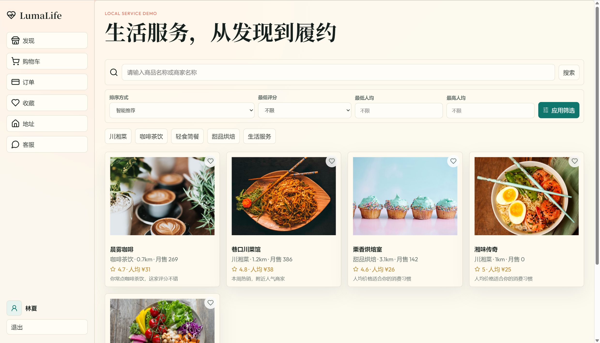
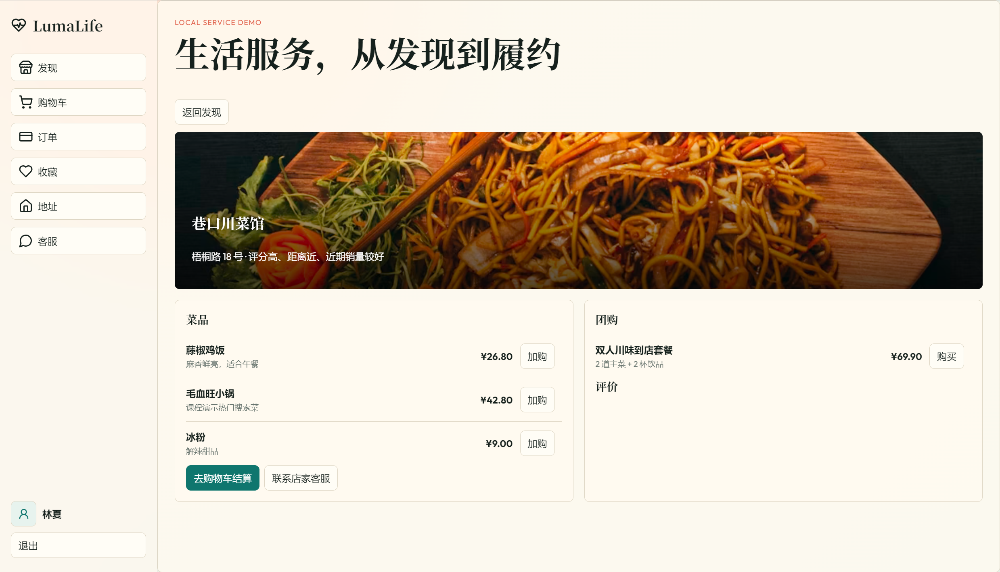
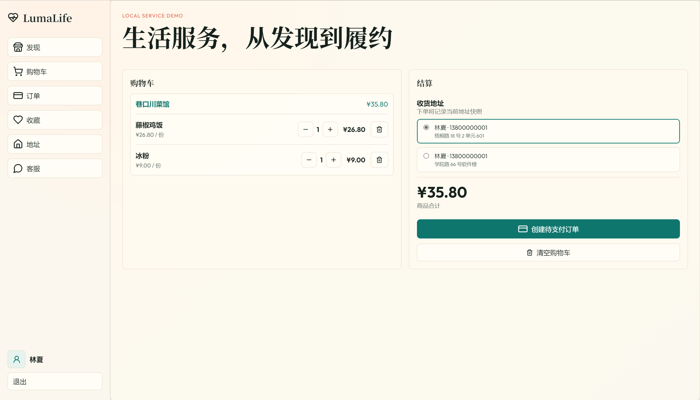
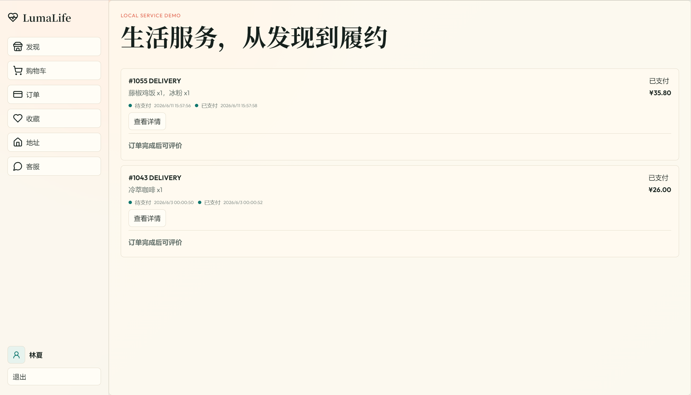
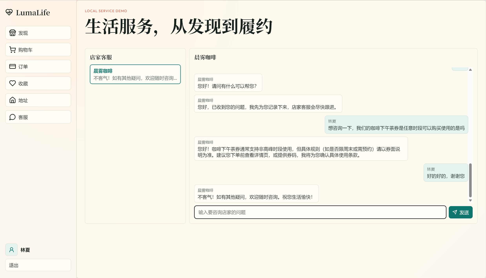
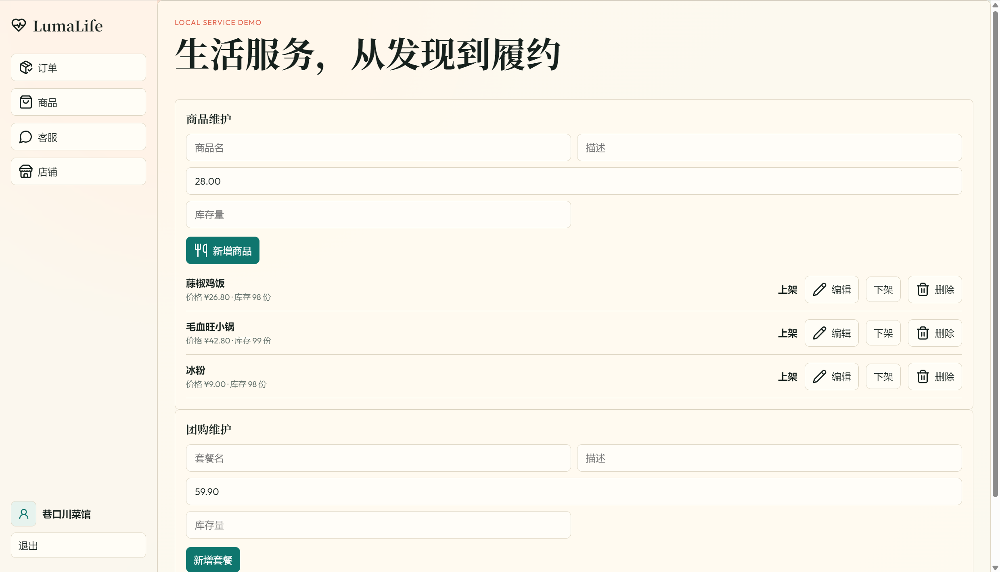
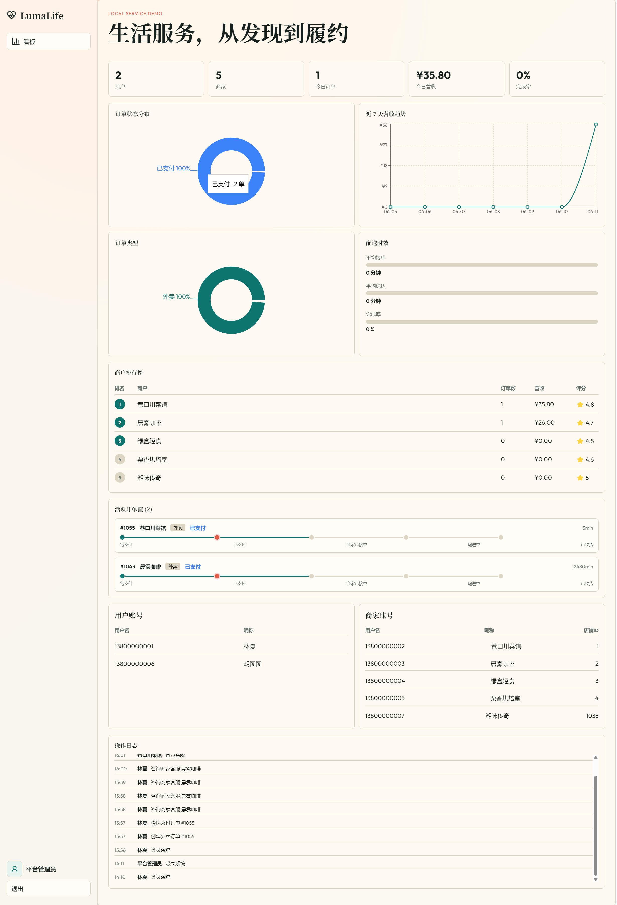

# LumaLife 用户手册

## 1 引言

### 1.1 编写目的

本文档用于说明 LumaLife 综合生活助手平台的主要使用方法，帮助普通用户、商家管理员和平台管理员完成登录、浏览、下单、履约、客服、店铺维护和平台监控等操作。

### 1.2 项目背景

LumaLife 是一个面向课程验收场景的本地生活服务演示系统，覆盖用户消费闭环、商家履约闭环和平台观测闭环。系统采用 React + TypeScript + Vite 前端和 Spring Boot 后端，当前版本以演示数据和内存状态为主，便于快速运行和展示核心业务流程。

### 1.3 适用对象

本文档适用于以下用户：

| 用户类型 | 主要职责 |
|---|---|
| 普通用户 | 浏览商家、收藏店铺、管理地址、加购商品、创建订单、模拟支付、评价订单、联系客服 |
| 商家管理员 | 处理订单、核销团购券、维护商品和团购套餐、回复客服消息、维护店铺名称 |
| 平台管理员 | 查看平台指标、账号列表、商家排行、活跃订单、系统健康状态和操作日志 |

### 1.4 访问地址

本地开发环境默认访问地址如下：

| 服务 | 地址 |
|---|---|
| 前端页面 | `http://localhost:5173/` |
| 后端接口 | `http://localhost:8080` |
| 健康检查 | `http://localhost:8080/actuator/health` |
| Swagger UI | `http://localhost:8080/swagger-ui/index.html` |

## 2 登录与注册

### 2.1 登录系统

1. 打开 `http://localhost:5173/`。
2. 点击左侧导航底部的“登录”按钮。
3. 输入手机号和密码。
4. 点击登录后，系统会根据账号角色自动进入对应页面：
   - 普通用户进入发现页。
   - 商家管理员进入商家订单页。
   - 平台管理员进入平台看板页。

### 2.2 注册普通用户

1. 进入登录页面后切换到注册模式。
2. 选择普通用户角色。
3. 输入手机号、昵称和密码。
4. 提交后系统自动登录，并进入地址/个人资料相关页面。

图 2-1 账号注册页面

### 2.3 注册商家账号

1. 进入注册模式。
2. 选择商家管理员角色。
3. 输入手机号、店铺名称和密码。
4. 提交成功后系统创建商家管理员账号和对应商家店铺，并进入商家后台。

### 2.4 退出登录

在左侧导航底部账号区域点击“退出”，系统会清除本地登录令牌并返回普通浏览状态。

## 3 普通用户操作说明

### 3.1 浏览和搜索商家

1. 登录普通用户账号，或以未登录状态进入首页。
2. 在“发现”页查看商家列表。
3. 可通过以下方式筛选商家：
   - 输入关键词搜索商家或商品。
   - 点击分类筛选，如川湘菜、咖啡茶饮、轻食简餐、甜品烘焙、生活服务。
   - 选择推荐、价格、销量等排序方式。
   - 设置人均价格区间和最低评分。
4. 点击商家卡片进入商家详情。

图 3-1 发现页支持搜索、筛选、排序和收藏商家

### 3.2 收藏商家

1. 登录普通用户账号。
2. 在发现页点击商家卡片上的收藏按钮。
3. 在左侧导航进入“收藏”页面，可查看已收藏商家。
4. 再次点击收藏按钮可取消收藏。

### 3.3 查看商家详情

商家详情页展示以下信息：

| 区域 | 内容 |
|---|---|
| 店铺信息 | 店名、分类、评分、人均价格、月销量、距离、地址和推荐理由 |
| 商品列表 | 商品名称、描述、价格、库存和加购按钮 |
| 团购套餐 | 套餐名称、描述、价格、库存和购买按钮 |
| 客服入口 | 可进入与当前商家的客服会话 |

图 3-2 商家详情页展示菜单、团购和店家客服入口

### 3.4 加入购物车

1. 在商家详情页选择需要购买的商品。
2. 点击“加入购物车”。
3. 系统会将商品加入当前用户购物车。
4. 点击“购物车”进入购物车页面查看明细。

### 3.5 管理收货地址

1. 进入左侧导航的“地址”页面。
2. 填写联系人、手机号、详细地址。
3. 点击保存后地址进入地址列表。
4. 可设置默认地址，也可删除不再使用的地址。
5. 当前系统限制每个普通用户最多维护 5 个收货地址。

### 3.6 创建外卖订单

1. 进入购物车页面。
2. 检查商品数量和小计。
3. 如需调整数量，可在购物车中修改数量；数量为 0 或点击删除时商品会被移除。
4. 选择收货地址。
5. 点击创建订单。
6. 如果购物车中包含多个商家的商品，系统会按商家拆分生成多个待支付订单。

图 3-3 购物车页面可调整数量、选择收货地址并创建待支付订单

### 3.7 模拟支付和取消订单

1. 进入“订单”页面。
2. 对待支付订单点击支付，系统执行模拟支付并将订单状态变为已支付。
3. 对待支付订单可点击取消。
4. 已支付订单不能由用户直接取消，需要进入商家履约流程。

图 3-4 订单页面展示订单状态、金额和状态时间线

### 3.8 确认收货和评价

1. 商家完成配送后，订单进入已完成状态。
2. 用户在订单页面查看状态时间线。
3. 对已完成且未评价的订单填写评分和评价内容。
4. 提交后评价会进入商家评价列表，并影响商家评分统计。

### 3.9 购买团购券

1. 在商家详情页选择团购套餐。
2. 点击购买团购。
3. 系统创建团购订单并进行模拟支付。
4. 支付成功后生成团购券码。
5. 用户可将券码提供给商家管理员核销。

### 3.10 使用客服

普通用户支持两种客服入口：

| 入口 | 用途 |
|---|---|
| 左侧导航“客服” | 向平台 AI 助手提问 |
| 商家详情页“联系商家” | 进入与当前商家的会话 |

商家客服会话中，用户发送消息后，系统会记录会话内容；商家管理员可在商家后台查看并回复。

图 3-5 店家客服页面展示用户与商家的历史会话和输入框

## 4 商家管理员操作说明

### 4.1 进入商家后台

商家管理员登录后默认进入商家订单页面。左侧导航包含订单、商品、客服、店铺等入口。

### 4.2 处理订单

1. 进入“订单”页面。
2. 查看本商家的外卖订单和团购订单。
3. 对已支付外卖订单依次执行：
   - 接单。
   - 配送。
   - 完成。
4. 系统会记录订单状态时间线，用户可在订单页面查看。

### 4.3 核销团购券

1. 进入商家订单页面。
2. 在团购券核销区域输入用户提供的券码。
3. 点击核销。
4. 系统校验券码是否存在、是否属于当前商家、是否已核销。

### 4.4 维护商品

1. 进入“商品”页面。
2. 填写商品名称、描述、价格、库存和上架状态。
3. 点击保存新增或更新商品。
4. 可对已有商品执行上下架。
5. 可删除本商家商品；删除商品后，相关购物车项会被清理。

图 4-1 商家商品维护页面可新增、编辑、上下架和删除商品

### 4.5 维护团购套餐

1. 在商品页面的团购套餐区域填写套餐标题、描述、价格、库存和启用状态。
2. 点击保存新增或更新套餐。
3. 可对套餐执行启用、停用或删除操作。

### 4.6 回复客服消息

1. 进入“客服”页面。
2. 左侧选择用户会话。
3. 查看用户消息和历史记录。
4. 输入回复内容并发送。
5. 可使用商家 AI 辅助生成回复，再将生成内容作为人工回复发送。

### 4.7 维护店铺名称

1. 进入“店铺”页面。
2. 修改商家展示名称。
3. 保存后，商家账号昵称和前台店铺名称保持同步。

## 5 平台管理员操作说明

### 5.1 查看平台看板

平台管理员登录后进入“看板”页面，可查看：

| 指标 | 说明 |
|---|---|
| 用户数 | 普通用户账号数量 |
| 商家数 | 平台商家数量 |
| 订单数 | 平台累计订单数量 |
| 交易额 | 已支付订单累计金额 |
| 今日订单 | 当日订单数量 |
| 今日交易额 | 当日交易金额 |

图 5-1 平台管理员看板展示指标、图表、排行、账号和日志

### 5.2 查看运营分析

平台看板包含订单状态分布、订单类型分布、近 7 日营收趋势、商家排行、配送履约指标和活跃订单列表，用于观察系统当前运行状态。

### 5.3 查看账号列表

管理员可查看普通用户账号和商家账号摘要。账号列表展示用户 ID、用户名、昵称、角色和商家 ID，不展示密码或密码哈希。

### 5.4 查看系统健康和日志

1. 系统健康状态展示后端服务运行状态和待处理订单数量。
2. 操作日志展示登录、下单、支付、履约、评价、核销等关键行为。

## 6 常见问题

### 6.1 无法访问前端页面

请确认前端服务已启动，并访问 `http://localhost:5173/`。如果端口被占用，可停止旧进程后重新运行 `npm run dev`。

### 6.2 接口请求失败

请确认后端服务已启动，并访问 `http://localhost:8080/actuator/health`。返回 `{"status":"UP"}` 表示后端可用。

### 6.3 登录后页面没有进入对应角色

请确认当前账号角色正确。普通用户、商家管理员和平台管理员会进入不同导航视图。

### 6.4 AI 客服只有固定回复

如果未配置 `AGNES_API_KEY`，系统会使用本地兜底回复。需要配置环境变量并重启后端，才会调用 Agnes 远程模型。

### 6.5 数据重启后变化

当前版本以演示数据为主，部分状态可通过后端状态文件持久化；若清理状态文件或重新构建容器，数据可能恢复为种子数据。
