# LumaLife 综合生活助手平台

## 软件需求规格说明书

| 项目 | 内容 |
|---|---|
| 文档标识 | SRS-LUMALIFE-2026-V2.0 |
| 文档版本 | V2.0（基于当前代码基线） |
| 编写日期 | 2026-08-25 |
| 软件配置项 | LumaLife 综合生活助手平台（CSCI） |
| 适用范围 | 课程演示、功能验收、后续设计与测试 |

> 本文档以仓库当前实现为准。参考资料中的 MySQL、Redis、JWT、真实支付、支付记录表和自动超时等内容，如果当前代码没有实现，均不作为本版本的已实现需求；相关内容列入“尚未解决的问题”。

## 1 范围

### 1.1 标识

本文档适用于 LumaLife 综合生活助手平台。平台是一个前后端分离的本地生活服务演示系统，前端配置项位于 `frontend/`，后端配置项位于 `backend/`，辅助脚本位于 `scripts/`，项目文档位于 `docs/`。

### 1.2 系统概述

LumaLife 面向课程验收场景，提供本地商家发现、商品购买、团购券消费、商家履约和平台运营观测能力。系统覆盖三条业务闭环：

1. **用户消费闭环：** 浏览或搜索商家、查看详情、收藏商家、加入购物车、创建外卖订单、模拟支付、确认收货、评价。
2. **商家履约闭环：** 商家管理员查看本店订单、接单、配送、完成、核销团购券，并维护商品、团购套餐和店铺名称。
3. **平台观测闭环：** 平台管理员查看用户数、商家数、订单数、交易金额、订单分布、营收趋势、商家排行、活跃订单、健康状态和操作日志。

系统当前由 React/Vite 单页前端和 Spring Boot REST 后端组成。后端业务数据主要由 `DemoStore` 维护，使用内存集合运行，并可通过 `lumalife.state-file` 将账号、订单、评价、客服会话、商家资料和收藏等部分状态写入 JSON 文件。Docker Compose 中预留了 MySQL 和 Redis 服务，但本版本业务代码未接入 MySQL/Redis。

### 1.3 文档概述

本文档定义 LumaLife 当前版本的功能需求、用户故事、用例、外部接口、内部数据、质量属性、运行约束、合格性规定和需求追踪关系。本文档服务于：

- 项目成员：明确实现边界和模块责任；
- 课程教师及验收人员：依据需求编号、用例和验收准则进行检查；
- 测试人员：根据需求编号设计正常、异常、边界和权限测试；
- 后续维护人员：了解当前演示实现与计划中的数据库化实现之间的差异。

本文档不包含真实用户隐私、真实支付数据或生产环境秘密配置。

### 1.4 基线

本文档基于以下基线编写：

- 当前仓库 `C:\Users\Lenovo\Lumalife` 的前端和后端源代码；
- `README.md`、`docs/00_项目总览.md`、`docs/01_核心需求说明.md`；
- `docs/03_概要设计说明.md`、`docs/04_详细设计说明.md`、`docs/05_接口文档.md`；
- `docs/06_数据库设计.md`、`docs/07_测试报告.md`、`docs/08_部署文档.md`、`docs/09_用户手册.md`；
- `backend/src/test/java/` 中的业务单元测试和接口权限集成测试；
- 本次需求重写所参考的课程 SRS 模板及旧版《软件需求规格说明书-v1.0.md》。

## 2 引用文件

| 编号 | 文件或资料 | 作用 |
|---|---|---|
| [R1] | `README.md` | 项目范围、启动方式、演示账号和当前状态 |
| [R2] | `docs/00_项目总览.md` | 项目目标和三条业务闭环 |
| [R3] | `docs/01_核心需求说明.md` | 核心需求编号 CR-01 至 CR-06 |
| [R4] | `docs/03_概要设计说明.md` | 架构、鉴权和订单状态机说明 |
| [R5] | `docs/04_详细设计说明.md` | 后端类职责和业务规则 |
| [R6] | `docs/05_接口文档.md` | REST 接口初始清单 |
| [R7] | `docs/06_数据库设计.md` | 后续数据库表和金额字段规划 |
| [R8] | `docs/07_测试报告.md` | 测试范围、测试用例和测试规程 |
| [R9] | `docs/08_部署文档.md` | 本地、打包和 Docker Compose 部署说明 |
| [R10] | `docs/09_用户手册.md` | 普通用户、商家和管理员操作流程 |
| [R11] | `backend/src/main/java/com/lumalife/controller/ApiControllers.java` | 当前接口实际入口 |
| [R12] | `backend/src/main/java/com/lumalife/service/DemoStore.java` | 当前核心业务行为和状态存储 |
| [R13] | `backend/src/main/java/com/lumalife/security/SecurityConfig.java` | 当前访问控制和 Token 认证行为 |
| [R14] | 课程提供的 SRS 模板 | 章节组织和合格性方法参考 |

## 3 需求

### 3.1 所需的状态和方式

| 状态/方式 | 适用范围 | 行为 |
|---|---|---|
| 正常演示运行 | 全部核心功能 | 后端提供 REST API，前端提供用户、商家和管理员页面，业务数据由 `DemoStore` 处理。 |
| 状态文件恢复 | 后端启动且配置了状态文件 | 读取 JSON 状态，恢复部分账号、订单、评价、会话、商家资料和收藏数据；分类、种子商品等基础数据由代码重新初始化。 |
| AI 降级运行 | 未配置 `AGNES_API_KEY`，或 Agnes API 调用失败 | 客服和商家 AI 助手使用本地规则型兜底回复，不影响浏览、购物车、订单和商家履约功能。 |
| 未认证访问 | 用户尚未登录 | 可浏览分类、商家列表、商家详情，并可调用平台 AI 问答；购物车、订单、地址、收藏和会话等受保护操作不可用。 |

本版本没有实现独立的维护模式、支付超时后台任务、真实支付模式或自动配送模式。任何需求如未特别说明，均适用于正常演示运行状态。

### 3.2 需求概述

#### 3.2.1 目标

平台应为普通用户提供从商家发现到消费评价的连续操作路径，为商家管理员提供订单履约和商品经营工具，为平台管理员提供可观察的运营数据。系统首要目标是稳定演示核心业务规则，而不是实现完整商业化本地生活平台。

系统高层数据流如下：

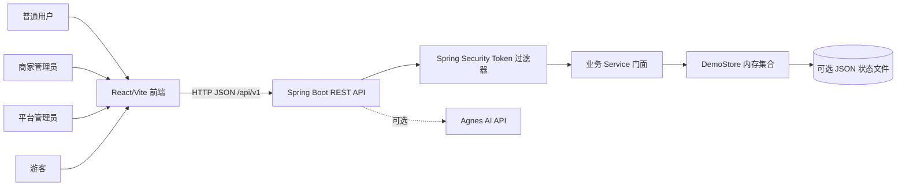
```mermaid
flowchart LR
    U[普通用户] --> FE[React/Vite 前端]
    M[商家管理员] --> FE
    A[平台管理员] --> FE
    V[游客] --> FE
    FE -->|HTTP JSON /api/v1| API[Spring Boot REST API]
    API --> SEC[Spring Security Token 过滤器]
    SEC --> SVC[业务 Service 门面]
    SVC --> STORE[DemoStore 内存集合]
    STORE --> STATE[(可选 JSON 状态文件)]
    API -.可选.-> AGNES[Agnes AI API]
```

#### 3.2.2 运行环境

| 类别 | 当前要求 |
|---|---|
| 后端运行时 | Java 17 及以上，Spring Boot 3.3.5，Maven 3.9 及以上 |
| 前端运行时 | Node.js 18 及以上，npm 9 及以上 |
| 浏览器 | 支持现代 JavaScript、Fetch、Local Storage 和 CSS Grid 的浏览器 |
| 后端默认端口 | `8080` |
| 前端开发端口 | `5173` |
| 健康检查 | `GET /actuator/health` |
| API 文档 | Springdoc/OpenAPI，默认 `/swagger-ui/index.html` |
| 可选外部服务 | Agnes Chat Completions API；未配置时使用本地兜底 |
| 可选部署服务 | Docker Compose 中的 MySQL 8.4、Redis 7，仅作后续持久化预留 |

#### 3.2.3 用户的特点

| 用户 | 特点与目标 |
|---|---|
| 游客 | 不登录即可浏览商家和分类，可能只进行初步发现。 |
| 普通用户 | 具有基本网页操作能力，关注搜索、价格、评分、下单、支付、收货和评价。 |
| 商家管理员 | 负责单个绑定店铺的订单、商品、团购、店铺资料和客服会话，必须理解订单状态和券码核销。 |
| 平台管理员 | 关注平台整体数据、活跃订单、商家排行、健康状态和操作日志。 |

#### 3.2.4 关键点

1. **权限隔离：** 商家管理员只能操作自己绑定商家的订单、商品、团购、评价、券码和客服会话；平台看板仅允许平台管理员访问。
2. **订单状态约束：** 外卖订单必须按 `PENDING_PAYMENT → PAID → ACCEPTED → DELIVERING → COMPLETED` 流转；团购订单按 `PENDING_PAYMENT → PAID → USED` 流转。
3. **支付幂等：** 支付请求必须携带 `clientRequestId`；同一订单以相同请求标识重复支付时返回原订单，不重复扣库存。
4. **库存一致性：** 支付时校验并扣减商品或团购库存，订单通过 `stockDeducted` 标记避免重复扣减。
5. **业务可追踪：** 关键登录、下单、支付、履约、评价、核销和经营操作写入操作日志。
6. **演示可恢复：** 配置状态文件后，部分业务状态可在服务重启后恢复；数据库迁移仍属于后续工作。

#### 3.2.5 约束条件

- 本版本定位为课程演示系统，不处理真实资金，不接入骑手、地图、短信或真实支付网关。
- 当前后端以 `DemoStore` 为核心，未使用 MySQL、Redis 或 MyBatis-Plus 读写业务数据。
- 当前 Token 是随机 UUID 与服务端内存映射，不是 JWT；前端退出登录通过清除浏览器 Local Storage 完成，没有独立登出接口。
- 账号密码只要求非空且长度不少于 6 个字符；代码没有强制 11 位手机号、字母数字组合或登录失败锁定规则。
- 当前购物车可包含多个商家的商品；提交外卖订单时系统按商家拆分为多个订单。
- 前端金额以“分”为后端字段单位，显示时转换为人民币元；商品和套餐价格必须为正数，库存不能为负数。
- 所有图示使用 Mermaid 描述，最终展示效果依赖 Markdown 阅读器对 Mermaid 的支持。

### 3.3 需求规格

#### 3.3.1 软件系统总体功能/对象结构

系统由发现、账户、购物车、订单、支付、评价、商家管理、客服和平台管理等业务域组成。外层 REST Controller 负责参数接收，业务 Service 负责按领域分门面，`DemoStore` 负责当前演示版的业务状态和规则。

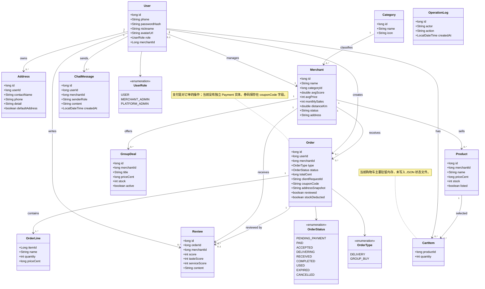
```mermaid
classDiagram
    class User {
      +long id
      +String phone
      +String passwordHash
      +String nickname
      +String avatarUrl
      +UserRole role
      +Long merchantId
    }
    class Address {
      +long id
      +long userId
      +String contactName
      +String phone
      +String detail
      +boolean defaultAddress
    }
    class Category {
      +long id
      +String name
      +String icon
    }
    class Merchant {
      +long id
      +String name
      +long categoryId
      +double avgScore
      +int avgPrice
      +int monthlySales
      +double distanceKm
      +String status
      +String address
    }
    class Product {
      +long id
      +long merchantId
      +String name
      +long priceCent
      +int stock
      +boolean listed
    }
    class GroupDeal {
      +long id
      +long merchantId
      +String title
      +long priceCent
      +int stock
      +boolean active
    }
    class CartItem {
      +long productId
      +int quantity
    }
    class Order {
      +long id
      +long userId
      +long merchantId
      +OrderType type
      +OrderStatus status
      +long totalCent
      +String clientRequestId
      +String couponCode
      +String addressSnapshot
      +boolean reviewed
      +boolean stockDeducted
    }
    class OrderLine {
      +Long itemId
      +String name
      +int quantity
      +long priceCent
    }
    class Review {
      +long id
      +long orderId
      +long merchantId
      +int score
      +int tasteScore
      +int serviceScore
      +String content
    }
    class ChatMessage {
      +long id
      +long userId
      +long merchantId
      +String senderRole
      +String content
      +LocalDateTime createdAt
    }
    class OperationLog {
      +long id
      +String actor
      +String action
      +LocalDateTime createdAt
    }
    class UserRole {
      <<enumeration>>
      USER
      MERCHANT_ADMIN
      PLATFORM_ADMIN
    }
    class OrderStatus {
      <<enumeration>>
      PENDING_PAYMENT
      PAID
      ACCEPTED
      DELIVERING
      RECEIVED
      COMPLETED
      USED
      EXPIRED
      CANCELLED
    }
    class OrderType {
      <<enumeration>>
      DELIVERY
      GROUP_BUY
    }

    User "1" --> "0..*" Address : owns
    User "1" --> "0..*" Order : creates
    User "1" --> "0..*" CartItem : has
    User "1" --> "0..*" Review : writes
    User "1" --> "0..*" ChatMessage : sends
    User "0..1" --> "1" Merchant : manages
    Category "1" --> "0..*" Merchant : classifies
    Merchant "1" --> "0..*" Product : sells
    Merchant "1" --> "0..*" GroupDeal : offers
    Merchant "1" --> "0..*" Order : receives
    Merchant "1" --> "0..*" Review : receives
    Product "1" --> "0..*" CartItem : selected
    Order "1" --> "1..*" OrderLine : contains
    Order "1" --> "0..1" Review : reviewed by
    Order --> OrderStatus
    Order --> OrderType
    User --> UserRole

    note for Order "支付是对订单的操作；当前没有独立 Payment 实体。券码保存在 couponCode 字段。"
    note for CartItem "当前购物车主要驻留内存，未写入 JSON 状态文件。"
```

#### 3.3.2 软件子系统功能/对象结构

| 子系统 | 主要功能 | 当前实现入口 |
|---|---|---|
| 账户与权限 | 注册、登录、当前用户、资料、地址 | `AuthService`、`SecurityConfig`、`DemoStore` |
| 商家发现 | 分类、搜索、筛选、排序、推荐、详情 | `CatalogService`、`Home`、`Detail` |
| 收藏 | 收藏、取消收藏、收藏列表 | `FavoriteService`、`Favorites` |
| 购物车 | 加购、改数量、删除、清空、明细 | `CartService`、`Cart` |
| 订单与支付 | 外卖拆单、团购订单、模拟支付、取消、确认收货、订单列表 | `OrderWorkflowService`、`Orders` |
| 评价 | 评分和文字评价、一单一评、商家评价 | `OrderWorkflowService`、`MerchantAdminService` |
| 商家后台 | 订单履约、商品、团购套餐、店铺名称、券码核销 | `MerchantAdminService`、商家页面 |
| 客服与 AI | 平台 AI 问答、用户-商家会话、商家 AI 辅助 | `AssistantService`、`Assistant`、`MerchantSupport` |
| 平台管理 | 指标、趋势、排行、活跃订单、账号、日志 | `AdminDashboardService`、`Admin` |

#### 3.3.3 描述约定

- 需求标识采用 `[域]-FR-[序号]`，FR 表示功能需求；非功能需求采用 `NFR-[序号]`，安全需求采用 `SEC-[序号]`。
- 正式业务用例标识采用 `UC01`~`UC09`；旧版 `UC-01`~`UC-14` 仅作为 A.5 的历史细分标识。
- 优先级采用 P1、P2、P3：P1 为核心验收功能，P2 为重要配套功能，P3 为演示增强或后续扩展。
- 合格性方法采用：T（测试）、D（演示）、I（审查）、A（分析）。
- 金额字段以人民币“分”为整数单位，如 `2680` 表示 `¥26.80`。
- “系统”表示 LumaLife 前端和后端作为一个整体；图中的“前端”或“后端 API”仅在需要说明边界时单独标注。

### 3.4 CSCI 能力需求

#### 3.4.1 账户、身份与地址能力

| 编号 | 需求 | 优先级 | 合格性 |
|---|---|---|---|
| AUTH-FR-001 | 系统应允许通过非空账号标识、长度不少于 6 个字符的密码和昵称注册普通用户；账号不能重复，密码应使用 BCrypt 编码后保存。 | P1 | T/I |
| AUTH-FR-002 | 系统应允许演示账号和已注册账号登录；登录成功返回随机 Token 和脱敏用户信息，Token 与角色绑定。错误账号或密码返回未授权错误。 | P1 | T |
| AUTH-FR-003 | 系统应提供当前用户查询、昵称修改和头像 URL 维护；商家管理员修改昵称时，账号昵称和公开店铺名称应同步。 | P2 | T/D |
| AUTH-FR-004 | 普通用户应能新增、编辑、删除和设置默认地址；每个普通用户最多维护 5 个地址；删除默认地址后，系统应为剩余地址自动选择默认地址。 | P1 | T |
| AUTH-FR-005 | 系统应支持通过公开注册入口创建商家管理员及其绑定店铺，但不得通过公开注册入口创建平台管理员。 | P1 | T |

#### 3.4.2 商家发现、详情与收藏能力

| 编号 | 需求 | 优先级 | 合格性 |
|---|---|---|---|
| DISC-FR-001 | 未登录用户和普通用户应能查看分类、商家分页列表和商家详情；详情应返回商家、在售商品、有效团购套餐和评价。 | P1 | D/T |
| DISC-FR-002 | 商家列表应支持按商家名或商品名关键词、分类、人均价格区间、最低评分筛选，并支持推荐、价格、评分、销量和距离排序。 | P1 | T |
| DISC-FR-003 | 推荐排序在无用户历史时应综合商家评分和距离；普通用户有历史订单时，应进一步考虑品类偏好、客单价、质量、行为和销量，并返回推荐理由。 | P2 | A/D |
| DISC-FR-004 | 商家详情只应展示在售商品和有效团购套餐；不存在的商家应返回资源不存在错误。 | P1 | T |
| FAV-FR-001 | 登录普通用户应能收藏和取消收藏商家，并在收藏页查看收藏商家；重复收藏或取消不存在的收藏应返回业务错误。 | P2 | T/D |

#### 3.4.3 购物车能力

| 编号 | 需求 | 优先级 | 合格性 |
|---|---|---|---|
| CART-FR-001 | 登录普通用户应能将已上架商品加入购物车；商品不存在、下架或数量不大于 0 时不得加入。 | P1 | T |
| CART-FR-002 | 用户应能修改购物车商品数量；数量不大于 0 时视为移除；商品已失效时不得继续修改。 | P1 | T |
| CART-FR-003 | 用户应能删除单个购物车商品或清空购物车；删除不存在的商品应返回业务错误。 | P1 | T |
| CART-FR-004 | 购物车允许包含多个商家的商品；创建外卖订单时系统应按商家拆分订单，并清空已提交购物车。 | P1 | T/D |

#### 3.4.4 订单、支付与履约能力

| 编号 | 需求 | 优先级 | 合格性 |
|---|---|---|---|
| ORDER-FR-001 | 普通用户应能使用默认地址或指定地址创建外卖订单；系统应校验购物车非空、商品在售、库存充足，并保存收货地址快照。 | P1 | T |
| ORDER-FR-002 | 普通用户应能选择有效且有库存的团购套餐创建团购订单；套餐价格和数量应形成订单明细。 | P1 | T |
| PAY-FR-001 | 普通用户应能对待支付订单发起模拟支付；支付必须携带非空 `clientRequestId`。 | P1 | T/D |
| PAY-FR-002 | 同一订单以相同 `clientRequestId` 重复支付时应返回同一订单，不重复更新支付状态、不重复扣减库存；首次支付成功后外卖订单变为 `PAID`。 | P1 | T |
| PAY-FR-003 | 团购订单支付成功后，系统应生成 12 位数字券码并建立券码到订单的索引；外卖或团购库存只能扣减一次。 | P1 | T |
| ORDER-FR-003 | 普通用户只能查看和操作自己的订单；用户只能取消 `PENDING_PAYMENT` 订单，已支付订单不得直接取消。 | P1 | T |
| ORDER-FR-004 | 普通用户可对配送中的或已完成的外卖订单确认收货；其他类型或未进入可收货状态的订单不得确认收货。 | P2 | T |
| ORDER-FR-005 | 商家管理员可按 `PAID → ACCEPTED → DELIVERING → COMPLETED` 处理本店外卖订单，不得跳过状态或处理其他商家订单。 | P1 | T |

#### 3.4.5 评价能力

| 编号 | 需求 | 优先级 | 合格性 |
|---|---|---|---|
| REVIEW-FR-001 | 普通用户只能对本人状态为 `RECEIVED`、`COMPLETED` 或 `USED` 且未评价的订单提交评价。 | P1 | T |
| REVIEW-FR-002 | 总评分、口味评分和服务评分均应为 1 到 5 分，评价文字不能为空且最多保存 200 个字符；同一订单不得重复评价。 | P1 | T |
| REVIEW-FR-003 | 评价用户昵称应脱敏展示；商家详情应展示评价，商家管理员只能查看本店评价，评价应参与商家实时评分统计。 | P1 | T/D |

#### 3.4.6 商家经营管理能力

| 编号 | 需求 | 优先级 | 合格性 |
|---|---|---|---|
| MERCHANT-FR-001 | 商家管理员只能查看和维护绑定商家的商品、团购、订单、评价、券码和客服会话。 | P1 | T |
| MERCHANT-FR-002 | 商家管理员应能新增、编辑、上架、下架和删除本店商品；价格必须大于 0，库存不得小于 0；删除商品应清理购物车中的对应项。 | P1 | T/D |
| MERCHANT-FR-003 | 商家管理员应能新增、编辑、启用、停用和删除本店团购套餐；价格必须大于 0，库存不得小于 0。 | P1 | T/D |
| MERCHANT-FR-004 | 商家管理员应能维护店铺展示名称，修改后应同步账号昵称、商家公开列表、商家详情和订单中的商家名称。 | P2 | T/D |
| MERCHANT-FR-005 | 商家管理员应能输入券码核销本店已支付团购订单；不存在、他店或已核销券码不得重复核销。 | P1 | T |

#### 3.4.7 客服与 AI 能力

| 编号 | 需求 | 优先级 | 合格性 |
|---|---|---|---|
| ASSIST-FR-001 | 系统应提供平台 AI 问答入口，能够回答登录、下单、支付、评价、团购券和履约等平台问题。 | P2 | D |
| ASSIST-FR-002 | 普通用户应能针对商家发送不超过 500 字的会话消息；系统应保存用户消息和 AI/商家回复。 | P2 | T/D |
| ASSIST-FR-003 | 商家管理员应能查看本店用户会话、发送人工回复，并使用商家 AI 助手根据店铺商品和团购上下文生成建议回复。 | P2 | T/D |
| ASSIST-FR-004 | 未配置或无法访问 Agnes API 时，系统应返回本地规则型兜底回复，客服主流程仍应可用。 | P2 | T |

#### 3.4.8 平台观测能力

| 编号 | 需求 | 优先级 | 合格性 |
|---|---|---|---|
| ADMIN-FR-001 | 只有 `PLATFORM_ADMIN` 可访问平台指标接口和看板页面；系统应返回概览、订单状态分布、订单类型分布、近 7 日营收趋势、商家排行、配送指标、活跃订单、健康状态、账号摘要和操作日志。 | P1 | T/D |
| ADMIN-FR-002 | 管理员账号摘要不得包含密码或密码哈希；日志至少应覆盖登录、订单、支付、履约、评价、核销和经营维护等关键操作。 | P1 | I/T |

#### 3.4.9 安全、质量和环境需求

| 编号 | 需求 | 优先级 | 合格性 |
|---|---|---|---|
| SEC-001 | 受保护 API 应要求有效 Bearer Token；普通用户、商家管理员和平台管理员必须按角色访问资源；未认证和无权访问分别返回 401、403。 | P1 | T |
| SEC-002 | 密码不得以明文形式通过安全用户信息接口返回，管理员账号列表不得暴露密码字段；评价昵称应按规则脱敏。 | P1 | I/T |
| SEC-003 | 业务错误应使用统一结构 `{code, message, data}`，覆盖参数错误、认证错误、权限错误、资源不存在和业务冲突。 | P1 | T |
| NFR-001 | 前端应提供发现、详情、购物车、订单、资料、商家后台和管理看板页面，并在核心操作后给出中文成功或失败提示。 | P1 | D |
| NFR-002 | 系统应使用“分”作为金额计算单位，使用枚举表达用户角色、订单类型和订单状态，避免金额浮点误差和散落状态字符串。 | P1 | I |
| NFR-003 | 项目应能按 README 和部署文档在本地启动；后端健康接口正常时返回 `UP`，前端可通过 Vite 代理访问后端。 | P1 | D/T |
| NFR-004 | 当前版本应优先保证课程演示规模下的可维护性、可测试性和可恢复性；不得把未接入的 MySQL、Redis 或真实支付描述为本版本已实现能力。 | P1 | I |

### 3.5 CSCI 外部接口需求

#### 3.5.1 接口标识和接口图

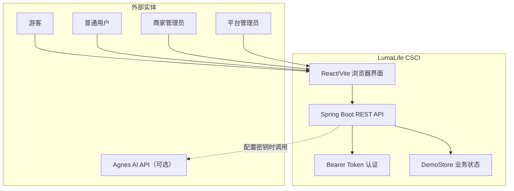
```mermaid
flowchart TB
    subgraph Actors[外部实体]
      Visitor[游客]
      User[普通用户]
      MerchantAdmin[商家管理员]
      PlatformAdmin[平台管理员]
      Agnes[Agnes AI API（可选）]
    end
    subgraph CSCI[LumaLife CSCI]
      Browser[React/Vite 浏览器界面]
      Rest[Spring Boot REST API]
      Token[Bearer Token 认证]
      Store[DemoStore 业务状态]
    end
    Visitor --> Browser
    User --> Browser
    MerchantAdmin --> Browser
    PlatformAdmin --> Browser
    Browser --> Rest
    Rest --> Token
    Rest --> Store
    Rest -.配置密钥时调用.-> Agnes
```

#### 3.5.2 用户接口

前端界面应提供以下主要页面和交互：

| 角色 | 页面 | 主要操作 |
|---|---|---|
| 游客/用户 | 登录、发现、详情 | 登录注册、搜索分类、查看商品和团购 |
| 用户 | 购物车、订单、地址、收藏、资料 | 加购、下单、支付、取消、收货、评价、地址和收藏管理 |
| 用户 | 平台客服、商家客服 | 平台问答、联系商家、查看会话、发送消息 |
| 商家管理员 | 订单、商品、客服、店铺 | 订单状态流转、券码核销、商品/套餐维护、店铺名称、人工客服 |
| 平台管理员 | 看板 | 查看概览、图表、排行、活跃订单、账号和日志 |

界面应使用中文提示；数据为空时显示空状态；关键操作失败时显示后端错误消息；页面应适应桌面和较窄屏幕布局。

#### 3.5.3 软件接口

接口统一前缀为 `/api/v1`，成功响应格式为：

```json
{ "code": 200, "message": "success", "data": {} }
```

主要接口如下：

| 接口域 | 方法与路径 | 权限 | 说明 |
|---|---|---|---|
| 认证 | `POST /auth/login` | 公开 | 登录 |
| 认证 | `POST /auth/register`、`POST /auth/register/merchant` | 公开 | 注册普通用户/商家 |
| 认证 | `GET /auth/me`、`POST /user/profile` | Token | 当前用户/资料 |
| 发现 | `GET /categories`、`GET /merchants`、`GET /merchants/{id}` | 公开 | 分类、列表、详情 |
| 收藏 | `GET/POST /user/favorites`、`POST /user/favorites/{merchantId}/delete` | USER | 收藏管理 |
| 地址 | `GET/POST /user/addresses`、`POST /user/addresses/{id}/default`、`POST /user/addresses/{id}/delete` | USER | 地址管理 |
| 购物车 | `GET /cart`、`GET /cart/detail`、`POST /cart/items`、`POST /cart/items/{productId}`、`POST /cart/items/{productId}/delete`、`POST /cart/clear` | USER | 购物车 |
| 订单 | `POST /orders/delivery`、`POST /orders/group-buy`、`GET /orders`、`POST /orders/{id}/cancel`、`POST /orders/{id}/receive` | USER | 外卖、团购、查询、取消、收货 |
| 支付 | `POST /payments` | USER | 模拟支付和幂等 |
| 评价 | `POST /reviews` | USER | 提交评价 |
| 客服 | `GET /conversations`、`GET/POST /conversations/{merchantId}...` | USER | 用户商家会话 |
| 商家后台 | `GET /merchant-admin/orders`、`POST /merchant-admin/orders/{id}/transition` | MERCHANT_ADMIN | 订单履约 |
| 商家后台 | `/merchant-admin/products`、`/merchant-admin/group-deals` | MERCHANT_ADMIN | 商品和团购维护 |
| 商家后台 | `POST /merchant-admin/coupons/verify` | MERCHANT_ADMIN | 券码核销 |
| 商家后台 | `/merchant-admin/profile`、`/merchant-admin/reviews` | MERCHANT_ADMIN | 店铺资料和评价 |
| 商家客服 | `/merchant-admin/conversations/**`、`POST /merchant-admin/assistant/ask` | MERCHANT_ADMIN | 会话和 AI 辅助 |
| 平台管理 | `GET /admin/metrics` | PLATFORM_ADMIN | 平台看板数据 |
| 平台 AI | `POST /assistant/ask` | 当前实现为公开 | 规则/远程 AI 问答 |

#### 3.5.4 通信接口

- 前端与后端通过 HTTP/JSON 通信，开发环境由 Vite 将 `/api` 和 `/actuator` 代理到 `VITE_API_TARGET`，默认 `http://localhost:8080`。
- 受保护请求使用 `Authorization: Bearer <token>`；前端将 Token 保存在 `localStorage` 的 `lumalife-token` 键中。
- 后端返回整数金额字段，前端使用工具函数转换为人民币元显示。
- 与 Agnes 的可选通信采用 HTTP Chat Completions 风格 JSON，请求带 `Authorization: Bearer <AGNES_API_KEY>`，连接超时和调用失败时使用本地兜底。

### 3.6 CSCI 内部接口需求

当前内部接口边界应保持为：

```text
ApiControllers
  -> AuthService / CatalogService / CartService / OrderWorkflowService
  -> MerchantAdminService / AdminDashboardService / AssistantService / FavoriteService
  -> DemoStore
```

Controller 不应直接维护业务集合或实现订单规则；Service 门面应提供稳定的业务调用边界。后续数据库迁移时，可将 `DemoStore` 替换为 Mapper/Repository 实现，同时保持 `/api/v1/**` 契约不变。

### 3.7 CSCI 内部数据需求

当前主要内部数据集合包括：用户、Token 映射、分类、地址、商家、商品、团购套餐、购物车、订单、券码索引、评价、客服会话、收藏和操作日志。其要求如下：

- User 的密码字段只保存 BCrypt 编码值，安全响应不得返回该字段；
- Order 的金额、商品明细、状态时间线、地址快照、支付请求标识和券码应保持一致；
- Order 状态时间线应记录状态变更时间，用于用户订单展示和管理员配送指标；
- 评价内容保存上限为 200 个字符，客服单条消息保存上限为 500 个字符；
- 状态文件默认为 `./data/lumalife-state.json`，可通过 `lumalife.state-file` 配置；配置为空时测试可关闭状态文件持久化；
- 当前状态文件不持久化购物车、分类、基础商品/套餐全集和实时 Token 映射，重启后这些内容按代码种子和当前内存状态初始化；
- 数据库表、软删除字段、支付记录表和 MySQL 唯一索引属于后续迁移设计，不是当前实现的数据要求。

### 3.8 适应性需求

系统应允许通过环境或配置调整以下参数：

| 配置 | 默认值 | 作用 |
|---|---|---|
| `server.port` | `8080` | 后端 HTTP 端口 |
| `lumalife.state-file` | `./data/lumalife-state.json` | 状态文件路径；为空可关闭 |
| `VITE_API_TARGET` | `http://localhost:8080` | 前端开发代理目标 |
| `agnes.endpoint` | Agnes Chat Completions 地址 | AI 服务地址 |
| `agnes.model` | `agnes-2.0-flash` | AI 模型名 |
| `AGNES_API_KEY` | 空 | 远程 AI 密钥，空值启用兜底 |

### 3.9 保密性需求

本项目不存在人身、财产或设备安全控制需求。业务层面的安全要求包括：

- 支付、订单、券码核销和评价操作必须校验订单或资源归属；
- 非法订单状态流转、重复评价、重复核销、库存不足和非法价格/库存输入必须被拒绝；
- 删除商品时清理购物车中的失效项，避免用户继续提交不可购买商品；
- 模拟支付不得宣称产生真实资金结果。

### 3.10 保密性和私密性需求

- 密码必须使用 BCrypt 保存，不出现在 `safeUser` 和管理员账号摘要中；
- 用户只能访问自己的地址、购物车、订单、收藏和会话；
- 商家只能访问绑定店铺的数据；
- 评价展示使用昵称脱敏规则；
- `.env`、AI 密钥及本地状态文件不应提交到版本库；
- 当前版本使用演示账号和演示数据，不得用于真实支付或生产个人信息处理。

### 3.11 CSCI 环境需求

系统应运行在支持 Java 17、Node.js 18 和现代浏览器的 Windows 或 Linux 开发/测试环境。后端使用 Spring Boot 内嵌 Web 容器，前端开发时使用 Vite，生产前端可由 Nginx 或容器提供静态文件。

### 3.12 计算机资源需求

#### 3.12.1 计算机硬件需求

课程演示无需专用硬件。单台普通开发机即可运行后端、前端和浏览器；若使用 Docker Compose，可额外运行 MySQL 和 Redis 容器。

#### 3.12.2 计算机硬件资源利用需求

本版本没有经过大规模压测，不定义生产级 CPU、内存或并发上限。验收重点是课程演示规模下核心流程不崩溃、状态规则正确、前后端可构建。

#### 3.12.3 计算机软件需求

| 软件 | 版本要求 |
|---|---|
| Java/JDK | 17+ |
| Maven | 3.9+ |
| Node.js | 18+ |
| npm | 9+ |
| Spring Boot | 3.3.5 |
| React | 18.3.1 |
| Vite | 5.4.10 |
| MySQL/Redis | Docker Compose 预留，不是当前业务运行前置条件 |

#### 3.12.4 计算机通信需求

前端开发服务默认监听 `5173`，后端默认监听 `8080`；浏览器需要能访问这两个端口。若启用远程 AI，后端需要访问配置的 Agnes endpoint。

### 3.13 软件质量因素

| 质量属性 | 当前需求 |
|---|---|
| 功能性 | 核心消费、履约和观测闭环应可通过前端演示完成。 |
| 可靠性 | 非法状态、越权、重复支付、重复评价、重复核销和库存不足应稳定返回业务错误。 |
| 可维护性 | Controller、Service 和 DemoStore 之间保持清晰边界；金额使用分，状态使用枚举。 |
| 可测试性 | 核心规则可通过 `DemoStoreTest` 和接口权限集成测试验证。 |
| 易用性 | 页面提供中文导航、空状态和操作提示，商家和管理员按角色进入对应工作台。 |
| 可恢复性 | 配置状态文件时，账号、订单、评价、会话、商家资料和收藏等部分数据可重启恢复。 |
| 可扩展性 | 后续可在不改变 API 的前提下将 DemoStore 逐步替换为数据库实现。 |

### 3.14 设计和实现的约束

- 后端必须使用 Java 17+、Spring Boot、Spring Security 和统一 `ApiResponse`；
- 前端必须使用 React、TypeScript 和现有全局样式设计系统；
- 所有业务金额使用分，订单状态使用 `Enums.OrderStatus`；
- 当前实现优先保证本地演示，不应为满足旧版文档而虚构未接入的数据库、缓存、JWT 或支付能力；
- 后续持久化迁移应保持当前 API 路径、请求结构和主要响应结构兼容；
- 外部 AI 只作为可选增强，远程调用不可成为核心交易链路的单点依赖。

### 3.15 数据

#### 3.15.1 输入数据

账号、密码、昵称、头像 URL、地址、搜索关键词、分类和排序参数、商品数量、地址 ID、团购 ID、支付订单 ID、客户端支付请求 ID、状态转移目标、券码、评分、评价文字、客服消息和商家维护信息。

#### 3.15.2 输出数据

商家分页列表、商家详情、购物车明细、订单及状态时间线、支付结果、券码、评价、客服消息、商家后台资源、管理员指标和统一错误响应。

#### 3.15.3 数据约束

- 价格用 `long` 表示分；库存用非负整数；评分范围为 1 至 5；
- 页面列表默认请求 20 条，服务端返回 `records/page/size/total/pages`；
- 订单总额等于订单明细单价乘以数量之和；
- 支付成功才扣减库存并改变订单状态；
- 评价必须关联本人订单且一单一评。

### 3.16 操作

#### 3.16.1 常规操作

开发环境分别启动后端和前端：

```bash
cd backend
mvn spring-boot:run
```

```bash
cd frontend
npm ci
npm run dev
```

#### 3.16.2 初始化操作

后端首次启动时初始化演示账号、分类、商家、商品和团购套餐。若状态文件存在，系统在种子初始化后加载可恢复状态。前端首次访问时加载分类、商家列表并检查本地 Token。

#### 3.16.3 恢复操作

后端异常退出后重新启动即可恢复服务；配置状态文件时可恢复已保存的部分业务数据。若状态文件损坏，系统应记录并报告加载错误，运维人员可备份或移除该文件后重新启动演示数据。

### 3.17 故障处理

| 场景 | 当前处理 |
|---|---|
| 参数错误 | 返回业务错误码 `40000`，HTTP 400。 |
| 未认证 | Spring Security 返回 HTTP 401。 |
| 角色不匹配 | Spring Security 返回 HTTP 403。 |
| 资源不存在 | 返回业务错误码 `40400`，HTTP 404。 |
| 业务冲突 | 返回 `40900` 或其他非 400/401/403/404 业务码，HTTP 409。 |
| 服务器异常 | 全局异常处理器返回 HTTP 500 和 `50000`。 |
| AI 服务不可用 | 记录日志并返回本地规则型回复。 |
| 下架、缺货、非法流转 | 拒绝操作并返回中文业务提示，不改变原有有效状态。 |

成功和业务异常通常使用 `{code, message, data}`；认证过滤器产生的 401/403 响应由 Spring Security 处理，前端应将其视为登录失效或无权访问。

### 3.18 算法说明

#### 3.18.1 默认推荐算法

没有用户历史时，商家综合质量分为：

```text
qualityScore = 0.6 × (avgScore / 5.0)
             + 0.4 × max(0, 1 - distanceKm / 5.0)
```

有用户历史且排序方式为 `recommend` 时，系统综合以下信号：品类偏好、用户平均消费匹配度、商家质量、复购/高评价行为和销量热度。实现中的加权形式为：

```text
recommendScore = 0.25 × categoryScore
               + 0.20 × priceScore
               + 0.20 × qualityScore
               + 0.25 × behaviorScore
               + 0.10 × popularityScore
```

无历史时退化为 `qualityScore`。推荐结果同时返回面向用户的推荐理由。

#### 3.18.2 订单状态规则

```text
外卖：PENDING_PAYMENT → PAID → ACCEPTED → DELIVERING → COMPLETED
                                  └→ 用户确认收货：RECEIVED
取消：PENDING_PAYMENT → CANCELLED
团购：PENDING_PAYMENT → PAID → USED
```

当前商家接口只允许外卖订单按相邻状态流转；团购订单通过券码核销从 `PAID` 变为 `USED`。代码中定义了 `EXPIRED`，但当前没有自动过期任务。

#### 3.18.3 支付和库存规则

支付前校验订单归属、待支付状态和 `clientRequestId`；首次支付调用库存扣减逻辑，成功后设置 `stockDeducted=true`，再变更为 `PAID`。重复请求若使用相同客户端请求标识直接返回原订单。

#### 3.18.4 券码规则

团购订单支付成功后根据订单 ID 生成 12 位数字券码，并写入券码索引。商家核销时校验券码存在、订单属于当前商家且状态为 `PAID`。

### 3.19 有关人员需求

- 普通用户只需具备基本浏览器和网页操作能力；
- 商家管理员需要理解接单、配送、完成和券码核销的顺序；
- 平台管理员需要理解订单状态、金额单位和看板指标含义；
- 开发/维护人员需要掌握 Java 17、Spring Boot、React、TypeScript、Maven 和 npm 的基础使用；
- 课程验收人员应能根据演示账号和本文档中的用例复现核心流程。

### 3.20 有关培训需求

系统不内置独立培训模块。培训和验收以 `docs/09_用户手册.md`、本文档的用例说明和 README 演示流程为依据。首次使用者应能通过页面导航和中文提示完成主要操作。

### 3.21 有关后勤需求

本版本为课程项目，不涉及正式商业运维、备件、数据中心或客服排班。维护工作包括：源码版本管理、状态文件备份、依赖安装、服务启动、测试执行和文档同步。

### 3.22 其他需求

- 当前界面主要支持简体中文；
- 时间使用后端 `LocalDateTime`，未定义跨时区业务；
- 远程图片使用演示 URL，图片加载失败不应阻断商家列表和交易流程；
- 平台 AI 问答当前被配置为公开接口；若后续接入真实用户数据，应重新评估鉴权、限流和隐私边界；
- 后续数据库化应优先迁移账户、地址、目录、购物车、订单、支付幂等、券码、评价和日志，并保持当前用例行为。

### 3.23 包装需求

软件交付以 Git 仓库为主，至少应包含：后端源码、前端源码、`pom.xml`、`package-lock.json`、Dockerfile、Docker Compose、初始化脚本、README、需求/设计/测试/部署/用户手册以及本文档。生产构建产物为后端 JAR 和前端 `dist/` 目录；当前项目不要求物理介质包装。

### 3.24 需求的优先次序和关键程度

| 优先级 | 范围 | 说明 |
|---|---|---|
| P1 | AUTH、DISC、CART、ORDER、PAY、REVIEW、MERCHANT、ADMIN、SEC 核心需求 | 课程验收必须能够演示，涉及权限、状态、库存和幂等的需求属于关键需求。 |
| P2 | 资料、收藏、确认收货、推荐增强、客服和 AI 兜底 | 重要配套或演示增强，不能破坏 P1 主链路。 |
| P3 | MySQL/Redis 持久化、真实支付、自动过期、地图配送、图片评价、复杂运营分析 | 后续扩展，不作为当前演示版本验收前置条件。 |

## 4 合格性规定

### 4.1 合格性方法

| 方法 | 含义 | 适用场景 |
|---|---|---|
| T | 测试 | 自动化测试、接口权限测试、边界和异常规则测试 |
| D | 演示 | 前端页面和完整业务闭环的人工演示 |
| I | 审查 | 代码、配置、响应字段和安全实现检查 |
| A | 分析 | 推荐算法、金额计算、指标统计和状态规则分析 |

### 4.2 验收准则

1. 普通用户、商家管理员和平台管理员可以使用演示账号登录并进入对应页面。
2. 游客可以浏览公开分类、商家列表和详情；未登录访问购物车等受保护接口被拒绝。
3. 普通用户可以完成外卖浏览、加购、地址选择、拆单、支付、订单查询、确认收货和评价。
4. 普通用户可以完成团购创建、支付、获取券码；商家可以对本店券码核销。
5. 商家订单只能按合法相邻状态流转，跨商家操作被拒绝。
6. 同一 `clientRequestId` 重复支付不会重复扣减库存。
7. 重复评价、未完成订单评价、非法评分、无效地址、无效券码和库存不足均被拦截。
8. 平台管理员可以查看指标；普通用户和商家管理员访问平台看板被拒绝；响应不含密码。
9. Agnes API 不可用或未配置时，客服仍能返回本地兜底回复。
10. 后端测试和前端 TypeScript/Vite 构建应能够按项目测试报告和 README 执行。

### 4.3 需求合格性索引

功能需求表中已经为每项需求标注合格性方法。重点测试映射如下：

| 需求范围 | 主要验证 |
|---|---|
| AUTH-FR、SEC | 登录、注册、密码编码、Token、角色权限、资料和地址边界 |
| DISC-FR、FAV-FR | 公开访问、搜索、筛选、排序、推荐理由和收藏 |
| CART-FR | 加购、数量、删除、清空、多商家拆单 |
| ORDER-FR、PAY-FR | 地址快照、库存、支付幂等、取消、状态机、确认收货、券码 |
| REVIEW-FR | 资格、评分范围、一单一评、脱敏和商家统计 |
| MERCHANT-FR | 资源归属、商品/团购维护、订单履约、核销 |
| ASSIST-FR | 会话、AI/兜底回复、持久化状态 |
| ADMIN-FR | 指标结构、角色边界、日志和敏感字段 |

## 5 需求可追踪性

### 5.1 需求到模块、接口和用例的追踪

| 需求范围 | 当前模块/接口 | 对应用例 |
|---|---|---|
| AUTH-FR-001~005 | `AuthService`；`/auth/**`、`/auth/me`、`/user/profile`、`/user/addresses/**` | UC01 |
| DISC-FR-001~004、FAV-FR-001 | `CatalogService`、`FavoriteService`；`/categories`、`/merchants/**`、`/user/favorites/**` | UC02 |
| CART-FR-001~004、ORDER-FR-001、PAY-FR-001~002、ORDER-FR-003 | `CartService`、`OrderWorkflowService`；`/cart/**`、`/orders/delivery`、`/payments`、`/orders/{id}/cancel` | UC03 |
| ORDER-FR-004~005、REVIEW-FR-001~003 | `OrderWorkflowService`、`MerchantAdminService`；`/merchant-admin/orders/**`、`/orders/{id}/receive`、`/reviews`、`/merchant-admin/reviews` | UC04 |
| ORDER-FR-002、PAY-FR-002~003 | `OrderWorkflowService`；`/orders/group-buy`、`/payments` | UC05 |
| MERCHANT-FR-001、005 | `MerchantAdminService`；`/merchant-admin/coupons/verify` | UC06 |
| MERCHANT-FR-001~004 | `MerchantAdminService`、`CatalogService`；`/merchant-admin/products/**`、`/merchant-admin/group-deals/**`、`/merchant-admin/profile`、`/merchants/{id}` | UC07 |
| ASSIST-FR-001~004 | `AssistantService`；`/assistant/ask`、`/conversations/**`、`/merchant-admin/conversations/**` | UC08 |
| ADMIN-FR-001~002 | `AdminDashboardService`；`/admin/metrics` | UC09 |
| SEC-001~003 | `SecurityConfig`、`GlobalExceptionHandler`、`ApiResponse` | UC01~UC09 通用验收条件 |

### 5.2 需求到测试的追踪

| 测试资产 | 覆盖内容 |
|---|---|
| `DemoStoreTest` | 支付幂等、状态流转、地址上限、商品归属、商品删除、取消、注册、持久化、排序筛选、库存、评价、会话等核心规则 |
| `ApiSecurityIntegrationTest` | 匿名访问、普通用户权限、商家后台权限、平台看板权限、商家注册和资料更新、商家 AI 接口 |
| 前端手工流程 | 登录、发现、详情、购物车、订单、评价、团购、商家后台、客服和管理员看板 |
| `scripts/build.sh` | 后端 Maven 测试/打包和前端 npm 构建流程 |

## 6 尚未解决的问题

1. **数据库持久化：** 当前 MySQL 和 Redis 只是 Docker Compose 预留，业务仍由内存集合和可选 JSON 状态文件处理；后续应按 `docs/11_数据库持久化迁移计划.md` 逐个 Service 迁移。
2. **Token 生命周期：** 当前 Token 是服务端内存 UUID 映射，没有过期时间、刷新、撤销和独立登出接口；浏览器退出只清除本地 Token。
3. **购物车持久化：** 当前购物车没有写入状态文件，后端重启后可能丢失。
4. **支付记录：** 当前没有独立支付记录实体，支付信息主要保存在订单的 `clientRequestId`、状态和时间线中。
5. **自动任务：** `EXPIRED` 状态已定义，但没有团购券自动过期和待支付订单超时取消任务。
6. **并发控制：** 当前集合使用主要用于课程演示，未实现数据库事务、分布式锁或高并发库存控制。
7. **接口一致性：** 统一业务错误响应由全局异常处理器提供，但 Spring Security 直接产生的 401/403 可能没有完整 JSON 响应体，前端错误解析仍可进一步统一。
8. **推荐输入：** 当前距离和基础商家统计为演示数据，不接收真实定位，不提供地图或动态配送时间。
9. **AI 安全边界：** 平台 AI 接口当前公开；若接入真实业务上下文，应增加鉴权、限流、内容安全和隐私评估。
10. **文档同步：** 旧文档中存在“23 个测试”“JWT”“MySQL 已接入”等与当前代码不一致的描述，后续发布文档应以本 SRS 和实际代码为准。

## 7 注解

### 7.1 术语说明

- **CSCI：** Computer Software Configuration Item，计算机软件配置项，本文指 LumaLife 平台整体。
- **SRS：** Software Requirements Specification，软件需求规格说明书。
- **REST API：** 通过 HTTP 方法和资源路径提供服务的接口形式。
- **Token：** 登录成功后返回的随机访问令牌；当前实现为服务端内存映射的 UUID，不是 JWT。
- **DemoStore：** 当前演示版的核心状态和业务规则存储类。
- **幂等性：** 同一请求重复执行不会造成额外业务副作用；本项目主要用于支付请求。
- **状态时间线：** 订单各状态及其发生时间的有序记录。
- **券码核销：** 商家确认已支付团购券可用，并将订单从 `PAID` 变为 `USED`。
- **Bearer Token：** 放在 HTTP `Authorization` 请求头中的令牌格式。
- **Agnes API：** 可选的外部 AI 对话接口；不可用时使用本地规则回复。

### 7.2 缩略语表

| 缩略语 | 含义 |
|---|---|
| API | Application Programming Interface，应用程序接口 |
| CSCI | Computer Software Configuration Item，计算机软件配置项 |
| HTTP | Hypertext Transfer Protocol，超文本传输协议 |
| JSON | JavaScript Object Notation，轻量数据交换格式 |
| REST | Representational State Transfer，表述性状态转移 |
| SRS | Software Requirements Specification，软件需求规格说明书 |
| UI | User Interface，用户界面 |
| URL | Uniform Resource Locator，统一资源定位符 |
| Vite | 前端构建和开发服务器工具 |

## 附录 A 用例总览、用户故事与用例图

### A.1 正式用户故事和用例清单

本表以《12_业务场景用例清单.pdf》为本项目正式业务场景清单。登录、查询、收藏、购物车增删改和权限校验等步骤并入相应业务目标，不再单独作为业务用例。

| 用例 | 用户故事 | 主要参与者 | 业务目标 | 需求/验证关联 |
|---|---|---|---|---|
| UC01 | 作为普通用户，我希望完成注册、登录和个人资料/地址维护，以便建立可下单的用户资料。 | 普通用户 | 建立可登录、可下单的用户资料 | REQ01、AUTH-FR、SYS-SEQ01、COMP-SEQ01、OBJ-SEQ01、UNIT-TC01、INT-TC01、E2E-TC01 |
| UC02 | 作为游客或普通用户，我希望发现商家、查看商品/团购并收藏商家，以便形成购买决策。 | 游客、普通用户 | 找到符合条件的商家、商品或团购套餐 | REQ02、DISC-FR、FAV-FR、SYS-SEQ02、COMP-SEQ02、OBJ-SEQ02、UNIT-TC02、INT-TC02、E2E-TC02 |
| UC03 | 作为普通用户，我希望从购物车提交外卖订单并完成支付或取消，以便获得明确的订单结果。 | 普通用户 | 从选购商品到支付、取消和订单状态展示 | REQ03、CART-FR、ORDER-FR-001/003、PAY-FR-001/002、SYS-SEQ03、COMP-SEQ03、OBJ-SEQ03、UNIT-TC03、INT-TC03、E2E-TC03 |
| UC04 | 作为商家管理员，我希望履约外卖订单；作为普通用户，我希望确认收货并评价，以便完成服务反馈闭环。 | 商家管理员、普通用户 | 完成订单状态流转、收货和评价 | REQ04、ORDER-FR-004/005、REVIEW-FR、SYS-SEQ04、COMP-SEQ04、OBJ-SEQ04、UNIT-TC04、INT-TC04、E2E-TC04 |
| UC05 | 作为普通用户，我希望购买团购套餐并获得券码，以便到店使用团购权益。 | 普通用户 | 购买团购套餐并获得可核销凭证 | REQ05、ORDER-FR-002、PAY-FR-003、SYS-SEQ05、COMP-SEQ05、OBJ-SEQ05、UNIT-TC05、INT-TC05、E2E-TC05 |
| UC06 | 作为商家管理员，我希望核销团购券并处理异常券码，以便确认团购消费。 | 商家管理员 | 核验券码、拒绝异常券码、完成消费确认 | REQ06、MERCHANT-FR-005、SYS-SEQ06、COMP-SEQ06、OBJ-SEQ06、UNIT-TC06、INT-TC06、E2E-TC06 |
| UC07 | 作为商家管理员，我希望维护店铺、商品和团购套餐并发布到用户端，以便保持经营内容准确可售。 | 商家管理员 | 维护并发布商家经营内容 | REQ07、MERCHANT-FR-001~004、SYS-SEQ07、COMP-SEQ07、OBJ-SEQ07、UNIT-TC07、INT-TC07、E2E-TC07 |
| UC08 | 作为用户，我希望与商家客服沟通并获得处理结果；作为商家，我希望借助 AI 客服提高回复效率。 | 普通用户、商家管理员、AI 客服 | 围绕商家、商品、订单和团购完成咨询 | REQ08、ASSIST-FR、SYS-SEQ08、COMP-SEQ08、OBJ-SEQ08、UNIT-TC08、INT-TC08、E2E-TC08 |
| UC09 | 作为平台管理员，我希望查看运营看板并判断系统状态，以便掌握平台运营数据和关键业务情况。 | 平台管理员 | 查看运营指标、健康状态和日志 | REQ09、ADMIN-FR、SYS-SEQ09、COMP-SEQ09、OBJ-SEQ09、UNIT-TC09、INT-TC09、E2E-TC09 |

### A.2 系统级用例图（正式清单）

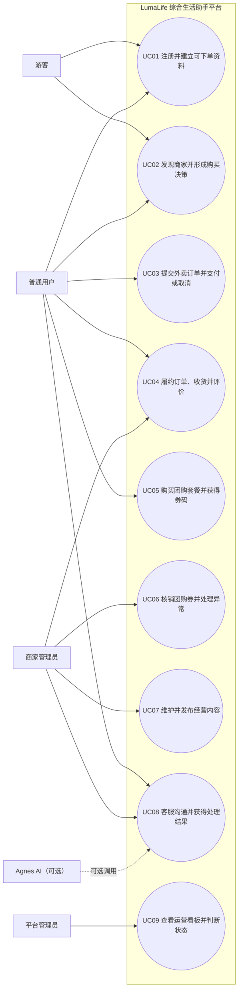
```mermaid
flowchart LR
    Visitor[游客]
    User[普通用户]
    MerchantAdmin[商家管理员]
    PlatformAdmin[平台管理员]
    Agnes[Agnes AI（可选）]

    subgraph System[LumaLife 综合生活助手平台]
      UC1((UC01 注册并建立可下单资料))
      UC2((UC02 发现商家并形成购买决策))
      UC3((UC03 提交外卖订单并支付或取消))
      UC4((UC04 履约订单、收货并评价))
      UC5((UC05 购买团购套餐并获得券码))
      UC6((UC06 核销团购券并处理异常))
      UC7((UC07 维护并发布经营内容))
      UC8((UC08 客服沟通并获得处理结果))
      UC9((UC09 查看运营看板并判断状态))
    end

    Visitor --> UC1
    Visitor --> UC2
    User --> UC1
    User --> UC2
    User --> UC3
    User --> UC4
    User --> UC5
    User --> UC8
    MerchantAdmin --> UC4
    MerchantAdmin --> UC6
    MerchantAdmin --> UC7
    MerchantAdmin --> UC8
    PlatformAdmin --> UC9
    Agnes -.可选调用.-> UC8
```

### A.3 正式清单用例说明和系统级业务场景图

> 本节严格按照正式清单的 UC01~UC09 编排。每个正式业务用例配有一张系统级顺序图、活动图或状态图。旧版按页面/接口拆分的细分内容保留在 A.5，仅作为实现参考，不作为正式业务场景编号。

#### UC01 用户完成平台注册并建立可下单资料

**参与者：** 普通用户。  
**前置条件：** 系统可访问；注册账号尚未使用；资料和地址操作要求登录。  
**主成功流程：** 用户提交账号、密码和昵称；系统校验唯一性并 BCrypt 编码密码；系统返回 Token；用户维护昵称、头像和地址；系统保存默认地址并允许后续下单使用。  
**备选/异常流程：** 账号重复、密码少于 6 个字符、地址超过 5 个、地址不存在或未登录时返回错误；删除默认地址后自动设置剩余地址为默认地址。  
**可验证结果：** 用户可以登录并获得可下单资料，重复注册、地址上限和权限边界可测试。

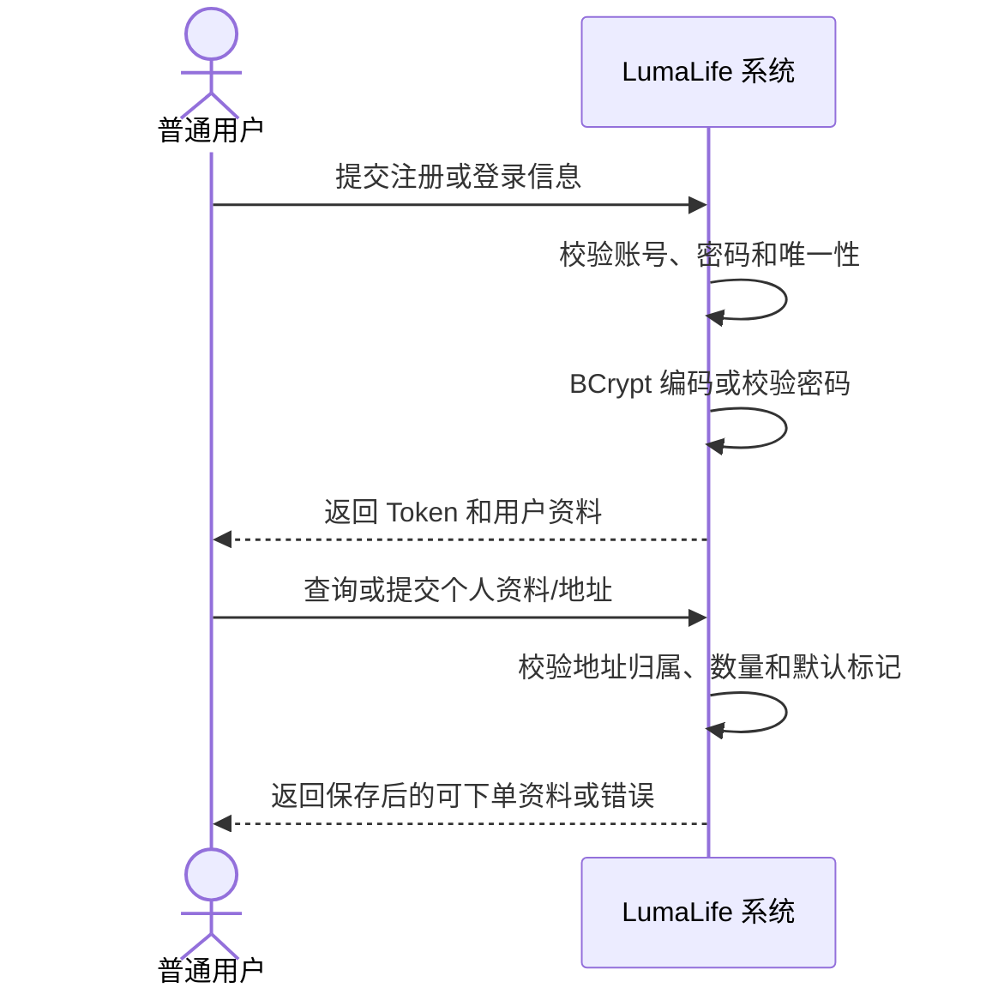
```mermaid
sequenceDiagram
    actor User as 普通用户
    participant System as LumaLife 系统
    User->>System: 提交注册或登录信息
    System->>System: 校验账号、密码和唯一性
    System->>System: BCrypt 编码或校验密码
    System-->>User: 返回 Token 和用户资料
    User->>System: 查询或提交个人资料/地址
    System->>System: 校验地址归属、数量和默认标记
    System-->>User: 返回保存后的可下单资料或错误
```

#### UC02 用户发现商家并形成购买决策

**参与者：** 游客、普通用户。  
**前置条件：** 分类、商家、商品和团购基础数据已加载；收藏要求普通用户登录。  
**主成功流程：** 用户查看发现页；按关键词、分类、价格、最低评分和排序方式筛选；系统返回商家列表和推荐理由；用户查看商品、团购和评价详情；登录用户收藏商家。  
**备选/异常流程：** 无结果返回空列表；商家不存在返回 404；未登录收藏要求登录；重复收藏或取消未收藏商家返回业务错误。  
**可验证结果：** 游客可完成公开发现，用户可完成详情查看和收藏，API 与前端的筛选和收藏状态一致。

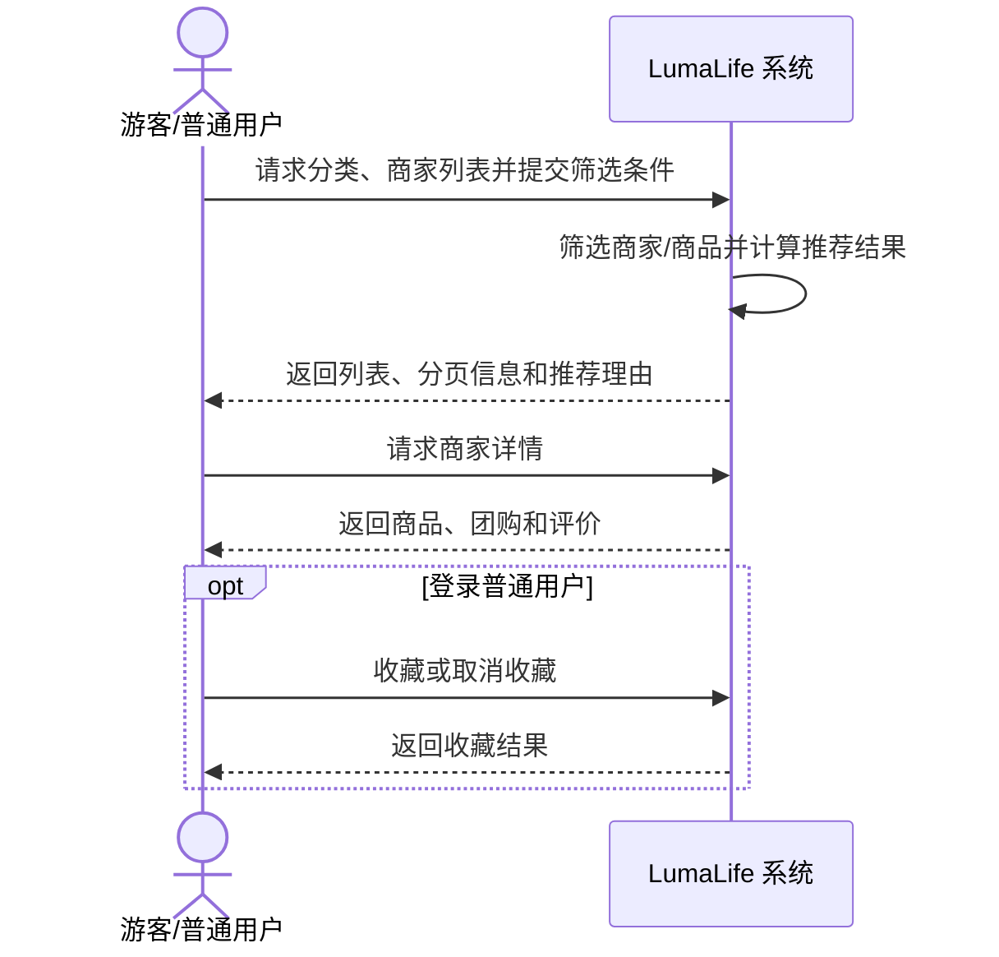
```mermaid
sequenceDiagram
    actor User as 游客/普通用户
    participant System as LumaLife 系统
    User->>System: 请求分类、商家列表并提交筛选条件
    System->>System: 筛选商家/商品并计算推荐结果
    System-->>User: 返回列表、分页信息和推荐理由
    User->>System: 请求商家详情
    System-->>User: 返回商品、团购和评价
    opt 登录普通用户
        User->>System: 收藏或取消收藏
        System-->>User: 返回收藏结果
    end
```

#### UC03 用户提交外卖订单并完成支付或取消

**参与者：** 普通用户。  
**前置条件：** 用户已登录；购物车非空；至少存在一个收货地址。  
**主成功流程：** 用户加购、修改或删除商品；系统校验商品在售状态；用户选择地址并提交订单；系统按商家拆单并保存地址快照；用户提交 `clientRequestId` 完成模拟支付；系统扣减一次库存并将订单置为 `PAID`。  
**备选/异常流程：** 购物车为空、商品下架、库存不足或无地址时拒绝下单；待支付订单可取消；已支付订单不可直接取消；相同 `clientRequestId` 重复支付不重复扣库存。  
**可验证结果：** 订单、金额、地址快照、支付结果和状态时间线正确，取消与支付幂等规则可测试。

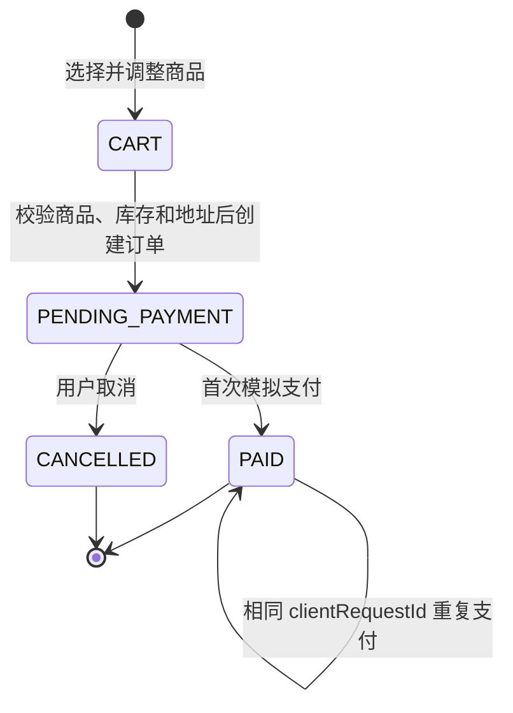
```mermaid
stateDiagram-v2
    [*] --> CART: 选择并调整商品
    CART --> PENDING_PAYMENT: 校验商品、库存和地址后创建订单
    PENDING_PAYMENT --> PAID: 首次模拟支付
    PENDING_PAYMENT --> CANCELLED: 用户取消
    PAID --> PAID: 相同 clientRequestId 重复支付
    PAID --> [*]
    CANCELLED --> [*]
```

#### UC04 商家履约外卖订单，用户确认收货并评价

**参与者：** 商家管理员、普通用户。  
**前置条件：** 订单已支付且属于当前商家；用户只能操作自己的订单。  
**主成功流程：** 商家查看本店订单并依次接单、配送、完成；用户查看时间线并确认收货；用户对完成订单提交评分和文字评价；系统脱敏保存评价、标记已评价并更新商家评分。  
**备选/异常流程：** 商家越权、非法状态跳转、未完成订单评价、重复评价、评分越界或评价为空时拒绝。  
**可验证结果：** 订单状态流转、确认收货、评价一单一评和商家评分统计正确。

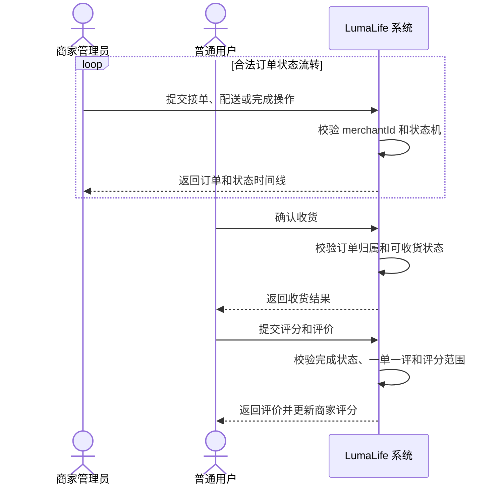
```mermaid
sequenceDiagram
    actor Merchant as 商家管理员
    actor User as 普通用户
    participant System as LumaLife 系统
    loop 合法订单状态流转
        Merchant->>System: 提交接单、配送或完成操作
        System->>System: 校验 merchantId 和状态机
        System-->>Merchant: 返回订单和状态时间线
    end
    User->>System: 确认收货
    System->>System: 校验订单归属和可收货状态
    System-->>User: 返回收货结果
    User->>System: 提交评分和评价
    System->>System: 校验完成状态、一单一评和评分范围
    System-->>User: 返回评价并更新商家评分
```

#### UC05 用户购买团购套餐并获得券码

**参与者：** 普通用户。  
**前置条件：** 用户已登录；团购套餐存在、启用且库存足够。  
**主成功流程：** 用户查看套餐并提交数量；系统创建待支付团购订单；用户模拟支付；系统扣减套餐库存、将订单置为 `PAID` 并生成 12 位数字券码。  
**备选/异常流程：** 套餐不存在、停用、库存不足或支付未完成时不得生成可用券码；相同支付请求不重复生成券码。  
**可验证结果：** 订单显示正确套餐、金额、支付状态和券码，套餐库存只扣减一次。

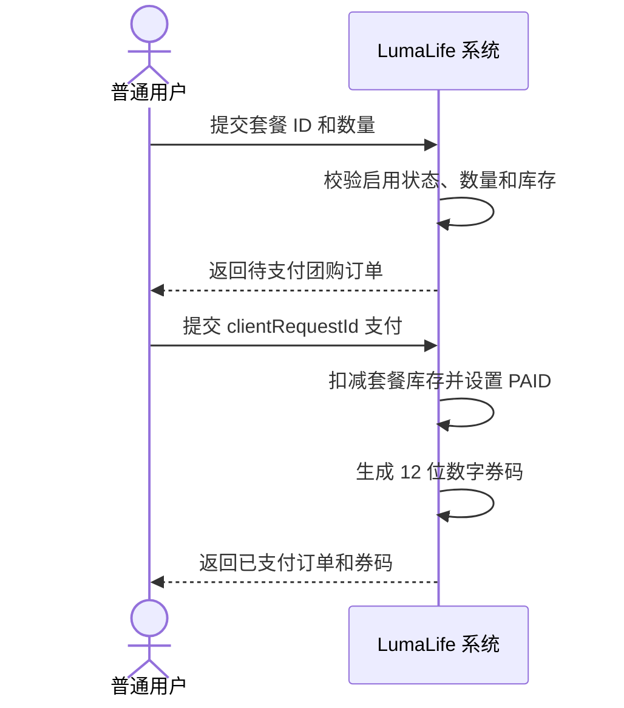
```mermaid
sequenceDiagram
    actor User as 普通用户
    participant System as LumaLife 系统
    User->>System: 提交套餐 ID 和数量
    System->>System: 校验启用状态、数量和库存
    System-->>User: 返回待支付团购订单
    User->>System: 提交 clientRequestId 支付
    System->>System: 扣减套餐库存并设置 PAID
    System->>System: 生成 12 位数字券码
    System-->>User: 返回已支付订单和券码
```

#### UC06 商家核销团购券并处理异常券码

**参与者：** 商家管理员。  
**前置条件：** 商家管理员已登录；券码对应已支付团购订单且属于当前商家。  
**主成功流程：** 商家输入券码；系统查询券码、校验存在性、支付状态和商家归属；系统将订单从 `PAID` 置为 `USED` 并写入日志。  
**备选/异常流程：** 券码不存在、未支付、已取消、已核销或属于其他商家时拒绝，且不改变原状态。  
**可验证结果：** 合法券码只能由本店成功核销一次，异常券码均返回明确提示。

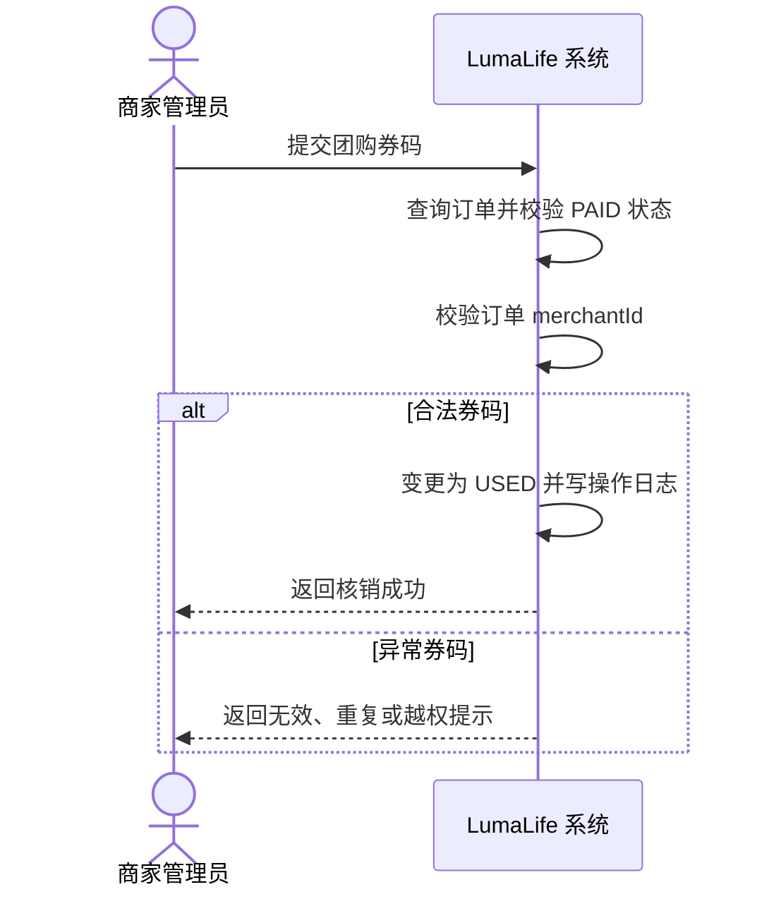
```mermaid
sequenceDiagram
    actor Merchant as 商家管理员
    participant System as LumaLife 系统
    Merchant->>System: 提交团购券码
    System->>System: 查询订单并校验 PAID 状态
    System->>System: 校验订单 merchantId
    alt 合法券码
        System->>System: 变更为 USED 并写操作日志
        System-->>Merchant: 返回核销成功
    else 异常券码
        System-->>Merchant: 返回无效、重复或越权提示
    end
```

#### UC07 商家维护经营内容并发布到用户端

**参与者：** 商家管理员。  
**前置条件：** 商家管理员已登录并绑定有效店铺；维护对象属于当前商家。  
**主成功流程：** 商家维护店铺名称、商品和团购套餐；设置价格、库存、上架/启用状态；系统校验字段和资源归属，保存并写日志；用户端详情读取最新可售内容。  
**备选/异常流程：** 跨商家维护、价格小于等于 0、库存为负或对象不存在时拒绝；下架/停用内容不可被用户新购买；删除商品清理购物车对应项。  
**可验证结果：** 商家维护结果能够在用户端生效，越权和非法经营数据不能保存。

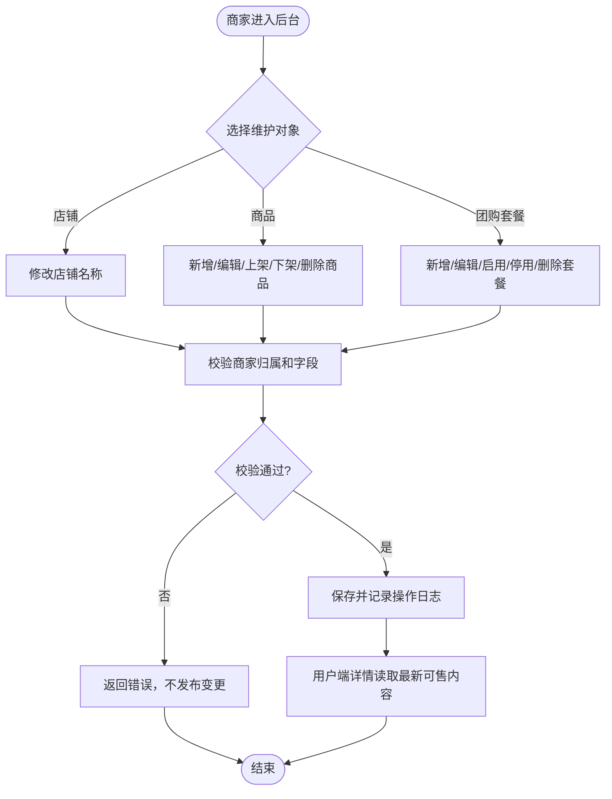
```mermaid
flowchart TD
    A([商家进入后台]) --> B{选择维护对象}
    B -->|店铺| C[修改店铺名称]
    B -->|商品| D[新增/编辑/上架/下架/删除商品]
    B -->|团购套餐| E[新增/编辑/启用/停用/删除套餐]
    C --> F[校验商家归属和字段]
    D --> F
    E --> F
    F --> G{校验通过?}
    G -->|否| H[返回错误，不发布变更]
    G -->|是| I[保存并记录操作日志]
    I --> J[用户端详情读取最新可售内容]
    H --> K([结束])
    J --> K
```

#### UC08 用户与商家客服沟通并获得处理结果

**参与者：** 普通用户、商家管理员、AI 客服。  
**前置条件：** 用户和商家会话要求登录；商家只能查看本店会话；平台 AI 问答当前可公开调用。  
**主成功流程：** 用户发送关于商家、商品、订单或团购的消息；系统保存消息并生成 AI/规则回复；商家查看会话并人工回复；需要时商家调用 AI 辅助生成建议。  
**备选/异常流程：** 空消息拒绝；商家不存在或越权访问拒绝；Agnes 未配置、超时或失败时使用本地兜底回复，人工客服流程不受影响。  
**可验证结果：** 用户和商家看到一致会话历史，AI 能返回上下文相关或兜底回复，越权会话不可访问。

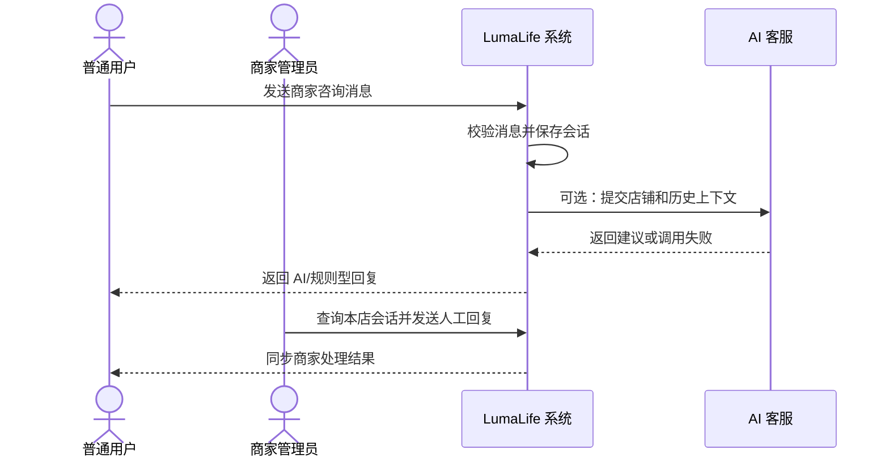
```mermaid
sequenceDiagram
    actor User as 普通用户
    actor Merchant as 商家管理员
    participant System as LumaLife 系统
    participant AI as AI 客服
    User->>System: 发送商家咨询消息
    System->>System: 校验消息并保存会话
    System->>AI: 可选：提交店铺和历史上下文
    AI-->>System: 返回建议或调用失败
    System-->>User: 返回 AI/规则型回复
    Merchant->>System: 查询本店会话并发送人工回复
    System-->>User: 同步商家处理结果
```

#### UC09 平台管理员查看运营看板并判断系统状态

**参与者：** 平台管理员。  
**前置条件：** 平台管理员已登录；系统已有或初始化用户、商家、订单、交易和日志数据。  
**主成功流程：** 管理员进入看板；系统校验角色；系统汇总用户数、商家数、订单数、交易额、订单分布、营收趋势、商家排行、配送指标、活跃订单、健康状态、账号摘要和日志；管理员据此判断平台运行情况。  
**备选/异常流程：** 普通用户或商家管理员访问返回 403；指标为空时展示零值或空状态；健康聚合异常时展示异常状态并提示排查。  
**可验证结果：** 只有平台管理员可以访问看板，指标与演示数据一致，账号摘要不包含密码。

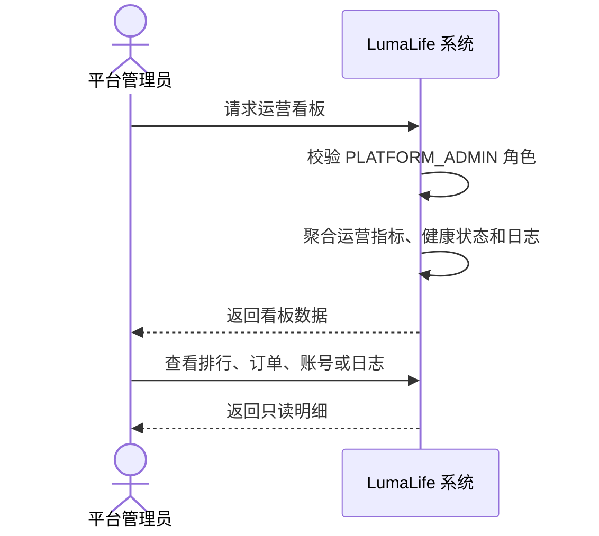
```mermaid
sequenceDiagram
    actor Admin as 平台管理员
    participant System as LumaLife 系统
    Admin->>System: 请求运营看板
    System->>System: 校验 PLATFORM_ADMIN 角色
    System->>System: 聚合运营指标、健康状态和日志
    System-->>Admin: 返回看板数据
    Admin->>System: 查看排行、订单、账号或日志
    System-->>Admin: 返回只读明细
```

### A.5 旧版功能细分参考（非正式业务用例）

以下原有 UC-01~UC-14 内容是前一版按照页面和接口拆分的细分说明。根据正式清单的合并原则，它们不再作为业务场景编号，也不参与附录 C 的正式图示覆盖统计；保留内容用于说明功能需求与代码模块之间的细粒度关系。

#### UC-01 账号注册与登录

**用户故事：** 作为游客，我希望注册或登录账号，以便获得与角色匹配的功能入口。

**参与者：** 游客、普通用户、商家管理员。  
**前置条件：** 游客能够访问登录页面；注册账号标识尚未被使用。  
**触发条件：** 用户提交注册表单或登录表单。

**基本流程：**

1. 用户选择普通用户或商家管理员注册，输入账号、密码和昵称。
2. 系统校验账号非空、密码长度和账号唯一性；商家注册时创建并绑定新店铺。
3. 系统对密码进行 BCrypt 编码，保存账号并返回登录结果。
4. 已有用户输入账号和密码，系统验证凭据。
5. 登录成功后系统生成随机 Token，前端保存 Token 并按角色进入发现页、商家订单页或平台看板。

**异常与后置条件：** 重复账号、密码过短或凭据错误时返回明确错误；平台管理员不能通过公开注册创建。成功后形成登录会话。

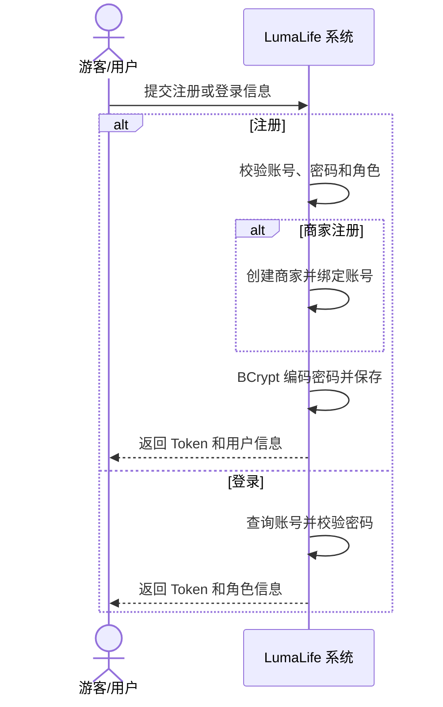
```mermaid
sequenceDiagram
    actor Visitor as 游客/用户
    participant System as LumaLife 系统
    Visitor->>System: 提交注册或登录信息
    alt 注册
        System->>System: 校验账号、密码和角色
        alt 商家注册
            System->>System: 创建商家并绑定账号
        end
        System->>System: BCrypt 编码密码并保存
        System-->>Visitor: 返回 Token 和用户信息
    else 登录
        System->>System: 查询账号并校验密码
        System-->>Visitor: 返回 Token 和角色信息
    end
```

#### UC-02 个人资料与地址管理

**用户故事：** 作为普通用户，我希望维护昵称、头像和收货地址，以便完成配送订单。

**参与者：** 普通用户。  
**前置条件：** 用户已登录并持有有效 Token。  
**基本流程：** 用户打开资料或地址页面，查询已有数据，新增/编辑/删除地址或设置默认地址；系统校验地址归属和数量限制并返回最新列表。

**异常与后置条件：** 超过 5 个地址、地址不存在或未登录时拒绝操作；创建订单时默认地址会被保存为地址快照。

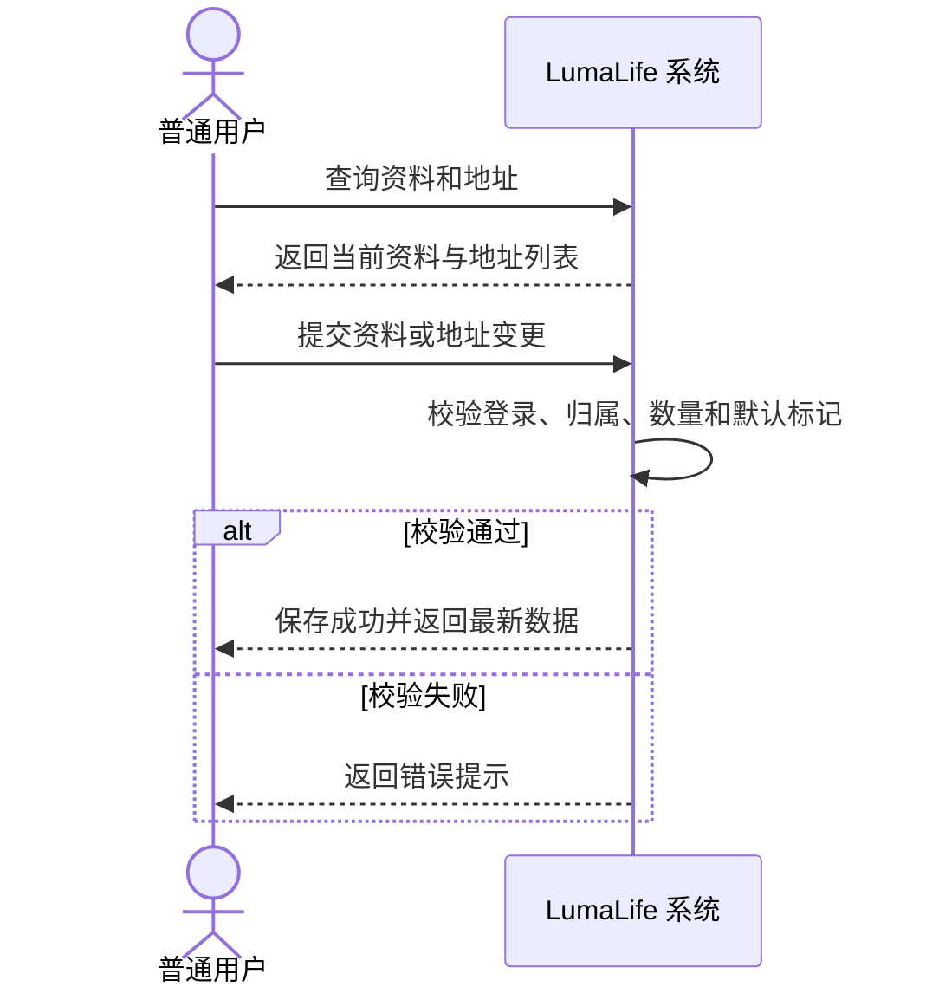
```mermaid
sequenceDiagram
    actor User as 普通用户
    participant System as LumaLife 系统
    User->>System: 查询资料和地址
    System-->>User: 返回当前资料与地址列表
    User->>System: 提交资料或地址变更
    System->>System: 校验登录、归属、数量和默认标记
    alt 校验通过
        System-->>User: 保存成功并返回最新数据
    else 校验失败
        System-->>User: 返回错误提示
    end
```

#### UC-03 商家发现

**用户故事：** 作为用户，我希望按关键词、分类、价格、评分和排序方式查找商家，以便快速发现合适的消费地点。

**参与者：** 游客、普通用户。  
**前置条件：** 系统已加载分类和种子商家；普通用户登录后可产生个性化推荐历史。  
**基本流程：** 用户输入条件，系统筛选商家名称或商品名称，计算实时评分/销量并排序，返回分页记录及推荐理由。

**异常与后置条件：** 无结果时返回空列表；非法筛选条件由前端或后端提示；不改变订单和库存数据。

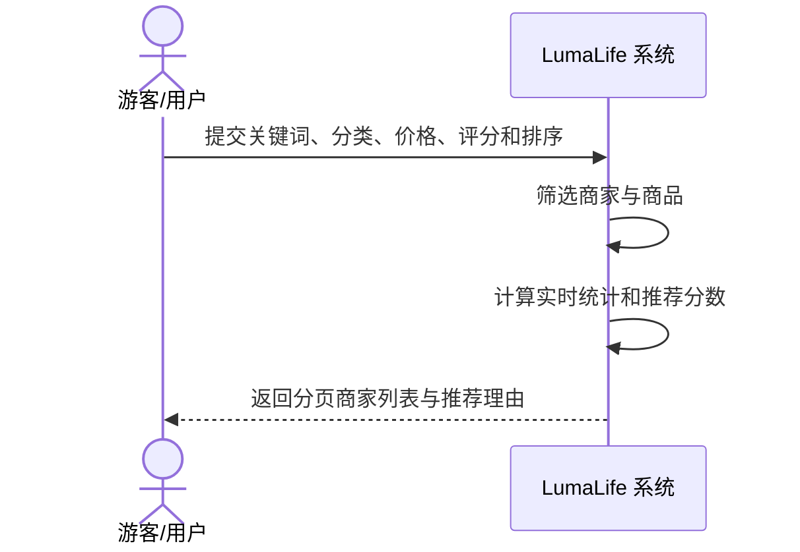
```mermaid
sequenceDiagram
    actor User as 游客/用户
    participant System as LumaLife 系统
    User->>System: 提交关键词、分类、价格、评分和排序
    System->>System: 筛选商家与商品
    System->>System: 计算实时统计和推荐分数
    System-->>User: 返回分页商家列表与推荐理由
```

#### UC-04 商家详情与收藏

**用户故事：** 作为普通用户，我希望查看商家商品、团购和评价并收藏商家，以便比较和再次访问。

**参与者：** 游客、普通用户。  
**前置条件：** 商家 ID 存在；收藏操作要求普通用户已登录。  
**基本流程：** 用户打开商家卡片，系统返回公开商家信息、在售商品、有效套餐和评价；登录用户可收藏、取消收藏并查看收藏列表。

**异常与后置条件：** 商家不存在返回 404；重复收藏和取消未收藏商家返回业务错误；收藏结果写入当前状态。

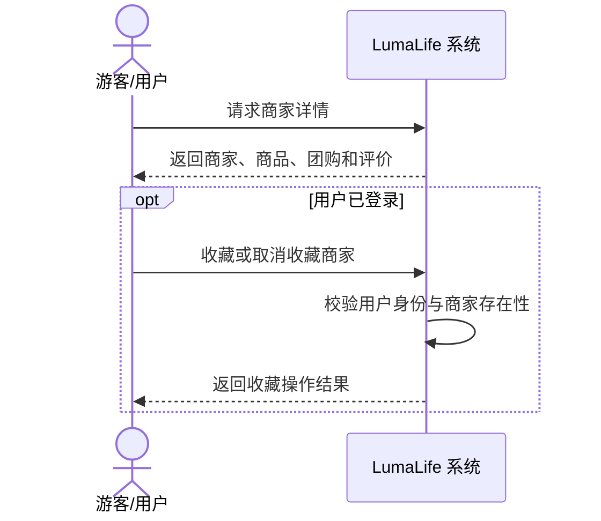
```mermaid
sequenceDiagram
    actor User as 游客/用户
    participant System as LumaLife 系统
    User->>System: 请求商家详情
    System-->>User: 返回商家、商品、团购和评价
    opt 用户已登录
        User->>System: 收藏或取消收藏商家
        System->>System: 校验用户身份与商家存在性
        System-->>User: 返回收藏操作结果
    end
```

#### UC-05 购物车管理

**用户故事：** 作为普通用户，我希望增加、修改和移除购物车商品，以便在提交订单前调整购买内容。

**参与者：** 普通用户。  
**前置条件：** 用户已登录，商品存在且处于上架状态。  
**基本流程：** 用户加购商品，系统写入数量；用户修改数量、删除商品或清空购物车；系统返回购物车明细和小计。

**异常与后置条件：** 商品下架、商品不存在、数量不合法或删除不存在项时返回业务错误；购物车可包含多个商家商品。

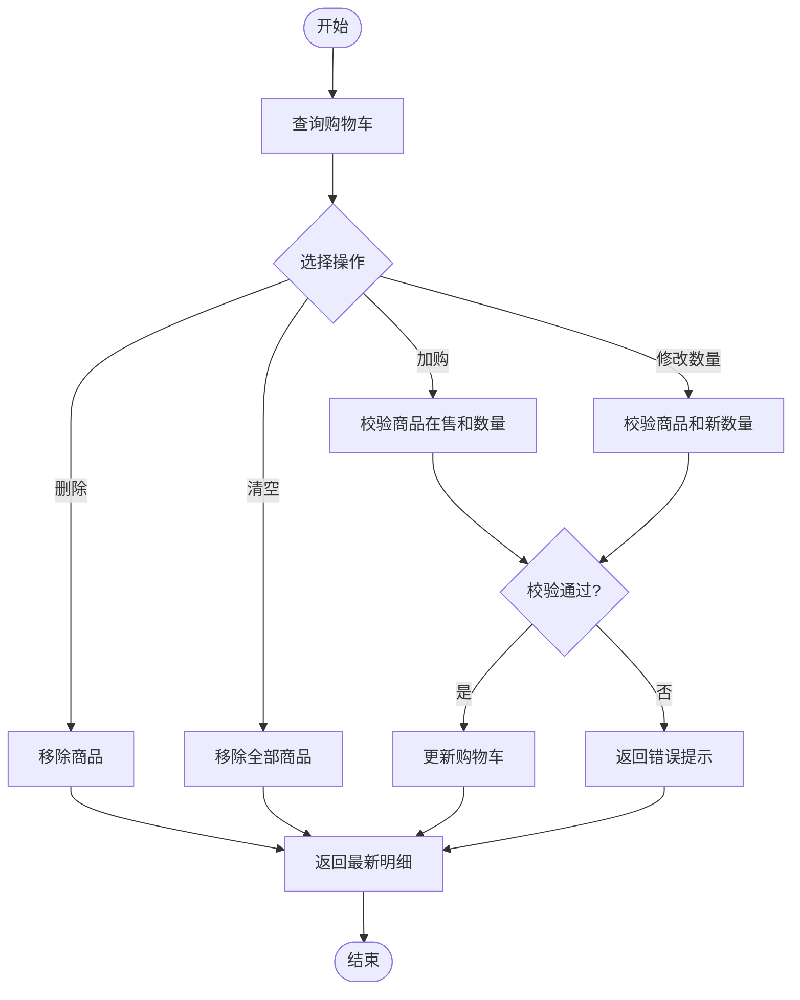
```mermaid
flowchart TD
    A([开始]) --> B[查询购物车]
    B --> C{选择操作}
    C -->|加购| D[校验商品在售和数量]
    C -->|修改数量| E[校验商品和新数量]
    C -->|删除| F[移除商品]
    C -->|清空| G[移除全部商品]
    D --> H{校验通过?}
    E --> H
    H -->|是| I[更新购物车]
    H -->|否| J[返回错误提示]
    F --> K[返回最新明细]
    G --> K
    I --> K
    J --> K
    K --> L([结束])
```

#### UC-06 创建外卖订单

**用户故事：** 作为普通用户，我希望选择收货地址并提交购物车，以便生成待支付外卖订单。

**参与者：** 普通用户。  
**前置条件：** 用户已登录，购物车非空，至少存在一个地址。  
**基本流程：** 用户选择默认或指定地址并提交；系统校验商品上架状态和库存，按商家分组生成订单，记录地址快照，清空购物车。

**异常与后置条件：** 购物车为空、无地址、商品下架、商品失效或库存不足时不创建订单；跨商家商品生成多个 `PENDING_PAYMENT` 订单。

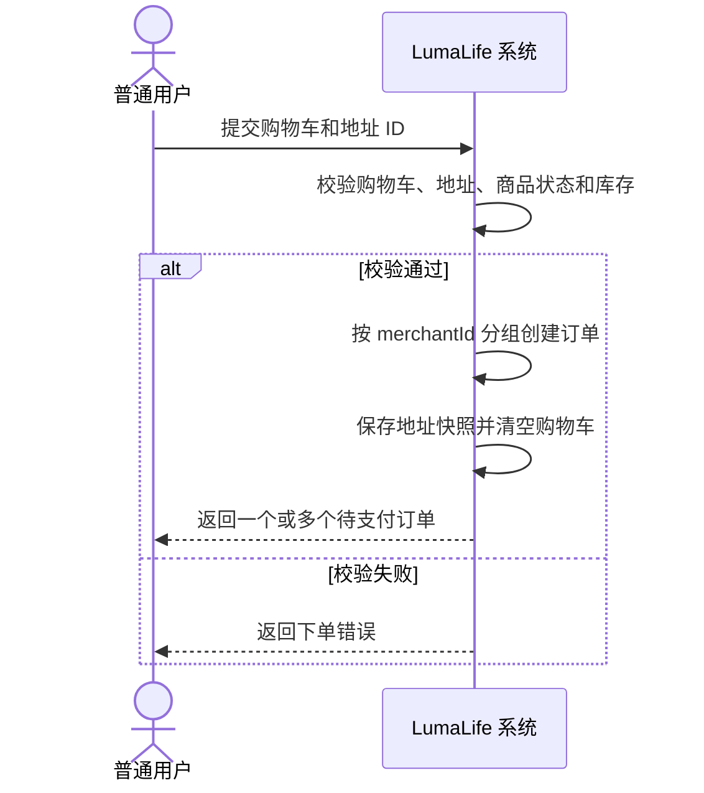
```mermaid
sequenceDiagram
    actor User as 普通用户
    participant System as LumaLife 系统
    User->>System: 提交购物车和地址 ID
    System->>System: 校验购物车、地址、商品状态和库存
    alt 校验通过
        System->>System: 按 merchantId 分组创建订单
        System->>System: 保存地址快照并清空购物车
        System-->>User: 返回一个或多个待支付订单
    else 校验失败
        System-->>User: 返回下单错误
    end
```

#### UC-07 外卖支付与取消

**用户故事：** 作为普通用户，我希望对待支付订单进行模拟支付或取消，以便控制订单是否进入商家履约。

**参与者：** 普通用户。  
**前置条件：** 订单属于当前用户；支付订单必须为 `PENDING_PAYMENT`。  
**基本流程：** 用户提交订单 ID 和 `clientRequestId`；系统校验幂等标识，扣减一次库存并变为 `PAID`；或对待支付订单执行取消。

**异常与后置条件：** 请求标识为空、订单不属于用户、订单状态不允许支付/取消时拒绝；重复支付返回原订单，不重复扣库存。

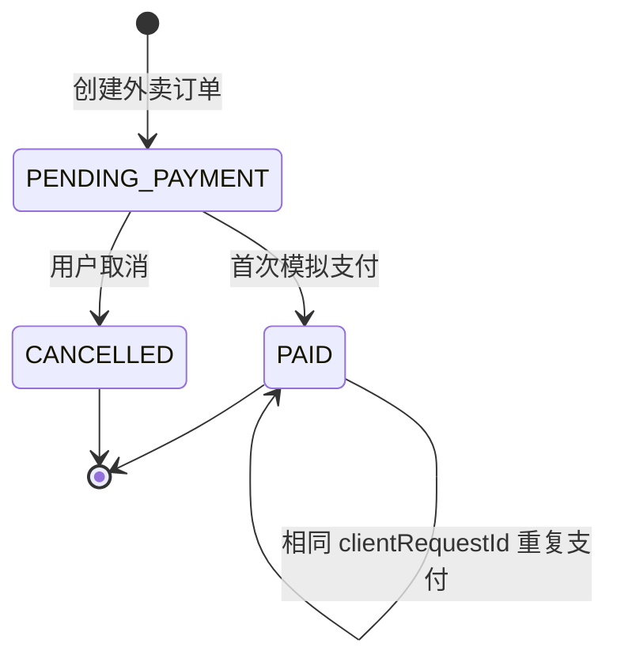
```mermaid
stateDiagram-v2
    [*] --> PENDING_PAYMENT: 创建外卖订单
    PENDING_PAYMENT --> PAID: 首次模拟支付
    PENDING_PAYMENT --> CANCELLED: 用户取消
    PAID --> PAID: 相同 clientRequestId 重复支付
    PAID --> [*]
    CANCELLED --> [*]
```

#### UC-08 外卖履约与确认收货

**用户故事：** 作为商家管理员，我希望按顺序处理本店订单；作为用户，我希望在配送后确认收货，以便完成履约闭环。

**参与者：** 商家管理员、普通用户。  
**前置条件：** 外卖订单已支付；商家管理员与订单商家匹配。  
**基本流程：** 商家依次将订单从 `PAID` 改为 `ACCEPTED`、`DELIVERING`、`COMPLETED`；用户在配送中或完成状态下确认收货，订单变为 `RECEIVED`。

**异常与后置条件：** 跳过状态、处理他店订单、处理团购订单或未配送确认收货时拒绝；每次状态变更写入时间线和操作日志。

```mermaid
stateDiagram-v2
    [*] --> PAID: 用户支付
    PAID --> ACCEPTED: 商家接单
    ACCEPTED --> DELIVERING: 开始配送
    DELIVERING --> COMPLETED: 商家完成
    DELIVERING --> RECEIVED: 用户确认收货
    COMPLETED --> RECEIVED: 用户确认收货
    PAID --> [*]: 非法跳转
```

#### UC-09 团购购买与券码

**用户故事：** 作为普通用户，我希望购买有效团购套餐并获得券码，以便到店使用。

**参与者：** 普通用户。  
**前置条件：** 套餐存在、启用且库存满足购买数量。  
**基本流程：** 用户在商家详情选择套餐，系统创建待支付团购订单；用户模拟支付后，系统扣减套餐库存、生成 12 位数字券码并返回。

**异常与后置条件：** 套餐停用、套餐不存在、库存不足或支付失败时不生成可用券码；成功后订单状态为 `PAID`。

```mermaid
sequenceDiagram
    actor User as 普通用户
    participant System as LumaLife 系统
    User->>System: 提交团购套餐 ID 和数量
    System->>System: 校验套餐启用状态和库存
    System-->>User: 返回待支付团购订单
    User->>System: 提交订单支付请求
    System->>System: 幂等校验并扣减套餐库存
    System->>System: 生成 12 位数字券码
    System-->>User: 返回已支付订单和券码
```

#### UC-10 团购券核销

**用户故事：** 作为商家管理员，我希望核销本店有效团购券，以便确认用户已到店消费。

**参与者：** 商家管理员。  
**前置条件：** 商家管理员已登录；券码对应订单存在且已支付。  
**基本流程：** 商家输入券码，系统查询券码索引、校验商家归属和订单状态，将订单置为 `USED` 并记录日志。

**异常与后置条件：** 券码不存在、属于其他商家或已核销时拒绝；核销成功后不可再次核销。

```mermaid
sequenceDiagram
    actor Merchant as 商家管理员
    participant System as LumaLife 系统
    Merchant->>System: 提交团购券码
    System->>System: 查询券码和订单
    System->>System: 校验商家归属及 PAID 状态
    alt 校验通过
        System->>System: 将订单变为 USED 并写日志
        System-->>Merchant: 返回核销成功
    else 校验失败
        System-->>Merchant: 返回不存在、越权或重复核销提示
    end
```

#### UC-11 评价与评分

**用户故事：** 作为普通用户，我希望评价已完成的订单，以便记录体验并帮助其他用户判断商家。

**参与者：** 普通用户、商家管理员。  
**前置条件：** 订单属于当前用户，状态为 `RECEIVED`、`COMPLETED` 或 `USED`，且尚未评价。  
**基本流程：** 用户提交总评分、口味评分、服务评分和文字；系统校验范围和内容，创建脱敏用户评价并标记订单已评价；商家可查看本店评价。

**异常与后置条件：** 未完成订单、重复评价、评分不在 1 至 5 或空内容时拒绝；评价影响商家实时评分展示。

```mermaid
sequenceDiagram
    actor User as 普通用户
    participant System as LumaLife 系统
    User->>System: 提交订单评价和三项评分
    System->>System: 校验订单归属、状态、一单一评和评分范围
    alt 校验通过
        System->>System: 脱敏昵称并保存评价
        System->>System: 标记订单 reviewed=true
        System-->>User: 返回评价结果
    else 校验失败
        System-->>User: 返回评价错误
    end
```

#### UC-12 商家经营维护

**用户故事：** 作为商家管理员，我希望维护商品、团购套餐和店铺名称，以便公开页面展示准确的经营信息。

**参与者：** 商家管理员。  
**前置条件：** 商家管理员已登录并绑定有效店铺。  
**基本流程：** 商家新增或编辑商品/套餐，修改价格、库存、上架或启用状态；也可删除本店资源和修改店铺展示名称。系统校验资源归属并返回最新数据。

**异常与后置条件：** 价格不合法、库存为负、资源不属于当前商家或资源不存在时拒绝；删除商品清理购物车项，店铺名称同步公开列表和订单显示。

```mermaid
flowchart TD
    A([商家进入管理页]) --> B{选择维护对象}
    B -->|商品| C[新增/编辑/上下架/删除商品]
    B -->|团购| D[新增/编辑/启用/停用/删除套餐]
    B -->|店铺| E[修改店铺名称]
    C --> F[校验 merchantId、价格和库存]
    D --> F
    E --> G[校验名称并同步账号与店铺]
    F --> H{校验通过?}
    H -->|是| I[保存并写操作日志]
    H -->|否| J[返回业务错误]
    G --> I
    I --> K([结束])
    J --> K
```

#### UC-13 客服会话与 AI 辅助

**用户故事：** 作为用户，我希望向平台或商家咨询；作为商家，我希望查看会话、人工回复并使用 AI 辅助生成回复。

**参与者：** 普通用户、商家管理员、Agnes AI（可选）。  
**前置条件：** 商家会话要求用户登录；商家侧要求商家管理员登录；平台 AI 问答当前可公开调用。  
**基本流程：** 用户发送不超过 500 字消息，系统保存消息并调用本地规则或 Agnes 生成回复；商家查看本店会话并可人工回复或请求 AI 建议。

**异常与后置条件：** 空消息被拒绝；远程 AI 超时、密钥为空或返回异常时使用本地兜底；会话数据在状态文件配置有效时可恢复。

```mermaid
sequenceDiagram
    actor User as 用户
    actor Merchant as 商家管理员
    participant System as LumaLife 系统
    participant Agnes as Agnes API
    User->>System: 发送平台问题或商家消息
    System->>System: 校验内容长度并保存用户消息
    alt 商家会话
        System->>Agnes: 可选：提交店铺上下文和历史消息
        Agnes-->>System: 返回建议回复
        System-->>User: 返回 AI/兜底回复并保存会话
        Merchant->>System: 查询会话并发送人工回复
        System-->>User: 返回商家回复
    else 平台问答
        System->>Agnes: 可选：提交平台问题
        Agnes-->>System: 返回回答
        System-->>User: 返回 AI/规则回答
    end
```

#### UC-14 平台看板

**用户故事：** 作为平台管理员，我希望查看平台规模、订单、收入、健康状态和日志，以便观察演示系统运行情况。

**参与者：** 平台管理员。  
**前置条件：** 管理员已使用 `PLATFORM_ADMIN` 账号登录。  
**基本流程：** 管理员打开看板，系统聚合用户、商家、订单、金额、趋势、排行、配送时效、活跃订单、健康状态、账号和日志并返回；前端使用图表和表格展示。

**异常与后置条件：** 非平台管理员访问返回 403；看板只读，不改变交易数据。

```mermaid
sequenceDiagram
    actor Admin as 平台管理员
    participant System as LumaLife 系统
    Admin->>System: 请求平台指标
    System->>System: 校验 PLATFORM_ADMIN 角色
    System->>System: 聚合订单、金额、趋势、排行、健康和日志
    System-->>Admin: 返回看板数据
    Admin->>System: 刷新或查看账号/活跃订单
    System-->>Admin: 返回当前只读指标
```

## 附录 B 核心状态与演示账号

### B.1 订单状态

| 枚举 | 中文含义 | 适用 |
|---|---|---|
| `PENDING_PAYMENT` | 待支付 | 外卖、团购 |
| `PAID` | 已支付/待履约或待使用 | 外卖、团购 |
| `ACCEPTED` | 商家已接单 | 外卖 |
| `DELIVERING` | 配送中 | 外卖 |
| `COMPLETED` | 已完成 | 外卖 |
| `RECEIVED` | 已收货 | 外卖 |
| `USED` | 已使用 | 团购 |
| `EXPIRED` | 已过期，当前无自动任务 | 预留 |
| `CANCELLED` | 已取消 | 待支付订单 |

### B.2 演示账号

| 角色 | 账号 | 密码 |
|---|---|---|
| 普通用户 | `13800000001` | `abc123456` |
| 巷口川味研究所 | `13800000002` | `abc123456` |
| 晨雾咖啡局 | `13800000003` | `abc123456` |
| 绿盒轻食 | `13800000004` | `abc123456` |
| 栗香烘焙室 | `13800000005` | `abc123456` |
| 平台管理员 | `13800000000` | `admin123456` |

## 附录 C 正式用例图示覆盖检查表

| 正式用例 | 图类型 | 所在位置 |
|---|---|---|
| UC01 | 系统级顺序图 | 附录 A.3，UC01 |
| UC02 | 系统级顺序图 | 附录 A.3，UC02 |
| UC03 | 系统级状态图 | 附录 A.3，UC03 |
| UC04 | 系统级顺序图 | 附录 A.3，UC04 |
| UC05 | 系统级顺序图 | 附录 A.3，UC05 |
| UC06 | 系统级顺序图 | 附录 A.3，UC06 |
| UC07 | 系统级活动图 | 附录 A.3，UC07 |
| UC08 | 系统级顺序图 | 附录 A.3，UC08 |
| UC09 | 系统级顺序图 | 附录 A.3，UC09 |

## 附录 D 正式用例追踪矩阵

| 正式用例 | 系统级图 | 组件/对象视图 | 主要代码模块 | 测试追踪 |
|---|---|---|---|---|
| UC01 | SYS-SEQ01 | COMP-SEQ01 / OBJ-SEQ01 | `AuthService`、`SecurityConfig`、`DemoStore`、`ApiControllers`、`Login`、`Profile` | UNIT-TC01 / INT-TC01 / E2E-TC01 |
| UC02 | SYS-SEQ02 | COMP-SEQ02 / OBJ-SEQ02 | `CatalogService`、`FavoriteService`、`DemoStore`、`Home`、`Detail`、`Favorites` | UNIT-TC02 / INT-TC02 / E2E-TC02 |
| UC03 | SYS-SEQ03 | COMP-SEQ03 / OBJ-SEQ03 | `CartService`、`OrderWorkflowService`、`AuthService`、`DemoStore`、`Cart`、`Orders` | UNIT-TC03 / INT-TC03 / E2E-TC03 |
| UC04 | SYS-SEQ04 | COMP-SEQ04 / OBJ-SEQ04 | `MerchantAdminService`、`OrderWorkflowService`、`DemoStore`、`MerchantOrders`、`MerchantDesk`、`Orders` | UNIT-TC04 / INT-TC04 / E2E-TC04 |
| UC05 | SYS-SEQ05 | COMP-SEQ05 / OBJ-SEQ05 | `OrderWorkflowService`、`CatalogService`、`DemoStore`、`Detail`、`Orders` | UNIT-TC05 / INT-TC05 / E2E-TC05 |
| UC06 | SYS-SEQ06 | COMP-SEQ06 / OBJ-SEQ06 | `MerchantAdminService`、`OrderWorkflowService`、`DemoStore`、`MerchantOrders`、`MerchantDesk` | UNIT-TC06 / INT-TC06 / E2E-TC06 |
| UC07 | SYS-SEQ07 | COMP-SEQ07 / OBJ-SEQ07 | `MerchantAdminService`、`CatalogService`、`DemoStore`、`MerchantProducts`、`MerchantShop`、`Detail` | UNIT-TC07 / INT-TC07 / E2E-TC07 |
| UC08 | SYS-SEQ08 | COMP-SEQ08 / OBJ-SEQ08 | `AssistantService`、`DemoStore`、`Assistant`、`MerchantSupport`、`MerchantDesk` | UNIT-TC08 / INT-TC08 / E2E-TC08 |
| UC09 | SYS-SEQ09 | COMP-SEQ09 / OBJ-SEQ09 | `AdminDashboardService`、`SecurityConfig`、`DemoStore`、`Admin` | UNIT-TC09 / INT-TC09 / E2E-TC09 |

权限校验、统一错误响应和敏感字段保护属于全局质量与安全需求，作为 UC01~UC09 的通用验收条件，不单独增加业务用例。
