# LumaLife 综合生活助手平台

## 软件概要设计说明书

| 项目 | 内容 |
|---|---|
| 文档编号 | LUMALIFE-SDD-001 |
| 版本 | 2.0 |
| 编制依据 | 当前代码实现、正式业务场景用例清单、需求规格说明书 |
| 适用范围 | LumaLife 综合生活助手平台 Web 端及后端服务 |
| 文档状态 | 设计基线 |

> 本文是当前项目实现的概要设计说明书。参考文档中的章节组织和图示风格保留，但具体技术、接口、数据存储和业务流程以仓库当前代码为准。正式业务场景采用 UC01～UC09，不将登录、收藏、购物车和权限单独扩展为正式业务场景。

## 1 引言

### 1.1 编写目的

本文从系统总体结构、组件职责、接口边界、数据结构和运行设计等方面说明 LumaLife 的实现方案，为详细设计、编码、测试、部署和后续持久化迁移提供统一依据。

本文特别覆盖以下设计交付物：

- 系统总体组件图；
- UC01～UC09 每个正式业务场景各一张组件级顺序图、状态图或活动图；
- 前后端组件职责及调用边界；
- 当前内存加可选 JSON 状态文件方案与未来数据库迁移边界。

### 1.2 项目背景

LumaLife 面向本地生活服务场景，为用户提供商家发现、商品浏览、收藏、购物车、外卖订单、团购券、评价和智能助手能力，为商家提供经营内容、订单履约、客服和团购券核销能力，为平台管理员提供运营看板。

当前系统是一个可运行的 Web 演示与工程化原型：前端通过 REST API 调用 Spring Boot 后端，后端业务状态由 `DemoStore` 管理，并可通过 `lumalife.state-file` 配置将部分状态持久化到 JSON 文件。Docker Compose 中预留 MySQL 和 Redis 服务，但它们不是当前后端业务运行的实际依赖。

### 1.3 术语与缩写

| 术语 | 含义 |
|---|---|
| 用户 | 使用平台发现商家、下单、购买团购或咨询的消费者 |
| 商家管理员 | 维护商家资料、商品、团购、订单和客服消息的商家角色 |
| 平台管理员 | 查看平台级运营指标的管理角色 |
| 外卖订单 | 用户从商家购物车提交、支付并由商家履约的订单 |
| 团购券码 | 用户购买团购套餐后由系统生成的 12 位数字核销码 |
| `DemoStore` | 当前后端的内存领域存储和状态协调组件 |
| 状态文件 | `lumalife.state-file` 指向的可选 JSON 快照文件 |
| Agnes | 可选的外部 AI 对话服务适配器 |
| UC | Use Case，业务场景用例 |

### 1.4 参考资料

1. [软件需求规格说明书](./12_软件需求规格说明书.md)
2. [项目总览](./00_项目总览.md)
3. [接口文档](./05_接口文档.md)
4. [数据库持久化迁移计划](./11_数据库持久化迁移计划.md)
5. `backend/src/main/java/com/lumalife/controller/ApiControllers.java`
6. `backend/src/main/java/com/lumalife/service/` 下业务服务实现
7. `frontend/src/App.tsx`、`frontend/src/api.ts` 及 `frontend/src/pages/` 页面实现

## 2 系统需求概述

### 2.1 系统需求规定

系统应在统一的 Web 界面中支持消费者、商家管理员和平台管理员三类角色。系统必须通过后端接口完成身份识别、角色校验和业务状态校验；前端不得直接修改订单、库存、券码或管理数据。

系统的业务边界由九个正式业务场景组成：

| 编号 | 正式业务场景 | 优先级 |
|---|---|---|
| UC01 | 用户完成平台注册并建立可下单资料 | P1 |
| UC02 | 用户发现商家并形成购买决策 | P1 |
| UC03 | 用户提交外卖订单并完成支付或取消 | P0 |
| UC04 | 商家履约外卖订单，用户确认收货并评价 | P0 |
| UC05 | 用户购买团购套餐并获得券码 | P0 |
| UC06 | 商家核销团购券并处理异常券码 | P0 |
| UC07 | 商家维护经营内容并发布到用户端 | P1 |
| UC08 | 用户与商家客服沟通并获得处理结果 | P1 |
| UC09 | 平台管理员查看运营看板并判断系统状态 | P1 |

### 2.2 业务目标

1. 将本地商家、商品、团购内容集中呈现，降低用户发现和决策成本。
2. 用购物车、支付幂等、库存扣减和订单状态流转支撑可演示的交易闭环。
3. 将外卖履约和团购核销分别建模，保证用户端与商家端的操作边界清晰。
4. 为客服沟通提供持久化会话记录，并在配置可用时接入 Agnes 智能回复。
5. 用平台指标接口为管理员提供商家、订单、收入和系统活跃度概览。

### 2.3 运行环境

#### 2.3.1 设备环境

| 设备 | 要求 |
|---|---|
| 客户端 | 支持现代 JavaScript、Fetch API 和 CSS 的桌面或移动浏览器 |
| 应用服务器 | 能运行 Java 17、Maven 和 Spring Boot 3.3.5 的主机 |
| 可选容器环境 | Docker 与 Docker Compose；Compose 文件中的 MySQL 8.4、Redis 7 为预留基础设施 |
| 网络 | 浏览器可访问前端开发服务器和后端 8080 端口；AI 能力需额外访问 Agnes endpoint |

#### 2.3.2 支持软件

| 软件 | 当前版本或配置 |
|---|---|
| 后端语言 | Java 17 |
| 后端框架 | Spring Boot 3.3.5、Spring Web、Spring Security |
| API 文档 | springdoc-openapi 2.6.0，Swagger UI 路径为 `/swagger-ui/index.html` |
| 前端框架 | React 18.3.1、TypeScript 5.6.3 |
| 前端构建 | Vite 5.4.10 |
| 运行端口 | 后端 8080；前端开发服务器由 Vite 分配或按启动参数指定 |
| 健康检查 | Actuator 暴露 `health`、`info` |

### 2.4 设计约束

1. 当前版本必须兼容现有 React 页面、REST 路由和响应结构 `{code, message, data}`。
2. 后端业务规则集中在服务层，控制器只负责请求接收、认证上下文和响应包装。
3. 订单状态只能通过 `OrderWorkflowService` 或商家履约服务进行合法转换。
4. 当前运行形态不依赖数据库即可启动；状态文件能力必须保持可选。
5. 支付为演示支付，不连接真实支付渠道；支付幂等依靠 `clientRequestId`。
6. 当前登录令牌是后端内存保存的随机 UUID，不是 JWT；当前没有 refresh、revoke 或 logout REST 接口。
7. Agnes 是可选外部依赖，未配置密钥或调用失败时必须走本地回复回退路径。

### 2.5 功能模块概览

| 模块 | 主要职责 | 主要实现组件 |
|---|---|---|
| 用户与身份 | 注册、登录、用户资料、地址和角色上下文 | `Login`、`Profile`、`AuthService`、`SecurityConfig` |
| 商家发现 | 分类、商家列表、商家详情、商品和团购展示 | `Home`、`Detail`、`CatalogService` |
| 交易闭环 | 购物车、外卖订单、支付、取消、收货和团购券 | `Cart`、`Orders`、`CartService`、`OrderWorkflowService` |
| 互动服务 | 收藏、评价、用户客服会话和商家客服 | `Favorites`、`Assistant`、`MerchantSupport`、`FavoriteService`、`AssistantService` |
| 商家运营 | 商家资料、商品、团购、订单履约、券码核销 | `MerchantShop`、`MerchantProducts`、`MerchantOrders`、`MerchantAdminService` |
| 平台运营 | 运营统计和系统状态概览 | `Admin`、`AdminDashboardService` |
| 状态存储 | 领域集合、种子数据、部分状态快照 | `DemoStore`、JSON state file |

### 2.6 非功能设计概述

| 属性 | 设计要点 |
|---|---|
| 安全性 | Spring Security 统一拦截；普通接口要求认证，商家管理要求 `MERCHANT_ADMIN`，平台管理要求 `PLATFORM_ADMIN` |
| 一致性 | 订单状态、库存扣减、支付幂等和券码核销在后端服务内完成，不能信任前端状态 |
| 可用性 | Agnes 不可用时使用本地回退；状态文件不存在时使用种子数据，状态文件损坏或读写失败时当前实现会抛出异常并中止启动或请求，需由运维修复或移除文件后重试 |
| 可维护性 | Controller、Service、Store、Domain 分层；前端 API 调用集中在 `api.ts` |
| 可测试性 | 服务规则可通过 `DemoStoreTest` 验证，安全边界可通过 `ApiSecurityIntegrationTest` 验证 |
| 可扩展性 | `DemoStore` 与 REST 服务之间保持清晰边界，后续可替换为 Repository/数据库实现 |
| 可观测性 | Actuator health/info、统一业务响应、全局异常处理和后端日志 |

### 2.7 系统总体架构与组件图

系统采用“浏览器前端—REST 控制器—领域服务—内存状态存储”的分层结构。前端页面不直接访问存储；控制器通过 `SecurityConfig` 取得认证用户并调用对应服务；服务层读取或修改 `DemoStore`，必要时由状态文件组件写入快照，智能助手服务可选调用 Agnes。

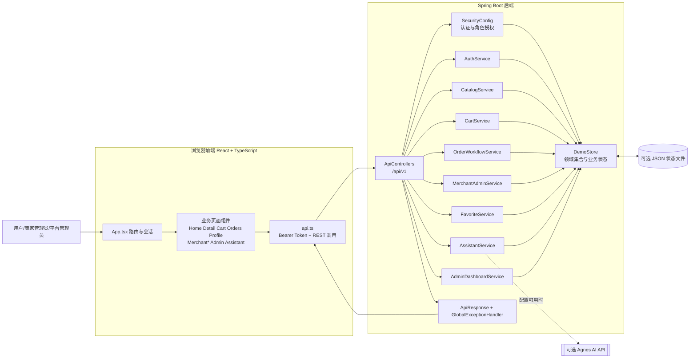

#### 2.7.1 前端组件

| 组件 | 职责 | 依赖 |
|---|---|---|
| `App.tsx` | 维护页面路由、登录态和全局导航 | 页面组件、`localStorage` |
| `api.ts` | 封装 HTTP 方法、请求体、Bearer token 和响应解包 | 后端 `/api/v1` |
| 用户页面 | 展示发现、详情、购物车、订单、资料、收藏和 AI 助手 | `api.ts` |
| 商家页面 | 展示商家资料、商品、订单、客服和商家工作台 | `api.ts` |
| `Admin.tsx` | 展示管理员指标与图表 | `api.ts`、Recharts |
| `StatusTimeline.tsx` | 展示订单时间线和状态 | `Orders`、`MerchantOrders` |

#### 2.7.2 后端组件

| 组件 | 职责 |
|---|---|
| `ApiControllers` | REST 入口、路径参数校验、认证用户传递和响应包装 |
| `SecurityConfig` | 公开路径、认证路径、角色路径与异常状态 |
| `AuthService` | 注册、登录、当前用户和用户资料 |
| `CatalogService` | 分类、商家、商品和团购查询 |
| `CartService` | 购物车增删改查、清空和商品汇总 |
| `OrderWorkflowService` | 外卖/团购下单、支付、取消、收货、优惠券与状态流转 |
| `MerchantAdminService` | 商家内容、订单履约、评价、客服和券码核销 |
| `FavoriteService` | 收藏夹读写 |
| `AssistantService` | 会话记录、商家客服消息和 Agnes/本地回复选择 |
| `AdminDashboardService` | 平台指标聚合 |
| `DemoStore` | 领域对象集合、种子数据、账户令牌和状态快照 |

## 3 系统接口设计

### 3.1 接口设计原则

1. 所有业务 API 使用 `/api/v1` 前缀。
2. 成功响应使用统一的 `ApiResponse`，业务失败由 `BusinessException` 和 `GlobalExceptionHandler` 转换为结构化错误。
3. 前端在登录成功后将 token 写入 `localStorage` 的 `lumalife-token`，后续请求通过 `Authorization: Bearer <token>` 传递。
4. 认证失败返回 401，角色不足返回 403；业务参数或状态不合法时返回业务错误码。
5. 写操作由后端重新读取当前用户和当前领域状态，不能使用前端传来的角色、库存或订单状态作为最终依据。

### 3.2 外部接口

#### 3.2.1 用户接口

用户界面由 React 页面组成，主要页面和正式业务场景对应关系如下：

| 页面 | 主要入口 |
|---|---|
| `Login`、`Profile` | 注册、登录、资料和地址 |
| `Home`、`Detail`、`Favorites` | 分类、商家发现、详情和收藏 |
| `Cart`、`Orders` | 外卖购物车、支付、取消、收货、团购券和评价 |
| `MerchantShop`、`MerchantProducts` | 商家资料、商品和团购维护 |
| `MerchantOrders`、`MerchantDesk` | 订单履约、券码核销和商家工作台 |
| `MerchantSupport`、`Assistant` | 用户与商家客服、AI 助手 |
| `Admin` | 平台运营看板 |

#### 3.2.2 REST 接口分组

| 接口组 | 代表路径 | 认证要求 |
|---|---|---|
| 身份与资料 | `/auth/login`、`/auth/register`、`/auth/me`、`/user/profile`、`/user/addresses` | 登录/注册公开；资料需登录 |
| 发现与收藏 | `/categories`、`/merchants`、`/merchants/{id}`、`/user/favorites` | 商家浏览公开；收藏需登录 |
| 购物车与订单 | `/cart/**`、`/orders/**`、`/payments`、`/reviews` | 登录 |
| 用户客服 | `/conversations/**`、`/assistant/ask` | 会话需登录；助手问答当前可公开调用 |
| 商家管理 | `/merchant-admin/**` | `MERCHANT_ADMIN` |
| 平台管理 | `/admin/metrics` | `PLATFORM_ADMIN` |
| 运维和文档 | `/actuator/health`、`/swagger-ui/**` | 按 `SecurityConfig` 的公开配置 |

#### 3.2.3 内部组件接口

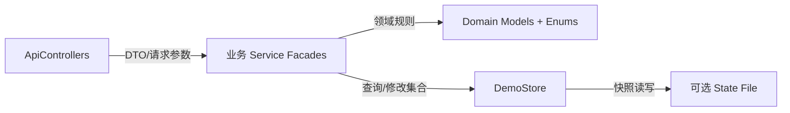

控制器与服务之间以 Java 方法调用传递请求数据；服务与 `DemoStore` 之间通过领域对象和集合操作传递数据。当前没有独立 Repository、ORM EntityManager 或消息队列组件。

### 3.3 数据结构设计

#### 3.3.1 逻辑结构

系统的核心对象包括 `UserAccount`、`Merchant`、`Product`、`GroupDeal`、`Cart`、`CartItem`、`Order`、`OrderItem`、`Review`、`Favorite`、`Conversation`、`ChatMessage`、`Address` 和 `MerchantProfile`。对象实际定义位于 `backend/src/main/java/com/lumalife/domain/Models.java`。

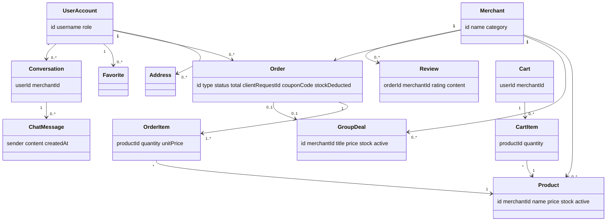

#### 3.3.2 订单状态与业务规则

订单状态枚举为 `PENDING_PAYMENT`、`PAID`、`ACCEPTED`、`DELIVERING`、`RECEIVED`、`COMPLETED`、`USED`、`EXPIRED`、`CANCELLED`。

外卖主流程为 `PENDING_PAYMENT -> PAID -> ACCEPTED -> DELIVERING -> COMPLETED`，用户可以从配送中或已完成状态确认收货为 `RECEIVED`，待支付订单可以取消为 `CANCELLED`。团购主流程为 `PENDING_PAYMENT -> PAID -> USED`，成功支付后生成 12 位数字券码。

支付使用 `clientRequestId` 做幂等判断，首次成功支付才扣减商品或团购库存；订单对象保存券码、优惠券码、库存是否已扣减和状态时间线。当前没有独立 `Payment` 领域对象或支付表。

#### 3.3.3 物理存储

当前 `DemoStore` 中主要使用内存集合或映射保存：账户、令牌、商家、商品、团购、购物车、订单、评价、收藏、会话、商家资料和地址。`lumalife.state-file` 非空时，部分账户、订单、评价、会话、商家资料和收藏状态可写入 JSON 快照并在启动时恢复。

快照方案不是事务数据库：不能提供跨进程一致性、并发写保护、复杂查询、索引、审计或高可用能力。后续持久化迁移应以 `docs/11_数据库持久化迁移计划.md` 为依据，把 `DemoStore` 替换为 Repository 层，而不是让控制器直接依赖数据库。

## 4 系统数据库设计

### 4.1 当前版本数据库边界

当前业务运行不要求 MySQL 或 Redis。`docker-compose.yml` 中定义的 MySQL 8.4 和 Redis 7 是未来持久化、缓存或部署联调的基础设施预留，当前后端 `pom.xml` 未引入 JDBC、JPA、MyBatis、Redis 客户端或数据库连接配置。因此本版本不把 MySQL ER 图描述为已实现设计。

### 4.2 未来迁移建议

| 当前状态 | 未来建议 |
|---|---|
| `DemoStore.accounts` | `user_account`、`address` 表及角色字段 |
| `DemoStore.merchants/products/groupDeals` | `merchant`、`product`、`group_deal`、分类关联表 |
| `DemoStore.carts` | `cart`、`cart_item`，按用户和商家建立唯一约束 |
| `DemoStore.orders` | `order`、`order_item`、`order_timeline`；保留 `client_request_id` 唯一约束 |
| 订单内的券码 | `coupon` 或 `group_coupon`；券码唯一并记录核销人、核销时间和异常原因 |
| `DemoStore.conversations` | `conversation`、`chat_message` |
| 令牌内存映射 | 生产环境改为有过期时间的安全会话或 JWT/Refresh Token 方案，并补充注销与撤销 |
| Agnes 调用 | 保留适配器接口，增加超时、重试、限流、脱敏和调用审计 |

## 5 运行设计

### 5.1 运行模块组合

正常运行由以下模块组成：

1. 浏览器加载 Vite 构建的 React 静态资源。
2. `api.ts` 将页面动作转换为 `/api/v1` 请求。
3. Spring Boot 启动 `ApiControllers`、`SecurityConfig` 和业务服务。
4. 业务服务从 `DemoStore` 读取种子数据或当前状态，完成校验和状态变更。
5. 如配置了 state file，相关状态在启动时恢复并在变更后写回；如配置了 Agnes API key，`AssistantService` 可调用外部 AI。

### 5.2 运行控制

#### 5.2.1 启动与恢复

后端从 `backend` 目录通过 Maven/Spring Boot 启动，默认监听 8080。前端从 `frontend` 目录通过 Vite 启动。后端启动时先初始化 `DemoStore` 的种子数据，再尝试恢复可选状态文件。文件不存在时继续使用种子数据；文件存在但 JSON 格式错误或读取失败时，`loadPersistentState` 抛出 `IllegalStateException`，应用启动失败，需由运维备份并修复或移除该文件后重新启动。

#### 5.2.2 请求控制

请求进入 `ApiControllers` 后由 `SecurityConfig` 完成公开路径、认证和角色判定，再由对应 Service 执行业务规则。订单、库存、券码和幂等判断必须在服务层完成。所有异常由全局异常处理器转换；未配置 Agnes 或调用失败时由 `AssistantService` 返回本地回退内容。

#### 5.2.3 并发与一致性边界

当前 `DemoStore` 适合单进程演示和测试。多实例部署、强并发库存扣减、跨进程锁、事务回滚和可靠消息不属于当前实现能力；在接入真实数据库前不得将当前内存状态视为生产级交易一致性方案。

### 5.3 运行时间设计

本系统为交互式 Web 应用，没有定时批处理作为业务闭环的一部分。用户或商家发起操作后，前端等待 HTTP 响应并刷新相应页面状态。当前代码没有实现后台自动关闭订单、自动过期团购券或自动推进配送状态的定时任务；`EXPIRED` 等状态需要由后续明确的业务任务或管理操作实现。

### 5.4 角色与权限组合

| 角色 | 可访问能力 |
|---|---|
| 未登录用户 | 登录、注册、商家浏览、分类浏览、商家详情和公开助手入口 |
| 普通用户 | 资料、地址、收藏、购物车、订单、支付、评价、用户会话和团购券 |
| 商家管理员 | 商家资料、商品、团购、订单履约、券码核销、评价和客服 |
| 平台管理员 | `/admin/metrics` 运营指标 |

## 6 正式业务场景的组件级设计

本节中的每个正式业务场景仅设置一张组件级顺序图、状态图或活动图。图中出现的页面、`api.ts`、`ApiControllers`、Service 和 `DemoStore` 均为实际组件；外部参与者不是系统组件，但用于表示触发方。

### 6.1 UC01 用户完成平台注册并建立可下单资料

| 项目 | 设计内容 |
|---|---|
| 参与者 | 用户 |
| 前端入口 | `Login`、`Profile` |
| 后端组件 | `ApiControllers`、`AuthService`、`SecurityConfig`、`DemoStore` |
| 主要接口 | `/auth/register`、`/auth/login`、`/auth/me`、`/user/profile`、`/user/addresses` |
| 结果 | 用户获得有效登录 token，资料和地址可用于下单 |
| 异常 | 用户名重复、密码或资料校验失败、地址不存在或无权限 |

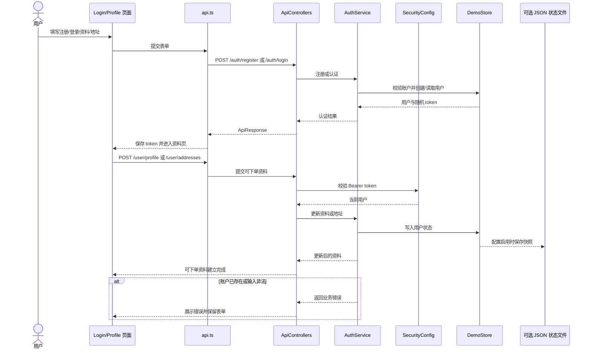

### 6.2 UC02 用户发现商家并形成购买决策

| 项目 | 设计内容 |
|---|---|
| 参与者 | 用户 |
| 前端入口 | `Home`、`Detail`、`Favorites`、`Cart` |
| 后端组件 | `ApiControllers`、`CatalogService`、`FavoriteService`、`CartService`、`DemoStore` |
| 主要接口 | `/categories`、`/merchants`、`/merchants/{id}`、`/user/favorites`、`/cart/items` |
| 结果 | 用户查看商家和商品，选择收藏或加入购物车 |
| 异常 | 商家/商品不存在、商品下架、数量不合法或购物车商品不存在；跨商家商品允许共存并在下单时拆单 |

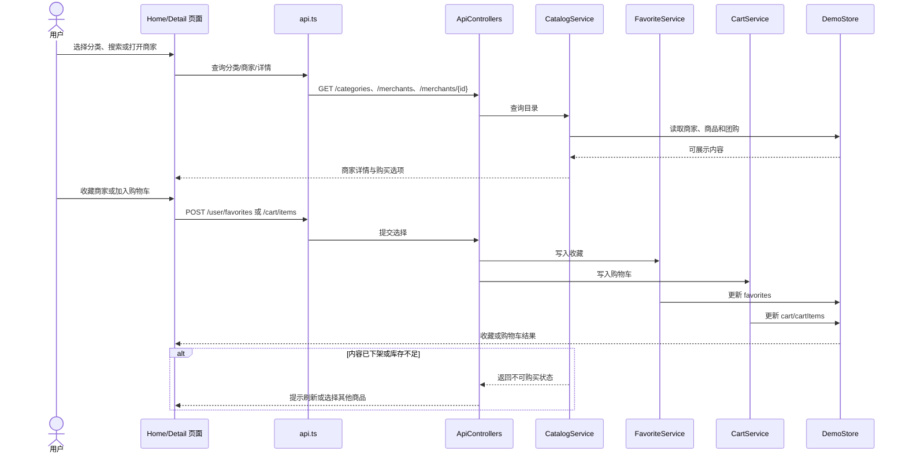

### 6.3 UC03 用户提交外卖订单并完成支付或取消

| 项目 | 设计内容 |
|---|---|
| 参与者 | 用户 |
| 前端入口 | `Cart`、`Orders`、`Detail` |
| 后端组件 | `ApiControllers`、`CartService`、`OrderWorkflowService`、`DemoStore` |
| 主要接口 | `/cart/detail`、`/orders/delivery`、`/payments`、`/orders/{id}/cancel` |
| 结果 | 订单支付成功进入 `PAID`，或待支付订单进入 `CANCELLED` |
| 异常 | 购物车为空、地址无效、库存不足、重复支付或订单状态不允许取消 |

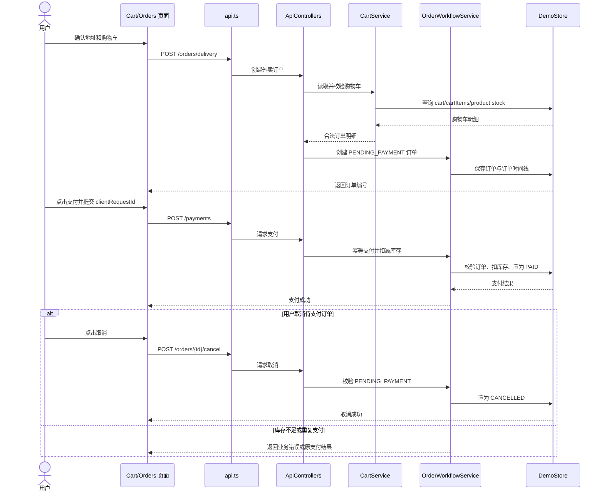

### 6.4 UC04 商家履约外卖订单，用户确认收货并评价

| 项目 | 设计内容 |
|---|---|
| 参与者 | 商家管理员、用户 |
| 前端入口 | `MerchantOrders`、`Orders` |
| 后端组件 | `SecurityConfig`、`MerchantAdminService`、`OrderWorkflowService`、`DemoStore` |
| 主要接口 | `/merchant-admin/orders`、`/merchant-admin/orders/{id}/transition`、`/orders/{id}/receive`、`/reviews` |
| 结果 | 订单按履约阶段推进，用户可收货并提交评价 |
| 异常 | 非商家越权、状态跳跃、非本人订单收货或重复评价 |

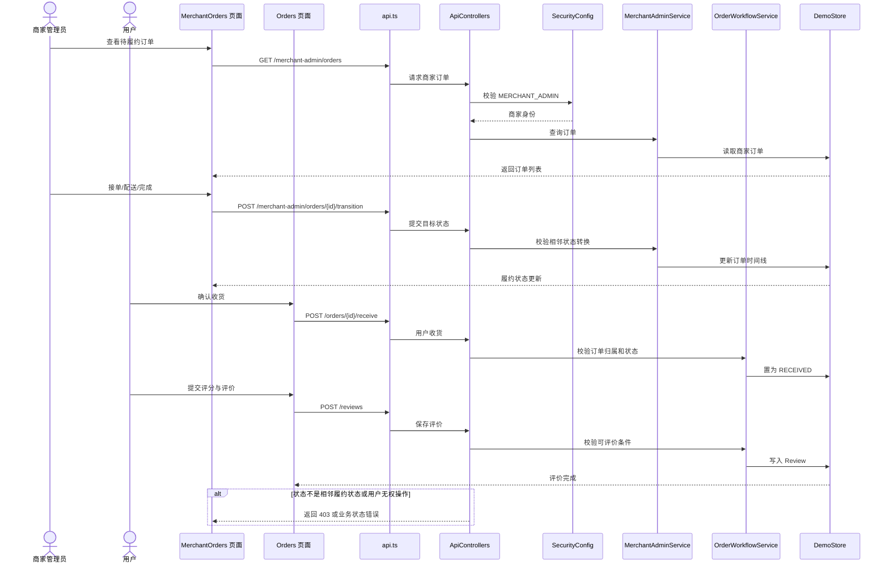

### 6.5 UC05 用户购买团购套餐并获得券码

| 项目 | 设计内容 |
|---|---|
| 参与者 | 用户 |
| 前端入口 | `Detail`、`Orders` |
| 后端组件 | `ApiControllers`、`CatalogService`、`OrderWorkflowService`、`DemoStore` |
| 主要接口 | `/merchants/{id}`、`/orders/group-buy`、`/payments`、`/orders` |
| 结果 | 团购订单支付成功，系统生成 12 位数字券码 |
| 异常 | 团购已下架、库存不足、重复支付或券码生成/订单状态校验失败 |

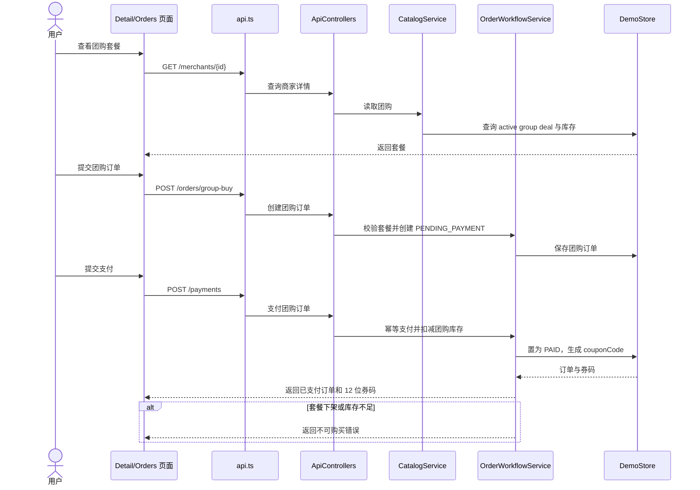

### 6.6 UC06 商家核销团购券并处理异常券码

| 项目 | 设计内容 |
|---|---|
| 参与者 | 商家管理员 |
| 前端入口 | `MerchantOrders`、`MerchantDesk` |
| 后端组件 | `SecurityConfig`、`MerchantAdminService`、`DemoStore` |
| 主要接口 | `/merchant-admin/coupons/verify` |
| 结果 | 有效且属于当前商家的券码进入 `USED` |
| 异常 | 券码不存在、已使用、已过期、订单不属于当前商家或格式非法 |

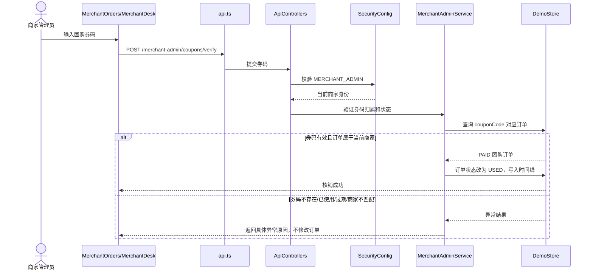

### 6.7 UC07 商家维护经营内容并发布到用户端

| 项目 | 设计内容 |
|---|---|
| 参与者 | 商家管理员、用户 |
| 前端入口 | `MerchantShop`、`MerchantProducts`、`Detail` |
| 后端组件 | `SecurityConfig`、`MerchantAdminService`、`CatalogService`、`DemoStore` |
| 主要接口 | `/merchant-admin/profile`、`/merchant-admin/products`、`/merchant-admin/group-deals`、各自 toggle/delete 接口 |
| 结果 | 商家资料、商品或团购状态变更，用户端查询可见最新 active 内容 |
| 异常 | 非商家越权、字段非法、重复创建、删除不存在对象或用户端缓存未刷新 |

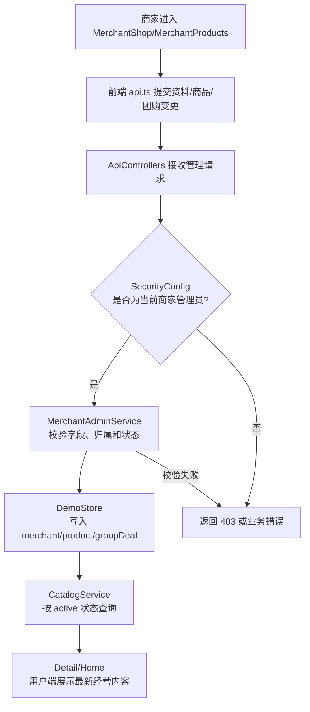

### 6.8 UC08 用户与商家客服沟通并获得处理结果

| 项目 | 设计内容 |
|---|---|
| 参与者 | 用户、商家管理员 |
| 前端入口 | `Assistant`、`MerchantSupport` |
| 后端组件 | `ApiControllers`、`AssistantService`、`SecurityConfig`、`DemoStore`、可选 Agnes 适配器 |
| 主要接口 | `/conversations`、`/conversations/{merchantId}`、`/conversations/{merchantId}/messages`、`/merchant-admin/conversations/**`、`/assistant/ask` |
| 结果 | 消息写入会话，用户得到商家或 AI 的处理结果 |
| 异常 | 会话无权访问、商家不存在、消息为空或 Agnes 不可用 |

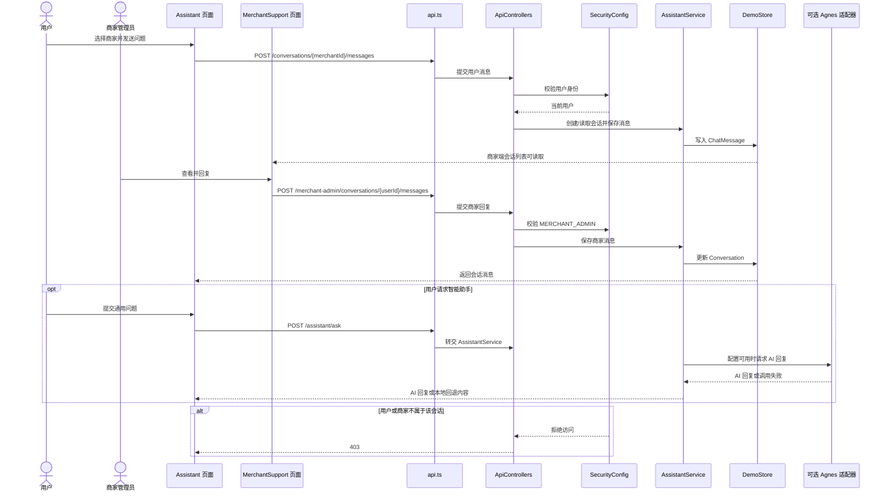

### 6.9 UC09 平台管理员查看运营看板并判断系统状态

| 项目 | 设计内容 |
|---|---|
| 参与者 | 平台管理员 |
| 前端入口 | `Admin` |
| 后端组件 | `SecurityConfig`、`ApiControllers`、`AdminDashboardService`、`DemoStore`、Actuator |
| 主要接口 | `/admin/metrics`、`/actuator/health`、`/actuator/info` |
| 结果 | 管理员获得订单、商家、收入、用户和系统健康概览 |
| 异常 | 非平台管理员访问被拒绝，数据为空时显示零值或空状态 |

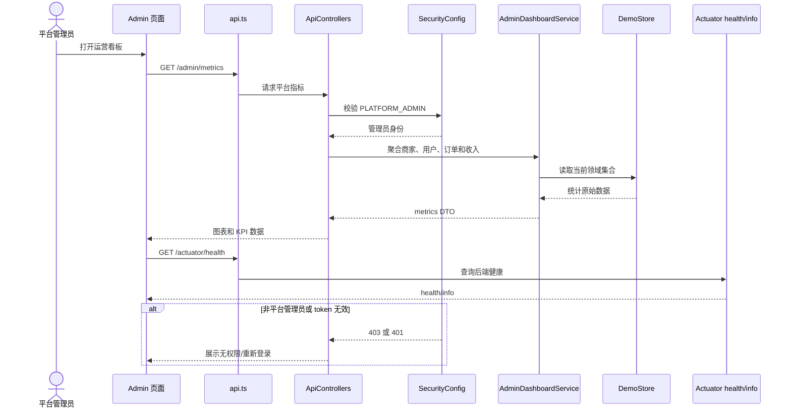

### 6.10 组件级业务场景覆盖表

| 正式用例 | 图类型 | 图所在章节 | 关键组件 |
|---|---|---|---|
| UC01 | 组件级顺序图 | 6.1 | Login/Profile、ApiControllers、AuthService、SecurityConfig、DemoStore |
| UC02 | 组件级顺序图 | 6.2 | Home/Detail、CatalogService、FavoriteService、CartService、DemoStore |
| UC03 | 组件级顺序图 | 6.3 | Cart/Orders、CartService、OrderWorkflowService、DemoStore |
| UC04 | 组件级顺序图 | 6.4 | MerchantOrders、Orders、MerchantAdminService、OrderWorkflowService |
| UC05 | 组件级顺序图 | 6.5 | Detail/Orders、CatalogService、OrderWorkflowService、DemoStore |
| UC06 | 组件级顺序图 | 6.6 | MerchantDesk、SecurityConfig、MerchantAdminService、DemoStore |
| UC07 | 组件级活动图 | 6.7 | MerchantProducts、MerchantAdminService、CatalogService、DemoStore |
| UC08 | 组件级顺序图 | 6.8 | Assistant、MerchantSupport、AssistantService、DemoStore、Agnes |
| UC09 | 组件级顺序图 | 6.9 | Admin、SecurityConfig、AdminDashboardService、DemoStore、Actuator |

## 7 设计取舍与后续演进

### 7.1 当前版本取舍

当前版本优先保证业务闭环可运行、接口边界清晰和测试可重复，因此使用 `DemoStore` 代替数据库，使用演示支付代替真实支付，使用随机内存 token 代替生产级身份令牌。该取舍降低了本地启动成本，但不等同于生产部署方案。

### 7.2 后续演进方向

1. 引入 Repository 接口并迁移到 MySQL，补充事务、索引、唯一约束和迁移脚本。
2. 将购物车、库存和支付幂等操作放入可靠事务边界，必要时使用 Redis 做短期锁或缓存。
3. 引入过期时间、刷新、注销和撤销能力，替换当前内存 token 映射。
4. 增加订单超时关闭、券码过期、消息通知和操作审计任务。
5. 对 Agnes 增加超时、重试、熔断、敏感信息脱敏和调用成本控制。
6. 将统计指标从全量内存聚合演进为数据库聚合或异步指标服务。

