# LumaLife 综合生活助手平台

## 软件详细设计说明书

| 项目 | 内容 |
|---|---|
| 文档编号 | LUMALIFE-DD-001 |
| 版本 | 2.0 |
| 设计基线 | 当前仓库代码、UC01～UC09 正式业务场景、需求规格说明书、概要设计说明书 |
| 适用范围 | LumaLife 前端、后端及其交互业务 |
| 文档状态 | 设计基线 |

> 本文参考所提供的两份详细设计说明书的章节组织，但不直接继承其中的旧版实现假设。实际类、方法、对象关系、接口和异常行为以当前源码为准。正式业务场景采用已确认的 UC01～UC09，每个用例在第 8 节配有且仅配一张对象级顺序图、状态图或活动图。

## 1 引言

### 1.1 编写目的

本文将 LumaLife 的概要架构进一步细化到 Java 领域对象、服务方法、REST 接口、前端页面交互、异常处理和测试边界，为编码维护、代码评审、单元测试、集成测试和后续数据库迁移提供直接依据。

本文的重点交付物为：

- 后端真实领域对象和服务类的类图；
- 九个正式业务场景各一张对象级业务流程图；
- 服务方法的输入、处理规则、输出和异常条件；
- 前端页面、`api.ts`、REST 控制器之间的调用关系；
- 本地状态文件与生产 MySQL 关系表适配器的详细边界。

### 1.2 项目背景与范围

LumaLife 是面向本地生活服务场景的 Web 平台。用户可以发现商家、查看商品和团购、收藏商家、加入购物车、提交外卖订单、购买团购并获得券码、确认收货、评价和咨询；商家管理员可以维护经营内容、履约订单、核销团购券和处理客服消息；平台管理员可以查看运营看板。

本说明书覆盖 `frontend/src` 与 `backend/src/main/java/com/lumalife` 的当前实现，不覆盖真实支付渠道、生产级令牌服务和完整多副本并发模型。Docker Compose/Kubernetes 中的 MySQL 是业务关系表持久化依赖；Redis 仍是未来基础设施。

### 1.3 术语表

| 术语 | 定义 |
|---|---|
| DTO | Data Transfer Object，接口请求或响应使用的数据传输结构 |
| REST | 基于 HTTP 资源路径和方法的接口风格 |
| `DemoStore` | 当前后端的领域规则、运行聚合和持久化协调类 |
| Order | 订单对象，包含外卖或团购类型、状态、订单行、金额和状态时间线 |
| `clientRequestId` | 支付请求幂等键，首次支付后重复使用会返回原支付结果 |
| 状态时间线 | `Order.statusTimeline`，记录订单状态及其进入时间 |
| `BusinessStateRepository` | 本地文件或 MySQL 关系表的可替换持久化端口 |
| Agnes | 可选外部 AI 对话服务；不可用时使用本地回退回答 |
| 对象级图 | 展示具体页面对象、控制器对象、服务对象和领域对象之间协作的图 |

### 1.4 参考文档

1. [软件需求规格说明书](./12_软件需求规格说明书.md)
2. [软件概要设计说明书](./13_概要设计说明书.md)
3. [接口文档](./05_接口文档.md)
4. [数据库持久化迁移计划](./11_数据库持久化迁移计划.md)
5. `backend/src/main/java/com/lumalife/domain/Models.java`
6. `backend/src/main/java/com/lumalife/domain/Enums.java`
7. `backend/src/main/java/com/lumalife/controller/ApiControllers.java`

## 2 系统结构设计及子系统划分

### 2.1 子系统划分

正式业务场景按领域职责划分为八个子系统。购物车、收藏和权限是支撑能力，不单独列为正式业务场景。

| 子系统编号 | 子系统名称 | 主要对象/服务 | 覆盖用例 |
|---|---|---|---|
| SYS-01 | 用户与身份子系统 | `User`、`Address`、`AuthService`、`SecurityConfig` | UC01 |
| SYS-02 | 商家发现子系统 | `Category`、`Merchant`、`Product`、`GroupDeal`、`CatalogService`、`FavoriteService` | UC02 |
| SYS-03 | 购物车子系统 | `CartItem`、`CartLine`、`CartService` | UC02、UC03 |
| SYS-04 | 外卖订单子系统 | `Order`、`OrderLine`、`OrderWorkflowService` | UC03、UC04 |
| SYS-05 | 团购券码子系统 | `GroupDeal`、`Order.couponCode`、`MerchantAdminService` | UC05、UC06 |
| SYS-06 | 评价子系统 | `Review`、`Order.reviewed` | UC04 |
| SYS-07 | 商家运营与客服子系统 | `Merchant`、`Product`、`GroupDeal`、`ChatMessage`、`MerchantAdminService`、`AssistantService` | UC04、UC06、UC07、UC08 |
| SYS-08 | 平台管理子系统 | `OperationLog`、`AdminDashboardService` | UC09 |

### 2.2 分层结构

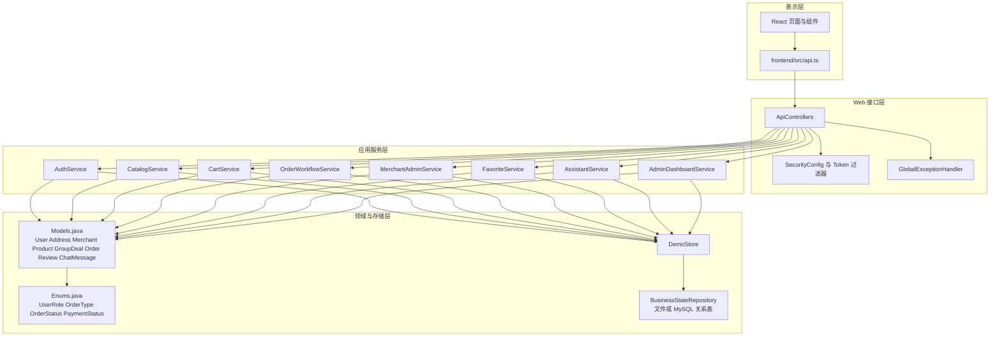

### 2.3 后端对象类图

下图是基于 `Models.java`、`Enums.java` 和服务类的实现级类图。`Order` 是当前唯一的可变领域实体；其他主要模型使用 Java record 表示不可变值对象。收藏、会话和支付幂等关系由 `DemoStore` 中的集合维护，不对应独立的 `Favorite`、`Conversation` 或 `Payment` record。

```mermaid
classDiagram
    class ApiControllers {
        -AuthService authService
        -CatalogService catalogService
        -CartService cartService
        -OrderWorkflowService orderWorkflowService
        -MerchantAdminService merchantAdminService
        -AssistantService assistantService
        -FavoriteService favoriteService
        +login(LoginRequest)
        +register(RegisterRequest)
        +orders(Principal)
    }
    class SecurityConfig {
        +filterChain(HttpSecurity)
        +tokenFilter()
    }
    class AuthService {
        +login(phone,password)
        +register(phone,password,nickname,role)
        +updateProfile(user,nickname,avatarUrl)
        +addresses(user)
        +saveAddress(user,...)
    }
    class CatalogService {
        +categories()
        +merchants(...)
        +merchantsForUser(...)
        +merchantDetail(id)
    }
    class CartService {
        +cart(userId)
        +cartDetail(userId)
        +addCart(userId,productId,quantity)
        +updateCartItem(...)
        +removeCartItem(...)
        +clearCart(userId)
    }
    class OrderWorkflowService {
        +createDeliveryOrders(user,addressId)
        +createGroupOrder(user,dealId,quantity)
        +pay(user,orderId,clientRequestId)
        +cancel(user,orderId)
        +receive(user,orderId)
        +review(user,orderId,...)
    }
    class MerchantAdminService {
        +merchantOrders(admin)
        +saveProduct(admin,...)
        +toggleProduct(admin,id)
        +saveDeal(admin,...)
        +transition(admin,orderId,next)
        +verifyCoupon(admin,code)
    }
    class FavoriteService {
        +addFavorite(user,merchantId)
        +removeFavorite(user,merchantId)
        +listFavoriteMerchants(user)
    }
    class AssistantService {
        +ask(question)
        +askForMerchant(admin,question)
        +userMessages(user,merchantId)
        +sendUserMessage(user,merchantId,content)
        +sendMerchantMessage(admin,userId,content)
    }
    class AdminDashboardService {
        +metrics()
    }
    class DemoStore {
        -Map~String,User~ users
        -Map~String,Long~ tokens
        -Map~Long,Merchant~ merchants
        -Map~Long,Product~ products
        -Map~Long,GroupDeal~ deals
        -Map~Long,List~CartItem~~ carts
        -Map~Long,Order~ orders
        -Map~String,Long~ couponIndex
        -Map~Long,Review~ reviews
        -Map~String,List~ChatMessage~~ conversations
        -Map~Long,Set~Long~~ favorites
        -List~OperationLog~ logs
        +userByToken(token)
        +merchantDetail(id)
        +createDeliveryOrder(user,addressId)
        +createGroupOrder(user,dealId,quantity)
        +pay(user,orderId,clientRequestId)
        +verifyCoupon(admin,code)
        +persistState()
    }
    class User {
        <<record>>
        long id
        String phone
        String password
        String nickname
        UserRole role
        Long merchantId
    }
    class Address {
        <<record>>
        long id
        long userId
        String contactName
        String phone
        String detail
        boolean defaultAddress
    }
    class Merchant {
        <<record>>
        long id
        String name
        long categoryId
        double avgScore
        int avgPrice
        String status
    }
    class Product {
        <<record>>
        long id
        long merchantId
        String name
        long priceCent
        int stock
        boolean listed
    }
    class GroupDeal {
        <<record>>
        long id
        long merchantId
        String title
        long priceCent
        int stock
        boolean active
    }
    class CartItem {
        <<record>>
        long productId
        int quantity
    }
    class CartLine {
        <<record>>
        long productId
        long merchantId
        long priceCent
        int quantity
        long subtotalCent
    }
    class Order {
        long id
        long userId
        long merchantId
        OrderType type
        OrderStatus status
        long totalCent
        String clientRequestId
        String couponCode
        String addressSnapshot
        boolean reviewed
        boolean stockDeducted
        List~OrderLine~ lines
        Map~OrderStatus,LocalDateTime~ statusTimeline
    }
    class OrderLine {
        <<record>>
        Long itemId
        String name
        int quantity
        long priceCent
    }
    class Review {
        <<record>>
        long id
        long orderId
        long merchantId
        int score
        int tasteScore
        int serviceScore
        String content
    }
    class ChatMessage {
        <<record>>
        long id
        long userId
        long merchantId
        String senderRole
        String content
        LocalDateTime createdAt
    }
    class OperationLog {
        <<record>>
        long id
        String actor
        String action
        LocalDateTime createdAt
    }
    class UserRole { <<enumeration>> USER MERCHANT_ADMIN PLATFORM_ADMIN }
    class OrderType { <<enumeration>> DELIVERY GROUP_BUY }
    class OrderStatus { <<enumeration>> PENDING_PAYMENT PAID ACCEPTED DELIVERING RECEIVED COMPLETED USED EXPIRED CANCELLED }

    ApiControllers --> AuthService
    ApiControllers --> CatalogService
    ApiControllers --> CartService
    ApiControllers --> OrderWorkflowService
    ApiControllers --> MerchantAdminService
    ApiControllers --> FavoriteService
    ApiControllers --> AssistantService
    ApiControllers --> AdminDashboardService
    AuthService --> DemoStore
    CatalogService --> DemoStore
    CartService --> DemoStore
    OrderWorkflowService --> DemoStore
    MerchantAdminService --> DemoStore
    FavoriteService --> DemoStore
    AssistantService --> DemoStore
    AdminDashboardService --> DemoStore
    User --> UserRole
    Order --> OrderType
    Order --> OrderStatus
    User "1" --> "0..*" Address
    Merchant "1" --> "0..*" Product
    Merchant "1" --> "0..*" GroupDeal
    User "1" --> "0..*" Order
    Order "1" --> "1..*" OrderLine
    Order "0..1" --> "0..1" Review
    User "1" --> "0..*" ChatMessage
    Merchant "1" --> "0..*" ChatMessage
    CartItem --> Product
    CartLine --> Product
```

### 2.4 子系统间协作原则

1. `ApiControllers` 只负责请求参数、`Principal`、服务调用和 `ApiResponse` 封装，不直接操作 `DemoStore` 集合。
2. `SecurityConfig` 在业务方法前完成 token 与角色判断；服务层仍需检查用户、商家和订单的业务归属。
3. `CatalogService` 负责读模型，`CartService` 负责购物车，`OrderWorkflowService` 负责用户侧订单状态，`MerchantAdminService` 负责商家侧内容和履约。
4. `DemoStore` 负责领域规则、种子数据、状态恢复和持久化触发；`BusinessStateRepository` 负责文件或 MySQL 关系表适配，页面和控制器不得绕过服务层直接访问数据库。

## 3 功能模块详细设计

### 3.1 模块总览

| 模块编号 | 模块名称 | 主要类 | 输入 | 输出 |
|---|---|---|---|---|
| M-01 | 身份与资料 | `AuthService`、`User`、`Address` | 登录/注册/资料/地址请求 | token、脱敏用户、地址 |
| M-02 | 商家发现 | `CatalogService`、`Merchant`、`Product`、`GroupDeal` | 分类、关键词、排序和分页 | 商家页、详情聚合 |
| M-03 | 收藏与购物车 | `FavoriteService`、`CartService`、`CartItem`、`CartLine` | 商家 ID、商品 ID、数量 | 收藏列表、购物车明细 |
| M-04 | 外卖订单 | `OrderWorkflowService`、`Order`、`OrderLine` | 地址 ID、购物车 | 待支付订单、支付后订单 |
| M-05 | 团购与券码 | `OrderWorkflowService`、`MerchantAdminService` | deal ID、数量、券码 | 团购订单、USED 订单 |
| M-06 | 履约与评价 | `MerchantAdminService`、`OrderWorkflowService`、`Review` | 下一状态、评价内容 | 状态时间线、评价 |
| M-07 | 客服与 AI | `AssistantService`、`ChatMessage` | 问题和会话消息 | 商家回复、AI/本地回复 |
| M-08 | 运营看板 | `AdminDashboardService`、`OperationLog` | 管理员身份 | metrics Map |

### 3.2 M-01 身份与资料模块

#### 3.2.1 `AuthService` 方法设计

| 方法 | 输入 | 核心处理 | 输出/异常 |
|---|---|---|---|
| `login` | phone、password | 从 `DemoStore` 查用户，校验 BCrypt 密码，生成并保存随机 UUID token | token+脱敏用户；账户不存在或密码错误抛业务异常 |
| `register` | phone、password、nickname、role | 校验手机号唯一性，编码密码，创建用户并返回自动登录结果 | token+用户；手机号重复抛 400 业务异常 |
| `safeUser` | `User` | 复制用户信息并移除 password | 脱敏用户 Map |
| `updateProfile` | 用户、nickname、avatarUrl | 以新 record 替换旧用户，保留 id、phone、role、merchantId | 用户摘要 |
| `addresses` | 用户 | 从 `addresses: Map<Long,List<Address>>` 按用户读取 | 地址列表 |
| `saveAddress` | 用户、地址字段 | 新增或更新地址；最多 5 个；默认地址互斥 | 地址对象；格式或数量不合法抛异常 |
| `setDefaultAddress` | 用户、地址 ID | 校验地址属于当前用户，遍历重建默认标记 | 默认地址；非本人地址抛异常 |
| `deleteAddress` | 用户、地址 ID | 校验归属后删除 | 无返回值 |

密码只保存编码值。当前 token 是 `DemoStore.tokens: Map<String,Long>` 的随机 UUID 映射，不是 JWT；前端清理 token 的“退出登录”行为发生在本地，不对应后端 logout 接口。

### 3.3 M-02 商家发现模块

#### 3.3.1 `CatalogService` 方法设计

| 方法 | 处理规则 |
|---|---|
| `categories` | 返回 `DemoStore.categories` 的分类集合 |
| `merchants` | 按 keyword、categoryId、minPrice、maxPrice、minScore 过滤，再按 `distance`、`score` 或 `recommend` 排序 |
| `merchantsForUser` | 在普通查询基础上结合用户类别偏好、平均消费、历史商家和收藏计算推荐信息 |
| `merchantDetail` | 聚合商家、在售 `Product`、有效 `GroupDeal` 和 `Review`，返回详情 Map |

金额以分为单位的整数表示，推荐结果只属于读模型，不改变商家领域对象。不存在的商家、商品和团购通过 `BusinessException` 返回 404 或不可购买错误。

### 3.4 M-03 收藏与购物车模块

#### 3.4.1 收藏

`FavoriteService` 调用 `DemoStore.addFavorite/removeFavorite/listFavorites/listFavoriteMerchants`。实际存储是 `Map<Long, Set<Long>> favorites`，键为用户 ID，值为商家 ID 集合。收藏操作必须校验当前用户；重复添加返回 `40900`（已收藏该商家），取消不存在的收藏返回 `40400`（未收藏该商家），两种失败均不修改其他收藏。

#### 3.4.2 购物车

`CartService` 的购物车实际存储为 `Map<Long, List<CartItem>> carts`，`CartItem` 只保存商品 ID 和数量；返回页面时通过 `CartLine` 补充商家、商品名称、单价和小计。

| 操作 | 详细规则 |
|---|---|
| 加入 | 商品必须存在、`listed=true`、数量为正；同商品再次加入时以本次请求数量覆盖原数量 |
| 跨商家 | 不限制单一商家；不同商家的商品同时保留在购物车中，提交外卖订单时按 `merchantId` 分组拆单 |
| 修改 | 数量小于等于 0 时移除，否则替换数量 |
| 删除 | 按用户和商品 ID 删除，不影响其他用户 |
| 清空 | 删除当前用户购物车集合 |
| 小计 | `priceCent * quantity`，使用 long 计算 |

### 3.5 M-04 外卖订单与支付模块

#### 3.5.1 创建外卖订单

`OrderWorkflowService.createDeliveryOrders(User user, Long addressId)` 调用 `DemoStore.createDeliveryOrders`，处理步骤如下：

1. 读取当前用户购物车明细；为空则抛出业务异常。
2. 按 `addressId` 解析当前用户地址；地址不存在或不属于当前用户则拒绝。
3. 按 `merchantId` 对购物车商品分组，每个商家创建一个外卖 `Order`，复制为 `OrderLine` 并保存同一地址快照。
4. 计算 `totalCent`，初始状态设为 `PENDING_PAYMENT`，写入 `statusTimeline`。
5. 清空购物车并返回订单列表。

购物车允许包含多个商家的商品，因此一次提交可能产生多个订单；返回的 `List<Order>` 与商家分组一一对应。现有 `cartCanCreateSeparateDeliveryOrdersByMerchant` 测试覆盖该行为。

#### 3.5.2 创建团购订单

`createGroupOrder` 查询 active 的 `GroupDeal`，校验数量、库存和商家，创建 `Order.type=GROUP_BUY`，以 `deal.priceCent * quantity` 计算总额，初始状态为 `PENDING_PAYMENT`。

#### 3.5.3 支付

`pay(User user, long orderId, String clientRequestId)` 的详细算法：

1. 通过用户 ID 查找订单并校验订单归属。
2. 如果 `clientRequestId` 已存在且对应订单已支付，返回已有订单结果。
3. 订单必须处于 `PENDING_PAYMENT`；否则抛状态冲突异常。
4. 调用 `ensureStockDeducted`，根据订单类型扣减 `Product` 或 `GroupDeal` 库存，只允许扣减一次。
5. 保存 `clientRequestId`，订单状态改为 `PAID` 并写入时间线。
6. 团购订单生成 12 位数字 `couponCode`，写入 `couponIndex`。

当前没有独立 Payment record、支付表或真实支付网关。`PaymentStatus` 枚举存在于代码中，但本版本支付结果直接体现为订单状态和幂等键字段。

#### 3.5.4 取消、收货和评价

- `cancel` 只允许订单所有者取消 `PENDING_PAYMENT` 订单。
- `receive` 只允许订单所有者把 `DELIVERING` 或 `COMPLETED` 订单置为 `RECEIVED`。
- `review` 校验订单所有权、订单状态、评分范围和 `reviewed=false`，写入 `Review` 后把订单标记为已评价，并重算商家评分。

### 3.6 M-05 团购券码模块

`MerchantAdminService.verifyCoupon(User admin, String code)` 的处理顺序为：

1. `SecurityConfig` 先校验 `MERCHANT_ADMIN` 角色。
2. `DemoStore.couponIndex` 根据券码找到订单。
3. 校验订单存在、订单类型为 `GROUP_BUY`、订单属于当前商家且状态为 `PAID`。
4. 将订单置为 `USED`，写入状态时间线并记录操作日志。
5. 任意条件失败都不修改订单，返回明确业务错误。

### 3.7 M-06 商家运营模块

#### 3.7.1 商品与团购维护

`saveProduct`、`toggleProduct`、`deleteProduct` 和对应的 deal 方法都先调用 `ensureMerchantAdmin`，再校验对象的 `merchantId` 属于当前管理员。商品修改字段为名称、描述、价格、库存、listed；团购修改字段为标题、描述、价格、库存、active。用户端 `CatalogService.merchantDetail` 只返回 active/listed 内容。

#### 3.7.2 订单履约

`transition(admin, orderId, next)` 只允许当前商家的外卖订单按相邻状态推进：

```text
PAID -> ACCEPTED -> DELIVERING -> COMPLETED
```

不能跨状态跳转，不能处理其他商家订单，也不能把团购订单走外卖履约路径。

### 3.8 M-07 客服与 AI 模块

`AssistantService` 的会话实际存储为 `Map<String,List<ChatMessage>> conversations`，key 由 userId 和 merchantId 组合生成；代码中没有独立 Conversation 实体。

| 方法 | 处理 |
|---|---|
| `userConversations` / `merchantConversations` | 按用户或商家汇总消息列表，生成会话摘要 |
| `userMessages` / `merchantMessages` | 校验会话参与者后读取消息 |
| `sendUserMessage` | 校验商家存在，写入用户消息；需要时生成 AI/本地回复 |
| `sendMerchantMessage` | 校验商家身份和用户会话，写入商家消息 |
| `ask` | 调用 Agnes 或返回本地通用回答 |
| `askForMerchant` | 以商家、商品和团购上下文生成 Agnes/本地回答 |

Agnes 调用使用 HTTP client，连接超时配置为 3 秒；无 API key、返回异常或响应格式异常时调用本地回退逻辑，不影响消息记录和其他订单功能。

### 3.9 M-08 平台看板模块

`AdminDashboardService.metrics()` 调用 `DemoStore.adminMetrics()` 或当前指标聚合逻辑，读取用户、商家、订单、交易金额、订单状态、履约耗时和操作日志等集合，返回 `Map<String,Object>`。接口层只允许 `PLATFORM_ADMIN` 调用，前端 `Admin.tsx` 使用 KPI 卡片和 Recharts 图表展示结果。

## 4 接口与界面详细设计

### 4.1 外部 REST 接口设计

所有接口前缀为 `/api/v1`，成功结果封装为 `ApiResponse.success(data)`，业务异常由 `GlobalExceptionHandler` 转为 `ApiResponse.fail(code,message)`。

| 业务域 | 方法与路径 | 调用服务 | 权限 |
|---|---|---|---|
| 身份 | POST `/auth/login` | `AuthService.login` | 公开 |
| 身份 | POST `/auth/register`、`/auth/register/merchant` | `AuthService.register` | 公开 |
| 资料 | GET `/auth/me`、POST `/user/profile` | `AuthService` | 登录 |
| 地址 | GET/POST `/user/addresses`、POST `/user/addresses/{id}/default`、`/delete` | `AuthService` | 登录 |
| 发现 | GET `/categories`、`/merchants`、`/merchants/{id}` | `CatalogService` | 浏览公开 |
| 收藏 | GET/POST `/user/favorites`、POST `/user/favorites/{merchantId}/delete` | `FavoriteService` | 登录 |
| 购物车 | GET `/cart`、`/cart/detail`，POST `/cart/items`、`/cart/items/{productId}`、`/delete`、`/clear` | `CartService` | 登录 |
| 订单 | POST `/orders/delivery`、`/group-buy`、`/{id}/cancel`、`/{id}/receive`，GET `/orders` | `OrderWorkflowService` | 用户 |
| 支付 | POST `/payments` | `OrderWorkflowService.pay` | 用户 |
| 评价 | POST `/reviews` | `OrderWorkflowService.review` | 用户 |
| 用户客服 | GET `/conversations`、`/{merchantId}`，POST `/{merchantId}/messages` | `AssistantService` | 登录 |
| AI | POST `/assistant/ask` | `AssistantService.ask` | 当前入口公开 |
| 商家 | GET/POST/PUT `/merchant-admin/profile`、商品和团购管理路径 | `MerchantAdminService` | 商家管理员 |
| 商家履约 | GET `/merchant-admin/orders`，POST `/merchant-admin/orders/{id}/transition` | `MerchantAdminService` | 商家管理员 |
| 核销 | POST `/merchant-admin/coupons/verify` | `MerchantAdminService.verifyCoupon` | 商家管理员 |
| 商家客服 | GET/POST `/merchant-admin/conversations/**` | `AssistantService` | 商家管理员 |
| 平台 | GET `/admin/metrics` | `AdminDashboardService` | 平台管理员 |

### 4.2 前端对象与页面设计

#### 4.2.1 `App.tsx` 状态对象

`App.tsx` 是当前前端的应用协调对象，使用 React state 保存：

| 状态 | 类型/用途 |
|---|---|
| `user` | 当前登录用户或 null |
| `view` | 当前页面视图，如 home、detail、cart、orders、merchant、admin |
| `categories`、`merchants` | 发现页数据 |
| `activeMerchant` | 当前详情页聚合对象，包含 products、deals、reviews |
| `orders`、`cart`、`addresses` | 交易页面数据 |
| `favoriteIds` | 当前用户收藏商家 ID |
| `assistantMerchantId` | 当前客服商家上下文 |
| `message`、`noticeVisible` | Toast/提示信息 |

页面组件通过 props 接收数据，通过回调向 `App` 反馈操作；网络请求集中由 `api.ts` 完成。`api.ts` 从 `localStorage` 读取 `lumalife-token`，统一设置 Bearer header，并在非成功响应时抛出错误。

#### 4.2.2 页面与正式用例对应关系

| 用例 | 页面对象 |
|---|---|
| UC01 | `Login`、`Profile` |
| UC02 | `Home`、`Detail`、`Favorites` |
| UC03 | `Cart`、`Orders` |
| UC04 | `MerchantOrders`、`Orders`、`StatusTimeline` |
| UC05 | `Detail`、`Orders` |
| UC06 | `MerchantOrders`、`MerchantDesk` |
| UC07 | `MerchantShop`、`MerchantProducts`、`Detail` |
| UC08 | `Assistant`、`MerchantSupport`、`MerchantDesk` |
| UC09 | `Admin` |

### 4.3 内部接口与调用约束

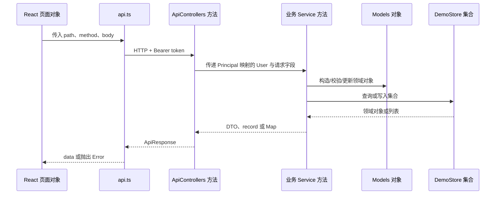

控制器不得把 `Principal` 之外的用户 ID 作为权限依据；服务方法必须重新校验对象归属。任何页面传入的订单状态、库存和用户角色都只能作为显示或请求参数，最终规则以服务层读取的对象为准。

## 5 异常处理设计

### 5.1 异常分类

| 类别 | 代表情况 | 处理方式 |
|---|---|---|
| 参数异常 | 数量非正、评分超出 1～5、必填字段为空 | `BusinessException`，返回 400 业务响应 |
| 认证异常 | 用户不存在、密码错误、token 无效 | 401；前端清除 token 并回到登录页 |
| 权限异常 | 普通用户访问商家/平台管理、跨商家访问 | 403；不修改数据 |
| 资源异常 | 商家、商品、订单、地址或券码不存在 | 404 业务响应 |
| 状态冲突 | 重复评价、非法履约、已支付订单再次支付 | 409 或对应业务错误 |
| 外部 AI 异常 | Agnes 超时、无 key、响应无法解析 | 记录日志，使用本地回退回答 |
| 状态文件不存在 | 配置路径不存在 | 跳过恢复并继续使用种子/内存状态 |
| 状态文件损坏或读取失败 | JSON 格式错误、文件不可读 | `loadPersistentState` 抛出 `IllegalStateException`，应用启动失败；运维备份并修复或移除文件后重启 |
| 状态文件写入失败 | 目录或文件不可写、序列化失败 | `persistState` 抛出 `IllegalStateException`，当前请求失败；不得描述为已持久化成功 |
| MySQL 事务失败 | 连接、约束或关系表写入失败 | 整体回滚并使当前请求失败；不得留下部分业务表更新 |

### 5.2 错误响应流程

```mermaid
flowchart TD
    A[Controller 接收请求]
    B{SecurityConfig 鉴权}
    C[Service 执行业务规则]
    D[ApiResponse.success]
    E[BusinessException]
    F[GlobalExceptionHandler]
    G[ApiResponse.fail(code,message)]
    H[前端 api.ts 抛出 Error]
    I[页面 Toast 或回登录页]
    A --> B
    B -- 通过 --> C
    B -- 401/403 --> G
    C -- 成功 --> D
    C -- 业务失败 --> E --> F --> G
    D --> H
    G --> H --> I
```

### 5.3 关键故障预防

1. 支付使用 `clientRequestId` 和订单字段防重复处理，并将成功结果写入 `payment_record` 的唯一键范围。
2. 库存通过 `Order.stockDeducted` 防止同一订单重复扣减；团购和商品分别校验库存。
3. 订单状态使用 `OrderStatus` 枚举和服务层合法转换，拒绝状态跳跃。
4. 商家管理服务校验当前管理员的 `merchantId` 与对象归属，防止跨商家操作。
5. 评价先校验订单归属、可评价状态和 `reviewed` 标记，再写入 Review。
6. MySQL 保存使用数据库事务与命名写锁，任何关系表失败均整体回滚；本地文件适配器只用于开发回退。

## 6 性能与安全详细设计

### 6.1 性能设计

当前版本面向单进程、演示规模数据集，主要性能特征如下：

| 场景 | 当前设计 |
|---|---|
| 目录查询 | Java 集合过滤和排序；商家列表支持 page/size |
| 购物车 | 按用户 ID 直接取 Map，读取复杂度接近 O(1) |
| 订单查询 | 对内存订单集合按用户或商家过滤并排序 |
| 看板统计 | 每次请求聚合内存集合，不维护独立指标数据库 |
| 页面渲染 | `App` 根据 view 条件渲染页面，未引入全局状态库 |
| AI 调用 | Agnes HTTP client 连接超时 3 秒，失败走本地回退 |

不能将上述内存复杂度和演示响应时间承诺为生产并发指标。MySQL 已为订单、商家、商品、券码和 `client_request_id` 建立索引并提供整体同步事务；进一步水平扩容前仍需将库存与支付拆成按请求的小事务和并发控制。

### 6.2 安全设计

| 安全点 | 当前实现 |
|---|---|
| 密码 | 使用 `PasswordEncoder` 编码后存储，不通过 `safeUser` 返回 |
| 认证 | Bearer UUID token 在 `DemoStore.tokens` 中映射用户 ID |
| 角色 | `USER`、`MERCHANT_ADMIN`、`PLATFORM_ADMIN`；管理路径由 Spring Security 保护 |
| 业务归属 | 服务层校验订单、商品、团购和会话的用户/商家归属 |
| 金额 | `long` 分单位，避免浮点金额误差 |
| 输入 | 服务层校验数量、评分、库存、状态和必填字段 |
| AI 数据 | 商家 AI 上下文只组装商家、商品、团购和消息所需信息，不返回密码 |

当前 token 没有过期、刷新和服务端撤销机制，不能直接作为生产认证方案。后续应引入安全会话或 JWT/Refresh Token，并增加注销、撤销、密钥轮换、速率限制和审计。

## 7 状态机与并发边界

### 7.1 订单状态机

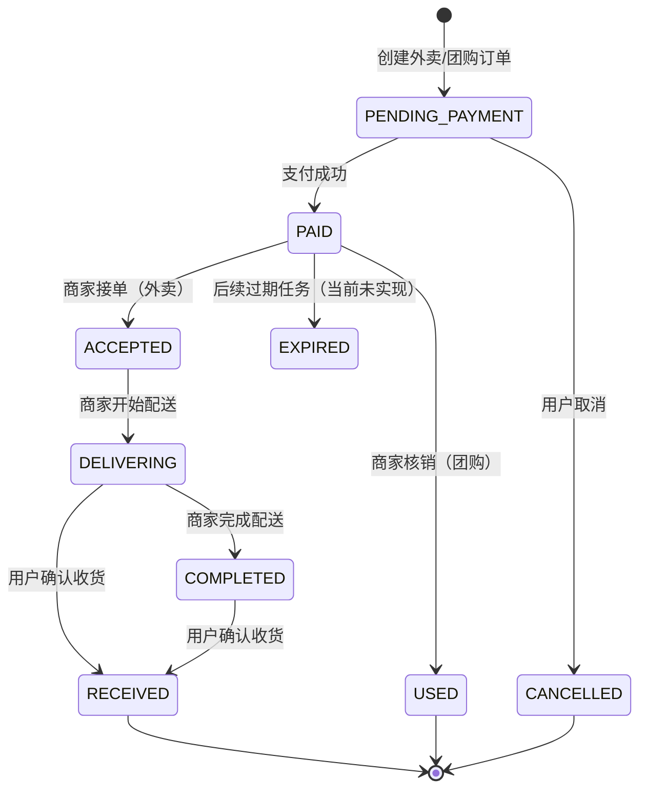

外卖履约只允许相邻转换 `PAID -> ACCEPTED -> DELIVERING -> COMPLETED`；团购核销只允许 `PAID -> USED`。当前代码不包含自动过期、自动关单或定时配送任务。

### 7.2 并发边界

当前 `DemoStore` 作为单进程领域聚合使用，支付幂等、库存扣减和状态变更在同一个服务调用链中完成；`JdbcBusinessStateRepository` 使用一个数据库事务和 MySQL 命名锁同步全部关系表，写入失败整体回滚。该模型保证单写者持久化一致性，但不支持多个后端实例各自持有不同聚合版本。后续应把订单创建、支付与库存扣减、团购券生成、订单状态流转、券码核销和评价与评分更新拆成按请求的小事务，再开放多副本。

## 8 九个正式业务场景的对象级设计

本节严格对应正式业务场景清单。每个用例只配置一张对象级图，图中参与协作的是具体页面对象、控制器方法、服务对象、领域对象或存储集合，而非抽象系统边界。

### 8.1 UC01 用户完成平台注册并建立可下单资料

| 项目 | 内容 |
|---|---|
| 参与者 | 用户 |
| 前置条件 | 用户未注册或已有账户；浏览器可访问后端 |
| 入口对象 | `Login`、`Profile` |
| 主要对象 | `ApiControllers`、`AuthService`、`User`、`Address`、`DemoStore` |
| 后置条件 | 账户存在，token 有效，至少可维护资料和地址 |
| 主要异常 | 手机号重复、密码错误、地址不属于当前用户、地址数量达到 5 个 |

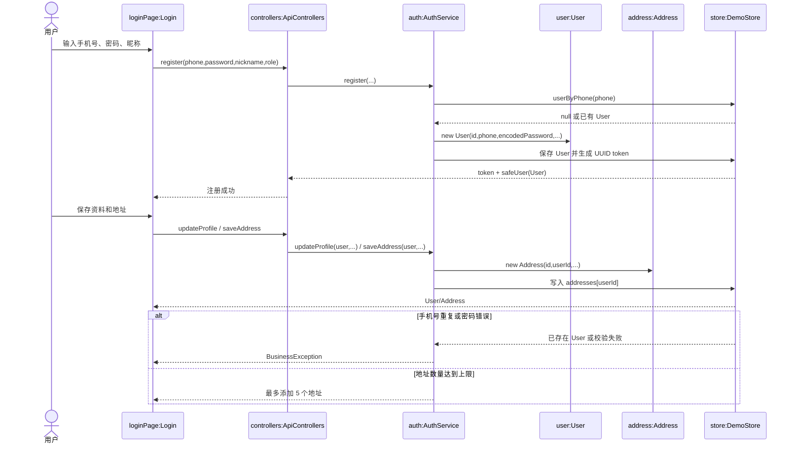

### 8.2 UC02 用户发现商家并形成购买决策

| 项目 | 内容 |
|---|---|
| 参与者 | 游客或普通用户 |
| 入口对象 | `Home`、`Detail`、`Favorites` |
| 主要对象 | `Category`、`Merchant`、`Product`、`GroupDeal`、`CatalogService`、`FavoriteService`、`CartItem` |
| 后置条件 | 用户获得详情信息，并可收藏商家或形成购物车项 |
| 主要异常 | 商家不存在、商品未上架、团购未启用、库存不足 |

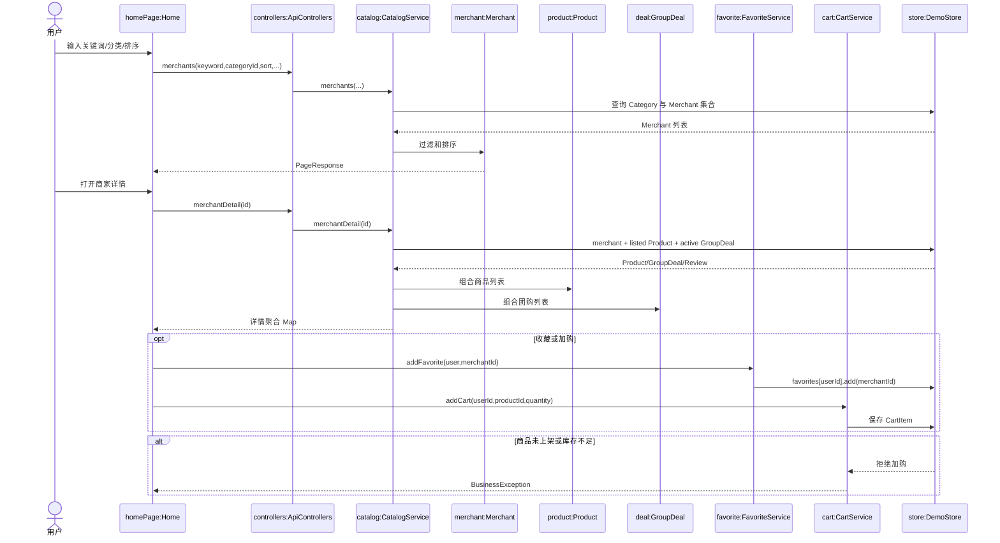

### 8.3 UC03 用户提交外卖订单并完成支付或取消

| 项目 | 内容 |
|---|---|
| 参与者 | 普通用户 |
| 入口对象 | `Cart`、`Orders` |
| 主要对象 | `CartLine`、`CartService`、`OrderWorkflowService`、`Order`、`OrderLine`、`Product` |
| 后置条件 | 支付后订单为 `PAID`，或待支付订单为 `CANCELLED` |
| 主要异常 | 购物车为空、地址无效、库存不足、重复支付、非待支付订单取消 |

```mermaid
sequenceDiagram
    actor 用户
    participant CartPage as cartPage:Cart
    participant Ctrl as controllers:ApiControllers
    participant CartSvc as cart:CartService
    participant OrderSvc as workflow:OrderWorkflowService
    participant Line as cartLine:CartLine
    participant OrderObj as order:Order
    participant OrderLine as line:OrderLine
    participant ProductObj as product:Product
    participant Store as store:DemoStore
    用户->>CartPage: 确认地址和商品数量
    CartPage->>Ctrl: createDeliveryOrders(user,addressId)
    Ctrl->>OrderSvc: createDeliveryOrders(user,addressId)
    OrderSvc->>CartSvc: cartDetail(user.id)
    CartSvc->>Line: 生成 CartLine 小计
    Line-->>OrderSvc: 商品明细
    OrderSvc->>ProductObj: 校验 listed、库存和 merchantId
    OrderSvc->>OrderObj: new Order(type=DELIVERY,status=PENDING_PAYMENT)
    OrderSvc->>OrderLine: 复制 CartLine 为订单行
    OrderSvc->>Store: 保存 Order 并清空 carts[userId]
    Store-->>CartPage: 待支付 Order
    用户->>CartPage: 提交 clientRequestId 支付
    CartPage->>Ctrl: pay(user,orderId,clientRequestId)
    Ctrl->>OrderSvc: pay(...)
    OrderSvc->>Store: 检查 clientRequestId 和 Order.status
    OrderSvc->>ProductObj: ensureStockDeducted(order)
    OrderSvc->>OrderObj: status=PAID; stockDeducted=true
    OrderObj-->>CartPage: 支付后的 Order
    alt 用户取消
        用户->>CartPage: cancel(orderId)
        CartPage->>Ctrl: cancel(user,orderId)
        Ctrl->>OrderSvc: cancel(...)
        OrderSvc->>OrderObj: status=PENDING_PAYMENT -> CANCELLED
    else 重复支付
        Store-->>OrderSvc: clientRequestId 已处理
        OrderSvc-->>CartPage: 返回原支付结果
    end
```

### 8.4 UC04 商家履约外卖订单，用户确认收货并评价

| 项目 | 内容 |
|---|---|
| 参与者 | 商家管理员、普通用户 |
| 入口对象 | `MerchantOrders`、`Orders`、`StatusTimeline` |
| 主要对象 | `Order`、`OrderWorkflowService`、`MerchantAdminService`、`Review`、`OperationLog` |
| 后置条件 | 外卖订单完成履约，用户可收货并提交一次评价 |
| 主要异常 | 商家越权、状态跳跃、订单不属于用户、重复评价 |

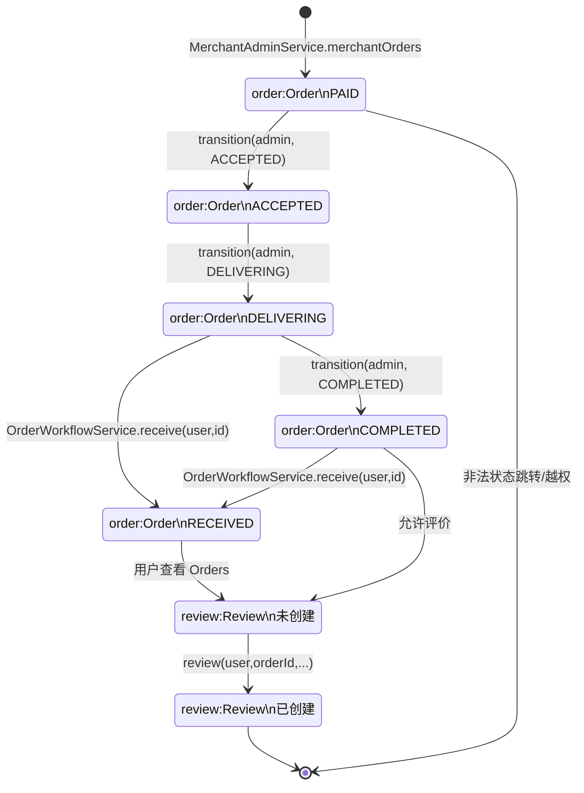

### 8.5 UC05 用户购买团购套餐并获得券码

| 项目 | 内容 |
|---|---|
| 参与者 | 普通用户 |
| 入口对象 | `Detail`、`Orders` |
| 主要对象 | `GroupDeal`、`OrderWorkflowService`、`Order`、`DemoStore.couponIndex` |
| 后置条件 | 团购订单为 `PAID`，订单包含唯一券码 |
| 主要异常 | 团购未启用、库存不足、订单重复支付、券码冲突 |

```mermaid
sequenceDiagram
    actor 用户
    participant Detail as detailPage:Detail
    participant Ctrl as controllers:ApiControllers
    participant Workflow as workflow:OrderWorkflowService
    participant Deal as deal:GroupDeal
    participant OrderObj as order:Order
    participant Coupon as couponIndex:Map
    participant Store as store:DemoStore
    用户->>Detail: 选择团购套餐和数量
    Detail->>Ctrl: createGroupOrder(user,dealId,quantity)
    Ctrl->>Workflow: createGroupOrder(...)
    Workflow->>Store: 查询 active GroupDeal
    Store-->>Deal: 套餐价格、库存、商家
    Workflow->>Deal: 校验 active、quantity 和 stock
    Workflow->>OrderObj: 创建 GROUP_BUY/PENDING_PAYMENT Order
    Workflow->>Store: 保存 Order
    用户->>Detail: 支付团购订单
    Detail->>Ctrl: pay(user,orderId,clientRequestId)
    Ctrl->>Workflow: pay(...)
    Workflow->>Deal: 扣减 stock
    Workflow->>OrderObj: status=PAID; stockDeducted=true
    Workflow->>Coupon: 生成并索引 12 位 couponCode
    Coupon-->>OrderObj: couponCode
    OrderObj-->>Detail: 支付订单和券码
    alt 团购不可用或库存不足
        Deal-->>Workflow: 校验失败
        Workflow-->>Detail: BusinessException，不创建可支付结果
    end
```

### 8.6 UC06 商家核销团购券并处理异常券码

| 项目 | 内容 |
|---|---|
| 参与者 | 商家管理员 |
| 入口对象 | `MerchantOrders`、`MerchantDesk` |
| 主要对象 | `MerchantAdminService`、`Order`、`couponIndex`、`OperationLog` |
| 后置条件 | 有效券码对应订单变为 `USED` |
| 主要异常 | 券码不存在、已使用、非团购、非当前商家、订单状态错误 |

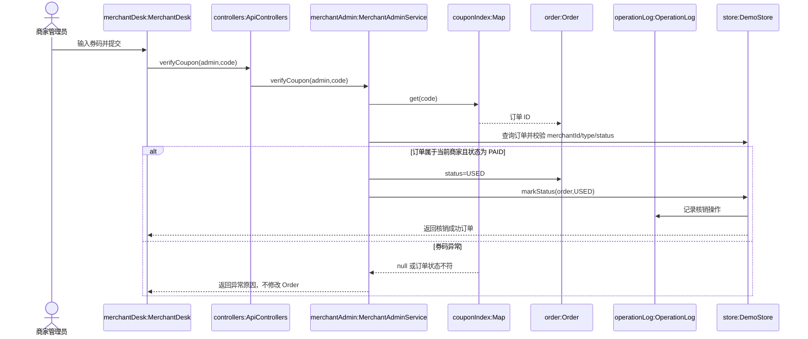

### 8.7 UC07 商家维护经营内容并发布到用户端

| 项目 | 内容 |
|---|---|
| 参与者 | 商家管理员、普通用户 |
| 入口对象 | `MerchantShop`、`MerchantProducts`、`Detail` |
| 主要对象 | `Merchant`、`Product`、`GroupDeal`、`MerchantAdminService`、`CatalogService` |
| 后置条件 | 管理对象写入 `DemoStore`，用户详情按 listed/active 条件可见 |
| 主要异常 | 非商家管理员、跨商家 ID、字段非法、删除不存在对象 |

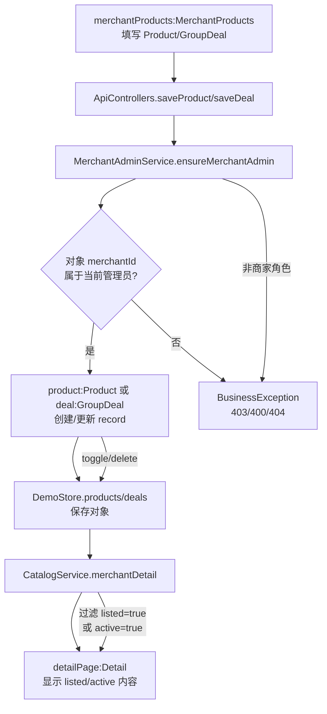

### 8.8 UC08 用户与商家客服沟通并获得处理结果

| 项目 | 内容 |
|---|---|
| 参与者 | 普通用户、商家管理员、可选 Agnes AI |
| 入口对象 | `Assistant`、`MerchantSupport` |
| 主要对象 | `AssistantService`、`ChatMessage`、`conversations` Map、`Merchant`、`Product`、`GroupDeal` |
| 后置条件 | 用户和商家消息进入同一会话 key，用户获得商家或 AI/本地回复 |
| 主要异常 | 会话参与者不匹配、消息为空、商家不存在、AI 调用超时 |

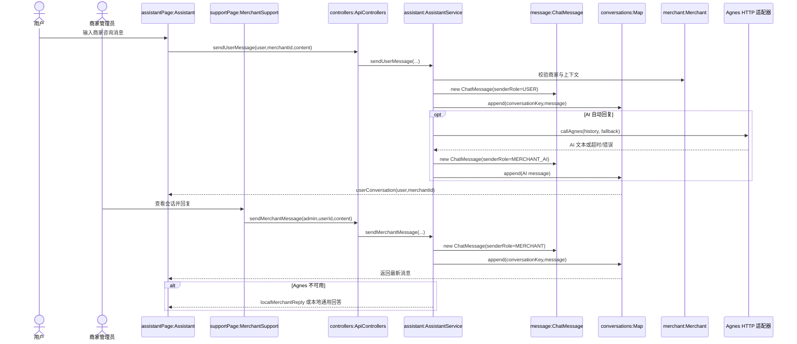

### 8.9 UC09 平台管理员查看运营看板并判断系统状态

| 项目 | 内容 |
|---|---|
| 参与者 | 平台管理员 |
| 入口对象 | `Admin` |
| 主要对象 | `AdminDashboardService`、`DemoStore`、`User`、`Merchant`、`Order`、`OperationLog` |
| 后置条件 | 页面得到指标 Map 和健康状态，可展示 KPI、图表和日志 |
| 主要异常 | 非平台管理员 403、token 无效 401、数据集合为空 |

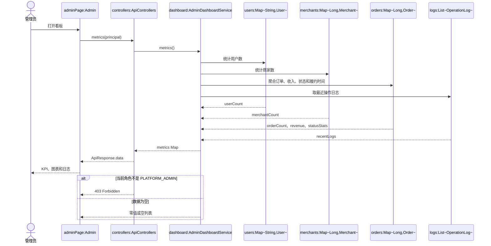

### 8.10 对象级图覆盖表

| 用例 | 图类型 | 图所在章节 | 关键对象 |
|---|---|---|---|
| UC01 | 对象级顺序图 | 8.1 | `User`、`Address`、`AuthService`、`DemoStore` |
| UC02 | 对象级顺序图 | 8.2 | `Category`、`Merchant`、`Product`、`GroupDeal`、`CartItem` |
| UC03 | 对象级顺序图 | 8.3 | `CartLine`、`Order`、`OrderLine`、`Product` |
| UC04 | 对象级状态图 | 8.4 | `Order`、`Review`、`OrderStatus` |
| UC05 | 对象级顺序图 | 8.5 | `GroupDeal`、`Order`、`couponIndex` |
| UC06 | 对象级顺序图 | 8.6 | `Order`、`couponIndex`、`OperationLog` |
| UC07 | 对象级活动图 | 8.7 | `Merchant`、`Product`、`GroupDeal`、`DemoStore` |
| UC08 | 对象级顺序图 | 8.8 | `ChatMessage`、`conversations`、`Merchant` |
| UC09 | 对象级顺序图 | 8.9 | `User`、`Merchant`、`Order`、`OperationLog` |

## 9 项目测试计划

### 9.1 测试策略

测试按“对象规则—服务方法—REST 权限—正式业务场景”逐层展开。由于当前版本以内存 `DemoStore` 为核心，测试可以在不启动 MySQL、Redis 或 Agnes 的情况下运行；AI 回退路径和安全边界应单独验证。

### 9.2 详细测试点

| 测试层级 | 主要对象/方法 | 测试内容 |
|---|---|---|
| 单元测试 | `DemoStore.pay` | 同一 `clientRequestId` 重复支付结果一致，库存只扣一次 |
| 单元测试 | `DemoStore.transition` | 非法订单状态跳转被拒绝 |
| 单元测试 | `DemoStore.saveAddress` | 地址上限 5 个、默认地址互斥 |
| 单元测试 | `DemoStore.addCart/updateCartItem` | 同商品数量覆盖、跨商家商品共存、数量修改和删除 |
| 单元测试 | `DemoStore.createDeliveryOrders` | 地址快照、购物车清空、按商家拆单、订单行和总额 |
| 单元测试 | `DemoStore.verifyCoupon` | 有效券核销、已使用券、跨商家券和不存在券 |
| 集成测试 | `ApiSecurityIntegrationTest` | 未登录 401、角色不匹配 403、公开浏览可访问 |
| 接口测试 | `ApiControllers` | 请求路径、响应包装、业务错误码和 principal 归属 |
| 端到端测试 | UC01～UC09 | 用户、商家和平台管理员从页面完成各自主流程 |

### 9.3 正式用例验收矩阵

| 用例 | 主流程验收 | 替代/异常流程验收 | 关键验证对象 |
|---|---|---|---|
| UC01 | 注册、资料、地址可完成 | 重复手机号、地址上限 | `User`、`Address`、token |
| UC02 | 查询详情、收藏、加购 | 下架商品、库存不足 | `Merchant`、`Product`、`GroupDeal`、`CartItem` |
| UC03 | 外卖下单并支付 | 取消、重复支付、库存不足 | `Order`、`OrderLine`、`clientRequestId` |
| UC04 | 履约、收货、评价 | 越权、非法跳转、重复评价 | `OrderStatus`、`Review` |
| UC05 | 团购支付并生成券码 | 团购下架、库存不足 | `GroupDeal`、`Order.couponCode` |
| UC06 | 有效券核销 | 不存在、已用、跨商家券 | `couponIndex`、`Order` |
| UC07 | 商家发布经营内容 | 非商家、跨商家修改 | `Product`、`GroupDeal`、`Merchant` |
| UC08 | 用户与商家互发消息 | AI 超时、本地回退、会话越权 | `ChatMessage`、`conversations` |
| UC09 | 指标看板可展示 | 普通用户访问、空数据 | `AdminDashboardService`、`OperationLog` |

### 9.4 当前代码测试对应关系

仓库已有 `backend/src/test/java/com/lumalife/service/DemoStoreTest.java` 和 `backend/src/test/java/com/lumalife/controller/ApiSecurityIntegrationTest.java`。详细设计中的支付幂等、地址上限、购物车、订单归属、状态流转和权限测试应继续以这两类测试为基础扩展；文档不将未实际存在的测试结果写成已通过结果。

## 10 设计限制与后续改造

1. `DemoStore` 的集合存储适合演示和单进程测试，不提供生产级事务、索引、并发库存控制和多实例一致性。
2. 当前 token 是随机 UUID 映射，不具备过期、刷新、撤销能力；生产环境需替换。
3. 当前支付是订单状态更新，不包含支付渠道、支付回调、支付记录表或退款流程。
4. 当前没有自动订单超时、券码过期和配送定时任务；`EXPIRED` 只是枚举状态。
5. 未来接入 MySQL/Redis 时，应先抽取 Repository 接口，再将订单、库存、券码、幂等和会话逐步迁移。
6. Agnes 适配器应补充重试、熔断、敏感信息脱敏、限流和调用审计。

