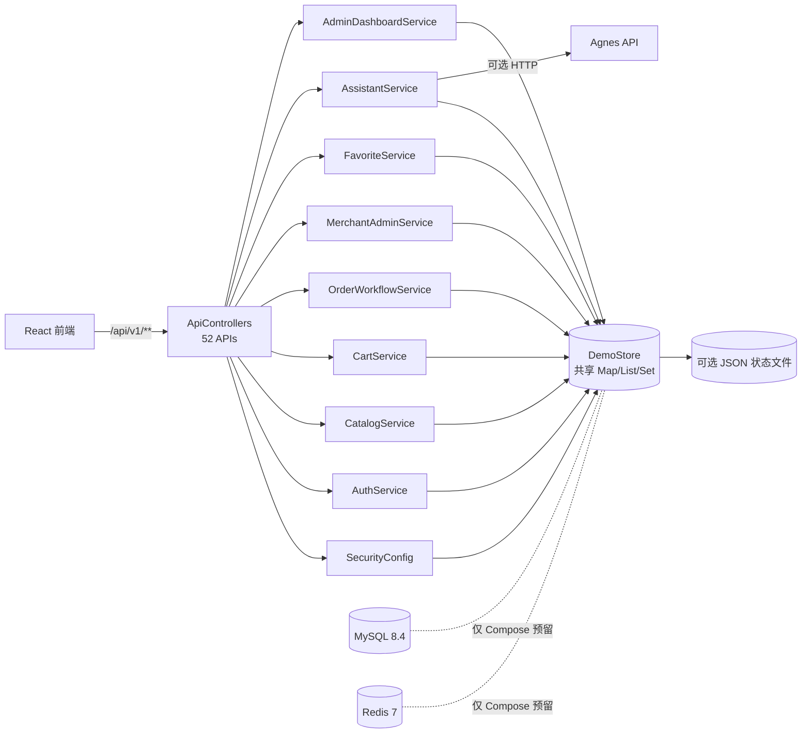
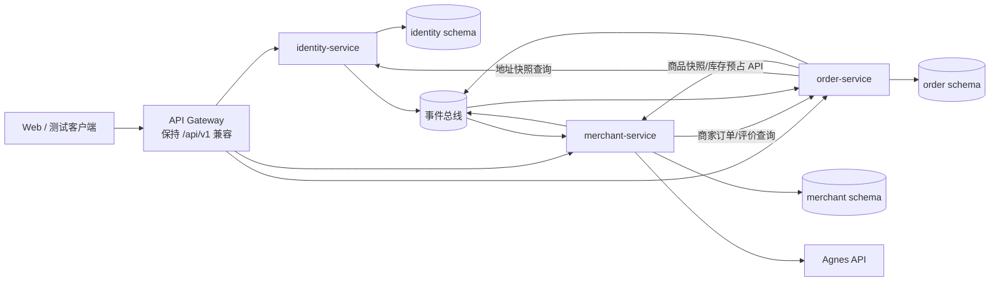

# 单体后端审计与三服务拆分草案

> 对应任务：[#18](https://github.com/daihao007/Lumalife/issues/18)
> 关联主任务：[#9](https://github.com/daihao007/Lumalife/issues/9)
> 旧代码基线：`monolith-start` 标签，解引用提交 `a1a93529f81ccb3ba1f52b549c8d2027383066e8`（2026-08-25），40 个测试；该版本普通用户路径尚未限定 `ROLE_USER`
> 当前候选基线：合并 `origin/main` 与 D02 修复后的交付候选（2026-08-26），已包含 `ROLE_USER` 路径限制、`/auth/me` 认证修复和 `DELIVERING → COMPLETED` 页面入口；实测 59/59（评审回复中的 46/46 属于合并前候选快照）
> 范围：现有 CR-01～CR-06 及承载这些流程的支撑能力
> 明确排除：骑手、派单、抢单、轨迹、运力和骑手结算领域

## 1. 结论摘要

当前后端是单 Maven 模块、单 Spring Boot 进程、单控制器、共享内存存储的模块化单体雏形。`ApiControllers` 暴露 52 个 REST API，并调用 8 个业务 Service；但这些 Service 除 `AssistantService` 的外部 AI 适配外，基本都是 `DemoStore` 的薄门面。真正的业务规则、跨域查询、内存数据和 JSON 快照逻辑集中在 1328 行的 `DemoStore` 中。

本草案建议形成三个业务服务：

1. `identity-service`：用户认证、账户、会话令牌和收货地址；
2. `merchant-service`：商家资料、分类、商品、团购套餐、收藏及商家客服；
3. `order-service`：购物车、订单、模拟支付、库存预占流程、券码、评价、履约状态和运营读模型。

拆分不应复制 `DemoStore` 或共享数据库。第一阶段保持外部 `/api/v1/**` 路径和统一响应不变，在网关兼容现有前端；服务之间只能使用版本化 API 或事件。最高风险是支付时同步扣库存、下单时跨地址/购物车/商品写入、商家改名反向改历史订单、推荐及看板跨域聚合。必须先冻结契约和数据所有权，再迁移代码。

## 2. 审计依据与方法

本次审计逐项核对以下证据：

- `backend/pom.xml`、`application.yml`、`docker-compose.yml` 与数据库脚本；
- `ApiControllers`、`SecurityConfig`、8 个业务 Service、`DemoStore`、领域模型及异常包装；
- `DemoStoreTest` 与 `ApiSecurityIntegrationTest`；
- `docs/05_接口文档.md`、`docs/06_数据库设计.md`、`docs/11_数据库持久化迁移计划.md`、概要/详细设计；
- GitHub Project “Lumalife”、Issue #18 和主任务 #9。

审计以源码和可运行测试为事实基线。文档与源码冲突时，以源码为准并在风险中记录差异。

## 3. 当前运行架构



### 3.1 当前模块清单

| 层/模块 | 当前职责 | 关键依赖 | 审计判断 |
|---|---|---|---|
| `LumaLifeApplication` | Spring Boot 启动 | Spring Boot | 单进程、单部署单元 |
| `ApiControllers` | 52 个 API、请求 DTO、分页与用户上下文 | 8 个 Service | 单一控制器，发布与路由强耦合 |
| `SecurityConfig` | URL 授权、自定义 Bearer Token 过滤 | `DemoStore` | 安全层直接依赖共享存储 |
| `AuthService` | 登录、注册、当前用户、资料、地址 | `DemoStore` | 身份服务候选门面 |
| `CatalogService` | 分类、商家搜索、推荐、详情 | `DemoStore` | 商家服务候选门面 |
| `CartService` | 购物车增删改查 | `DemoStore` | 应归订单服务 |
| `OrderWorkflowService` | 下单、支付、取消、收货、评价 | `DemoStore` | 订单服务候选门面 |
| `MerchantAdminService` | 商家资料、商品/套餐、订单履约、券码 | `DemoStore` | 当前横跨商家与订单两个边界 |
| `FavoriteService` | 用户收藏商家 | `DemoStore` | 归商家服务，用户 ID 仅作外部引用 |
| `AssistantService` | 客服会话、商家上下文、Agnes 调用与回退 | `DemoStore`、Java `HttpClient` | 三服务约束下暂归商家服务 |
| `AdminDashboardService` | 运营指标 | `DemoStore` | 暂归订单服务的读模型，不拥有其他服务原始表 |
| `DemoStore` | 种子数据、全部集合、业务规则、JSON 快照 | Jackson、文件系统、`PasswordEncoder` | 实际共享内核和数据访问层，是拆分首要解耦点 |
| `Models` / `Enums` | 所有领域对象与枚举 | 无 | 共享领域模型，拆分后不能作为跨服务 Entity 包 |
| `common` | 响应、分页、业务异常、异常转换 | Spring Web | 可复制为轻量基础库，但不得夹带领域模型 |

### 3.2 构建、运行与外部依赖

| 类型 | 当前事实 | 拆分影响 |
|---|---|---|
| Java / Spring | Java 17、Spring Boot 3.3.5 | 三服务先保持同一技术基线 |
| Web / Security | Spring MVC、Spring Security | 每个服务需独立安全配置或验证网关传递的签名身份 |
| 健康检查 | Actuator `health,info` | 每个服务都应提供 `/actuator/health` 和版本信息 |
| API 文档 | springdoc 2.6.0 | 每个服务独立 OpenAPI，网关聚合展示 |
| 数据库 | 无 JDBC/JPA/MyBatis/Redis 客户端和连接配置 | MySQL/Redis 当前不是实际业务依赖，不能把 Compose 存在视为已持久化 |
| 当前持久化 | `./data/lumalife-state.json` 可选快照 | 仅适合单进程演示，不支持事务、并发、多副本或可靠恢复 |
| 外部 AI | Agnes HTTP，连接 3 秒、请求 6 秒，失败本地回退 | 归商家服务适配器；保留超时和降级，不向外部发送不必要的用户/订单数据 |
| 测试 | 旧标签：30 个 `DemoStoreTest` + 10 个 MockMvc 安全集成测试；当前候选：37 个 `DemoStoreTest` + 22 个 `ApiSecurityIntegrationTest` | 旧标签 40 个；评审快照 46 个；当前候选 59 个，均为单进程测试，仍需契约、数据库、并发与故障测试 |

## 4. API 清单与目标归属

统一外部契约暂保持 `ApiResponse(code, message, data)`，路径仍使用 `/api/v1`。表中的“目标服务”表示网关后的唯一业务所有者，不表示允许服务共享数据表。

### 4.1 用户认证服务（9 个）

| Method | Endpoint | 当前访问要求 | 目标职责 |
|---|---|---|---|
| POST | `/api/v1/auth/login` | Public | 登录并签发令牌 |
| POST | `/api/v1/auth/register` | Public；现状请求体接受 `role`，传 `MERCHANT_ADMIN` 会创建商家管理员 | 目标态普通注册强制 `USER`，忽略或拒绝客户端角色字段 |
| POST | `/api/v1/auth/register/merchant` | Public；现状直接创建商家管理员和商家 | 目标态仅保留受控的商家入驻/审核入口 |
| GET | `/api/v1/auth/me` | 当前候选 Token（旧标签 Public） | 当前身份 |
| POST | `/api/v1/user/profile` | USER | 更新昵称和头像 |
| GET | `/api/v1/user/addresses` | USER | 地址列表 |
| POST | `/api/v1/user/addresses` | USER | 新增或编辑地址 |
| POST | `/api/v1/user/addresses/{id}/default` | USER | 设置默认地址 |
| POST | `/api/v1/user/addresses/{id}/delete` | USER | 删除地址 |

### 4.2 商家商品服务（25 个）

| Method | Endpoint | 当前访问要求 | 目标职责 |
|---|---|---|---|
| GET | `/api/v1/categories` | Public | 分类列表 |
| GET | `/api/v1/merchants` | Public，可选身份个性化 | 商家搜索、过滤、排序与推荐读模型 |
| GET | `/api/v1/merchants/{id}` | Public | 商家、在售商品/套餐及评价展示聚合 |
| GET | `/api/v1/user/favorites` | USER | 收藏商家列表 |
| POST | `/api/v1/user/favorites` | USER | 收藏商家 |
| POST | `/api/v1/user/favorites/{merchantId}/delete` | USER | 取消收藏 |
| GET | `/api/v1/conversations` | USER | 用户会话摘要 |
| GET | `/api/v1/conversations/{merchantId}` | USER | 用户侧会话消息 |
| POST | `/api/v1/conversations/{merchantId}/messages` | USER | 用户发消息并触发 AI 回复 |
| GET | `/api/v1/merchant-admin/profile` | MERCHANT_ADMIN | 商家资料 |
| POST | `/api/v1/merchant-admin/profile` | MERCHANT_ADMIN | 兼容式更新商家资料 |
| PUT | `/api/v1/merchant-admin/profile` | MERCHANT_ADMIN | 替换/更新商家资料 |
| GET | `/api/v1/merchant-admin/products` | MERCHANT_ADMIN | 商家商品列表 |
| POST | `/api/v1/merchant-admin/products` | MERCHANT_ADMIN | 新增或编辑商品 |
| POST | `/api/v1/merchant-admin/products/{id}/toggle` | MERCHANT_ADMIN | 商品上下架 |
| POST | `/api/v1/merchant-admin/products/{id}/delete` | MERCHANT_ADMIN | 删除商品并发布失效事件 |
| GET | `/api/v1/merchant-admin/group-deals` | MERCHANT_ADMIN | 团购套餐列表 |
| POST | `/api/v1/merchant-admin/group-deals` | MERCHANT_ADMIN | 新增或编辑团购套餐 |
| POST | `/api/v1/merchant-admin/group-deals/{id}/toggle` | MERCHANT_ADMIN | 套餐上下架 |
| POST | `/api/v1/merchant-admin/group-deals/{id}/delete` | MERCHANT_ADMIN | 删除套餐 |
| GET | `/api/v1/merchant-admin/conversations` | MERCHANT_ADMIN | 商家会话摘要 |
| GET | `/api/v1/merchant-admin/conversations/{userId}` | MERCHANT_ADMIN | 商家侧会话消息 |
| POST | `/api/v1/merchant-admin/conversations/{userId}/messages` | MERCHANT_ADMIN | 商家回复 |
| POST | `/api/v1/merchant-admin/assistant/ask` | MERCHANT_ADMIN | 带店铺上下文的助手 |
| POST | `/api/v1/assistant/ask` | Public | 通用规则客服/AI 回退 |

### 4.3 订单服务（18 个）

| Method | Endpoint | 当前访问要求 | 目标职责 |
|---|---|---|---|
| GET | `/api/v1/cart` | USER | 原始购物车项 |
| GET | `/api/v1/cart/detail` | USER | 带商品快照的购物车明细 |
| POST | `/api/v1/cart/items` | USER | 加购 |
| POST | `/api/v1/cart/items/{productId}` | USER | 修改数量 |
| POST | `/api/v1/cart/items/{productId}/delete` | USER | 删除购物车项 |
| POST | `/api/v1/cart/clear` | USER | 清空购物车 |
| POST | `/api/v1/orders/delivery` | USER | 按商家拆分创建外卖订单 |
| POST | `/api/v1/orders/group-buy` | USER | 创建团购订单 |
| POST | `/api/v1/payments` | USER | 幂等模拟支付；同步预占库存，支付提交后仅由 `OrderPaid.v1` 确认库存 |
| POST | `/api/v1/orders/{id}/cancel` | USER | 取消待支付订单 |
| POST | `/api/v1/orders/{id}/receive` | USER | 用户确认收货 |
| GET | `/api/v1/orders` | USER | 用户订单列表 |
| POST | `/api/v1/reviews` | USER | 完成订单评价 |
| GET | `/api/v1/merchant-admin/orders` | MERCHANT_ADMIN | 商家订单列表 |
| GET | `/api/v1/merchant-admin/reviews` | MERCHANT_ADMIN | 商家评价列表 |
| POST | `/api/v1/merchant-admin/orders/{id}/transition` | MERCHANT_ADMIN | 商家履约状态流转 |
| POST | `/api/v1/merchant-admin/coupons/verify` | MERCHANT_ADMIN | 团购券核销 |
| GET | `/api/v1/admin/metrics` | PLATFORM_ADMIN | 运营读模型和健康摘要 |

> 当前 `docs/05_接口文档.md` 只列主要接口，未覆盖全部 52 个端点；后续冻结契约时应从代码生成 OpenAPI，并以契约测试防止再次漂移。

## 5. 当前数据实体与访问方式

### 5.1 运行时实体

| 实体/值对象 | 关键字段或语义 | 当前集合 | JSON 快照 | 当前跨域使用 |
|---|---|---|---|---|
| `User` | id、phone、BCrypt password、nickname、role、merchantId | `users` | 是 | 安全、订单、商家、客服、看板 |
| `Address` | userId、联系人、电话、详情、默认标记 | `addresses` | **否** | 下单读取并形成地址快照 |
| `Category` | id、name、icon | `categories` | 否，启动 seed | 商家搜索 |
| `Merchant` | 分类、评分、客单价、销量、状态、地址 | `merchants` | 部分，嵌入商家账户 | 商品、订单、收藏、推荐、评价、客服、看板 |
| `Product` | merchantId、价格分、库存、上架状态 | `products` | **否** | 搜索、购物车、下单、支付扣库存 |
| `GroupDeal` | merchantId、价格分、库存、激活状态 | `deals` | **否** | 商家详情、团购下单、支付扣库存 |
| `CartItem` / `CartLine` | userId 隐含在 Map key、productId、数量 | `carts` | **否** | 商品查询与外卖下单 |
| `Order` / `OrderLine` | 用户/商家、类型、状态、金额、快照、幂等键、券码、时间线 | `orders` | 是 | 用户、商家、库存、评价、推荐、看板 |
| `Review` | orderId、merchantId、匿名用户名、三项评分 | `reviews` | 是 | 订单约束、商家详情和评分 |
| `ChatMessage` | userId、merchantId、发送方、内容 | `conversations` | 是 | 用户/商家客服、AI |
| 收藏关系 | userId -> merchantId 集合 | `favorites` | 是 | 商家列表 |
| Token 会话 | UUID token -> userId | `tokens` | **否** | 每个认证请求 |
| 券码索引 | couponCode -> orderId | `couponIndex` | 由订单恢复 | 券码核销 |
| `OperationLog` | actor、action、createdAt | `logs` | **否** | 管理员看板 |

`PersistentState` 实际只保存账户、订单、评价、会话、商家资料和收藏。地址、商品、团购套餐、购物车、令牌和操作日志在进程重启后丢失；这比“内存加可选 JSON 持久化”更严格地说是**部分状态快照**。

### 5.2 当前不存在的数据库层

当前没有数据库表、ORM Entity、Repository、Mapper 或数据库迁移脚本。`scripts/init-db.sql` 只创建数据库，`scripts/seed-demo-data.sql` 明确仍使用内存 seed。`docs/06_数据库设计.md` 和 `docs/11_数据库持久化迁移计划.md` 中的表只是建议，不是已实现资产。

## 6. 三服务职责和数据所有权

### 6.1 目标边界图



网关不是第四个业务服务，只负责路由、统一 CORS、请求 ID、限流和兼容入口。每个业务服务必须可独立构建、测试、部署、升级和健康检查。

### 6.2 服务职责

#### `identity-service`

- 账户注册、密码哈希、登录、退出、令牌签发/刷新/撤销；普通 `/auth/register` 强制创建 `USER`，不信任客户端 `role`；
- 用户和商家管理员的身份资料；
- 用户收货地址及“最多 5 个、唯一默认地址”规则；
- 角色声明和 `merchantId` 绑定关系；
- 对外发布 `UserRegistered`、`UserProfileChanged`、`MerchantAccountBound` 事件。

不负责商家经营资料、商品、购物车、订单或库存。商家账户注册不能在同一数据库事务中创建 `merchant` 表记录，应使用受控入驻流程和幂等事件/API。

#### `merchant-service`

- 分类、商家经营资料、商品和团购套餐；
- 价格、上下架状态和可售库存的唯一事实源；
- 商家收藏关系、商家搜索与推荐读模型；
- 用户—商家客服会话、店铺上下文 AI 和 Agnes 适配；
- 消费 `OrderPaid`、`ReviewCreated` 等事件更新销量、评分和推荐投影；
- 提供批量商品快照和幂等库存预占/释放内部 API；库存确认只消费 `OrderPaid.v1`，不再提供第二条同步确认路径。

不直接读取账户、订单或评价数据库。公开商家详情中的评价列表可由网关聚合，或由商家服务消费评价事件形成只读副本。

#### `order-service`

- 购物车、按商家拆单、订单行及地址/商家/商品不可变快照；
- 外卖与团购订单状态机；
- 模拟支付记录、`clientRequestId` 幂等、券码生成与核销；
- 订单库存预占 Saga、超时取消和补偿；
- 评价写入及“一单一评”约束；
- 商家订单/评价查询；
- 平台运营读模型，消费用户和商家事件维护账户/商家计数，不越权访问其他 Schema。

“配送中”只是订单履约状态。该服务不创建骑手、配送单、派单或轨迹模型。

### 6.3 目标 Schema 归属

| Schema | 表 | 所有者 | 关键约束 |
|---|---|---|---|
| `identity` | `user_account` | identity | `phone` 唯一；密码只存哈希；角色白名单 |
| `identity` | `auth_session` / `refresh_token` | identity | token hash 唯一、过期时间、撤销时间 |
| `identity` | `user_address` | identity | userId 下最多 5 个；仅一个默认地址 |
| `identity` | `outbox_event` | identity | 事件 ID 唯一、可重试发布 |
| `merchant` | `category` | merchant | 分类 ID 唯一 |
| `merchant` | `merchant` | merchant | identity merchantId 只作外部关联，不设跨库外键 |
| `merchant` | `product` | merchant | merchantId + productId；价格 `BIGINT` 分 |
| `merchant` | `group_deal` | merchant | 价格 `BIGINT` 分；状态和库存约束 |
| `merchant` | `inventory_reservation` | merchant | `(order_id,item_id)` 唯一；状态机和过期时间 |
| `merchant` | `merchant_favorite` | merchant | `(user_id,merchant_id)` 唯一 |
| `merchant` | `conversation` / `chat_message` | merchant | userId、merchantId 为外部 ID |
| `merchant` | `merchant_rating_projection` | merchant | 消费评价事件的幂等投影 |
| `merchant` | `outbox_event` / `inbox_event` | merchant | 事件发布与去重 |
| `order` | `cart_item` | order | `(user_id,product_id)` 唯一 |
| `order` | `order_main` | order | 金额分、状态版本、用户/商家/地址快照 |
| `order` | `order_item` | order | 商品/套餐名称和单价快照 |
| `order` | `order_status_timeline` | order | `(order_id,status,occurred_at)` |
| `order` | `payment_record` | order | `(user_id,order_id,client_request_id)` 唯一 |
| `order` | `coupon` | order | `code` 唯一；仅订单所属商家可核销 |
| `order` | `review` | order | `order_id` 唯一；评分 1～5 |
| `order` | `operation_log` | order/各服务本地 | 审计日志不作为跨服务共享写表 |
| `order` | `admin_metrics_projection` | order | 消费事件构建，允许最终一致 |
| `order` | `outbox_event` / `inbox_event` | order | Saga、事件发布与去重 |

任何服务不得给另一个服务的表建立可写 Repository，也不得使用跨 Schema Join。`userId`、`merchantId`、`productId` 等只作为稳定外部标识。

## 7. 必须冻结的跨服务契约

### 7.1 同步内部 API

| 调用方 -> 被调用方 | 草案契约 | 目的 | 失败语义 |
|---|---|---|---|
| 网关/服务 -> identity | 本地验证签名 access token；必要时 `POST /internal/v1/tokens/introspect` | 身份和角色 | 401 无效/过期；403 角色不足 |
| order -> identity | `GET /internal/v1/users/{userId}/addresses/{addressId}` | 获取地址并立即落订单快照 | 404 地址不存在；超时不创建订单 |
| order -> merchant | `POST /internal/v1/catalog/items:batch-get` | 购物车展示、下单时获取商品/套餐快照 | 返回逐项状态；不可售项阻止下单 |
| order -> merchant | `POST /internal/v1/inventory/reservations` | 按 `orderId` 幂等预占库存 | 409 库存不足；重复请求返回原结果 |
| order -> merchant | `POST /internal/v1/inventory/reservations/{orderId}:release` | 取消/超时补偿 | 幂等；重复释放无副作用 |
| merchant/网关 -> order | `GET /internal/v1/merchants/{merchantId}/reviews` | 商家详情或后台评价 | 超时返回降级空态并带可观测标记 |

内部请求必须携带 `X-Request-Id`、调用方身份和明确超时；重试仅用于幂等操作。

### 7.2 领域事件

| 事件 | 生产者 | 消费者 | 用途 |
|---|---|---|---|
| `UserRegistered.v1` | identity | order | 管理员用户计数投影 |
| `UserProfileChanged.v1` | identity | merchant/order | 客服显示名或读模型更新；不改历史订单快照 |
| `MerchantAccountBound.v1` | identity | merchant | 幂等创建/绑定商家经营主体 |
| `ProductChanged.v1` | merchant | order | 购物车显示投影更新 |
| `ProductDeleted.v1` | merchant | order | 标记购物车项失效，不跨库直接删除 |
| `OrderPaid.v1` | order | merchant | **库存确认的唯一入口**；将该订单的 `RESERVED` 预占幂等转为 `CONFIRMED`，并更新销量/推荐投影 |
| `OrderStatusChanged.v1` | order | merchant | 商家观测和客服上下文 |
| `ReviewCreated.v1` | order | merchant | 评分及公开评价读模型 |

事件至少包含 `eventId`、`eventType`、`version`、`occurredAt`、`aggregateId`、`traceId`。消费者用 `inbox_event.event_id` 去重；生产者与业务写入使用本地事务 Outbox。

### 7.3 错误码兼容

| 业务码 | 当前含义 | 拆分约定 |
|---|---|---|
| `40000` | 请求参数/业务输入非法 | HTTP 400；字段错误应增加稳定 `details`，不暴露堆栈 |
| `40100` | 未认证、用户不存在、密码错误 | HTTP 401；登录建议统一文案避免账户枚举 |
| `40300` | 角色或资源归属不允许 | HTTP 403 |
| `40400` | 资源不存在 | HTTP 404 |
| `40900` | 状态冲突、库存不足、重复操作 | HTTP 409；支付/库存接口必须返回可判定的冲突原因 |
| `50000` | 未处理异常 | HTTP 500；响应不得直接返回内部异常消息 |

## 8. 关键调用链与拆分策略

### 8.1 外卖下单

当前一次方法直接读取地址、购物车、商品和商家，创建多个订单后清空购物车。目标流程：

1. order 服务读取自己的购物车；
2. 批量向 merchant 服务获取可售商品快照，禁止逐项 N+1 调用；
3. 向 identity 服务获取并校验地址，写入 `addressSnapshot`；
4. order 服务本地事务按商家创建订单和订单行、清空相应购物车项；
5. 暂不扣库存，支付时通过预占 Saga 处理；失败时订单不落库或以明确失败状态回滚。

### 8.2 支付与库存

当前支付在同一内存方法中检查 `clientRequestId`、扣商品/套餐库存、更新订单、生成券码。这是拆分最高风险路径。目标流程：

1. order 服务以 `(userId, orderId, clientRequestId)` 唯一索引创建 `PROCESSING` 支付记录；重复请求返回已有结果或当前处理中状态；
2. order 服务同步请求 merchant 服务按 `orderId` 预占库存。库存不足返回 409，支付记录置 `FAILED`，订单保持 `PENDING_PAYMENT`；
3. 预占成功后，order 服务在一个本地事务中把支付记录置 `SUCCESS`、订单置 `PAID`、生成团购券，并写入 `OrderPaid.v1` Outbox；事务失败时调用幂等 `release`，释放失败由重试任务处理；
4. merchant 服务以 Inbox 去重消费 `OrderPaid.v1`，把 `RESERVED` 预占转为 `CONFIRMED` 并完成实际扣减。**不再调用同步 confirm API**，事件是唯一确认路径；
5. 事件投递或消费失败时，订单保持 `PAID`，库存保持不可售的 `RESERVED`，Outbox/Inbox 持续重试并告警，不得释放已支付订单的预占；
6. 未产生成功支付事务的预占可由 order 服务显式释放。预占到期扫描器在释放前必须查询订单支付状态：`PAID` 则确认，`PENDING_PAYMENT/FAILED` 则释放，订单服务不可用则转 `CHECK_REQUIRED`，不得盲目释放。

不得依赖当前进程内 `stockDeducted` 布尔值作为分布式幂等保障。

### 8.3 商家改名

当前账户昵称与商家名称同改，并反向重写所有历史订单的 `merchantName`。目标态应明确：

- identity 只维护账户显示名和商家绑定；
- merchant 维护当前经营名称；
- order 保存下单时商家名称快照，默认不随改名变化；
- 若前端必须显示当前名，由查询聚合层附加 `currentMerchantName`，不覆盖历史快照。

### 8.4 评价、推荐和看板

评价由 order 服务拥有，因为“订单完成且一单一评”是订单不变量。merchant 服务通过 `ReviewCreated` 更新评分和公开评价投影；个性化推荐通过订单事件构建用户—分类/商家偏好投影。平台看板通过三个服务的事件构建只读指标，不在请求时扫描或 Join 三个数据库。

## 9. 风险清单

| 等级 | 风险/当前证据 | 影响 | 控制措施 |
|---|---|---|---|
| P0 | 所有 Service 和安全过滤器共享 `DemoStore` | 拆分后出现共享数据库或远程 God Store | 先抽 Repository/端口，再按所有权迁移；禁止复制 Store |
| P0 | 支付同时改订单、库存、券码 | 超卖、重复扣减、部分成功 | 唯一幂等索引、库存预占 Saga、Outbox、补偿与对账 |
| P0 | `LinkedHashMap`/`ArrayList` 无并发控制 | 并发请求及多副本数据竞争 | 数据库事务、乐观锁/条件更新、并发测试 |
| P1 | JSON 快照不保存地址、商品、套餐、购物车、令牌、日志 | 重启后数据丢失、演示与真实行为不一致 | 迁移前导出/校验数据；为每个所有者建 Schema 和迁移脚本 |
| P1（已缓解） | 旧标签 `/auth/**` 全部 Public，`/auth/me` 匿名可能进入空 Principal | 旧基线中应为 401 的请求可能变成 500；当前候选已要求 `/auth/me` 认证 | 保留匿名 `/auth/me`=401 契约测试；仅 login/register Public |
| P1（已缓解） | 旧标签普通认证路径未限定 USER，商家/管理员可尝试购物车和下单 | 旧基线存在角色边界泄漏；当前候选已由 `SecurityConfig` 对 `/user/**`、`/cart/**`、`/orders/**`、`/payments`、`/reviews`、`/conversations/**` 要求 `ROLE_USER` | 保留 USER/商家/平台三角色 403 回归测试；拆分后继续执行网关与服务双层授权 |
| P1 | `/auth/register` 接受客户端 `role=MERCHANT_ADMIN`，且 `/auth/register/merchant` 也是 Public；两条路径均可直接创建商家管理员 | 未审核入驻和权限扩张 | 普通注册强制 `USER`；商家注册只保留受控邀请/审核，并增加限流、审计和验证码 |
| P1 | Token 是无 TTL、无撤销持久化的内存 UUID | 重启失效、无法横向扩展 | 短期签名 access token + 可撤销 refresh/session |
| P1 | 商品删除直接遍历并修改全部购物车 | 跨服务直接数据写入 | 发布 `ProductDeleted`，订单服务幂等标记失效 |
| P1 | 商家详情、收藏、推荐、看板依赖跨集合 Join | 拆分后 N+1、级联超时 | 批量 API、事件投影、BFF 降级和缓存 |
| P1 | `Models` 同时充当实体、响应 DTO 和持久化结构，`Order` 可变 | 契约和存储模型锁死 | 服务私有 Entity；独立 API DTO 与事件 Schema |
| P2 | POST `/delete`、`/toggle`，profile POST/PUT 重复 | 契约混乱但前端已依赖 | v1 兼容；新 v2 规范化，不在拆分时顺带破坏前端 |
| P2 | 通用异常直接返回 `ex.getMessage()` | 泄漏内部细节 | 统一错误 envelope、日志 traceId、外部安全文案 |
| P2 | 现有测试只覆盖单进程内存和 MockMvc | 无法证明分布式一致性 | 增加契约、数据库、并发、重复/乱序消息、故障恢复测试 |
| P2 | 旧接口文档和 README 仍写 23 个测试 | 验收证据漂移 | OpenAPI/测试报告自动生成并在 CI 校验 |
| P2 | Project 卡片展示标题残留“骑手后端方案”，但 Issue 正文明确排除 | 范围误读 | 以 Issue 正文为准；Project 展示标题需由项目维护者同步修正 |

## 10. 分阶段迁移草案

### 阶段 0：冻结单体基线

- 保留 `monolith-start` 标签和当前 52 个 API 的 OpenAPI 快照；
- 同时记录旧标签 40 个、评审快照 46 个和当前合并候选 59 个测试结果；新增 `/auth/me` 匿名、角色越权和支付并发测试不得回写旧标签数字；
- 冻结 `ApiResponse`、错误码、金额分、订单状态名和快照语义；
- 确认历史订单商家名称不再随商家改名重写。

### 阶段 1：单体内按边界解耦

- 将单个 `ApiControllers` 拆成 identity、merchant、order 控制器；
- 把 `DemoStore` 拆为服务私有 Repository 接口和内存实现；
- 禁止 Service 读取非本域 Repository；跨域访问先经显式端口；
- 将 API DTO、Entity、事件对象分离，保持外部 v1 契约不变。

### 阶段 2：先迁 identity

- 建 `identity` Schema、迁移账户/地址/会话；
- 将安全过滤器从 `DemoStore` 解耦；
- 使用签名 access token，其他服务本地校验角色和 `merchantId`；
- 通过登录、注册、地址上限、重启恢复和权限回归。

### 阶段 3：迁 merchant

- 建分类、商家、商品、套餐、收藏、会话和库存预占表；
- 提供批量商品快照及库存 reservation API；
- 接入 Agnes 降级、超时、指标与密钥管理；
- 通过搜索/详情、商品维护、越权、库存并发和客服回归。

### 阶段 4：迁 order

- 建购物车、订单、行、时间线、支付、券码和评价表；
- 实现支付幂等、库存 Saga、Outbox/Inbox 和补偿任务；
- 用事件构建评分、推荐和管理员指标投影；
- 对 CR-01～CR-06 做全量回归、故障注入和数据对账。

### 阶段 5：独立部署与收口

- 三服务分别构建镜像、暴露 health/readiness/info/version；
- 网关保持旧路径，配置调用超时、重试边界、熔断和请求追踪；
- 验证任一依赖停止时不会产生未解释的数据状态；
- 完成契约测试、部署记录、回归报告和回滚演练后，才移除 `DemoStore`。

## 11. 验收与契约测试点

| 服务 | 必须保留的核心规则 | 新增拆分测试 |
|---|---|---|
| identity | 密码错误、重复用户名、普通用户 merchantId 为空、地址最多 5 个和唯一默认 | token 过期/撤销、匿名 `/auth/me`=401、角色伪造、商家绑定事件重复消费 |
| merchant | 搜索/过滤/排序、下架不可加购、跨商家不可维护、客服失败回退 | 批量快照部分失败、并发库存预占、确认/释放幂等、商品删除事件重复/乱序 |
| order | 按商家拆单、支付幂等、合法状态机、一单一评、券码仅本商家核销 | 地址/商品服务超时、Saga 补偿、数据库唯一键竞争、Outbox 重放、事件最终一致 |
| 端到端 | 用户注册—浏览—下单—支付—商家履约—收货—评价；团购购买—支付—核销 | 三服务独立重启、单服务故障恢复、重复请求、链路 traceId 与数据对账 |

当前自检命令：

```bash
cd backend
mvn test
```

## 12. 骑手领域排除说明

源码中不存在 Rider/Courier/Dispatch 实体、角色、Repository、Service、Controller 或 API；`UserRole` 只有 `USER`、`MERCHANT_ADMIN`、`PLATFORM_ADMIN`。当前 `PAID -> ACCEPTED -> DELIVERING -> COMPLETED` 由商家管理员直接推进，`DELIVERING` 只是订单状态，不代表已有骑手主体。

因此本草案：

- 不新增 rider service；
- 不新增骑手账户、配送单、派单、抢单、轨迹或结算表；
- 不把任何现有成员工时投入骑手 API 或界面；
- 仅把现有外卖履约状态保留在 order 服务，以兼容 CR-01～CR-06。

## 13. 讨论纪要与待冻结事项

### 已形成共识

1. 三个业务服务的数据库/Schema 独占，禁止共享表和跨库 Join；
2. 外部 v1 API 在首轮拆分中保持兼容，路由变化由网关吸收；
3. 订单保存地址、商家和商品历史快照；商家改名不重写历史订单；
4. 评价归订单服务，评分与公开展示由事件投影到商家服务；
5. 库存归商家服务，订单通过幂等预占 Saga 协调；
6. 客服/AI 在只有三个业务服务的约束下暂归商家服务；
7. 骑手领域完全排除。

### 后续评审必须确认

1. 商家注册是否改为邀请/审核，还是保留受限公开注册；
2. access token 采用 JWT 还是集中会话 introspection；建议短期 JWT + refresh session；
3. 使用何种事件基础设施；即使暂用数据库 Outbox 轮询，也必须先冻结事件 Schema。库存确认路径已冻结为 `OrderPaid.v1` 事件，不再作为待选项；
4. 商家详情的完整评价列表由网关同步聚合，还是由 merchant 服务维护只读副本；
5. 管理员指标允许的最终一致延迟和降级展示；
6. v1 中 POST `/delete`、`/toggle` 的废弃周期和 v2 REST 规范。

## 14. 本任务完成定义

- [x] 当前模块、52 个 API、领域实体和实际数据访问已清点；
- [x] 构建、运行、外部依赖及 MySQL/Redis “仅预留”状态已确认；
- [x] 三服务职责、API 与 Schema 初步归属已给出；
- [x] 跨服务同步 API、事件、错误码和契约测试点已形成草案；
- [x] 迁移顺序、回滚边界和风险清单已给出；
- [x] 明确不设计或实现骑手领域；
- [ ] 由至少一名协作者交叉评审并冻结第 13 节待确认事项。

当日管理证据：

- [Issue #18 看板状态截图](./evidence/2026-08-25/issue-18-project-board.png)：任务处于 In Progress，已关联 PR #69；
- [2026-08-25 日报统计截图](./evidence/2026-08-25/daily-project-stats.png)：记录当日五项任务、负责人、状态和关联 PR。
