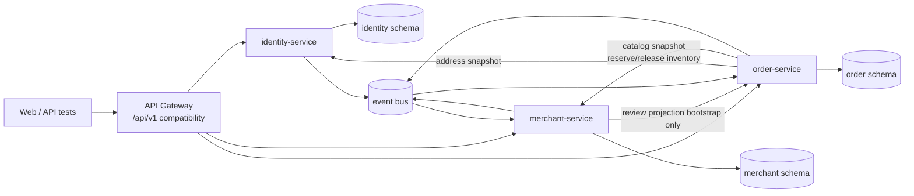

# 三服务接口、数据归属与契约草案

> 对应任务：[#23](https://github.com/daihao007/Lumalife/issues/23)
> 关联主任务：[#9](https://github.com/daihao007/Lumalife/issues/9)
> 旧代码基线：`monolith-start@a1a93529`（40 个测试，普通用户路径未限定 `ROLE_USER`）
> 当前候选基线：`origin/main@159ea85`（已含 Issue #33/PR #90 审查修正、`ROLE_USER`、`/auth/me`、服务边界端口和三容器 CI；本次核对后端 74/74，前端 23/23）
> 评审回复中的 46/46 后端、11/11 前端是合并前候选快照，作为历史证据保留，不作为当前候选计数
> 状态：`draft-2026-08-26`，待前端、测试、DevOps 和至少一名协作者评审后冻结
> 范围：CR-01～CR-06；不包含骑手、派单、轨迹、运力和骑手结算

## 1. 本文如何使用

本文是 `docs/15_单体后端审计与三服务拆分草案.md` 的契约细化，不宣称数据库或消息基础设施已经落地。外部 `/api/v1` 契约保持兼容；当前单体已通过领域端口和订单后台门面完成第一阶段边界落地，源码与 [`docs/17_D03服务边界落地记录.md`](./17_D03服务边界落地记录.md) 是实现事实，本文件和 `docs/contracts/` 是后续三服务迁移的冻结候选。

| 角色 | 使用方式 |
|---|---|
| 前端 | 继续请求网关 `/api/v1/**`；按第 4 节的请求、响应和错误约定适配，不直接调用 `/internal/**` |
| 后端 | 每个外部端点只能有一个服务所有者；跨域读取使用第 6 节 API，跨域传播使用第 7 节事件 |
| 测试 | 以第 9 节编号建立 provider/consumer、状态机、幂等和故障契约测试 |
| DevOps | 分别发布三个服务；仅网关暴露业务 API，内部 API 只在集群网络可达；按第 10 节配置探针、超时与追踪 |

机器可读草案：

- [`contracts/identity-service.openapi.yaml`](./contracts/identity-service.openapi.yaml)
- [`contracts/merchant-service.openapi.yaml`](./contracts/merchant-service.openapi.yaml)
- [`contracts/order-service.openapi.yaml`](./contracts/order-service.openapi.yaml)
- [`contracts/domain-events.asyncapi.yaml`](./contracts/domain-events.asyncapi.yaml)

## 2. 冻结等级和兼容规则

### 2.1 冻结候选

1. 外部路径、HTTP Method、业务所有者和 v1 响应外壳；
2. 金额一律使用整数分，时间一律使用带时区的 RFC 3339 字符串；
3. `userId`、`merchantId`、`productId`、`orderId` 在服务间只作稳定标识，不建立跨 Schema 外键；
4. 订单保存商家、商品、单价和地址快照，源数据变化不重写历史快照；
5. 库存唯一所有者是 merchant，评价和支付唯一所有者是 order；
6. 库存确认只有 `OrderPaid.v1` 一条路径；同步 API 只负责预占和释放；
7. 生产者本地事务写 Outbox，消费者以 `eventId` 写 Inbox 去重。
8. 商家注册采用异步建档 Saga；账户和 merchant 事实都进入 `ACTIVE` 前不签发可用 token。

### 2.2 v1 兼容策略

- 网关保持现有 52 个 `/api/v1/**` 端点，不要求前端随拆分改 URL。
- 现有成功响应保持 `{ "code": 200, "message": "success", "data": ... }`。
- 首轮拆分保留 POST `/delete`、`/toggle` 和 profile POST/PUT；只在 v2 规范化。
- 新错误响应增加 `requestId`、`reason`、`details` 字段时必须向后兼容；旧客户端只读取 `code/message` 仍可工作。
- `POST /api/v1/auth/register` 的目标态强制 `USER`。客户端传 `role` 时建议返回 400，而不是静默提权。
- `/api/v1/auth/me` 必须认证；旧标签曾把 `/auth/**` 全部公开，当前候选已修复为 `/auth/me` 认证，仅保留 login/register 为 Public。

## 3. 服务边界和调用方向



| 服务 | 拥有 | 明确不拥有 |
|---|---|---|
| `identity-service` | 账户、密码哈希、角色、access/refresh 会话、地址、商家账户绑定 | 商家经营资料、商品、库存、购物车、订单、评价 |
| `merchant-service` | 分类、商家经营资料、商品、团购套餐、可售库存、收藏、客服会话、公开评价/评分投影 | 密码、地址、购物车、订单主记录、支付、券码、评价事实 |
| `order-service` | 购物车、订单与快照、状态机、模拟支付、券码、评价事实、运营指标投影 | 账户凭证、当前地址、商品当前价格、商品可售库存、商家当前资料 |

网关只负责路由、CORS、限流、请求 ID 和外部兼容，不保存业务数据，不成为第四个业务服务。

## 4. 外部 API 清单

认证列约定：`Public`、`USER`、`MERCHANT_ADMIN`、`PLATFORM_ADMIN`。除 Public 外，必须携带 Bearer access token；服务端必须同时校验角色和资源归属，不能只依赖网关。

### 4.1 identity-service（9 个）

| ID | Method | Path | Auth | 请求/查询 | 成功 `data` | 主要错误 |
|---|---|---|---|---|---|---|
| ID-01 | POST | `/api/v1/auth/login` | Public | `phone,password` | ACTIVE 账户返回 `AuthResult` | 400 `VALIDATION_FAILED`；401 `INVALID_CREDENTIALS`；409 `MERCHANT_REGISTRATION_PENDING/FAILED` |
| ID-02 | POST | `/api/v1/auth/register` | Public | `phone,password,nickname`; `role` 不再接受提权 | `AuthResult` | 400；409 `PHONE_ALREADY_REGISTERED` |
| ID-03 | POST | `/api/v1/auth/register/merchant` | Public/受控 | `phone,password,nickname,invitationCode?` | ACTIVE 时 `AuthResult`；建档中 202 `MerchantRegistrationPending`（无 token） | 400；403 `MERCHANT_REGISTRATION_DENIED`；409 |
| ID-04 | GET | `/api/v1/auth/me` | Token | 无 | `UserView` | 401 `TOKEN_INVALID` |
| ID-05 | POST | `/api/v1/user/profile` | Token | `nickname,avatarUrl` | `UserView` | 400 |
| ID-06 | GET | `/api/v1/user/addresses` | USER | 无 | `Address[]` | 401；403 |
| ID-07 | POST | `/api/v1/user/addresses` | USER | `id?,contactName,phone,detail,defaultAddress` | `Address` | 400；404；409 `ADDRESS_LIMIT_REACHED` |
| ID-08 | POST | `/api/v1/user/addresses/{id}/default` | USER | 无 | `Address` | 403；404 `ADDRESS_NOT_FOUND` |
| ID-09 | POST | `/api/v1/user/addresses/{id}/delete` | USER | 无 | `null` | 403；404 |

`UserView` 绝不包含 `password` 或密码哈希。`AuthResult` 包含 `token`、`user`，目标态可新增 `refreshToken` 和 `expiresIn`。商家注册只有 identity 账户和 merchant 事实都激活后才返回 `AuthResult`；202 响应不得包含 access/refresh token。

### 4.2 merchant-service（25 个）

| ID | Method | Path | Auth | 请求/查询 | 成功 `data` |
|---|---|---|---|---|---|
| MER-01 | GET | `/api/v1/categories` | Public | 无 | `Category[]` |
| MER-02 | GET | `/api/v1/merchants` | Public/Token | `keyword,categoryId,sort,minPrice,maxPrice,minScore,page,size` | `Page<MerchantView>` |
| MER-03 | GET | `/api/v1/merchants/{id}` | Public | 无 | `MerchantDetail` |
| MER-04 | GET | `/api/v1/user/favorites` | USER | 无 | `MerchantView[]` |
| MER-05 | POST | `/api/v1/user/favorites` | USER | `merchantId` | `null` |
| MER-06 | POST | `/api/v1/user/favorites/{merchantId}/delete` | USER | 无 | `null` |
| MER-07 | GET | `/api/v1/conversations` | USER | 无 | `ConversationSummary[]` |
| MER-08 | GET | `/api/v1/conversations/{merchantId}` | USER | 无 | `ChatMessage[]` |
| MER-09 | POST | `/api/v1/conversations/{merchantId}/messages` | USER | `content` | `ChatMessage[]` |
| MER-10 | GET | `/api/v1/merchant-admin/profile` | MERCHANT_ADMIN | 无 | `MerchantProfile` |
| MER-11 | POST | `/api/v1/merchant-admin/profile` | MERCHANT_ADMIN | `nickname` | `MerchantProfile` |
| MER-12 | PUT | `/api/v1/merchant-admin/profile` | MERCHANT_ADMIN | `nickname` | `MerchantProfile` |
| MER-13 | GET | `/api/v1/merchant-admin/products` | MERCHANT_ADMIN | 无 | `Product[]` |
| MER-14 | POST | `/api/v1/merchant-admin/products` | MERCHANT_ADMIN | `id?,name,description,priceCent,stock,listed` | `Product` |
| MER-15 | POST | `/api/v1/merchant-admin/products/{id}/toggle` | MERCHANT_ADMIN | 无 | `Product` |
| MER-16 | POST | `/api/v1/merchant-admin/products/{id}/delete` | MERCHANT_ADMIN | 无 | `null` |
| MER-17 | GET | `/api/v1/merchant-admin/group-deals` | MERCHANT_ADMIN | 无 | `GroupDeal[]` |
| MER-18 | POST | `/api/v1/merchant-admin/group-deals` | MERCHANT_ADMIN | `id?,title,description,priceCent,stock,active` | `GroupDeal` |
| MER-19 | POST | `/api/v1/merchant-admin/group-deals/{id}/toggle` | MERCHANT_ADMIN | 无 | `GroupDeal` |
| MER-20 | POST | `/api/v1/merchant-admin/group-deals/{id}/delete` | MERCHANT_ADMIN | 无 | `null` |
| MER-21 | GET | `/api/v1/merchant-admin/conversations` | MERCHANT_ADMIN | 无 | `ConversationSummary[]` |
| MER-22 | GET | `/api/v1/merchant-admin/conversations/{userId}` | MERCHANT_ADMIN | 无 | `ChatMessage[]` |
| MER-23 | POST | `/api/v1/merchant-admin/conversations/{userId}/messages` | MERCHANT_ADMIN | `content` | `ChatMessage[]` |
| MER-24 | POST | `/api/v1/merchant-admin/assistant/ask` | MERCHANT_ADMIN | `question` | `{answer}` |
| MER-25 | POST | `/api/v1/assistant/ask` | Public | `question` | `{answer}` |

所有商家后台命令以 token 中的 `merchantId` 确定归属，忽略客户端试图提交的 merchantId。删除商品只改变 merchant 数据并发布 `ProductDeleted.v1`，不得直接改 order 的购物车表。

### 4.3 order-service（18 个）

| ID | Method | Path | Auth | 请求 | 成功 `data` |
|---|---|---|---|---|---|
| ORD-01 | GET | `/api/v1/cart` | USER | 无 | `CartItem[]` |
| ORD-02 | GET | `/api/v1/cart/detail` | USER | 无 | `CartLine[]` |
| ORD-03 | POST | `/api/v1/cart/items` | USER | `productId,quantity` | `CartItem[]` |
| ORD-04 | POST | `/api/v1/cart/items/{productId}` | USER | `quantity` | `CartItem[]` |
| ORD-05 | POST | `/api/v1/cart/items/{productId}/delete` | USER | 无 | `CartItem[]` |
| ORD-06 | POST | `/api/v1/cart/clear` | USER | 无 | `null` |
| ORD-07 | POST | `/api/v1/orders/delivery` | USER | `addressId?` | `Order[]`（按商家拆单） |
| ORD-08 | POST | `/api/v1/orders/group-buy` | USER | `dealId,quantity` | `Order` |
| ORD-09 | POST | `/api/v1/payments` | USER | `orderId,clientRequestId` | `Order` |
| ORD-10 | POST | `/api/v1/orders/{id}/cancel` | USER | 无 | `Order` |
| ORD-11 | POST | `/api/v1/orders/{id}/receive` | USER | 无 | `Order` |
| ORD-12 | GET | `/api/v1/orders` | USER | 无 | `Order[]` |
| ORD-13 | POST | `/api/v1/reviews` | USER | `orderId,score,tasteScore,serviceScore,content` | `Review` |
| ORD-14 | GET | `/api/v1/merchant-admin/orders` | MERCHANT_ADMIN | 无 | `Order[]` |
| ORD-15 | GET | `/api/v1/merchant-admin/reviews` | MERCHANT_ADMIN | 无 | `Review[]` |
| ORD-16 | POST | `/api/v1/merchant-admin/orders/{id}/transition` | MERCHANT_ADMIN | `next` | `Order` |
| ORD-17 | POST | `/api/v1/merchant-admin/coupons/verify` | MERCHANT_ADMIN | `code` | `Order` |
| ORD-18 | GET | `/api/v1/admin/metrics` | PLATFORM_ADMIN | 无 | `AdminMetrics` |

`clientRequestId` 由客户端为一次支付意图生成并在重试时复用。相同 `(userId,orderId,clientRequestId)` 必须返回同一业务结果；同一个 key 不能用于不同 order。

## 5. 数据和 Schema 归属

### 5.1 所有权表

| Schema | 表 | 唯一写入者 | 关键键/约束 | 允许被其他服务持有的副本 |
|---|---|---|---|---|
| identity | `user_account` | identity | `phone` 唯一；role 白名单；password_hash 非空；商家账户含 `PROVISIONING/ACTIVE/FAILED` | userId、role、merchantId、显示名投影 |
| identity | `merchant_registration` | identity | registration_id 唯一；phone 唯一活动 Saga；保存 payload hash、merchantId 和状态 | merchant 以 registrationId 建档去重 |
| identity | `auth_session` | identity | token hash 唯一；expires/revoked | 不复制 token；服务本地验证签名声明 |
| identity | `refresh_token` | identity | token family、rotation、expires/revoked | 无 |
| identity | `user_address` | identity | 每用户最多 5 个；仅一个默认 | 订单中的不可变地址快照 |
| identity | `outbox_event` | identity | event_id 唯一 | 消费方 Inbox |
| merchant | `category` | merchant | category_id 主键 | order 可持有 categoryId 投影 |
| merchant | `merchant` | merchant | merchant_id 主键；account id 为外部关联 | 订单商家名称快照、指标投影 |
| merchant | `product` | merchant | product_id；merchant_id；version | 购物车显示投影、订单行快照 |
| merchant | `group_deal` | merchant | deal_id；merchant_id；version | 订单行快照 |
| merchant | `inventory_reservation` | merchant | `(order_id,item_type,item_id)` 唯一；version | order 只存 reservation 状态/ID |
| merchant | `merchant_favorite` | merchant | `(user_id,merchant_id)` 唯一 | 无 |
| merchant | `conversation` | merchant | `(user_id,merchant_id)` 唯一 | 无 |
| merchant | `chat_message` | merchant | conversation_id + sequence | 无 |
| merchant | `review_projection` | merchant | review_id/event_id 唯一 | 来源事实仍在 order |
| merchant | `merchant_rating_projection` | merchant | merchant_id；last_event_id | order 不回写 |
| merchant | `outbox_event`,`inbox_event` | merchant | event_id 唯一 | 无 |
| order | `cart_item` | order | `(user_id,product_id)` 唯一 | 当前商品信息来自 merchant 投影/API |
| order | `order_main` | order | order_id；version；金额非负 | merchant 可持有订单摘要投影 |
| order | `order_item` | order | order_id + line_no；名称/单价快照 | 无 |
| order | `order_status_timeline` | order | order_id + sequence | merchant 事件投影 |
| order | `payment_record` | order | `(user_id,client_request_id)` 唯一；记录 order_id；状态 `PROCESSING/SUCCESS/FAILED` | 无 |
| order | `coupon` | order | code 唯一；order_id 唯一 | 无 |
| order | `review` | order | order_id 唯一；评分 1～5 | merchant 公开展示投影 |
| order | `admin_metrics_projection` | order | metric_key + bucket | 事件来源的最终一致指标 |
| order | `operation_log` | 各服务本地 | actor、action、request_id、time | 不建立跨服务共享日志表 |
| order | `outbox_event`,`inbox_event` | order | event_id 唯一 | 无 |

### 5.2 禁止项

- 禁止跨 Schema Join、外键和直接 SQL；禁止另一个服务为本表建立可写 Repository。
- 禁止把三个服务的 Entity 放入共享领域包；共享库只能含稳定的技术协议或生成 DTO。
- 禁止 merchant 改名后重写 order 历史快照。
- 禁止 order 直接扣减 `product.stock` / `group_deal.stock`。
- 禁止用事件替代必须即时判定成败的地址归属、商品可售性和库存预占检查。

## 6. 同步内部 API 契约

内部 API 统一前缀 `/internal/v1`，只允许服务身份调用。请求必须携带 `X-Request-Id`、`traceparent` 和 `X-Caller-Service`；命令还须携带 `Idempotency-Key`。内部 API 不通过公网暴露。

| ID | 调用 | 契约 | 超时预算 | 重试 | 失败处理 |
|---|---|---|---:|---|---|
| INT-ID-01 | gateway/service → identity | `POST /internal/v1/tokens/introspect` | 300 ms | 最多 1 次，仅连接错误 | 401/403；普通业务请求失败关闭 |
| INT-ID-02 | order → identity | `GET /internal/v1/users/{userId}/addresses/{addressId}` | 500 ms | 最多 1 次 | 404 或超时均不创建订单 |
| INT-MER-01 | order → merchant | `POST /internal/v1/catalog/items:batch-get` | 800 ms | 最多 1 次 | 逐项返回 `AVAILABLE/NOT_FOUND/NOT_SALEABLE`；任一不可售则拒绝对应下单 |
| INT-MER-02 | order → merchant | `POST /internal/v1/inventory/reservations` | 1 s | 同 key 最多 2 次 | 409 库存不足；超时后调用 INT-MER-03 查询，不能盲目重建 |
| INT-MER-03 | order → merchant | `GET /internal/v1/inventory/reservations/{orderId}` | 500 ms | 最多 1 次 | 返回 `RESERVED/CONFIRMED/RELEASED/CHECK_REQUIRED`；404 表示尚无预占，可用原 key/原载荷重放 POST |
| INT-MER-04 | order → merchant | `POST /internal/v1/inventory/reservations/{orderId}:release` | 1 s | 后台指数退避 | 幂等；支付成功后不得释放 |
| INT-ORD-01 | merchant → order | `GET /internal/v1/merchants/{merchantId}/reviews` | 800 ms | 最多 1 次 | 商家详情降级为空并标记 `partial=true`；后台明确显示暂不可用 |
| INT-ORD-02 | merchant → order | `GET /internal/v1/orders/{orderId}/payment-state` | 500 ms | 后台指数退避 | 只供预占到期对账；order 不可用时置 `CHECK_REQUIRED`，不得释放 |

### 6.1 批量商品快照

```json
{
  "items": [
    { "itemType": "PRODUCT", "itemId": 101, "quantity": 2 },
    { "itemType": "GROUP_DEAL", "itemId": 201, "quantity": 1 }
  ]
}
```

响应必须保持输入顺序，并逐项返回 `status`、`merchantId`、`name`、`priceCent`、`stockVersion`；失败项不得伪造价格或库存。

### 6.2 库存预占

```json
{
  "orderId": 9001,
  "expiresAt": "2026-08-26T10:15:00+08:00",
  "items": [
    { "itemType": "PRODUCT", "itemId": 101, "quantity": 2, "expectedVersion": 7 }
  ]
}
```

同一 orderId、同一载荷重复请求返回原 reservation；同一 orderId、不同载荷返回 409 `IDEMPOTENCY_CONFLICT`。预占状态为 `RESERVED → CONFIRMED | RELEASED | CHECK_REQUIRED`，终态不可逆。

若预占 POST 超时，order 先以同一 orderId 调用查询接口：查到记录则按返回状态继续，404 才允许使用相同 `Idempotency-Key` 和完全相同载荷重放 POST。查询和重放都不能生成第二个 reservation。

## 7. 异步事件契约

### 7.1 公共信封

```json
{
  "eventId": "0198e6f0-7a5e-7d11-a4dc-5b682c9f21e1",
  "eventType": "OrderPaid",
  "version": 1,
  "occurredAt": "2026-08-26T10:00:00+08:00",
  "producer": "order-service",
  "aggregateId": "9001",
  "traceId": "4bf92f3577b34da6a3ce929d0e0e4736",
  "payload": {}
}
```

| 事件 | 生产者 | 消费者 | 最小 payload | 作用 |
|---|---|---|---|---|
| `UserRegistered.v1` | identity | order | `userId,role,registeredAt` | 用户数投影 |
| `UserProfileChanged.v1` | identity | merchant/order | `userId,nickname,avatarUrl,changedAt` | 客服/读模型；不改历史快照 |
| `MerchantAccountBound.v1` | identity | merchant | `registrationId,userId,merchantId,nickname,boundAt` | merchant 已建档后确认账户绑定 |
| `MerchantRegistrationRequested.v1` | identity | merchant | `registrationId,userId,merchantId,nickname,requestedAt` | 请求幂等创建 merchant 事实 |
| `MerchantProvisioned.v1` | merchant | identity | `registrationId,userId,merchantId,provisionedAt` | 将 identity 商家账户原子激活 |
| `MerchantProvisioningFailed.v1` | merchant | identity | `registrationId,userId,merchantId,reason,failedAt` | 将 Saga 置失败并禁止签发 token |
| `ProductChanged.v1` | merchant | order | `productId,merchantId,name,priceCent,listed,version` | 购物车显示/失效投影 |
| `ProductDeleted.v1` | merchant | order | `productId,merchantId,version,deletedAt` | 标记购物车项失效 |
| `OrderPaid.v1` | order | merchant | `orderId,userId,merchantId,totalCent,paidAt,items[]` | 库存确认唯一入口、销量投影 |
| `OrderStatusChanged.v1` | order | merchant | `orderId,merchantId,from,to,changedAt` | 履约/客服投影 |
| `ReviewCreated.v1` | order | merchant | `reviewId,orderId,merchantId,userName,score,tasteScore,serviceScore,content,createdAt` | 评分和公开评价投影 |

事件交付语义为 at-least-once：允许重复和乱序，不允许消费者依赖“只会收到一次”。消费者先写 `inbox_event` 去重，再在本地事务中更新投影。无法识别的更高 major version 进入死信队列并告警。

## 8. 错误和可观测性约定

### 8.1 错误外壳

```json
{
  "code": 40900,
  "message": "库存不足",
  "data": null,
  "requestId": "01J6A2...",
  "reason": "INVENTORY_INSUFFICIENT",
  "details": [{ "field": "items[0].quantity", "issue": "exceeds_available" }]
}
```

| HTTP | 业务码 | 语义 | 稳定 reason 示例 | 可重试 |
|---:|---:|---|---|---|
| 400 | `40000` | 参数、格式、字段组合非法 | `VALIDATION_FAILED`,`ROLE_NOT_ALLOWED` | 否 |
| 401 | `40100` | 未认证、token 无效/过期、登录失败 | `INVALID_CREDENTIALS`,`TOKEN_INVALID` | 刷新 token 后一次 |
| 403 | `40300` | 角色不足或资源不归属 | `ROLE_FORBIDDEN`,`RESOURCE_FORBIDDEN` | 否 |
| 404 | `40400` | 资源不存在；对越权敏感资源可统一为 404 | `ORDER_NOT_FOUND`,`ADDRESS_NOT_FOUND` | 否 |
| 409 | `40900` | 唯一键、状态机、库存或幂等冲突 | `INVENTORY_INSUFFICIENT`,`ILLEGAL_STATE_TRANSITION`,`IDEMPOTENCY_CONFLICT` | 仅按业务规则 |
| 429 | `42900` | 限流 | `RATE_LIMITED` | 按 `Retry-After` |
| 500 | `50000` | 未处理服务错误 | `INTERNAL_ERROR` | 幂等读/命令才可有限重试 |
| 502 | `50200` | 下游协议错误 | `DOWNSTREAM_BAD_RESPONSE` | 幂等操作有限重试 |
| 503 | `50300` | 下游不可用/熔断 | `DEPENDENCY_UNAVAILABLE` | 后台退避 |
| 504 | `50400` | 下游超时 | `DEPENDENCY_TIMEOUT` | 幂等操作有限重试 |

外部响应不得返回堆栈、SQL、主机名、密钥或原始异常消息。日志记录 `requestId/traceId/service/errorClass`；API 返回安全文案。

### 8.2 身份传递

优先采用短期签名 access token，三服务本地验证 `sub,role,merchantId,iat,exp,iss,aud`。网关注入的用户头不能作为唯一身份依据；若使用内部 introspection，必须启用 mTLS 或服务凭据并失败关闭。

## 9. 契约测试矩阵

| ID | Provider / Consumer | 场景 | 必须断言 |
|---|---|---|---|
| CT-ID-01 | identity / frontend | 登录成功与失败 | 成功外壳、UserView 无密码；错误凭据统一 401，不枚举账号 |
| CT-ID-02 | identity / all | `/auth/me` 匿名、过期、撤销 token | 都返回 401 envelope，不是空 body/500 |
| CT-ID-03 | identity / frontend | 普通注册携带 `MERCHANT_ADMIN` | 400 `ROLE_NOT_ALLOWED`，不得创建提权账户 |
| CT-ID-04 | identity / order | 地址查询归属 | 本人 200；他人地址返回 404/403；响应可直接落快照 |
| CT-ID-05 | identity | 地址上限和默认地址 | 第 6 个地址 409；任意时刻最多一个默认地址 |
| CT-ID-06 | identity / merchant | 商家注册建档 Saga | 202 无 token；请求事件重放只建一个 merchant；建档成功后才 ACTIVE；终态失败禁止登录并可人工重试/补偿 |
| CT-MER-01 | merchant / frontend | 搜索、分页、排序 | page/size/total/pages 稳定；金额/评分类型不漂移 |
| CT-MER-02 | merchant / order | batch-get 混合结果 | 输入输出顺序一致；每项状态完整；无 N+1 契约 |
| CT-MER-03 | merchant / order | 并发预占同一库存 | 条件更新不超卖；失败 409；总预占不超过可售库存 |
| CT-MER-04 | merchant / order | reserve/release 重放 | 同载荷返回原结果；重复释放无副作用；不同载荷 409 |
| CT-MER-05 | merchant / order | `OrderPaid.v1` 重复/乱序 | 只确认一次；已确认不被 release；Inbox 去重 |
| CT-MER-06 | merchant / frontend | 商家越权维护 | 403/404，不能读写其他 merchantId 的商品/套餐 |
| CT-MER-07 | merchant / order | 商品删除事件重复 | 购物车项稳定标失效，不跨库删除，不重复产生副作用 |
| CT-ORD-01 | order / frontend | 按商家拆单 | 每单只有一个 merchantId；快照/金额正确；购物车清理范围正确 |
| CT-ORD-02 | order / identity/merchant | 地址或商品 API 超时 | 不产生可支付的半订单；返回 504/503 和 requestId |
| CT-ORD-03 | order / frontend | 支付幂等并发 | 唯一键竞争只有一个 SUCCESS；同 key 同订单返回原结果；同 key 跨订单 409 `IDEMPOTENCY_CONFLICT`；库存不重复预占 |
| CT-ORD-04 | order / merchant | 支付本地事务失败 | 触发幂等 release；失败可重试/告警；订单不误置 PAID |
| CT-ORD-05 | order / frontend | 状态机 | 只允许文档定义边；非法跳转 409 且版本不变 |
| CT-ORD-06 | order / frontend | 一单一评 | DELIVERY 仅 `RECEIVED/COMPLETED` 可评；GROUP_BUY 仅 `USED` 可评；并发第二次评价 409 |
| CT-ORD-07 | order / merchant | 券码核销 | 仅所属商家、仅 PAID、仅一次；重放 409 或返回相同终态 |
| CT-EVT-01 | all | Outbox 崩溃恢复 | 业务提交后事件最终发布；重复投递被 Inbox 去重 |
| CT-EVT-02 | all | 未知事件版本 | 不污染投影；死信和告警可观测 |
| CT-E2E-01 | all | 注册→浏览→下单→支付→履约→收货→评价 | 三服务独立重启后流程和数据对账正确 |
| CT-E2E-02 | all | 团购购买→支付→核销 | 券码唯一、库存确认、跨商家核销拒绝 |

契约 CI 建议：OpenAPI/AsyncAPI 语法校验 → provider schema 测试 → consumer compatibility → 三服务集成故障测试。规范文件发生破坏性变更时必须升级 major version，不得只修改实现。

## 10. DevOps 运行契约

| 项 | 约定 |
|---|---|
| 服务名 | `identity-service`、`merchant-service`、`order-service` |
| 外部端口 | 只由网关暴露；服务端口可分别使用 8081/8082/8083 |
| 活性 | `GET /actuator/health/liveness`，只判断进程是否活着，不检查远端依赖 |
| 就绪 | `GET /actuator/health/readiness`，检查本服务 DB/迁移状态；事件总线可按降级策略决定是否摘流 |
| 版本 | `GET /actuator/info` 返回 service、version、git.commit、contractVersion |
| 配置 | DB、token 密钥、消息系统和 Agnes 密钥只从 Secret/环境注入，不写入镜像或仓库 |
| 网络 | `/internal/**` 只允许服务账户和集群内 NetworkPolicy；业务 Schema 账号最小权限且互不复用 |
| 追踪 | 网关生成/透传 `X-Request-Id` 与 W3C `traceparent`；事件保留 traceId |
| 超时 | 采用第 6 节预算；客户端超时必须大于下游超时并留出响应预算 |
| 发布 | 镜像和契约都使用不可变版本；部署记录服务版本、git SHA、contractVersion 和迁移版本 |

## 11. 订单状态与库存状态

外卖订单：

```text
PENDING_PAYMENT -> PAID -> ACCEPTED -> DELIVERING -> RECEIVED -> COMPLETED
       |                                              |
       +----------------> CANCELLED                   +-> COMPLETED
```

团购订单：

```text
PENDING_PAYMENT -> PAID -> USED
       |
       +-> CANCELLED
```

`EXPIRED` 当前只有枚举，没有定时任务；实施时需另行冻结何时过期及退款/释放规则。每次状态变更使用乐观锁 `version` 和条件更新，写时间线与 Outbox 必须处于同一本地事务。

## 12. 评审记录和待决项

### 12.1 2026-08-27 审查修正后自检记录

| 检查项 | 结论 | 证据 |
|---|---|---|
| 现有 API 数量与归属 | 52 = identity 9 + merchant 25 + order 18 | `ApiControllers.java` 与本文第 4 节 |
| 请求 DTO | 已逐项对齐当前 Controller record；目标态差异已标注 | 三份 OpenAPI |
| 数据归属 | 每个业务表只有一个写入者，无跨库 Join | 第 5 节 |
| 跨服务失败 | 地址、商品、库存、评价和支付状态均定义超时/重试/降级 | 第 6、8 节 |
| 事件契约 | 11 个事件有版本、公共信封、去重和最小 payload | AsyncAPI 与第 7 节 |
| 前端兼容 | v1 路径和成功外壳保持；已知安全缺陷不冻结 | 第 2、4 节 |
| 测试可执行性 | 24 个编号测试点覆盖 provider、consumer、事件和 E2E | 第 9 节 |
| DevOps 可部署性 | 服务名、探针、版本、网络、Secret、追踪已定义 | 第 10 节 |

### 12.2 必须由团队确认

1. 商家注册采用邀请制、人工审核还是限流的公开注册；
2. access token 采用 JWT + refresh session（建议）还是集中 introspection；
3. 事件基础设施及 Topic 命名；即使先用数据库 Outbox 轮询，事件 Schema 不变；
4. 商家详情评价采用事件投影（建议）还是网关同步聚合；
5. 管理员指标允许的最终一致延迟；建议常态 30 秒内，故障时展示数据时间戳；
6. `EXPIRED` 的触发、退款和库存释放规则；
7. v1 POST `/delete`、`/toggle` 的废弃周期。

## 13. 完成定义

- [x] 52 个外部接口按唯一服务所有者列全；
- [x] 请求/响应主模型、权限、幂等和兼容约定已给出；
- [x] 表/Schema 归属、唯一写入者、复制边界和禁止项已给出；
- [x] 8 个内部调用定义超时、重试和失败语义；
- [x] 11 个版本化事件及公共信封已形成 AsyncAPI 草案；
- [x] 错误码、稳定 reason、追踪和安全文案已统一；
- [x] 24 个契约测试点和 DevOps 运行契约已列出；
- [ ] 至少一名协作者评审并在 PR/Issue 留下结论；
- [ ] 第 12.2 节待决项冻结后，将草案状态改为 `frozen-v1`。

当日管理证据：

- [Issue #23 项目看板截图](./evidence/2026-08-26/issue-23-project-board.png)：任务位于 In Progress，已关联 PR #76；
- [Issue #23 日报统计截图](./evidence/2026-08-26/issue-23-daily-project-stats.png)：记录 2026-08-26 任务、负责人、状态和关联 PR。
