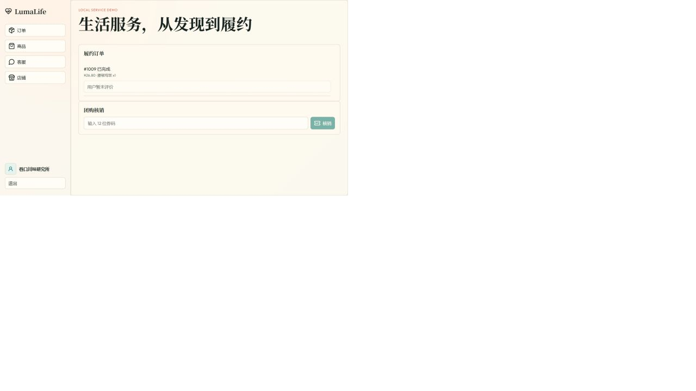
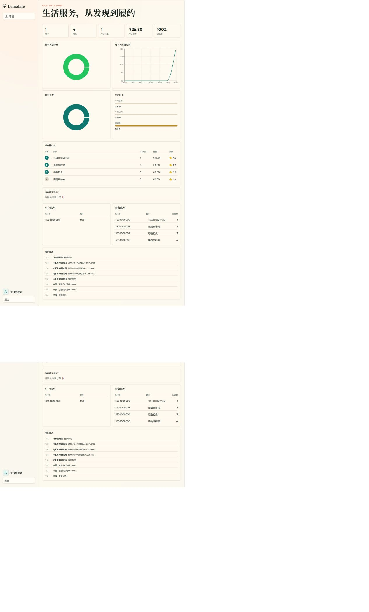
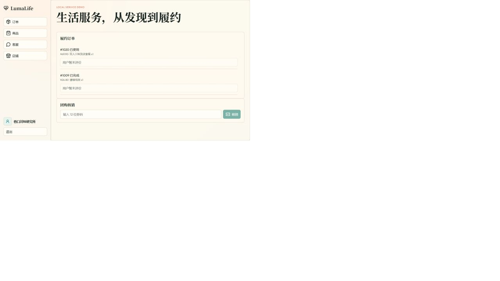

# D05 前端全角色回归与中期演示证据

> 任务：`[D05][B][2026-08-29] 完成前端全角色回归与中期演示证据`
>
> 执行时间：2026-08-26（中期检查前提前回归）

## 站会摘要

昨天完成用户、商家与平台管理员核心流程联调，并补齐详情页动作锁、管理员看板失败重试及团购/外卖订单类型隔离。今天在独立临时数据上启动前后端，按真实浏览器入口回归三角色导航、外卖下单支付与履约、团购购买核销、确认收货评价和管理员运营看板，同时固化截图、测试命令和中期缺口。当前无阻断；后续风险主要是微服务接口适配可能破坏既有页面契约，需由 D06 前端网关适配和端到端测试任务持续回归。

## 回归结论

- 普通用户 6 个导航入口、商家 4 个导航入口、平台管理员看板均可从登录页进入并正常渲染。
- 外卖订单 `发现商家 -> 加购 -> 选择地址 -> 下单 -> 支付 -> 商家接单 -> 配送 -> 完成 -> 用户确认收货` 全链路通过。
- 团购订单 `购买并支付 -> 生成 12 位券码 -> 商家核销 -> USED -> 用户评价` 全链路通过；商家端未为团购订单展示外卖履约按钮。
- 管理员看板可读取本次回归产生的订单数、营收、完成率、商户排行和操作日志，三角色数据一致。
- 本轮未发现 P0/P1 阻断问题；仅保留主包体积告警和浏览器 E2E 尚未工程化两个既有缺口。

## 全角色入口回归

| 角色 | 前端入口 | 结果 | 说明 |
| --- | --- | --- | --- |
| 普通用户 | 发现、购物车、订单、收藏、地址、客服 | 通过 | 6 个入口逐一点击并确认页面渲染 |
| 商家管理员 | 订单、商品、客服、店铺 | 通过 | 4 个入口逐一点击并确认页面渲染 |
| 平台管理员 | 看板 | 通过 | KPI、图表、排行、账号和日志均正常展示 |

## 业务用例回归矩阵

| 用例 | 代表性前端路径 | 执行结果 | 证据 |
| --- | --- | --- | --- |
| UC01 用户账号资料 | 登录普通用户，进入地址页并加载两条演示地址 | 通过 | 浏览器入口回归 + 后端 API 集成测试 |
| UC02 发现商家 | 发现页查看推荐列表，进入“巷口川味研究所”详情 | 通过 | 真实浏览器执行 |
| UC03 外卖下单支付 | 加购藤椒鸡饭，选择默认地址，创建并支付订单 `#1009` | 通过 | `01-user-order-paid.png` |
| UC04 商家履约与评价 | 商家将 `#1009` 依次推进至已完成，用户确认收货 | 通过 | `02-merchant-fulfillment-completed.png` |
| UC05 团购购买 | 用户购买双人套餐，订单 `#1020` 自动支付并生成券码 | 通过 | 真实浏览器执行 |
| UC06 团购核销 | 商家输入 12 位券码，订单从 PAID 变为 USED | 通过 | `04-merchant-groupbuy-verified.png` |
| UC07 商家经营内容 | 商家商品、店铺入口均正常加载现有经营内容 | 通过 | 商家全入口烟测 + 后端 API 集成测试 |
| UC08 用户商家客服 | 用户客服、商家客服入口均正常加载 | 通过 | 双角色入口烟测 + 后端 API 集成测试 |
| UC09 管理员看板 | 管理员查看 1 笔完成外卖订单及对应营收、日志 | 通过 | `03-admin-dashboard.png` |

## 中期演示截图

### 1. 用户完成外卖下单与支付

### 2. 商家完成外卖履约

### 3. 平台管理员核对经营看板

### 4. 商家核销团购券

## 自动化与构建证据

| 检查 | 结果 |
| --- | --- |
| `cd frontend && npm test -- --run` | 4 个测试文件、20 项测试全部通过 |
| `cd frontend && npm run build` | TypeScript 检查和 Vite 生产构建通过 |
| `cd backend && mvn -B -ntp verify` | 57 项测试通过，0 失败、0 错误 |
| 真实浏览器回归 | 用户 6 个入口、商家 4 个入口、管理员看板及 2 条交易闭环通过 |

生产构建仍提示主包约 618 kB，属于既有非阻断告警。

## 中期缺口与看板映射

| 缺口/风险 | 影响 | 已同步任务 |
| --- | --- | --- |
| 浏览器回归目前以本次手工实跑和组件/API 自动化为主，尚未形成可持续的 Playwright/Cypress 流水线 | 后续接口迁移时需要人工重复演示路径 | #11 `TEST-E2E-01`、#34 `D04/D`、#39 `D05/D` |
| 前端单包构建超过 Vite 500 kB 建议阈值 | 首屏加载和演示机器性能存在潜在风险 | #42 `D06/B` 在网关接口适配阶段评估路由级拆包 |
| D05 当前基于 D04 联调分支，需先合并 D04 PR | 若基础联调改动变化，截图与路径需要复验 | D05 PR 设为堆叠 PR，并在 D04 合并后复跑门禁 |
| 微服务拆分将改变请求入口和部署拓扑 | 可能破坏已确认的 UC01～UC09 前端契约 | #42、#47、#52 分阶段执行全角色回归 |

## 演示建议顺序

1. 普通用户登录，展示订单 `#1009` 的完整时间线和团购订单 `#1020` 的券码、评价状态。
2. 商家登录，展示外卖订单已完成、团购订单已使用以及团购不出现外卖履约按钮。
3. 平台管理员登录，对照本次交易展示订单、营收、完成率、排行和操作日志。
4. 最后展示本清单中的自动化结果和缺口映射，说明后续拆分阶段的回归门禁。
