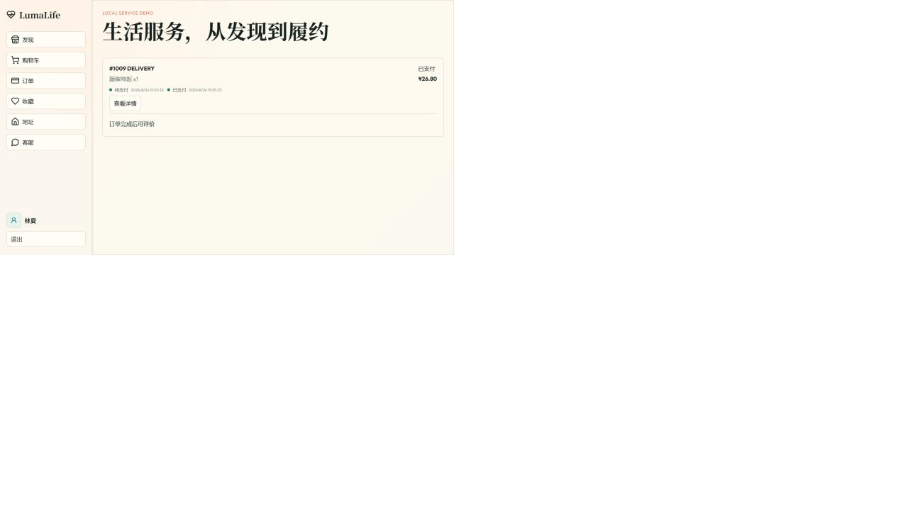
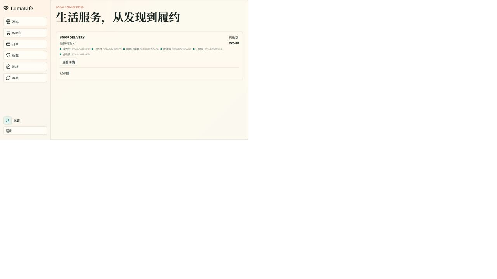
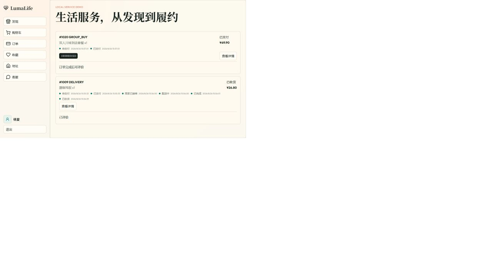
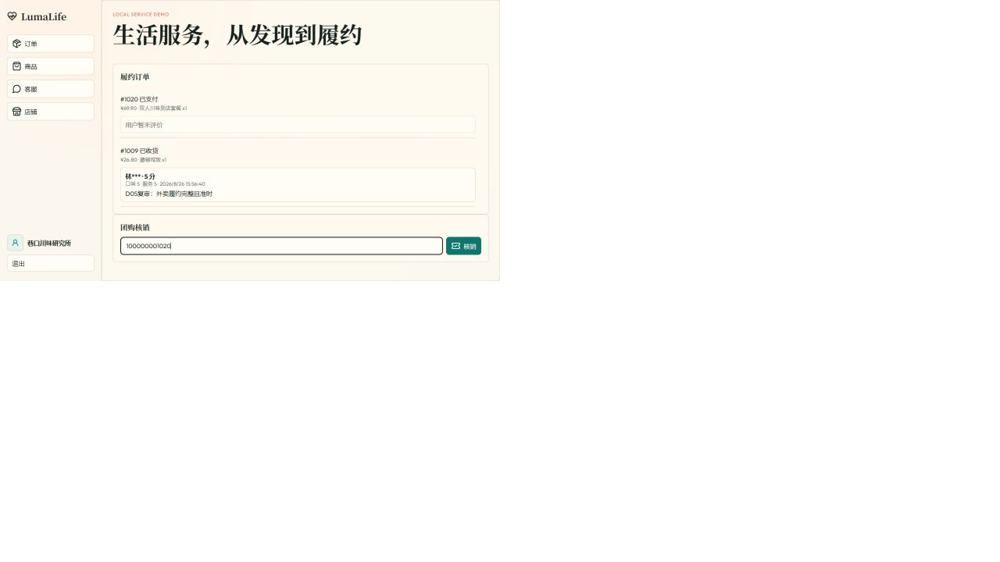
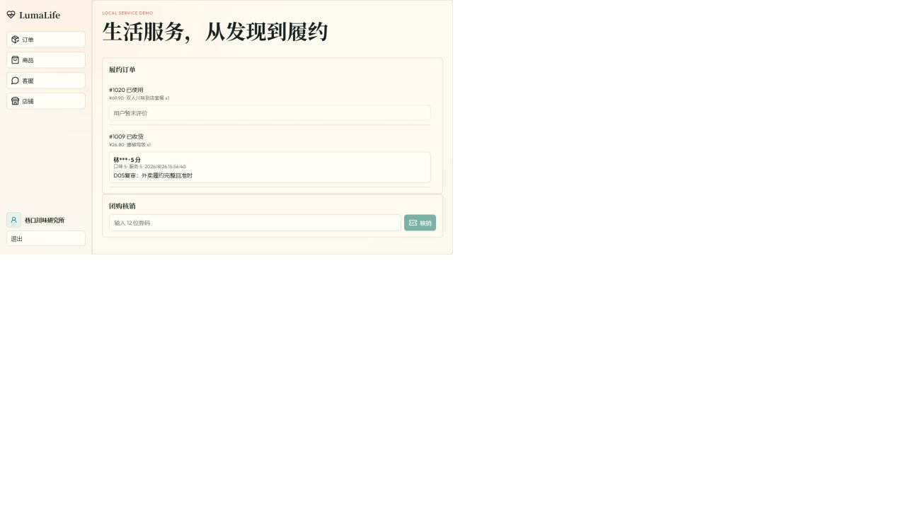
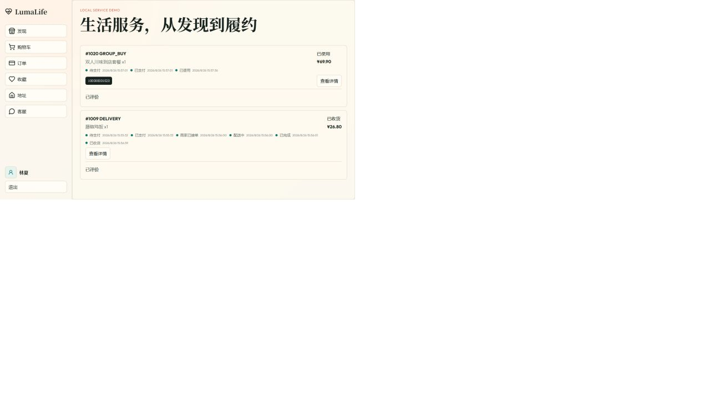
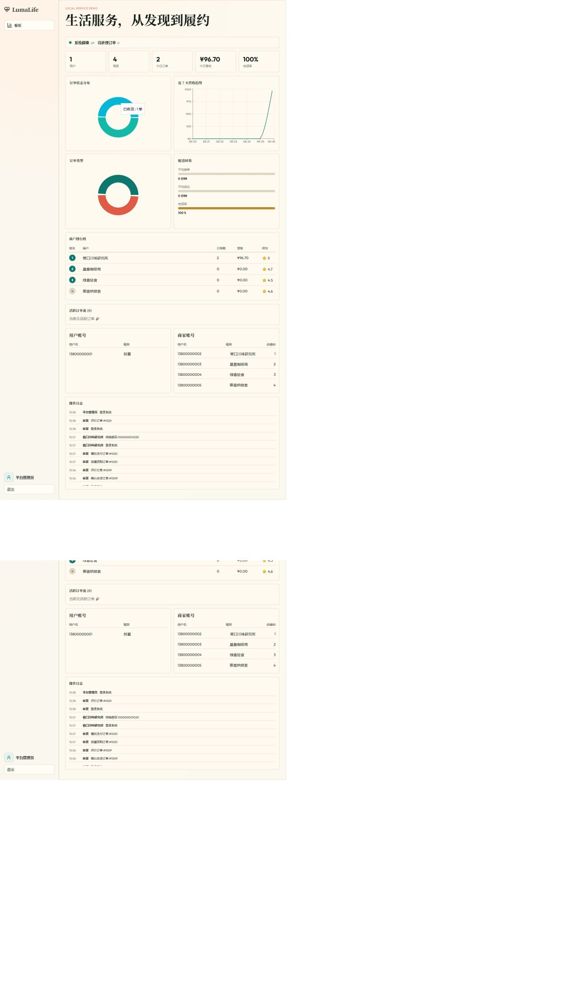

# D05 前端全角色回归与中期演示证据

> 任务：`[D05][B][2026-08-29] 完成前端全角色回归与中期演示证据`
>
> 执行时间：2026-08-26（中期检查前提前回归；审计整改后复验）

## 回归结论

- 普通用户 6 个导航入口、商家 4 个导航入口、平台管理员看板均可从登录页进入并正常渲染。
- 外卖订单 `#1009` 已完成“加购 → 下单 → 支付 → 接单 → 配送 → 完成 → 确认收货 → 评价”闭环。
- 团购订单 `#1020` 已完成“购买支付 → 生成 12 位券码 → 商家输入券码 → 核销为 USED → 用户评价”闭环，商家端未展示外卖履约按钮。
- 管理员看板显示系统健康 `UP`，可核对订单、营收、完成率和 `#1009`、`#1020` 的操作日志。
- 组件/路由测试、后端测试、HTTP 黑盒 E2E 和真实浏览器手工回归是四类独立验证，本报告不再将组件测试表述为浏览器自动化。
- 本轮未发现 P0/P1 阻断问题；生产构建仅保留既有主包体积告警。

## 全角色入口回归

| 角色 | 前端入口 | 结果 | 说明 |
| --- | --- | --- | --- |
| 普通用户 | 发现、购物车、订单、收藏、地址、客服 | 通过 | 6 个入口逐一点击并确认页面渲染 |
| 商家管理员 | 订单、商品、客服、店铺 | 通过 | 4 个入口逐一点击并确认页面渲染 |
| 平台管理员 | 看板 | 通过 | KPI、健康状态、图表、排行、账号和日志均正常展示 |

## 业务用例回归矩阵

| 用例 | 代表性前端路径 | 执行结果 | 证据 |
| --- | --- | --- | --- |
| UC01 用户账号资料 | 普通用户登录，进入地址页并加载演示地址 | 通过 | 真实浏览器入口回归 + 后端集成测试 |
| UC02 发现商家 | 发现页进入“巷口川味研究所”并查看商品 | 通过 | 真实浏览器回归 |
| UC03 外卖下单支付 | 加购藤椒鸡饭，选择默认地址，创建并支付 `#1009` | 通过 | `01-user-order-1009-paid.png` |
| UC04 商家履约 | 商家将 `#1009` 依次推进至已完成 | 通过 | `02-merchant-order-1009-completed.png` |
| UC05 外卖收货评价 | 用户确认收货并提交 5/5/5 评价 | 通过 | `03-user-order-1009-received-reviewed.png` |
| UC06 团购购买 | 创建并支付 `#1020`，生成券码 `100000001020` | 通过 | `04-user-groupbuy-1020-paid-coupon.png` |
| UC07 团购核销 | 商家输入完整券码后核销，订单变为 USED | 通过 | `05-merchant-groupbuy-1020-coupon-entered.png`、`06-merchant-groupbuy-1020-used.png` |
| UC08 团购评价 | 用户对已使用团购订单提交 5/5/5 评价 | 通过 | `07-user-orders-1009-1020-reviewed.png` |
| UC09 管理员看板 | 查看健康状态及两笔订单的经营指标与操作日志 | 通过 | `08-admin-dashboard-health-audit-log.png` |

## 中期演示截图

### 1. 外卖下单支付与履约

### 2. 团购券码生成、输入、核销与评价

### 3. 管理员健康状态与审计日志

## 自动化、构建与手工回归证据

| 验证层 | 命令/方式 | 结果 | 定位 |
| --- | --- | --- | --- |
| 前端组件与路由测试 | `cd frontend && npm test -- --run` | 4 个测试文件、23 项全部通过 | 组件交互和角色路由，不等同于真实浏览器 E2E |
| 前端生产构建 | `cd frontend && npm run build` | TypeScript 检查和 Vite 构建通过 | 主包 619.04 kB，仅有既有体积告警 |
| 后端单元/集成测试 | `cd backend && mvn -B -ntp verify` | D05 历史快照 66 项通过；当前主线复验 74/74（42 业务规则、25 API 集成、4 服务边界契约、3 数据库资产） | 领域状态机、权限、API 契约和数据库资产 |
| HTTP 黑盒 E2E | `cd e2e && npm test` | D05 历史快照 3/3；当前主线复验 6/6，环境启动通过 | 当前覆盖 CR-01～CR-06 六条代表性跨角色 API 闭环 |
| 真实浏览器手工回归 | 本地前后端 + 隔离状态文件 | 三角色入口及 `#1009`、`#1020` 两条交易闭环通过 | 截图与 `browser-regression-log.md` |

完整复现步骤、时间线和截图映射见 [`browser-regression-log.md`](evidence/D05/browser-regression-log.md)。Windows 本地执行 HTTP E2E 前需确保 `mvn.cmd` 位于 `PATH`；首次未配置 Maven 的启动失败没有执行任何业务场景，配置后重跑为 3/3 通过。当前主线复验已扩展为 CR-01～CR-06 共 6/6；历史快照保留用于说明当时的执行范围。

中期逐项检查和前五天缺口分派见 [`D05-A 中期检查与前五天缺口闭环`](20_D05中期检查与前五天缺口闭环.md)。

## 中期缺口与看板映射

| 缺口/风险 | 影响 | 已同步任务 |
| --- | --- | --- |
| 真实浏览器回归当前为人工执行；仓库已有可持续 HTTP 黑盒 E2E，但尚未引入 Playwright/Cypress UI 流水线 | 页面结构或浏览器兼容性变化仍需人工复验 | #11 `TEST-E2E-01`、#34 `D04/D`、#39 `D05/D` |
| 前端单包 619.04 kB，超过 Vite 500 kB 建议阈值 | 首屏加载和演示机性能存在潜在风险 | #42 `D06/B` 评估路由级拆包 |
| 微服务拆分将改变请求入口和部署拓扑 | 可能破坏已确认的 UC01～UC09 前端契约 | #42、#47、#52 分阶段执行全角色回归 |

## 演示建议顺序

1. 普通用户展示外卖订单 `#1009` 的支付、收货和评价结果。
2. 展示团购订单 `#1020` 的券码，再由商家对照核销前输入与核销后 USED 状态。
3. 回到用户订单页展示两单均已评价，并说明团购订单不会进入外卖履约状态机。
4. 平台管理员展示系统健康 `UP`、经营指标及两单操作日志。
5. 最后展示四层验证结果和后续风险映射。
