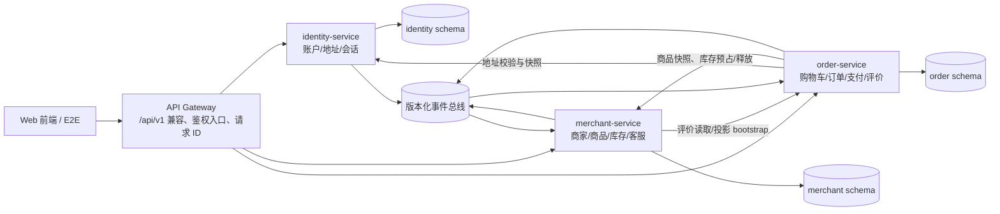

# [D04][C] 微服务边界、接口与数据归属初稿

> 对应任务：[#33](https://github.com/daihao007/Lumalife/issues/33) `[D04][C][2026-08-28]`
> 关联任务：[#23](https://github.com/daihao007/Lumalife/issues/23)、[#28](https://github.com/daihao007/Lumalife/issues/28)、[#9](https://github.com/daihao007/Lumalife/issues/9)
> 版本：`draft-2026-08-28`；目标/当前核对基线：`2ba74ea9db052143c0eafa5f2c18be2ac555bf85`；D07 当前实现索引见 [`28_D07服务接口数据归属与需求追溯.md`](./28_D07服务接口数据归属与需求追溯.md)
> 范围：用户认证、商家商品、订单三个业务服务；不包含骑手、派单、轨迹、运力和骑手结算

## 1. 交付结论和使用边界

本初稿冻结三件事：

1. 每个外部 API 只有一个业务服务所有者，网关只做路由和兼容，不保存业务事实；
2. 每张业务表只有一个服务写入，跨服务只传稳定 ID、快照、版本化 API 或事件，不跨库 Join；
3. 即时判定使用有预算的同步调用，跨域传播使用 Outbox/Inbox 事件；支付与库存、商家注册都采用可重试、可对账的 Saga。

当前代码已经有三个独立 Spring Boot 进程和 39 个内部业务接口：`IdentityApi`、`MerchantApi`、`OrderApi` 分别监听 8081/8082/8083；`ApiControllers` 仍是 `/api/v1` 兼容入口，远程适配器按迁移开关选择服务或单体 fallback。但数据库仍为共享 MySQL，identity 仍使用 JSON 状态（Kubernetes 通过 PVC 提供文件载体），库存预占和消息基础设施尚未完成；merchant 团购和 order 多商品明细已经具备 JDBC/V008 路径，但仍需生产重启与完整快照验证。下文用“当前落地”与“目标拆分”区分事实和设计，避免把规划误报为已部署能力。

详细的目标接口请求/响应模型继续以 [`docs/16_三服务接口数据归属与契约草案.md`](./16_三服务接口数据归属与契约草案.md) 第 4～11 节和 [`docs/contracts/`](./contracts/) 为准；当前实际接口、数据表、fallback 和测试编号以 [`D07 当前实现索引`](./28_D07服务接口数据归属与需求追溯.md) 为准。本文件是 Issue #33 的验收入口和决策摘要。

## 2. 架构图和服务边界

| 服务 | 唯一职责和事实源 | 明确不拥有 | 当前代码证据 |
|---|---|---|---|
| `identity-service` | 账户、密码哈希、角色、access/refresh 会话、收货地址、商家账户绑定 | 商家经营资料、商品、库存、购物车、订单、评价 | `IdentityServicePort`、`AuthService` |
| `merchant-service` | 分类、商家资料、商品、团购套餐、可售库存、收藏、客服会话、评价/评分读模型 | 凭证、地址、购物车、订单主记录、支付、券码、评价事实 | `MerchantServicePort`、`CatalogService`、`MerchantAdminService`、`FavoriteService` |
| `order-service` | 购物车、订单及历史快照、状态机、模拟支付、券码、评价事实、运营指标投影 | 凭证、当前地址、商品当前价格、可售库存、商家当前资料 | `OrderServicePort`、`CartService`、`OrderWorkflowService`、`OrderAdminService` |
| 网关/兼容层 | 路由、CORS、限流、请求 ID、鉴权入口、v1 兼容 | 任意业务表、订单/库存/账户事实 | `ApiControllers`、`SecurityConfig` |

边界规则：

- `userId`、`merchantId`、`productId`、`dealId`、`orderId` 是跨服务引用，不是共享 Entity，也不建立跨 Schema 外键。
- 商家管理员的商品命令进入 merchant；订单履约、评价、券码核销进入 order，避免 `MerchantAdminService` 同时拥有订单写入职责。
- 订单保存商家、商品、单价和地址快照；商家改名、商品改价不能回写历史订单。
- “配送中”只是 order 的履约状态，不代表引入骑手服务或配送实体。

## 3. 外部接口归属初稿

外部路径保持 `/api/v1/**` 兼容，共 52 个：identity 9 个、merchant 25 个、order 18 个。除 `Public` 外，服务端必须自行校验 Bearer token、角色和资源归属，不能只信任网关注入的用户头。

| 服务 | 接口范围（共 52 个） | 权限重点 | 机器可读契约 |
|---|---|---|---|
| identity（9） | `/auth/login`、`/auth/register`、`/auth/register/merchant`、`/auth/me`、`/user/profile`、`/user/addresses` 及其 default/delete | login/register 为 Public；`/auth/me` 认证；地址只允许本人 | [`identity-service.openapi.yaml`](./contracts/identity-service.openapi.yaml) |
| merchant（25） | `/categories`、`/merchants/**`、`/user/favorites/**`、`/conversations/**`、`/merchant-admin/profile`、`products/**`、`group-deals/**`、商家客服、assistant | 商家后台按 token 中的 `merchantId` 归属；客户端提交的 merchantId 不得改变归属 | [`merchant-service.openapi.yaml`](./contracts/merchant-service.openapi.yaml) |
| order（18） | `/cart/**`、`/orders/**`、`/payments`、`/reviews`、`/merchant-admin/orders/**`、`/merchant-admin/reviews`、`coupons/verify`、`/admin/metrics` | 用户资源按 `userId` 隔离；商家订单/券码按所属 merchant 隔离；看板仅平台管理员 | [`order-service.openapi.yaml`](./contracts/order-service.openapi.yaml) |

完整 Method、请求字段、响应模型、错误码和接口编号（`ID-*`、`MER-*`、`ORD-*`）见 [`docs/16` 第 4 节](./16_三服务接口数据归属与契约草案.md#4-外部-api-清单)。v1 保留现有 POST `/delete`、`/toggle` 以及 profile POST/PUT 兼容形态，v2 再规范化，避免本次边界整理同时破坏前端。

### 3.1 跨服务内部接口

内部接口统一使用 `/internal/v1`，仅允许服务身份在集群网络调用；请求携带 `X-Request-Id`、W3C `traceparent`、`X-Caller-Service`，命令额外携带 `Idempotency-Key`。

| 编号 | 调用方向和契约 | 超时预算 | 重试边界 | 失败处理 |
|---|---|---:|---|---|
| INT-ID-01 | gateway/service → identity：`POST /internal/v1/tokens/introspect` | 300 ms | 连接错误最多 1 次 | 失败关闭，返回 401/403 |
| INT-ID-02 | order → identity：`GET /internal/v1/users/{userId}/addresses/{addressId}` | 500 ms | 最多 1 次 | 地址未找到或超时均不创建订单 |
| INT-MER-01 | order → merchant：`POST /internal/v1/catalog/items:batch-get` | 800 ms | 最多 1 次 | 逐项返回可售/不存在/不可售；不可售阻止对应下单 |
| INT-MER-02 | order → merchant：`POST /internal/v1/inventory/reservations` | 1 s | 同 key 最多 2 次 | 409 库存不足；超时调用 INT-MER-03，禁止盲目重建 |
| INT-MER-03 | order → merchant：`GET /internal/v1/inventory/reservations/{orderId}` | 500 ms | 最多 1 次 | 返回预占生命周期状态；404 后才可用原 key 和原载荷重放 POST |
| INT-MER-04 | order → merchant：`POST /internal/v1/inventory/reservations/{orderId}:release` | 1 s | 后台指数退避 | 幂等释放；已支付订单不得释放 |
| INT-ORD-01 | merchant → order：`GET /internal/v1/merchants/{merchantId}/reviews` | 800 ms | 最多 1 次 | 商家详情返回 `partial=true` 降级，后台显示暂不可用 |
| INT-ORD-02 | merchant → order：`GET /internal/v1/orders/{orderId}/payment-state` | 500 ms | 后台指数退避 | 对账专用；order 不可用时置 `CHECK_REQUIRED`，不盲目释放 |

## 4. 数据归属和一致性边界

### 4.1 Schema 所有权

| Schema/服务 | 唯一写入的事实表 | 可复制的只读数据 |
|---|---|---|
| identity | `user_account`、`auth_session`、`refresh_token`、`user_address`、`merchant_registration`、本地 `outbox_event` | `userId`、角色、`merchantId`、显示名投影；order 的地址快照不回写 identity |
| merchant | `category`、`merchant`、`product`、`group_deal`、`inventory_reservation`、`merchant_favorite`、`conversation`、`chat_message`、`review_projection`、`merchant_rating_projection`、本地 `outbox_event`/`inbox_event` | 订单摘要、评价展示、商品/商家读模型；库存事实不复制为可写数据 |
| order | `cart_item`、`order_main`、`order_item`、`order_status_timeline`、`payment_record`、`coupon`、`review`、`admin_metrics_projection`、本地 `outbox_event`/`inbox_event` | 商家可持有订单摘要；商品、商家、地址只保存用于历史和展示的快照 |
| 各服务 | 本地 `operation_log` | 不建立共享日志表；统一使用 `requestId/traceId` 关联检索 |

关键约束：

- `payment_record` 唯一键为 `(userId, clientRequestId)`，同时记录 `orderId`；相同用户重放同一订单返回原结果，用同 key 指向另一个订单返回 409 `IDEMPOTENCY_CONFLICT`。状态必须支持 `PROCESSING/SUCCESS/FAILED`。`V001` 已发布且保持不可变，其中旧三列约束只代表历史基线；有效 Schema 由 `V002__payment_idempotency_scope.sql` 替换该约束。
- `inventory_reservation` 由 merchant 唯一写入，按 `(orderId,itemType,itemId)` 幂等；order 不直接扣 `product.stock` 或 `group_deal.stock`。
- `review` 由 order 拥有“一单一评”事实，merchant 只消费 `ReviewCreated.v1` 建立公开投影。
- order 的本地事务同时写订单状态时间线和 Outbox；消费者先写 Inbox 去重，再更新本地投影。
- 禁止跨 Schema Join、直接 SQL、共享可写 Repository 或复制三套领域 Entity。

### 4.2 事件传播

事件信封固定包含 `eventId`、`eventType`、`version`、`occurredAt`、`producer`、`aggregateId`、`traceId` 和 `payload`。首批事件为：

| 事件 | 生产者 → 消费者 | 用途和一致性要求 |
|---|---|---|
| `UserRegistered.v1`、`UserProfileChanged.v1` | identity → order/merchant | 更新读模型，不修改订单历史快照 |
| `MerchantAccountBound.v1` | identity → merchant | 幂等建立商家账户绑定 |
| `MerchantRegistrationRequested.v1` | identity → merchant | 以 registrationId 幂等创建 merchant 事实 |
| `MerchantProvisioned.v1`、`MerchantProvisioningFailed.v1` | merchant → identity | 激活账户或进入失败补偿，ACTIVE 前不签发 token |
| `ProductChanged.v1`、`ProductDeleted.v1` | merchant → order | 更新/失效购物车投影，不跨库删除 |
| `OrderPaid.v1` | order → merchant | 库存确认唯一入口、销量投影；重复消费只生效一次 |
| `OrderStatusChanged.v1` | order → merchant | 履约和客服读模型 |
| `ReviewCreated.v1` | order → merchant | 评分和公开评价投影 |

事件为至少一次投递，允许重复和乱序。消费者按 `eventId` Inbox 去重；未知 major version 进入死信队列并告警。完整载荷约束见 [`domain-events.asyncapi.yaml`](./contracts/domain-events.asyncapi.yaml)。

## 5. 关键故障处理策略

### 5.1 下单、支付和库存

1. order 从自己的购物车读取，批量请求 merchant 获取可售商品快照，再请求 identity 校验地址；任一即时依赖失败，不落可支付半订单。
2. order 本地创建 `PROCESSING` 支付记录并使用相同幂等键请求 merchant 预占库存；库存不足返回 409，订单保持 `PENDING_PAYMENT`。
3. 预占成功后，order 在本地事务内写 `SUCCESS`、订单 `PAID`、团购券和 `OrderPaid.v1` Outbox；事务失败调用幂等 release，释放失败进入后台重试。
4. merchant 只通过 `OrderPaid.v1` 将 `RESERVED` 转为 `CONFIRMED`；事件投递或消费暂时失败时保持已支付订单和 `RESERVED`，持续重试并告警，不释放已支付库存。
5. 预占到期扫描前先查询支付状态：`PAID` 确认、`PENDING_PAYMENT/FAILED` 释放、order 不可用转 `CHECK_REQUIRED`。

### 5.2 故障矩阵

| 故障 | 对外语义 | 数据保护动作 |
|---|---|---|
| identity 地址查询超时 | 504 `DEPENDENCY_TIMEOUT` | 不创建订单；重试仅限安全读取 |
| merchant 商品快照超时 | 503/504 | 不创建可支付订单；批量接口避免 N+1 |
| 库存预占响应超时 | 503/504 或处理中 | GET 查询原 reservation；仅 404 时以同 key/同载荷重放 POST；禁止生成第二个预占 |
| 支付本地事务失败 | 409/500，具体 reason 可判定 | 幂等 release；订单不误置 `PAID`；后台补偿和告警 |
| Outbox 发布失败 | 请求结果不回滚为“未支付” | Outbox 重试；业务提交与事件发布最终一致 |
| Inbox 重复/乱序 | 无新增对外错误 | 以 eventId 去重，以聚合版本/状态机拒绝旧事件 |
| merchant 评价读取超时 | 商家详情 `partial=true` | 不阻塞商品详情；显示数据来源和时间 |
| order 服务不可用且 reservation 到期 | 不自动判定释放 | reservation 置 `CHECK_REQUIRED`，待对账确认 |

统一错误外壳保持 `{code,message,data,requestId,reason,details}`；稳定 reason 至少包含 `VALIDATION_FAILED`、`ROLE_FORBIDDEN`、`RESOURCE_FORBIDDEN`、`INVENTORY_INSUFFICIENT`、`IDEMPOTENCY_CONFLICT`、`DEPENDENCY_TIMEOUT`、`DEPENDENCY_UNAVAILABLE`。外部响应不返回堆栈、SQL、主机名、密钥或原始异常。

### 5.3 商家注册与建档 Saga

1. identity 校验邀请/审核策略，分配全局唯一 `registrationId` 和 `merchantId`，在本地事务创建 `PROVISIONING` 账户、`merchant_registration` 记录和 `MerchantRegistrationRequested.v1` Outbox；同 phone、同 payload hash 的重试恢复原 Saga，不同 payload 返回 409。
2. 注册接口在建档未完成时返回 HTTP 202 `{registrationId,merchantId,status:PENDING,retryAfterSeconds}`，不返回 access/refresh token；登录和商家后台调用返回 409 `MERCHANT_REGISTRATION_PENDING`。
3. merchant 用 `registrationId` Inbox 去重，按 identity 预分配的 merchantId 创建唯一 merchant 事实，并在本地事务写 `MerchantProvisioned.v1`；重复事件只返回已有记录。
4. identity 消费 `MerchantProvisioned.v1` 后原子写入绑定、把账户改为 `ACTIVE` 并发布 `MerchantAccountBound.v1`。只有此后重试注册或登录才返回含 `MERCHANT_ADMIN` token 的 `AuthResult`。
5. merchant 在不可重试失败后发布 `MerchantProvisioningFailed.v1`；identity 将 Saga/账户置 `FAILED`、撤销会话且禁止登录。若 merchant 已部分创建，则 merchant 在同一本地事务回滚，或将记录标为不可见 `PROVISIONING_FAILED`，由人工重试/清理任务按 registrationId 补偿，不能留下可营业孤儿商家。

## 6. 构建、运行和验证边界

### 6.1 当前可运行基线

当前仓库仍是单体后端 + 前端 + MySQL 三容器演示栈；`docker-compose.yml` 的 `backend` 并非三个物理业务服务。当前代码边界通过端口接口落地，契约样例见 `ServiceBoundaryContractTest`。

| 验证项 | 命令 | 结果（基线 `159ea85`） |
|---|---|---|
| 后端编译和测试 | `cd backend && mvn -B -ntp test` | 74 tests passed |
| 前端测试 | `cd frontend && npm test -- --run` | 23 tests passed |
| 前端生产构建 | `cd frontend && npm run build` | CI `frontend-build` 质量门禁 |
| MySQL 迁移/seed/verify/clean | `docker compose --profile db-tools run --rm db-migrate/db-seed/db-verify/db-clean` | CI `database-schema` 重复生命周期校验 |
| 三容器健康检查 | `docker compose up --detach --build --wait` | CI `compose-stack` 校验 backend/frontend/mysql 健康状态 |
| API 黑盒闭环 | `cd e2e && npm test` | CI `e2e-test` 覆盖 CR-04～CR-06 |

机器可读契约建议在迁移前固定执行 Redocly/AsyncAPI 校验；命令和版本见 [`docs/contracts/README.md`](./contracts/README.md)。

### 6.2 目标拆分方式

- 三个服务分别拥有私有 Entity、Repository、Schema、迁移版本和健康探针；共享库只放稳定协议或生成 DTO。
- 网关只暴露 `/api/v1/**`；`/internal/**` 使用服务凭据/服务网络策略保护。
- 发布记录必须包含服务名、镜像版本、git SHA、`contractVersion` 和数据库迁移版本；失败时按服务独立回滚。
- 拆分完成前，先以当前端口接口和契约测试作为 provider/consumer 兼容基线，再替换为 HTTP 适配器和事件适配器。

## 7. 风险与决策记录

| 编号 | 决策/风险 | 当前结论 | 后续动作 |
|---|---|---|---|
| D04-C-01 | 服务边界 | 冻结 identity、merchant、order 三个业务所有者；网关不是第四业务服务 | 迁移时禁止跨域 Repository |
| D04-C-02 | 评价归属 | 评价事实在 order，merchant 保存事件投影 | 实现 `ReviewCreated.v1` Inbox 和投影重放 |
| D04-C-03 | 库存确认 | `OrderPaid.v1` 是唯一确认路径；同步 API 只预占/释放 | 实现 reservation 状态机和对账任务 |
| D04-C-04 | 订单历史 | 地址、商家、商品和单价为不可变快照 | API DTO 与持久化 Entity 分离 |
| D04-C-05 | 一致性最高风险 | 当前单体支付会同时触达订单和库存；物理拆分后不能依赖进程内布尔值 | 唯一键、乐观锁、Outbox/Inbox、Saga 故障测试 |
| D04-C-06 | 当前实现差异 | `DemoStore`、内存 token、单体 DB/进程和本地 fallback 仍存在 | 按 identity → merchant → order 顺序迁移并保留回滚点 |
| D04-C-07 | 事件基础设施 | 本稿冻结事件 Schema，不冻结 Kafka/RabbitMQ/Outbox 轮询的具体产品 | 在实现前由 DevOps 确认 Topic、保留期和告警 |
| D04-C-08 | 商家注册部分成功 | 采用 202 无 token 的异步建档 Saga；merchant 建档成功后 identity 才激活账户 | 对请求/成功/失败事件做重复、乱序和永久失败测试 |
| D04-C-09 | 待决事项 | 注册审核方式、token 方案、评价聚合、指标延迟、`EXPIRED` 规则、v1 废弃周期 | 评审后记录在 Issue/PR，并将契约版本升为 `frozen-v1` |

当前主要风险为 P0：支付、订单、库存跨服务部分成功；P1：token 持久化、商家详情聚合、事件投影延迟；P2：契约/实现漂移。控制措施和测试编号见 [`docs/16` 第 9 节](./16_三服务接口数据归属与契约草案.md#9-契约测试矩阵)。

## 8. Issue #33 验收映射

| 验收要求 | 本稿证据 |
|---|---|
| 架构图 | 第 2 节 Mermaid 图；当前单体与目标物理拆分差异见第 6 节 |
| 接口表 | 第 3 节服务汇总、内部接口超时表；52 个外部端点详表见 `docs/16` 第 4 节及三份 OpenAPI |
| 数据归属表 | 第 4.1 节 Schema/事实表/只读副本；禁止项和快照规则同节 |
| 跨服务调用、超时和一致性策略 | 第 3.1、5.1、5.2 节 |
| 构建方式和自检证据 | 第 6 节、`.github/workflows/ci.yml`、`docker-compose.yml` |
| 风险与决策记录 | 第 7 节；待决事项不伪装为已冻结结论 |

本初稿完成后，需由至少一名协作者交叉评审；评审结论、实际看板状态和 Issue 关联 PR 应回填 Issue #33，之后再将契约状态从 `draft` 改为 `frozen-v1`。
