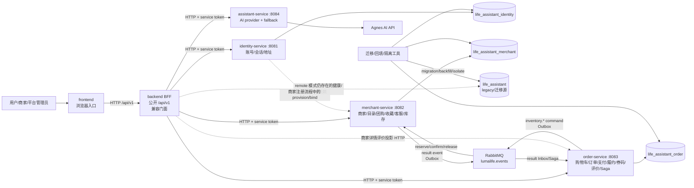

# LumaLife 微服务改造完整架构审计报告

审计日期：2026-09-01（Asia/Shanghai）
审计基线：当前工作树 `cfde357` 以及本机当前可见运行态
审计范围：`backend/`、`services/`、`database/`、`docker-compose*.yml`、`k8s/`、`.github/workflows/`、`scripts/`、`e2e/`、`ui-e2e/` 和相关设计/验收文档。
审计原则：以源码、SQL、配置和可复现实测为准；历史文档中的“已完成”不替代当前代码证据。本次不修改业务代码，仅新增本报告。

## 1. 执行摘要

### 1.1 总体结论

**评级：B（核心微服务拆分已经成立，但严格意义上尚未完成收口，不建议表述为“生产级微服务改造全部完成”）。**

当前仓库实际包含四个独立 Spring Boot 服务：

1. `identity-service`：账号、会话、资料、地址；
2. `merchant-service`：分类、商家、商品、团购、收藏、客服、库存预占；
3. `order-service`：购物车、订单、支付、履约、券码、评价、订单指标和库存 Saga；
4. `assistant-service`：AI Provider 边界和无状态降级。

其中前三个是有状态业务服务，第四个是独立的支撑能力。这个结果满足“至少三个业务微服务”的数量要求，而且服务代码之间没有发现直接跨服务 SQL、跨库 Join 或对方表写入；这是本次审计的主要正面结论。

但是，以下问题阻止了“已完成”结论：

- backend 的 `JdbcBusinessStateRepository` 和 `MysqlBusinessStateHealthIndicator` 在远程模式下仍然作为 legacy MySQL 运行依赖存在；backend 不是纯 BFF；
- 默认 profile 仍是 `monolith`，E2E runner 默认启动的也是单体模式，现有 7/7 E2E 不能证明微服务远程链路；
- `order-service` 的异步库存 Saga 对“确认失败”没有完成订单/支付补偿闭环，持久化补偿组件虽存在但没有被调用；
- canonical `k8s/services.yaml` 只有 readiness probe，没有 startup/liveness probe 和容器资源；另有一套 `k8s/services/*.yaml`，两套清单职责和内容不一致；
- 内部服务 token 在 Git 中以 `compose-internal-token` 明文复用，backend 的 `/internal/migration/status` 没有受内部认证保护；
- 当前 API 源码实际暴露 64 个内部业务映射，文档仍按 9/12/18/39 等旧口径描述，契约追溯已漂移；
- CI 有独立 Maven 构建、镜像矩阵和健康冒烟，但没有把“服务级数据库/消息链路的完整 UC01~UC09 远程回归”设为门禁。

### 1.2 P0/P1/P2 汇总

| 等级 | 本次结论 |
|---|---|
| P0 | **未发现**服务源码直接访问其他服务数据库或跨域 Join。数据归属静态门禁也通过；但该脚本不是数据库权限证明，仍需后续用账号权限和运行态 SQL 复核。 |
| P1 | 见第 8 节。主要包括 legacy 运行依赖、默认单体/测试模式、DB 名称 fallback、Saga 补偿不闭环、地址失败静默降级、公开迁移状态、明文共享 token、正式 K8s 清单不完整、微服务 E2E 缺失、CI 增量路径不覆盖共享契约/迁移等。 |
| P2 | 文档/工作流命名过期、服务内重复 token filter、详情聚合串行调用和 N+1、库存/收藏/客服过早拆分不划算、观测与性能验收不足等。 |

### 1.3 最终建议

下一阶段先完成以下五个门禁，再考虑进一步拆分库存、收藏或客服：

1. 把 legacy DB 彻底限定为迁移/回滚工具，remote backend 不再以业务状态健康指标依赖它；
2. 修复 Saga 的确认失败、释放失败、超时和过期处理，给 Outbox 增加 claim/lease、发布确认和可观测重试；
3. 统一生产 Kubernetes 清单，所有业务服务具备 startup/readiness/liveness、resources、Secret 和明确的 DB 初始化/迁移入口；
4. 增加以 `SPRING_PROFILES_ACTIVE=prod,remote`、三服务独立 DB、RabbitMQ、assistant-service 为被测对象的 UC01~UC09 黑盒回归；
5. 重新生成接口/数据归属矩阵，源代码、OpenAPI/契约、测试和文档只保留一套当前口径。

## 2. 实际架构图

以下图按当前源码的实际调用关系绘制，`life_assistant` 是 legacy 兼容/迁移源，不应成为远程生产业务事实源。



### 2.1 边界判断

- `identity-service`、`merchant-service`、`order-service` 的业务边界清晰，跨域 ID 在代码中作为 opaque reference 使用；
- `assistant-service` 无业务表，作为独立 provider 边界是合理的；它不应和商家客服事实混在一起，客服消息仍由 `merchant-service` 所有；
- backend 有清晰的 Port/Adapter 结构，并能在远程模式调用四个服务，但仍保留全量 `DemoStore`、legacy JDBC Repository 和领域模型。因此它是“渐进迁移 BFF + 兼容单体”，不是纯粹的无状态 API Gateway；
- 订单库存采用 Outbox/Inbox/Saga 方向正确，但当前代码对确认失败和发布可靠性的处理还不够严格；
- 公开评价事实在 order-service，backend 的商家详情 adapter 再读取 order-service 评价投影，这种所有权合理，但当前是同步串行聚合，存在延迟和可用性耦合。

## 3. 服务职责、接口和依赖

### 3.1 服务责任表

| 服务 | 当前职责 | 主要数据/事实 | 实际内部接口映射数 | 直接依赖 |
|---|---|---|---:|---|
| identity-service | 登录、注册、token introspection、账号列表、资料、商家绑定、地址 | `user_account`、`user_address`、`auth_session` | 13 | 自有 MySQL；内部 service token |
| merchant-service | 分类、商家列表/详情/profile、商品、团购、收藏、用户/商家客服、库存预占/确认/释放、Inbox/Outbox | `category`、`merchant`、`merchant_catalog`、`group_deal`、`merchant_favorite`、`chat_message`、库存和事件表 | 30 | 自有 MySQL；RabbitMQ；内部 service token |
| order-service | 订单创建/查询/详情/取消、购物车、支付、团购订单、履约、收货、券码、评价、商家订单、订单指标、库存结果消费 | `order_record`、`service_order_line`、购物车/支付/券码/评价/状态/Outbox/Inbox/Saga 表 | 19 + 1 个评价投影 | 自有 MySQL；RabbitMQ；兼容模式下 merchant HTTP；内部 service token |
| assistant-service | 平台/商家/会话 AI answer，Agnes 调用和 deterministic fallback | 无业务表 | 1 | Agnes API；内部 service token |
| backend | 对外 `/api/v1/**`、认证适配、角色校验、BFF 聚合、渐进切流、兼容单体 | remote 模式不应新增业务事实；仍保留 `DemoStore` 和 legacy JDBC 适配 | 52 个 controller mapping | identity/merchant/order/assistant HTTP；remote 下仍有 legacy MySQL health/compat bean |

### 3.2 源码接口计数

不计 `/actuator/**` 探针，本次按当前 Java 注解实际计数：

| Provider | 源码位置 | 当前映射数 | 说明 |
|---|---|---:|---|
| identity | `services/identity-service/.../IdentityApi.java` | 13 | 包括 admin accounts、token introspection、地址快照和商家绑定，不是旧文档的 9 |
| merchant | `services/merchant-service/.../MerchantApi.java` | 30 | 包括 profile、收藏、客服、库存和全部商品/团购写接口，不是旧文档的 12 |
| order | `services/order-service/.../OrderApi.java` | 19 | 包括 metrics、购物车、支付、履约、券码、评价和商家查询 |
| order 评价投影 | `services/order-service/.../MerchantReviewProjectionApi.java` | 1 | `/internal/v1/merchants/{merchantId}/reviews`，给 backend 商家详情聚合使用 |
| assistant | `services/assistant-service/.../AssistantApi.java` | 1 | `/internal/v1/assistant/answer` |
| 合计 | 当前服务源码 | **64** | 64 个内部业务 mapping；不包含 health/info |

旧文档中的 9/12/18/39、目标外部 52 等数字属于不同历史快照或目标契约，不能直接作为当前实现数量。`services/README.md`、`docs/28_D07服务接口数据归属与需求追溯.md` 和 `docs/27_D06第二阶段微服务实施与追溯计划_2026-08-31.md` 均需要重新标明快照口径或更新。

## 4. 各服务详细审计

### 4.1 identity-service

结论：**边界和数据库访问基本合格；商家注册一致性和 token 方案仍有风险。**

已确认的正确点：

- `IdentityApi` 所有业务接口统一在 `/internal/v1` 下；
- `IdentityStore` 的 JDBC SQL 只访问 `user_account`、`user_address`、`auth_session`；
- `merchantId` 仅作为身份侧关联字段保存，不读取 merchant 表；
- 生产 JDBC 和无 DB 的 JSON/内存测试路径在代码中明确分开；
- `InternalServiceTokenFilter` 对 `/internal/v1/**` 要求非空 token，并用常量时间比较；token 配错时拒绝请求，而不是放行；
- `auth_session` 存 token hash，不直接把 token 明文写入数据库。

主要风险：

- `RemoteIdentityServicePort.registerMerchant` 先注册 `MERCHANT_ADMIN` 账号，再调用 merchant provision，最后调用 identity bind；中间任一步失败都可能留下“有账号、无商家”或“已创建商家、账号未绑定”的孤儿状态。`IdentityStore` 注释称这是单独 Saga，但当前没有实际事件或补偿实现；
- `application-prod.yml` 的数据库名最终 fallback 为 `life_assistant`。如果部署漏注入 `MYSQL_DATABASE`，identity 可能错误连接 legacy 库；
- 物理 Kubernetes 清单将 `identity-data` PVC 挂到服务，但生产 JDBC 运行主路径并不需要它；这会混淆“JSON smoke/fallback 状态”和生产身份事实库；
- liveness/readiness controller 都调用 `health.health()` 总体健康，而不是明确的 liveness/readiness group。数据库或其他健康组件异常时，liveness 可能把进程杀掉，探针语义不严谨。

### 4.2 merchant-service

结论：**商家领域聚合较完整，库存已经从“仅接口”推进到服务侧事实和事件；当前不建议继续拆分为 inventory/favorite/chat 三个服务。**

已确认的正确点：

- `MerchantStore` 只访问 merchant-owned 表；分类和商家自身 Join 发生在同一 bounded context 内，不是跨服务 Join；
- 商品、团购、收藏和客服消息均由 merchant-service 写入；
- 库存预占使用 `SELECT ... FOR UPDATE`、幂等 key、版本字段和 reservation header/item；库存所有权没有下沉到 order-service；
- `MerchantInventoryInboxConsumer` 先记录 Inbox，再用独立事务执行命令，业务冲突生成失败结果，临时性错误抛出交给 Rabbit 重试；
- merchant Outbox 结果事件交给 order-service 的 Inbox 幂等消费。

库存与事件问题：

- `inventory_reservation` 有 `expires_at` 和过期索引，但没有发现定时过期扫描/释放 worker；如果订单、消息或补偿链路异常，RESERVED 可能长期占用库存；
- Outbox publisher 直接查询 `PENDING/FAILED` 再发送，没有 claim/lease 或行锁。在未来副本数大于 1 时，同一事件可能并发重复发送；Inbox 可以吸收重复，但会增加副作用和排障复杂度；
- `RabbitTemplate.convertAndSend` 后立即标记 PUBLISHED，没有看到 publisher confirm 配置。进程在 broker 接收确认前崩溃或网络状态不确定时，存在消息丢失窗口；
- release 遇到库存版本/数据不一致时进入 `CHECK_REQUIRED`，但没有后续人工/自动处理协议和告警门禁，业务上只能依赖人工排查。

关于是否拆分：

- **inventory：当前不建议拆。** 它与商品/团购库存同属 merchant 交易边界，需要和目录写入、版本控制、预占状态强一致；现在拆出只会增加 HTTP/Event/Saga 复杂度。只有在库存高并发、独立扩缩容、独立团队或明确 SLA 出现时才值得拆；
- **favorite：不建议拆。** 数据量小、规则简单、和用户侧商家发现紧密相邻，拆分收益很低；
- **chat：当前不建议拆。** 本项目客服消息是轻量事实，仍和商家归属、AI 上下文、权限校验强关联；真正需要实时推送、会话海量扩展或独立运营后再考虑。

### 4.3 order-service

结论：**领域覆盖最完整，订单表和多商品快照已落到服务库；支付/库存 Saga 方向正确，但一致性闭环还不足以给出“严格完成”。**

已确认的正确点：

- `OrderStore` 只访问 order-owned 表；用户、商家、商品 ID 是 opaque reference；
- `service_order_line` 保存多商品明细和价格/名称快照，订单详情不必依赖 merchant 在线；
- 支付金额从 order 当前事实校验，`clientRequestId` 有 user 级唯一约束和重复回放逻辑；
- broker 开启时，支付本地事务写 `service_payment`、订单 `PAID`、`order_inventory_saga=RESERVE_PENDING` 和 order Outbox，然后异步预占库存；
- merchant 侧库存写入、merchant Inbox/Outbox、order Inbox/Saga 的所有权方向正确；
- 评价事实放在 order-service 是合理的，因为评价依赖完成订单；merchant 详情通过 order 的只读投影读取，没有直接查 order 表。

关键一致性问题：

1. `OrderInventoryResultConsumer` 只有当失败事件的 `sourceEventType` 是 `inventory.reserve.requested` 时才执行 `failPaidOrder`。如果 `inventory.confirm.requested` 失败，代码仅把 Saga 标成 `FAILED`，订单仍可能保持 `PAID`、支付仍为 SUCCESS；确认失败后的订单处理、释放库存和用户侧结果没有闭环。
2. `OrderSagaEventStore.scheduleRelease` 提供了 `REQUIRES_NEW` 的持久化释放命令，但在当前源码中只有字段注入，没有调用点。它是“看起来有补偿”的死代码，不能计入有效补偿证据。
3. 同步兼容模式中，reserve 成功后本地写入/confirm 失败会直接调用 release；release 失败只被加入 suppressed exception，没有把一个可靠的 `RELEASE_PENDING` 补偿事件持久化下来。外部库存成功而本地事务失败时可能泄漏预占。
4. `setStatus` 用 `UPDATE ... WHERE status=?`，但不检查影响行数，随后仍写内存状态和订单事件；多副本或并发请求下可能出现事件已写、订单状态未更新。`verifyCoupon` 的 `UPDATE ... WHERE status='UNUSED'` 也没有检查影响行数，`synchronized` 只能保护单 JVM。
5. `createDeliveryOrders` 接收 backend 提供的价格、商品名称、merchantId 和多商品行，order-service 自己没有 quote/version 校验。当前 BFF 会先读取 merchant，但内部调用者只要拥有共享 service token 就能构造不可信价格；应引入 merchant quote 或由 order 在下单时重新校验。
6. backend `RemoteOrderServicePort.addressSnapshot` 把 identity 查询异常和找不到地址都静默转换为 `null`。这会使本应要求地址的订单在依赖故障时继续创建，违反 UC03 的“失败不产生部分订单”语义。

### 4.4 assistant-service

结论：**拆分合理，服务边界干净；当前验证只覆盖 provider/fallback 单服务，不足以证明 backend 远程链路。**

- 只有 `/internal/v1/assistant/answer` 一个业务入口，无业务数据库；
- Agnes key 缺失时在 assistant-service 内部降级，backend 不再承担默认 AI provider；
- `/internal/v1/**` 有独立 token filter；
- backend 的远程 adapter 设置 connect 2 秒、read 8 秒；
- 本机当前 Compose 运行态没有 assistant-service 容器，故现有后端 AI 远程配置没有被当前本机运行态实际验证。

### 4.5 backend：残留单体、fallback 和 BFF 责任

结论：**属于 B 类“显式兼容层”，不是纯 C 类假微服务；但 C 类问题的结构性残留仍然过多。**

#### A. 已迁出的事实

在 `prod,remote` 且 backfill 标志为 true 时，以下操作由远程服务承接：

- identity：登录、注册、用户查询、资料、地址；
- merchant：分类、商家、商品、团购、收藏、客服、商家 profile；
- order：购物车、下单、支付、取消、履约、收货、券码、评价、商家订单；
- assistant：平台/商家/会话 AI answer；
- metrics：backend 通过 `RemoteMetricsServicePort` 聚合 identity/merchant/order 三个只读投影。

这些路径不是伪调用，adapter 确实创建了 HTTP client、设置 header、处理响应和超时。

#### B. 仍保留的兼容层

- `DemoStore` 在 `monolith` profile 且 compatibility store 开启时加载，仍实现 Identity/Merchant/Order/Metrics 多个 Port；
- `JdbcBusinessStateRepository` 对 legacy `life_assistant` 全量业务表读写，用于 monolith 的持久化和迁移回滚；
- `LocalAssistantAnswerPort`、`AssistantFallbackService` 等本地 AI 兼容组件仍在 artifact 中；
- `MigrationController` 仍输出渐进迁移和回滚状态。

这些组件有明确条件开关，不能直接认定为“远程模式静默回退”。

#### C. 当前最需要收口的残留

- backend `application.yml` 默认 profile 是 `monolith`，`application-monolith.yml` 默认打开 compatibility store；因此不带显式 profile 的启动仍然是完整单体；
- 即使 `DemoStore` 因没有 `monolith` profile 不加载，`LUMALIFE_PERSISTENCE=mysql` 仍会创建 `JdbcBusinessStateRepository` 和 `MysqlBusinessStateHealthIndicator`；后者调用全量 legacy Repository 的 `load()`。因此 Kubernetes backend 仍依赖 legacy MySQL，且 health 仍会读取旧域数据；
- `k8s/backend.yaml` 注释直接写明“domain aggregate remains in-process”，这与“backend 仅做 BFF”的目标口径冲突；
- `GET /internal/migration/status` 在当前运行态返回 200，响应仍写着“remaining capabilities use the monolith until contracts are migrated”，这与当前源码已经迁出的全部能力不一致，也暴露了不应公开的切流信息。

建议将兼容层编译/部署成显式 `compatibility` profile 或独立 artifact，remote backend 默认 fail-closed；生产 BFF 不加载 legacy Repository/health indicator，不把 legacy DB 放在业务服务运行时依赖图中。

## 5. 数据库、迁移和所有权审计

### 5.1 数据库策略结论

仓库采用“legacy 单库 + 三个逻辑 service DB + 可选三物理 MySQL”的渐进策略：

- `life_assistant`：legacy 单体/迁移/回滚源；
- `life_assistant_identity`：identity；
- `life_assistant_merchant`：merchant；
- `life_assistant_order`：order。

`provision-service-databases.sh` 使用 `CREATE TABLE ... LIKE` 复制自有表结构，注释明确不会复制跨服务外键；`backfill-service-databases.sh` 负责迁移数据；`isolate-service-databases.sh` 首次把自有表导出到三台物理 MySQL。这个方向可以支持渐进迁移，但存在三个严格性问题：

1. service DB 没有独立的服务级 migration 目录/版本生命周期，仍由 legacy 的一套 V001~V016 通过部署脚本集中应用/复制；
2. `provision-service-databases.sh` 给同一个 `MYSQL_USER` 对三库都授予 `ALL PRIVILEGES`，代码层面虽不跨表，数据库权限层面仍不能阻止被攻破的服务读取其他库；
3. identity/merchant/order 的 `application-prod.yml` 在 DB 名字缺失时 fallback 到 `life_assistant`，把配置错误直接转化成 ownership 事故。

### 5.2 完整表归属表

符号：✅ = 当前运行代码访问符合目标；⚠️ = 兼容/迁移或配置风险；❌ = 违反目标。legacy 表在切流期间可以由迁移工具或显式 monolith 访问，但不应由新服务运行时读写。

| 表 | 物理/逻辑库 | 目标事实所有者 | 当前主要访问者 | 结论 |
|---|---|---|---|---|
| `schema_migration` | legacy + 三 service DB | 各库迁移工具 | `migrate.sh`、provision/deploy 脚本 | ✅ 技术表；生命周期仍集中 |
| `category` | legacy；merchant DB 副本 | merchant-service | MerchantStore、回填/隔离工具 | ✅ 服务运行时符合；legacy 为迁移源 |
| `merchant` | legacy；merchant DB 副本 | merchant-service | MerchantStore、回填/隔离工具 | ✅ 服务运行时符合 |
| `user_account` | legacy；identity DB 副本 | identity-service | IdentityStore；backend legacy Repository 兼容 | ⚠️ backend 仍保留全量 legacy 适配 |
| `user_address` | legacy；identity DB 副本 | identity-service | IdentityStore；backend legacy Repository 兼容 | ⚠️ 同上 |
| `auth_session` | legacy；identity DB 副本 | identity-service | IdentityStore；backend legacy Repository 兼容 | ⚠️ 同上 |
| `product` | legacy | merchant-service（历史兼容表） | backend `JdbcBusinessStateRepository`；迁移工具 | ⚠️ 新 merchant 运行时使用 `merchant_catalog`，旧表仍在 legacy |
| `group_deal` | legacy；merchant DB 副本 | merchant-service | MerchantStore；backend legacy Repository 兼容 | ⚠️ legacy 与 live 表同名，切流边界需继续明确 |
| `cart_item` | legacy | order-service（历史兼容表） | backend `JdbcBusinessStateRepository`；迁移工具 | ⚠️ 新 order 运行时使用 `service_cart_item` |
| `order_main` | legacy | order-service（历史兼容表） | backend `JdbcBusinessStateRepository`；迁移工具 | ⚠️ 新 order 运行时使用 `order_record` |
| `order_item` | legacy | order-service（历史兼容表） | backend `JdbcBusinessStateRepository`；迁移工具 | ⚠️ 新 order 运行时使用 `service_order_line` |
| `order_status_timeline` | legacy | order-service（历史兼容表） | backend `JdbcBusinessStateRepository`；迁移工具 | ⚠️ 新 order 运行时使用 `service_order_event` |
| `payment_record` | legacy | order-service（历史兼容表） | backend `JdbcBusinessStateRepository`；迁移工具 | ⚠️ 新 order 运行时使用 `service_payment` |
| `coupon` | legacy | order-service（历史兼容表） | backend `JdbcBusinessStateRepository`；迁移工具 | ⚠️ 新 order 运行时使用 `service_coupon` |
| `review` | legacy | order-service（历史兼容表） | backend `JdbcBusinessStateRepository`；迁移工具 | ⚠️ 新 order 运行时使用 `service_review` |
| `merchant_favorite` | legacy；merchant DB 副本 | merchant-service | MerchantStore；迁移工具 | ✅ 服务运行时符合 |
| `chat_message` | legacy；merchant DB 副本 | merchant-service | MerchantStore；迁移工具 | ✅ 服务运行时符合 |
| `operation_log` | legacy | 平台审计/兼容层，当前无独立 owner | backend legacy Repository | ⚠️ 没有被纳入新服务审计事件模型 |
| `business_state` | legacy | legacy compatibility only | `JdbcBusinessStateRepository`、健康指标、migration 工具 | ⚠️ 不应成为 remote 业务事实源 |
| `merchant_catalog` | legacy 副本；merchant DB | merchant-service | MerchantStore、库存 Saga | ✅ 唯一 live 写入方为 merchant |
| `order_record` | legacy 副本；order DB | order-service | OrderStore、订单结果 consumer | ✅ 唯一 live 写入方为 order |
| `service_cart_item` | legacy 副本；order DB | order-service | OrderStore | ✅ |
| `service_payment` | legacy 副本；order DB | order-service | OrderStore、库存失败补偿 consumer | ✅ |
| `service_coupon` | legacy 副本；order DB | order-service | OrderStore | ✅ |
| `service_review` | legacy 副本；order DB | order-service | OrderStore、评价投影 API | ✅ |
| `service_order_event` | legacy 副本；order DB | order-service | OrderStore、结果 consumer | ✅ |
| `service_order_line` | legacy 副本；order DB | order-service | OrderStore | ✅ |
| `service_outbox_event` | legacy 副本；order DB | order-service | OrderStore、OrderSagaEventStore、Rabbit/HTTP publisher | ✅ 但 publisher 可靠性不足 |
| `inventory_reservation` | legacy 副本；merchant DB | merchant-service | MerchantStore | ✅ |
| `inventory_reservation_item` | legacy 副本；merchant DB | merchant-service | MerchantStore | ✅ |
| `merchant_inbox_event` | legacy 副本；merchant DB | merchant-service | MerchantInventoryInboxConsumer | ✅ |
| `merchant_outbox_event` | legacy 副本；merchant DB | merchant-service | MerchantInventoryInboxConsumer、Rabbit publisher | ✅ 但 publisher 可靠性不足 |
| `order_inbox_event` | legacy 副本；order DB | order-service | OrderInventoryResultConsumer | ✅ |
| `order_inventory_saga` | legacy 副本；order DB | order-service | OrderStore、OrderInventoryResultConsumer | ✅ 状态闭环仍有 P1 |

### 5.3 跨服务直接查库检查

本次对 `services/*/src/main/java` 的 SQL 字符串和 Repository 入口做了逐表检查：

- identity 只访问身份表；
- merchant 只访问分类、商家、目录、团购、收藏、客服、库存和 merchant event 表；
- order 只访问订单、购物车、支付、券码、评价、order event/outbox/inbox/Saga 表；
- merchant 评价通过 `MerchantReviewProjectionApi` HTTP 提供给 backend，没有 merchant SQL 直接读取 order DB；
- order 库存通过 Rabbit command/result，broker 关闭时才调用兼容 HTTP `MerchantInventoryClient`；
- 未发现 `SELECT ... FROM user_account` 出现在 merchant/order 服务，也未发现 merchant 服务写 order 表。

因此，本项 **P0=0**。需要强调：`backend/JdbcBusinessStateRepository` 读取 legacy 全量表不等于“服务之间跨库直连”，但它仍然是 remote backend 的 legacy 运行依赖，应按 P1 收口。

## 6. 跨服务调用、超时、失败和补偿矩阵

| Consumer | Provider | 协议/接口 | 超时 | 当前失败策略 | 审计结论 |
|---|---|---|---|---|---|
| backend | identity | HTTP `/internal/v1/auth/*`、`users/*`、`tokens/*` | connect/read 2s | 多数异常转业务错误；`userByToken` 失败返回空并拒绝认证 | ✅ 有 timeout；注册商家两步操作无分布式补偿 |
| backend | merchant | HTTP `/internal/v1/categories`、商家/商品/团购/收藏/客服/profile | connect 2s/read 3s | RestClient 异常转 merchant unavailable；商家详情任一串行依赖失败可能整体失败 | ⚠️ 可用性和延迟耦合 |
| backend | order | HTTP `/internal/v1/orders/**`、metrics、评价投影 | connect 2s/read 3s | 映射 4xx/5xx；订单列表对 merchant 名称失败保留快照 | ✅ 基本有边界；地址查询异常被静默转 null |
| backend | assistant | HTTP `/internal/v1/assistant/answer` | connect 2s/read 8s | assistant provider 自身 fallback；remote adapter 空答案抛错 | ⚠️ backend 没有明确的服务不可用降级响应策略 |
| identity | merchant | 注册商家时 HTTP provision | connect/read 2s | provision/bind 任意失败返回错误 | ❌ 账号/商家没有补偿或待处理状态 |
| order | merchant | 兼容模式 HTTP reserve/confirm/release | connect 2s/read 3s | reserve/confirm 失败尝试 release；release 失败 suppressed | ❌ 只在 broker 关闭路径使用，补偿不持久化 |
| order | merchant | Rabbit `inventory.reserve.requested`、`confirm`、`release` | broker 异步 | order Outbox → merchant Inbox → merchant Outbox → order Inbox | ⚠️ 方向正确；确认失败未关闭订单；publisher 无 confirm/claim |
| backend | order | merchant detail 中 HTTP reviews projection | connect 2s/read 3s | review provider 失败可能导致商家详情失败 | ⚠️ 更适合事件投影/缓存或部分响应 |
| order | 可选 HTTP sink | `OrderOutboxPublisher` | 未看到显式 request factory timeout | 标记 FAILED，下一轮重试 | ⚠️ 可选 sink 连接超时不明确 |

### 6.1 订单支付与库存 Saga 当前序列

```text
用户支付
  -> order 本地事务：service_payment=SUCCESS、order=PAID、Saga=RESERVE_PENDING、Outbox reserve
  -> Rabbit
  -> merchant Inbox 幂等消费
  -> merchant 锁定库存并写 reservation=RESERVED
  -> merchant Outbox result.reserved
  -> order Inbox 幂等消费
  -> order 写 confirm Outbox、Saga=CONFIRM_PENDING
  -> Rabbit
  -> merchant confirm reservation=CONFIRMED
  -> merchant result.confirmed
  -> order Saga=CONFIRMED
```

异常路径中，reserve 失败会取消订单、将支付标记 FAILED、券码 EXPIRED；但 confirm 失败不触发同等的订单补偿。建议把 Saga 状态机改成显式可恢复状态：`RESERVE_FAILED`、`CONFIRM_FAILED`、`RELEASE_PENDING`、`MANUAL_REVIEW`，每个终态都必须有用户可见结果、支付状态、库存状态和告警。

## 7. 独立构建、测试、镜像、部署和探针

### 7.1 本次实测结果

| 验证项 | 命令/证据 | 结果 | 解释 |
|---|---|---|---|
| backend 构建和测试 | `mvn -B -ntp -f backend/pom.xml verify` | ✅ PASS，89 tests，0 failure/error | 主要包含 backend 单体/兼容路径和 adapter/安全测试 |
| 四服务聚合构建和测试 | `mvn -B -ntp -f services/pom.xml verify` | ✅ PASS，identity 10、merchant 8、order 14、assistant 2，共 34 tests | 服务可独立编译、打包和启动随机端口健康测试 |
| 前端构建 | `npm run build` | ✅ PASS，2396 modules | 有主 JS chunk 大于 500 kB 的既有 warning，属于 P2 性能事项 |
| 数据归属门禁 | `bash scripts/test-service-data-ownership.sh` | ✅ PASS | 证明静态规则通过，不等于 DB 账号权限隔离证明 |
| K8s 部署脚本静态门禁 | `bash scripts/test-deploy-k8s.sh` | ✅ PASS | 检查镜像预取/超时等脚本安全规则 |
| legacy migration 门禁 | `bash scripts/test-legacy-migrations.sh` | ✅ PASS | 覆盖完整/部分 legacy Schema 识别和迁移采用逻辑 |
| Compose 配置解析 | `docker compose config` | ✅ PASS | 语法和变量展开可解析 |
| Kustomize 渲染 | `kubectl kustomize k8s` | ✅ PASS | 仅证明 YAML 可渲染，不证明 Pod 能运行 |
| E2E runner | `E2E_REPORT_DIR=/tmp/lumalife-e2e-report npm test --prefix e2e` | ✅ 7/7 | runner 第 623 行启动 `mvn spring-boot:run`，未指定 remote profile，实际是默认单体模式 |
| Git 空白检查 | `git diff --check` | ✅ PASS | 本次报告前工作树无业务代码修改 |

### 7.2 本机运行态观察

本机 Docker daemon 可用，但当前已有的 Compose 项目并非源码声明的完整新栈：

- `docker compose config --services` 声明了 `assistant-service`、`rabbitmq`、三个服务、backend、frontend、mysql；
- `docker compose ps -a` 当前只有 backend、frontend、identity、merchant、order、mysql 六个运行容器，assistant 和 RabbitMQ 不在运行；
- 本机 8080~8083 `/actuator/health` 返回 200，8084 无法连接；
- 运行态直接访问 `/internal/v1/**` 无 token 返回 401，说明四个服务的 token 过滤器在已运行服务上工作；
- 运行态访问 backend `/internal/migration/status` 返回 200，证明该运维端点当前确实未被内部 token 保护；
- 本次没有在当前用户已有数据库上执行完整远程 E2E，因为该 runner 会创建账号、购物车、订单和客服消息，且当前栈缺少 assistant/RabbitMQ；没有把这套运行态误报为干净验收环境。

### 7.3 Dockerfile 和镜像

- backend 有独立 Dockerfile，Java 17 runtime；
- 四个 service Dockerfile 使用 services reactor 的 `-pl ... -am` 独立构建；
- frontend 有独立 Node build 和 nginx runtime；
- `ci.yml` 的 `images` matrix 覆盖 backend/frontend/四服务，main 分支构建 amd64/arm64 并使用 SHA tag；
- `services-cd.yml` 可对受影响服务做增量镜像构建，但仅 build 不 publish，由主 CI 发布 canonical SHA tag；
- 本次未执行六个 Docker image 的全量本地 rebuild，也未在本地 Kind 创建集群；因此镜像构建和真实 rollout 结论引用 Dockerfile/CI 结构，不冒充本地实测通过。

### 7.4 探针和 K8s 清单问题

服务源码都声明了 `/actuator/health`、`/actuator/health/liveness`、`/actuator/health/readiness`、`/actuator/info`，但四个 `ProbeController` 的 liveness/readiness 都调用总体 `health.health()`，没有读取相应 group。

更严重的是存在两套服务清单：

- `k8s/services.yaml` 被根 `k8s/kustomization.yaml` 使用，是 deploy script 的 canonical production-like 清单；它对四个业务服务只有 readiness，缺少 startup/liveness/resources；
- `k8s/services/*.yaml` 是 `smoke-services-k8s.sh` 使用的独立 Kind fixture，具有 2 replicas、startup/readiness/liveness 和 resources，但没有接入根 kustomization，且标签、DB/Broker 配置与 `k8s/services.yaml` 不一致。

这会导致“增量 smoke 的清单合格”与“正式 deploy 的清单缺少生产保护”同时成立，必须统一来源。

## 8. P0/P1/P2 问题清单

### 8.1 P0

**P0：0 项。**

没有发现 `identity-service`、`merchant-service`、`order-service` 直接读取其他 service DB 或写入其他服务表；没有发现跨服务 SQL Join。若后续通过数据库审计发现运行账号可以跨库读写，必须把以下权限问题升级为 P0 数据隔离事故。

### 8.2 P1

| ID | 问题和证据 | 影响 | 建议 |
|---|---|---|---|
| P1-01 | remote backend 仍加载 `JdbcBusinessStateRepository`/`MysqlBusinessStateHealthIndicator`：`backend/src/main/java/com/lumalife/service/MysqlBusinessStateHealthIndicator.java:9-24`；`k8s/backend.yaml:59-82` | BFF 仍依赖 legacy DB，legacy 不是纯迁移源 | remote profile 删除 legacy Repository/health bean；兼容层独立 profile/artifact |
| P1-02 | 默认 profile 为 monolith：`backend/src/main/resources/application.yml:6-9`；`application-monolith.yml:1-5`；E2E runner `e2e/runner.mjs:619-625` | 默认启动和现有 E2E 不能证明微服务 | 普通启动 fail-closed；单体只允许显式 `compatibility`；新增 remote E2E 启动参数 |
| P1-03 | identity/merchant/order production DB URL fallback `life_assistant`：各 `application-prod.yml:3-5` | 漏配 DB 名称会把服务接入 legacy，直接破坏所有权 | 服务专用 `MYSQL_*_DATABASE` 必填，去除 legacy fallback；启动时校验库名 |
| P1-04 | `/internal/migration/status` 未保护：`MigrationController.java:11-27`；`SecurityConfig.java:32-41` 的 `anyRequest().permitAll()`；本机 GET 返回 200 | 暴露切流状态、回滚提示和兼容信息 | 放入内部 token filter/management network；最少需要内部 token，最好仅管理员/运维网可见 |
| P1-05 | K8s/Compose 使用 Git 可见的共享 token `compose-internal-token`：`k8s/backend.yaml:82-83`、`k8s/services.yaml:28-29` 等 | 任一 token 泄漏即可调用所有服务并伪造 `X-User-Id`/`X-Merchant-Id` | 使用 Secret 引用、按服务分 token 或 mTLS；删除默认生产 token |
| P1-06 | canonical `k8s/services.yaml` 四服务仅 readiness，无 startup/liveness/resources；fixture 与 canonical 分裂 | 启动慢、死锁、OOM、broker/DB 故障时无法正确摘流/重启 | 统一一套 Kustomize 资源；补齐三类 probe、resources、securityContext、版本标签 |
| P1-07 | Saga confirm 失败只把 Saga 标 FAILED，不取消 PAID 订单：`OrderInventoryResultConsumer.java:42-55` | 出现“已支付但库存未确认”的不可解释状态 | 为 confirm/release failure 增加可恢复状态、释放补偿、支付/订单终态和告警 |
| P1-08 | `OrderSagaEventStore.scheduleRelease` 没有调用点；同步 release 失败只 suppressed：`OrderSagaEventStore.java:29-48`、`OrderStore.java:421-428` | 外部库存成功、本地事务失败时可能泄漏预占 | 在所有失败分支调用 REQUIRES_NEW compensation；补偿本身必须可重试和可观测 |
| P1-09 | `expires_at` 只有表字段/索引，没有发现过期 worker；Outbox 无 claim/lease/publisher confirm：`V012...sql:6-17`、`Rabbit*OutboxPublisher.java:33-57` | 预占泄漏、重复投递或消息丢失窗口 | 加 expiry scheduler、DLQ/manual review、publisher confirm、重试次数/backoff、并发 claim |
| P1-10 | `RemoteOrderServicePort.addressSnapshot` 把 identity 异常转为 null：`RemoteOrderServicePort.java:171-185` | 地址服务短暂故障时仍可能创建无地址订单 | 地址是 UC03 前置条件时必须 fail closed；或显式记录 PENDING_ADDRESS，不得静默成功 |
| P1-11 | merchant 注册是 account→provision→bind 两步/三步，没有 Saga：`RemoteIdentityServicePort.java:94-110` | 账号和商家资料可能半成功 | 增加 registration workflow/outbox、补偿删除或 PENDING_MERCHANT 状态及重试任务 |
| P1-12 | `setStatus`/coupon update 不检查 DB affected rows：`OrderStore.java:616-621`、`551-566` | 多副本并发下状态和事件可能不一致 | 使用乐观锁 version 条件并检查 rowcount；唯一约束和 transaction test 覆盖并发 |
| P1-13 | 当前 E2E 只有 CR01~CR06 + UC08，默认单体；没有 UC09；CI 的 Compose contract 与 remote/消息环境未形成全量用例门禁 | 三服务真实链路、独立 DB、Rabbit 和指标聚合未经持续证明 | 新增 clean Compose/K8s remote E2E，至少覆盖 UC01~UC09、重启、服务下线、重复支付和库存补偿 |
| P1-14 | `services-cd.yml` path filter 未覆盖 `services/data-ownership.yml`、`database/migrations/**`、`k8s/services.yaml`、`k8s/service-databases.yaml` 等共享路径 | 共享契约/Schema/正式部署变更可能不触发增量验证 | 对共享文件触发全部服务构建和完整 stack/K8s smoke |
| P1-15 | 同一 `MYSQL_USER` 被授予三 service DB `ALL PRIVILEGES`：`provision-service-databases.sh:61-68` | 数据库层无法阻止服务越权读写 | identity/merchant/order 使用独立账号和最小权限；migration 使用单独 admin 账号 |
| P1-16 | 源码接口 64 个，文档仍 9/12/18/39；`MigrationController` note 也过期 | 验收、前端联调和审计追溯会引用错误接口 | 从 Spring mapping/OpenAPI 自动生成当前清单；保留 target 与 implemented 两列并标快照 |

### 8.3 P2

| ID | 问题 | 建议 |
|---|---|---|
| P2-01 | `RemoteMerchantServicePort.merchantDetail` 串行调用 merchant、products、deals、order reviews；订单列表还有按需 merchant N+1 | 用并行 HTTP、超时预算、部分响应或 merchant-side review read model/cache |
| P2-02 | order-service 同时保留 `InternalServiceTokenFilter` 和 `InternalTokenFilter` | 合并为一个明确的 filter，避免规则差异和维护漂移 |
| P2-03 | `ci.yml` 名称仍为 `Monolith CI`，Kubernetes/文档标题也有历史“skeleton”口径 | 重命名工作流和文档，避免审查时误解当前交付阶段 |
| P2-04 | 指标为 backend BFF 同步聚合，不是独立 metrics service；一个服务失败可能导致整个看板不可用 | 引入带时间戳的数据投影、缓存、部分健康状态和指标新鲜度字段 |
| P2-05 | service 独立测试主要使用内存/随机端口或 mock，真实 JDBC 重启、Rabbit 重复/乱序、跨副本并发证据有限 | 增加 Testcontainers/Compose profile 的 DB/MQ 集成测试和故障注入 |
| P2-06 | 前端 build 有 623 kB gzip 前主 chunk 之上的 minified chunk warning | 以路由/页面为边界 code split，作为性能而非架构 blocker 处理 |

## 9. UC01~UC09 用例回归矩阵

状态口径：`已具备` 表示源码路径和至少单服务/兼容测试存在；`远程证据不足` 表示没有在真实 `prod,remote + 独立 DB + Rabbit` 链路中持续验证；`未完成` 表示当前没有满足用例闭环的实现或证据。

| 用例 | 目标 | 当前服务事实源/调用链 | 当前测试证据 | 本次审计判定 |
|---|---|---|---|---|
| UC01 | 注册、登录、资料、地址 | backend → identity；identity DB | backend 单体 API/安全测试、identity 10 tests、E2E CR-01（单体） | 已具备；远程证据不足，merchant 注册补偿未完成 |
| UC02 | 分类、搜索、详情、收藏 | backend → merchant；详情评价再 → order projection | merchant 8 tests、backend API、E2E CR-02（单体） | 已具备；远程聚合未持续验证 |
| UC03 | 购物车、拆单、支付、取消、库存 | backend → order；order → Rabbit → merchant；order DB + merchant DB | order 14 tests、`test-order-service-mysql-contract.sh` 存在、E2E CR-03（单体） | 主流程具备；Saga confirm/compensation 为 P1 |
| UC04 | 履约、收货、评价 | backend → order；order owns status/review | order tests、backend API、E2E CR-05/CR-06（单体） | 已具备；并发状态更新和远程证据不足 |
| UC05 | 团购购买、支付、券码 | backend → merchant deal + order group-buy/pay；库存事件 | order/merchant tests、E2E CR-04（单体） | 已具备；broker 失败闭环不足 |
| UC06 | 商家核销券码、拒绝重复/跨店 | backend → order coupon verify | backend API/OrderService tests、E2E CR-04（单体） | 已具备；DB rowcount/多副本并发需补 |
| UC07 | 商家 profile、商品/团购发布下架 | backend → merchant | merchant tests、页面证据文件、E2E CR-06（单体） | 已具备；production remote 页面链路不足 |
| UC08 | 用户/商家客服 + AI | backend → merchant chat；backend → assistant answer；merchant owns messages | assistant 2 tests、merchant tests、E2E UC08（单体） | 已具备；本机 assistant/Rabbit 未运行，远程链路不足 |
| UC09 | 管理指标、健康和异常状态 | backend → identity/merchant/order metrics；Actuator | `RemoteMetricsServicePortTest` 仅覆盖归一化；代码有 metrics；runner 无 UC09 | **未完成严格验收**；缺少真实三服务聚合、故障和指标新鲜度 E2E |

### 9.1 UC 验收缺口重点

- 现有 `e2e/runner.mjs` 实际执行 7 项：CR-01~CR-06 和 UC08；没有 UC09，也没有单独可识别的 UC07/UC06 remote matrix；
- runner 第 619~625 行启动 Maven，而非 Compose/K8s service endpoints；由于 backend 默认 profile 是 monolith，它的 7/7 只证明单体黑盒闭环；
- `ui-e2e` 的 CI 明确以 `--spring.profiles.active=monolith` 启动 backend（`.github/workflows/ci.yml:427-431`），因此 UI 通过不能替代微服务 UI/网关回归；
- `scripts/test-order-service-mysql-contract.sh` 是非常有价值的窄集成测试，能证明 order MySQL/payment/Rabbit 方向，但它还不是全部 UC03~UC06 的跨服务黑盒验收；
- UC09 需要至少记录：三服务健康状态、backend 聚合时间、order/merchant/identity 数据时间戳或 revision、任一 provider 不可用时的可见结果，以及恢复后数据是否一致。

## 10. CI/CD 和 Kubernetes 评估

### 10.1 做得较好的部分

- `ci.yml` 有 backend test、四服务 matrix、数据归属门禁、数据库 Schema、Compose stack、API E2E、failure injection、UI E2E、Kustomize、镜像矩阵和 Kind rollout；
- 镜像使用 SHA tag，main 分支构建 amd64/arm64，具备一定可追溯性；
- `deploy-k8s.sh` 会创建 namespace/Secret/ConfigMap，等待 MySQL、服务和消息组件 rollout，并执行集群内健康检查；
- migration script 对现有 legacy schema 做 checksum/完整性判断，拒绝明显部分初始化，避免盲目重复执行；
- service-level Kind smoke 可以单独验证服务镜像和健康接口。

### 10.2 需要修正的部分

- 完整 CI 的 service-skeleton job 证明“模块可构建”，不证明三库/消息/远程网关业务可用；
- `services-cd.yml` 的增量触发规则没有将共享 migration、ownership contract、正式 K8s 清单作为全服务依赖；
- Kind smoke 使用 `k8s/services/*.yaml`，而正式 deploy 使用 `k8s/services.yaml`，所以 smoke 与 production-like manifest 不是同一资源；
- K8s 三个 service DB StatefulSet 自身没有 migration/seed init container，必须依赖 `deploy-k8s.sh` 对 legacy MySQL `exec` 执行 provision/backfill/isolate。手工只 `kubectl apply -k k8s` 时，服务 DB 初始化并不自洽；
- backend K8s 仍连 legacy MySQL，并使用 `Recreate`/单副本保护旧的单体 aggregate；这说明部署形态仍被兼容状态约束，不是纯 BFF 的可水平扩展形态；
- K8s 清单里 RabbitMQ 用户密码也以固定值出现，和 service token 一样需要 Secret化；
- 目前只有 backend HPA，三个有状态业务服务没有明确资源/扩缩容策略；在有本地内存 Map fallback 的情况下，扩容还会造成数据分裂，必须先禁止生产 fallback。

## 11. 文档与实现一致性

当前文档层存在“目标架构、旧历史快照、当前实现”混写：

- `services/README.md` 仍写 identity 9、merchant 12、order 18；
- `docs/28_D07服务接口数据归属与需求追溯.md` 仍以 39 个接口和旧的“库存/事件未完成”口径为主，但当前源码已经有 merchant reservation、Inbox/Outbox 和 order Saga；
- `docs/27_D06第二阶段微服务实施与追溯计划_2026-08-31.md` 同时写“不要把远程适配器当成全量完成”，又引用旧 9/12/18/39 统计，需要重新生成当前事实索引；
- `docs/00_项目总览.md`、`docs/03_概要设计说明.md`、`docs/04_详细设计说明.md`、`docs/06_数据库设计.md` 仍描述 DemoStore 是当前核心实现，这对历史阶段可以接受，但必须显式标注“历史设计/不代表当前服务实现”；
- `docs/18_ISSUE-34_E2E执行记录_2026-08-27.md` 和当前 runner 的 7 项范围也需要区分“单体兼容 E2E”和“远程微服务 E2E”；
- 当前源码 `MigrationController` 的 `note` 比文档更危险，因为它由运行端点直接返回，不能只靠更新 Markdown 修复。

建议建立一个生成式事实索引：从 Java mapping、`data-ownership.yml`、配置和测试标签自动生成接口/所有权矩阵；历史文档只保留快照时间和“不适用于当前基线”的声明。

## 12. 评分和上线/验收建议

| 维度 | 分数 | 评价 |
|---|---:|---|
| 微服务边界与拆分 | 7.5/10 | 三个业务服务 + assistant 已真实独立进程，边界总体合理；backend 兼容残留较重 |
| 数据所有权与数据库隔离 | 7.0/10 | 服务源码无跨服务 SQL，独立库路径存在；但 DB 用户权限过宽、legacy fallback 和集中迁移仍有风险 |
| 服务间通信与一致性 | 6.0/10 | HTTP timeout、Rabbit、Outbox/Inbox/Saga 骨架真实存在；Saga 终态和发布可靠性未收口 |
| 构建、镜像和 CI | 7.0/10 | 独立 Maven、镜像矩阵、Kustomize 和 Kind 流程较完整；增量路径漏掉共享变更 |
| Kubernetes/运维 | 5.5/10 | deploy script 较强，但 canonical service manifest 缺 probe/resources，清单分叉且 Secret 不完整 |
| 安全 | 5.5/10 | 服务内部 token filter 有效；共享明文 token、backend migration endpoint、header 身份信任模型是主要问题 |
| 用例回归与证据 | 5.0/10 | 单体 E2E 和单服务测试较好；真实 remote + 三库 + Rabbit 的 UC01~UC09 证据不足 |
| 文档/契约一致性 | 4.5/10 | 实现已明显超出旧文档，数量、缺口和迁移状态不一致 |
| **综合** | **6.0/10** | **B：可以作为课程项目演示和渐进迁移基线，暂不能作为严格完成的生产级微服务架构结论** |

## 13. 优先级整改路线

### 第一批：必须先修（影响验收结论）

1. 修 P1-01~P1-05：remote backend 移除 legacy runtime 依赖；默认 profile fail-closed；DB 名称必填；migration endpoint 鉴权；所有 token/Rabbit 凭据 Secret 化；
2. 修 P1-07~P1-09：补齐 confirm failure、release failure、expiry、Outbox claim/confirm/retry/DLQ；删除或真正接入 `OrderSagaEventStore`；
3. 修 P1-06：合并 `k8s/services.yaml` 与 `k8s/services/*.yaml` 的职责，正式清单补齐 probe/resources/securityContext，service DB 初始化流程要能从清单或明确 runbook 独立复现；
4. 修 P1-13：新增 remote Compose E2E，清理环境后启动 assistant/Rabbit/三服务独立 DB，至少覆盖 UC01~UC09 代表路径和一次服务故障恢复；
5. 修 P1-16：更新接口数、每个 provider/consumer、鉴权头、数据表和测试编号，删除或隔离旧口径。

### 第二批：稳定性和安全收口

1. 给 order 状态转换、券码核销、评价增加乐观锁/唯一约束/rowcount 检查和多副本并发测试；
2. 将 merchant registration 改为可恢复 workflow；地址快照失败 fail closed；商品价格使用 quote/version；
3. 使用 service-specific DB accounts；migration/backfill 使用独立高权限账号，运行服务最小权限；
4. 为 remote metrics、merchant detail、order list 增加并行调用、预算、缓存/部分响应和指标新鲜度；
5. 将服务版本、migration version、outbox backlog、Saga FAILED/CHECK_REQUIRED、Rabbit DLQ 纳入 Actuator/管理员看板。

### 第三批：非阻塞优化

1. 仅在真实规模或团队边界出现后评估独立 inventory service；favorite/chat 暂不拆；
2. 合并 order 重复 token filter，重命名旧 CI workflow；
3. 前端按页面做 code splitting；
4. 建立契约测试生成和历史文档归档规范。

## 14. 审计证据索引

核心源码：

- [`services/data-ownership.yml`](../services/data-ownership.yml)
- [`services/identity-service/src/main/java/com/lumalife/identity/IdentityApi.java`](../services/identity-service/src/main/java/com/lumalife/identity/IdentityApi.java)
- [`services/identity-service/src/main/java/com/lumalife/identity/IdentityStore.java`](../services/identity-service/src/main/java/com/lumalife/identity/IdentityStore.java)
- [`services/merchant-service/src/main/java/com/lumalife/merchant/MerchantApi.java`](../services/merchant-service/src/main/java/com/lumalife/merchant/MerchantApi.java)
- [`services/merchant-service/src/main/java/com/lumalife/merchant/MerchantStore.java`](../services/merchant-service/src/main/java/com/lumalife/merchant/MerchantStore.java)
- [`services/order-service/src/main/java/com/lumalife/order/OrderApi.java`](../services/order-service/src/main/java/com/lumalife/order/OrderApi.java)
- [`services/order-service/src/main/java/com/lumalife/order/OrderStore.java`](../services/order-service/src/main/java/com/lumalife/order/OrderStore.java)
- [`services/order-service/src/main/java/com/lumalife/order/OrderInventoryResultConsumer.java`](../services/order-service/src/main/java/com/lumalife/order/OrderInventoryResultConsumer.java)
- [`backend/src/main/java/com/lumalife/service/RemoteIdentityServicePort.java`](../backend/src/main/java/com/lumalife/service/RemoteIdentityServicePort.java)
- [`backend/src/main/java/com/lumalife/service/RemoteMerchantServicePort.java`](../backend/src/main/java/com/lumalife/service/RemoteMerchantServicePort.java)
- [`backend/src/main/java/com/lumalife/service/RemoteOrderServicePort.java`](../backend/src/main/java/com/lumalife/service/RemoteOrderServicePort.java)
- [`backend/src/main/java/com/lumalife/service/RemoteMetricsServicePort.java`](../backend/src/main/java/com/lumalife/service/RemoteMetricsServicePort.java)
- [`backend/src/main/java/com/lumalife/service/JdbcBusinessStateRepository.java`](../backend/src/main/java/com/lumalife/service/JdbcBusinessStateRepository.java)
- [`backend/src/main/java/com/lumalife/security/SecurityConfig.java`](../backend/src/main/java/com/lumalife/security/SecurityConfig.java)

数据库和部署：

- [`database/migrations/V001__baseline_schema.sql`](../database/migrations/V001__baseline_schema.sql)
- [`database/migrations/V012__inventory_reservation_saga.sql`](../database/migrations/V012__inventory_reservation_saga.sql)
- [`database/migrations/V015__inventory_saga_result_delivery.sql`](../database/migrations/V015__inventory_saga_result_delivery.sql)
- [`database/bin/provision-service-databases.sh`](../database/bin/provision-service-databases.sh)
- [`database/bin/backfill-service-databases.sh`](../database/bin/backfill-service-databases.sh)
- [`docker-compose.yml`](../docker-compose.yml)
- [`k8s/kustomization.yaml`](../k8s/kustomization.yaml)
- [`k8s/backend.yaml`](../k8s/backend.yaml)
- [`k8s/services.yaml`](../k8s/services.yaml)
- [`k8s/service-databases.yaml`](../k8s/service-databases.yaml)
- [`scripts/deploy-k8s.sh`](../scripts/deploy-k8s.sh)

验证和追溯：

- [`e2e/runner.mjs`](../e2e/runner.mjs)
- [`scripts/test-service-data-ownership.sh`](../scripts/test-service-data-ownership.sh)
- [`scripts/test-order-service-mysql-contract.sh`](../scripts/test-order-service-mysql-contract.sh)
- [`.github/workflows/ci.yml`](../.github/workflows/ci.yml)
- [`.github/workflows/services-cd.yml`](../.github/workflows/services-cd.yml)
- [`docs/16_业务场景用例清单.md`](./16_业务场景用例清单.md)
- [`docs/28_D07服务接口数据归属与需求追溯.md`](./28_D07服务接口数据归属与需求追溯.md)

报告生成时没有修改上述业务文件；本次工作树变化仅为新增本报告。
