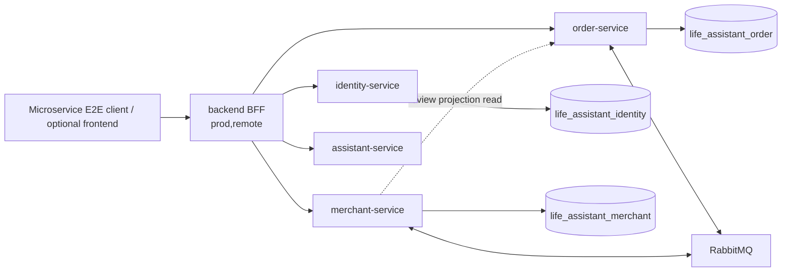

# LumaLife Microservice E2E Report

## 结论

**READY FOR CLOUD-NATIVE EXPERIMENTS**

本轮已在干净的独立 Docker Compose 环境中，以真实 `backend → remote microservices → service-owned databases / RabbitMQ` 链路完成 UC01–UC09。九个用例全部通过，基础设施和服务健康检查通过，原有 Monolith E2E 入口仍然保留。

本报告对应的实际运行证据：

- Run ID：`20260902T101500Z-review-fixes`
- Git HEAD：`c8e45db5a7d33064966a2b3488fd0b66b404255c`
- 开始时间：`2026-09-02T02:11:42.280Z`
- 结束时间：`2026-09-02T02:12:22.692Z`
- 证据目录：`04_tests/e2e/microservices/latest/`
- 机器结果：`microservice-e2e-summary.json`
- 可读摘要：`microservice-e2e-summary.md`
- 原始请求记录：`microservice-e2e-raw.log`

## 1. E2E 架构

`life_assistant` 仅在迁移、seed/backfill 和兼容/回滚路径中保留；本轮 E2E 的业务事实分别落在三个 service-owned database 中，backend 以 `prod,remote` 运行且关闭 compatibility store。

## 2. 测试环境

| 项目 | 实际值 |
| --- | --- |
| Compose project | `lumalife-microservice-e2e` |
| Compose 来源 | canonical `docker-compose.yml` + 最小覆盖 `docker-compose.e2e.yml` |
| backend profile | `prod,remote` |
| remote flags | identity / merchant / order / assistant 全部 `true` |
| compatibility store | `false` |
| 服务 profile | identity / merchant / order / assistant 均为 `prod` |
| backend | `127.0.0.1:18080` |
| identity-service | `127.0.0.1:18081` |
| merchant-service | `127.0.0.1:18082` |
| order-service | `127.0.0.1:18083` |
| assistant-service | `127.0.0.1:18084` |
| MySQL | `127.0.0.1:13306` |
| frontend | `127.0.0.1:15173` |
| RabbitMQ | Compose health check `healthy` |
| service databases | `life_assistant_identity`, `life_assistant_merchant`, `life_assistant_order` |

启动器 `scripts/run-microservice-e2e.sh` 会清理并创建独立 project、独立 volume 和独立端口，按 MySQL/RabbitMQ → migration → seed/backfill → services → backend/frontend → runner 的顺序执行，并轮询真实 Compose health 状态；失败时保存服务日志和 health 响应。

## 3. 启动自检结果

| 检查项 | 结果 | 证据 |
| --- | --- | --- |
| backend `/actuator/health` | PASS，HTTP 200 | summary JSON `health.services.backend` |
| identity-service health | PASS，HTTP 200 | summary JSON `health.services.identity` |
| merchant-service health | PASS，HTTP 200 | summary JSON `health.services.merchant` |
| order-service health | PASS，HTTP 200 | summary JSON `health.services.order` |
| assistant-service health | PASS，HTTP 200 | summary JSON `health.services.assistant` |
| remote migration route | PASS | identity / merchant / order 均为 `remote-service` |
| MySQL | PASS，Compose `healthy` | `docker-compose-ps.txt` |
| RabbitMQ | PASS，Compose `healthy` | `docker-compose-ps.txt` |
| backend compatibility store | PASS，关闭 | summary JSON `environment.compatibilityStore=false` |

## 4. UC01–UC09 测试矩阵

| UC | 涉及服务 | 正常路径 | 异常/边界路径 | 结果 |
| --- | --- | --- | --- | --- |
| UC01 | backend、identity-service、identity DB | 注册、登录、`auth/me`、资料、地址、默认地址 | 错误密码、重复注册、商家访问用户地址 | PASS |
| UC02 | backend、merchant-service、merchant DB、order-service review read | 分类、搜索、详情、商品/团购、收藏和取消收藏 | 重复收藏、无效资源、商家越权收藏 | PASS |
| UC03 | backend、order-service、merchant-service、order/merchant DB、RabbitMQ | 购物车、配送订单、支付、库存 reserve/confirm、最终状态轮询 | 同一 `clientRequestId` 重复支付、已支付取消、待支付取消 | PASS |
| UC04 | backend、merchant-service、order-service、order DB | 商家接单/配送/完成、用户收货、评价、商家查询评价 | 其他商家处理订单、重复评价 | PASS |
| UC05 | backend、order-service、merchant-service、RabbitMQ、order/merchant DB | 团购订单、支付、券码生成、Saga 最终确认 | 支付幂等重放、券码初始状态校验 | PASS |
| UC06 | backend、merchant-service、order-service、order DB | 自有券码核销 | 重复核销、无效券码、其他商家核销 | PASS |
| UC07 | backend、merchant-service、merchant DB | 商家资料、商品创建、上架/下架、删除 | 其他商家维护商品 | PASS |
| UC08 | backend、merchant-service、assistant-service、merchant DB | 用户发消息、商家保存、assistant 远程确定性回复、人工回复、用户读取 | 普通用户读取商家会话、其他商家读取他店会话 | PASS |
| UC09 | backend、identity-service、merchant-service、order-service、三服务 DB | 管理员指标聚合 users/merchants/orders/amount | 普通用户访问指标 | PASS |

关键实际结果：

- `UC03`：`Saga=CONFIRMED`、`payment=SUCCESS`、`reservation=CONFIRMED`。
- `UC05`：生成 12 位券码，幂等支付不会重复生成，初始状态 `UNUSED`。
- `UC08`：消息角色链为 `USER → MERCHANT_AI → MERCHANT`，跨商家会话读取返回 404，不再以空数组/200 隐藏权限边界。
- `UC09`：实际聚合结果为 users=7、merchants=4、orders=4、amountCent=13950，且普通用户被拒绝。

## 5. 与原 Monolith E2E 的区别

原有 `e2e/runner.mjs` 仍然保留，`npm test` 仍执行原 Monolith E2E。它通过 `monolith` profile 使用 `DemoStore`/legacy implementation，适合保留用于历史回归及后续单体与微服务对比，但不能证明远程服务、服务数据库或 RabbitMQ 链路真实生效。

本轮新增 `e2e/microservice-runner.mjs` 和 `scripts/run-microservice-e2e.sh`：

- 显式运行 `prod,remote`，关闭 compatibility store；
- 启动 identity、merchant、order、assistant、backend、RabbitMQ、MySQL 及可选 frontend；
- 使用三个独立数据库并执行实际 migration/seed/backfill；
- 对异步库存 Saga 轮询业务终态，而不是把支付接口 HTTP 200 当作完成；
- 保存每个用例的状态、耗时、关键业务证据和请求摘要。

因此原有 Monolith 的 7/7 结果与本报告的 UC01–UC09 不是同一层级证据；现在两类回归均保留。

## 6. 本轮修改文件

### E2E 和运行环境

- `docker-compose.yml`：为主 Compose 端口增加可覆盖变量，默认值不变。
- `docker-compose.e2e.yml`：仅覆盖 E2E 所需 profile/remote 配置。
- `scripts/run-microservice-e2e.sh`：隔离环境启动、健康等待、清理和失败证据收集。
- `e2e/microservice-runner.mjs`：UC01–UC09 真实 HTTP 黑盒测试和 JSON/Markdown 证据。
- `e2e/package.json`、`e2e/README.md`：区分 Monolith 与 Microservice E2E 入口。

### CI

- `.github/workflows/ci.yml`：新增 `microservice-e2e-test`，上传 E2E 证据，并加入 `quality-gate`；原 `e2e-test` 未删除。

### 为 E2E 暴露出的边界契约修复

- `services/merchant-service/src/main/java/com/lumalife/merchant/MerchantApi.java`
- `services/merchant-service/src/main/java/com/lumalife/merchant/MerchantStore.java`
- `services/merchant-service/src/test/java/com/lumalife/merchant/MerchantServiceBusinessTest.java`
- `database/migrations/V018__chat_sender_role_contract.sql`
- `database/bin/provision-service-databases.sh`
- `database/bin/isolate-service-databases.sh`
- `database/bin/verify.sh`
- `scripts/deploy-k8s.sh`
- `scripts/test-deploy-k8s.sh`

这些修复属于 E2E 必要收口：商家不存在会话现在返回 404；`chat_message` 允许实际使用的 `MERCHANT`/`MERCHANT_AI` sender role；不涉及新增服务或替换现有 RabbitMQ/Outbox/Inbox/Saga 设计。

## 7. 测试执行结果

| 检查 | 结果 |
| --- | --- |
| `mvn -B -ntp -f backend/pom.xml verify` | PASS，92 tests，0 failures |
| `mvn -B -ntp -f services/pom.xml verify` | PASS，15 tests，0 failures |
| merchant-service 定向 verify | PASS，9 tests，0 failures |
| `docker compose config` | PASS |
| `kubectl kustomize k8s` | PASS，渲染 1333 行 |
| `bash scripts/test-service-data-ownership.sh` | PASS |
| `bash scripts/test-deploy-k8s.sh` | PASS |
| `bash scripts/run-microservice-e2e.sh` | PASS，UC01–UC09 为 9/9 |
| `node --check e2e/microservice-runner.mjs` | PASS |
| `bash -n scripts/run-microservice-e2e.sh` | PASS |

本地 E2E 结束后已按精确 Compose project 清理测试容器、网络和测试 volume；不会清理开发环境的其他 Compose project。

## 8. CI 集成情况

CI 现在同时保留：

- `e2e-test`：原有 Monolith API E2E；
- `microservice-e2e-test`：独立 `prod,remote` Compose E2E；
- `quality-gate`：显式等待两个 E2E job，任意失败都会阻止后续 `images` 和部署阶段。

Microservice E2E 失败时，脚本会导出 backend、identity、merchant、order、assistant、RabbitMQ、MySQL 日志、Compose 状态和 health 响应；CI 上传 `04_tests/e2e/microservices` 作为 artifact。

## 9. 后续云原生实验状态

本报告记录的 Microservice E2E 已完成；后续夜间阶段已经补充了故障处理、HPA 观测、性能对比和架构文档同步。对应结果分别见：

- `docs/FAULT_TOLERANCE_EXPERIMENT_REPORT.md`：merchant-service 故障注入 PASS；
- `docs/HPA_EXPERIMENT_REPORT.md`：merchant-service HPA 配置和负载观测完成，但 Docker Desktop 缺少 `metrics.k8s.io`，自动扩缩容结果待目标集群复测；
- `04_tests/performance/results/nightly-20260902/comparison-summary.csv`：同机、同数据、同脚本的两模式三 API 性能原始结果；
- `docs/MICROSERVICE_FINAL_ARCHITECTURE_MATRIX.md`：当前 controller、数据归属、跨服务调用和 UC 追溯口径。

`DemoStore`、monolith profile 及 legacy `life_assistant` 仍用于兼容、本地开发、迁移和回滚，不是 `prod,remote` 的业务事实源。不要继续拆分新的业务微服务；优先在目标验收集群补齐 metrics-server 后复测 HPA。
