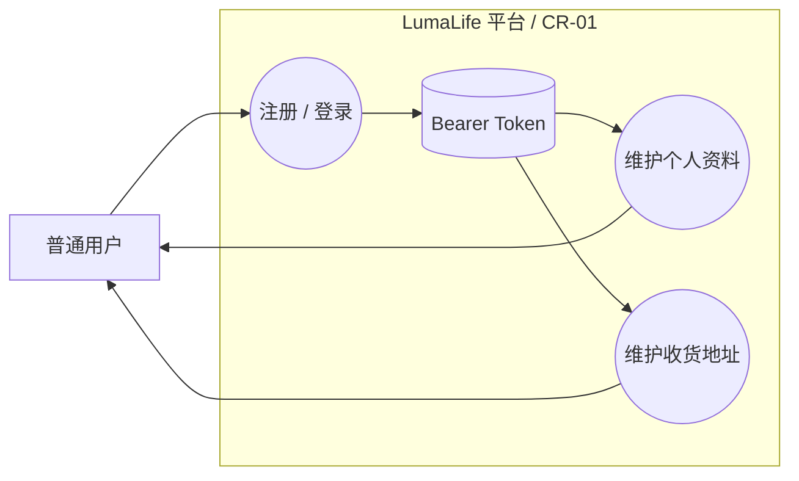
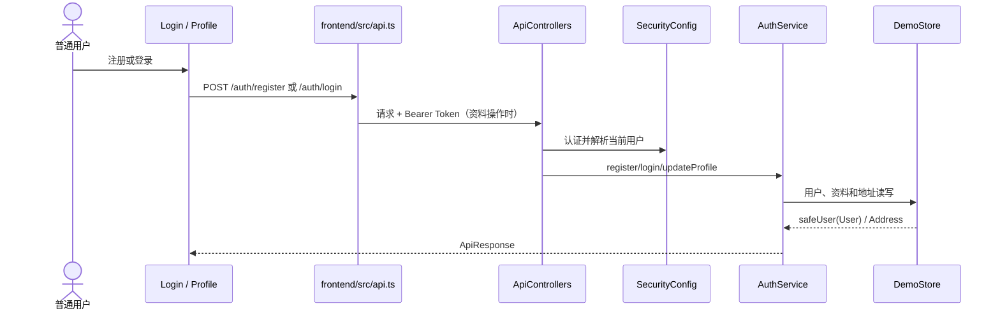
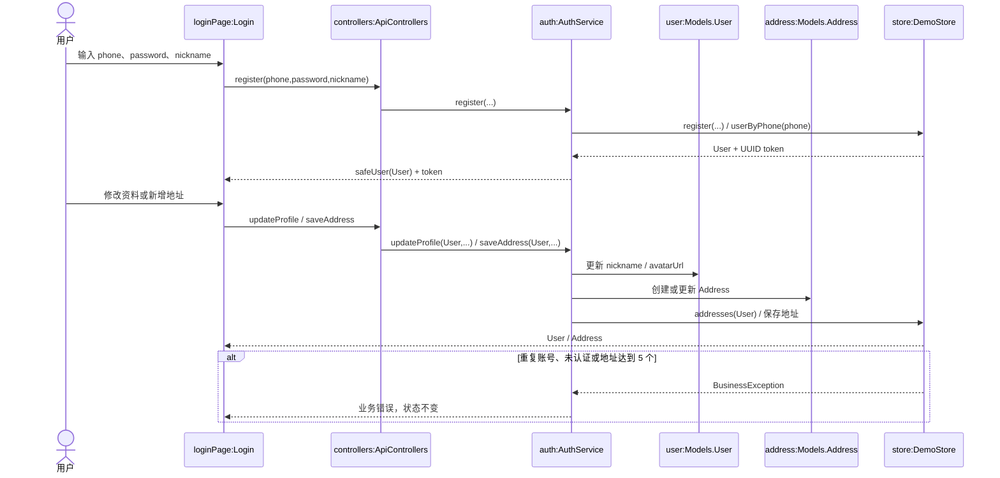

# CR-01 用户认证与个人中心：三层模型源文件

> 交付编号：D03-A-CR01。`CR-01` 对应正式用例 `UC01`、需求 `REQ01`。图中只使用当前仓库已有页面、接口、服务和领域对象。

## 系统级图 SYS-CR01

```mermaid
flowchart LR
    User[普通用户]
    subgraph Platform[LumaLife 平台 / CR-01]
        Auth((注册 / 登录))
        Profile((维护个人资料))
        Address((维护收货地址))
        Token[(Bearer Token)]
    end
    User --> Auth
    Auth --> Token
    Token --> Profile
    Token --> Address
    Profile --> User
    Address --> User
```

## 组件级图 COMP-CR01

```mermaid
sequenceDiagram
    actor User as 普通用户
    participant UI as Login / Profile
    participant API as frontend/src/api.ts
    participant Ctrl as ApiControllers
    participant Sec as SecurityConfig
    participant Auth as AuthService
    participant Store as DemoStore
    User->>UI: 注册或登录
    UI->>API: POST /auth/register 或 /auth/login
    API->>Ctrl: 请求 + Bearer Token（资料操作时）
    Ctrl->>Sec: 认证并解析当前用户
    Ctrl->>Auth: register/login/updateProfile
    Auth->>Store: 用户、资料和地址读写
    Store-->>Auth: safeUser(User) / Address
    Auth-->>UI: ApiResponse
```

## 对象级图 OBJ-CR01

```mermaid
sequenceDiagram
    actor User as 用户
    participant Login as loginPage:Login
    participant Ctrl as controllers:ApiControllers
    participant Auth as auth:AuthService
    participant UserObj as user:Models.User
    participant AddressObj as address:Models.Address
    participant Store as store:DemoStore
    User->>Login: 输入 phone、password、nickname
    Login->>Ctrl: register(phone,password,nickname)
    Ctrl->>Auth: register(...)
    Auth->>Store: register(...) / userByPhone(phone)
    Store-->>Auth: User + UUID token
    Auth-->>Login: safeUser(User) + token
    User->>Login: 修改资料或新增地址
    Login->>Ctrl: updateProfile / saveAddress
    Ctrl->>Auth: updateProfile(User,...) / saveAddress(User,...)
    Auth->>UserObj: 更新 nickname / avatarUrl
    Auth->>AddressObj: 创建或更新 Address
    Auth->>Store: addresses(User) / 保存地址
    Store-->>Login: User / Address
    alt 重复账号、未认证或地址达到 5 个
        Store-->>Auth: BusinessException
        Auth-->>Login: 业务错误，状态不变
    end
```
