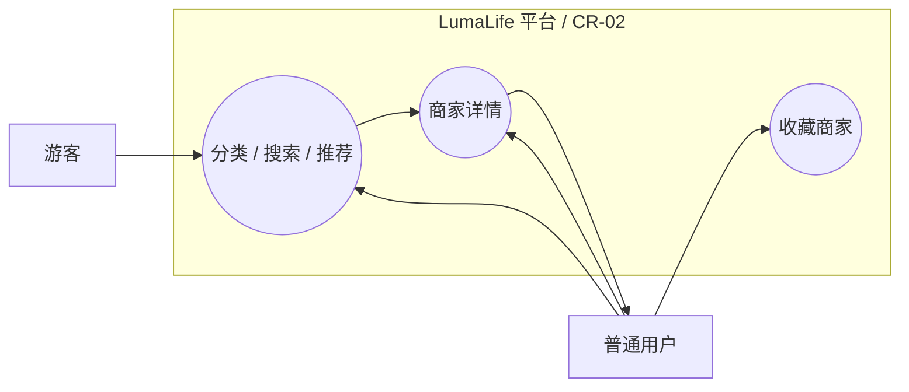
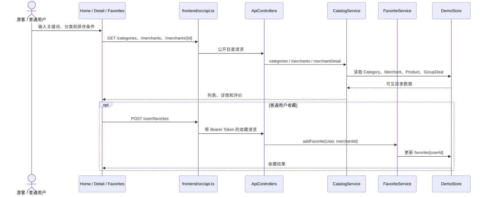
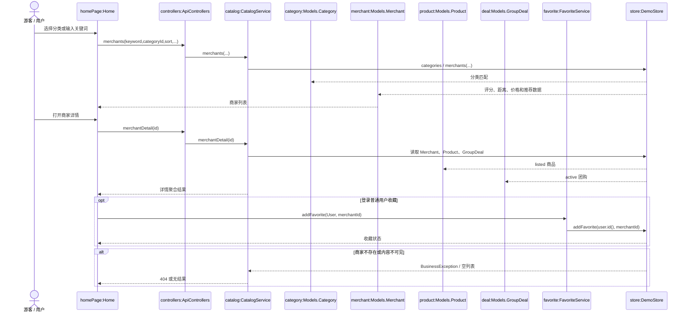

# CR-02 商家搜索、分类、推荐与详情：三层模型源文件

> 交付编号：D03-A-CR02。`CR-02` 对应正式用例 `UC02`、需求 `REQ02`。公开目录允许游客访问，收藏要求普通用户身份。

## 系统级图 SYS-CR02

```mermaid
flowchart LR
    Visitor[游客]
    User[普通用户]
    subgraph Platform[LumaLife 平台 / CR-02]
        Discover((分类 / 搜索 / 推荐))
        Detail((商家详情))
        Favorite((收藏商家))
    end
    Visitor --> Discover --> Detail
    User --> Discover
    User --> Detail
    User --> Favorite
    Detail --> User
```

## 组件级图 COMP-CR02

```mermaid
sequenceDiagram
    actor User as 游客 / 普通用户
    participant UI as Home / Detail / Favorites
    participant API as frontend/src/api.ts
    participant Ctrl as ApiControllers
    participant Catalog as CatalogService
    participant Fav as FavoriteService
    participant Store as DemoStore
    User->>UI: 输入关键词、分类和排序条件
    UI->>API: GET /categories、/merchants、/merchants/{id}
    API->>Ctrl: 公开目录请求
    Ctrl->>Catalog: categories / merchants / merchantDetail
    Catalog->>Store: 读取 Category、Merchant、Product、GroupDeal
    Store-->>Catalog: 可见目录数据
    Catalog-->>UI: 列表、详情和评价
    opt 普通用户收藏
        UI->>API: POST /user/favorites
        API->>Ctrl: 带 Bearer Token 的收藏请求
        Ctrl->>Fav: addFavorite(User, merchantId)
        Fav->>Store: 更新 favorites[userId]
        Store-->>UI: 收藏结果
    end
```

## 对象级图 OBJ-CR02

```mermaid
sequenceDiagram
    actor User as 游客 / 用户
    participant Home as homePage:Home
    participant Ctrl as controllers:ApiControllers
    participant Catalog as catalog:CatalogService
    participant Category as category:Models.Category
    participant Merchant as merchant:Models.Merchant
    participant Product as product:Models.Product
    participant Deal as deal:Models.GroupDeal
    participant Fav as favorite:FavoriteService
    participant Store as store:DemoStore
    User->>Home: 选择分类或输入关键词
    Home->>Ctrl: merchants(keyword,categoryId,sort,...)
    Ctrl->>Catalog: merchants(...)
    Catalog->>Store: categories / merchants(...)
    Store-->>Category: 分类匹配
    Store-->>Merchant: 评分、距离、价格和推荐数据
    Merchant-->>Home: 商家列表
    User->>Home: 打开商家详情
    Home->>Ctrl: merchantDetail(id)
    Ctrl->>Catalog: merchantDetail(id)
    Catalog->>Store: 读取 Merchant、Product、GroupDeal
    Store-->>Product: listed 商品
    Store-->>Deal: active 团购
    Catalog-->>Home: 详情聚合结果
    opt 登录普通用户收藏
        Home->>Fav: addFavorite(User, merchantId)
        Fav->>Store: addFavorite(user.id(), merchantId)
        Store-->>Home: 收藏状态
    end
    alt 商家不存在或内容不可见
        Store-->>Catalog: BusinessException / 空列表
        Catalog-->>Home: 404 或无结果
    end
```
