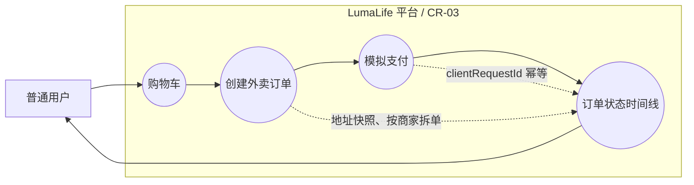
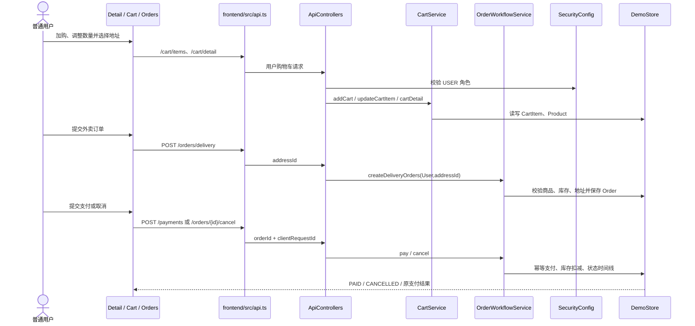
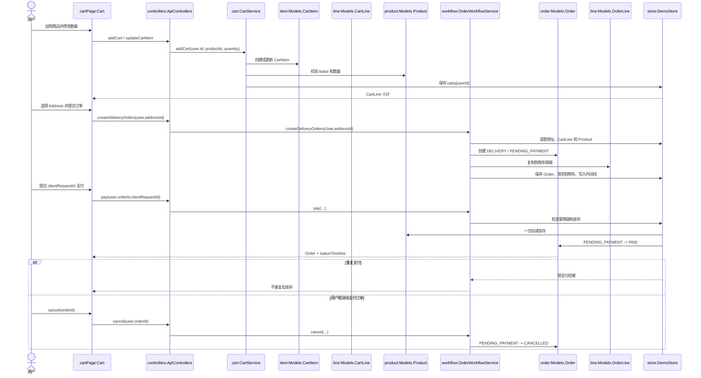

# CR-03 购物车、下单、模拟支付、订单跟踪：三层模型源文件

> 交付编号：D03-A-CR03。`CR-03` 对应正式用例 `UC03`、需求 `REQ03`。订单流程要求普通用户身份；支付以 `clientRequestId` 幂等，待支付订单可取消。

## 系统级图 SYS-CR03

```mermaid
flowchart LR
    User[普通用户]
    subgraph Platform[LumaLife 平台 / CR-03]
        Cart((购物车))
        Order((创建外卖订单))
        Payment((模拟支付))
        Tracking((订单状态时间线))
    end
    User --> Cart --> Order --> Payment --> Tracking
    Order -.地址快照、按商家拆单.-> Tracking
    Payment -.clientRequestId 幂等.-> Tracking
    Tracking --> User
```

## 组件级图 COMP-CR03

```mermaid
sequenceDiagram
    actor User as 普通用户
    participant UI as Detail / Cart / Orders
    participant API as frontend/src/api.ts
    participant Ctrl as ApiControllers
    participant Cart as CartService
    participant Order as OrderWorkflowService
    participant Security as SecurityConfig
    participant Store as DemoStore
    User->>UI: 加购、调整数量并选择地址
    UI->>API: /cart/items、/cart/detail
    API->>Ctrl: 用户购物车请求
    Ctrl->>Security: 校验 USER 角色
    Ctrl->>Cart: addCart / updateCartItem / cartDetail
    Cart->>Store: 读写 CartItem、Product
    User->>UI: 提交外卖订单
    UI->>API: POST /orders/delivery
    API->>Ctrl: addressId
    Ctrl->>Order: createDeliveryOrders(User,addressId)
    Order->>Store: 校验商品、库存、地址并保存 Order
    User->>UI: 提交支付或取消
    UI->>API: POST /payments 或 /orders/{id}/cancel
    API->>Ctrl: orderId + clientRequestId
    Ctrl->>Order: pay / cancel
    Order->>Store: 幂等支付、库存扣减、状态时间线
    Store-->>UI: PAID / CANCELLED / 原支付结果
```

## 对象级图 OBJ-CR03

```mermaid
sequenceDiagram
    actor User as 用户
    participant CartPage as cartPage:Cart
    participant Ctrl as controllers:ApiControllers
    participant CartSvc as cart:CartService
    participant CartItem as item:Models.CartItem
    participant Line as line:Models.CartLine
    participant Product as product:Models.Product
    participant OrderSvc as workflow:OrderWorkflowService
    participant Order as order:Models.Order
    participant OrderLine as line:Models.OrderLine
    participant Store as store:DemoStore
    User->>CartPage: 加购商品并修改数量
    CartPage->>Ctrl: addCart / updateCartItem
    Ctrl->>CartSvc: addCart(user.id, productId, quantity)
    CartSvc->>CartItem: 创建或更新 CartItem
    CartSvc->>Product: 校验 listed 和数量
    CartSvc->>Store: 保存 carts[userId]
    Store-->>CartPage: CartLine 小计
    User->>CartPage: 选择 Address 并提交订单
    CartPage->>Ctrl: createDeliveryOrders(user,addressId)
    Ctrl->>OrderSvc: createDeliveryOrders(User,addressId)
    OrderSvc->>Store: 读取地址、CartLine 和 Product
    OrderSvc->>Order: 创建 DELIVERY / PENDING_PAYMENT
    OrderSvc->>OrderLine: 复制购物车明细
    OrderSvc->>Store: 保存 Order、清空购物车、写入时间线
    User->>CartPage: 提交 clientRequestId 支付
    CartPage->>Ctrl: pay(user,orderId,clientRequestId)
    Ctrl->>OrderSvc: pay(...)
    OrderSvc->>Store: 检查幂等键和库存
    Store->>Product: 一次扣减库存
    Store->>Order: PENDING_PAYMENT -> PAID
    Order-->>CartPage: Order + statusTimeline
    alt 重复支付
        Store-->>OrderSvc: 原支付结果
        OrderSvc-->>CartPage: 不重复扣库存
    else 用户取消待支付订单
        User->>CartPage: cancel(orderId)
        CartPage->>Ctrl: cancel(user,orderId)
        Ctrl->>OrderSvc: cancel(...)
        OrderSvc->>Order: PENDING_PAYMENT -> CANCELLED
    end
```
