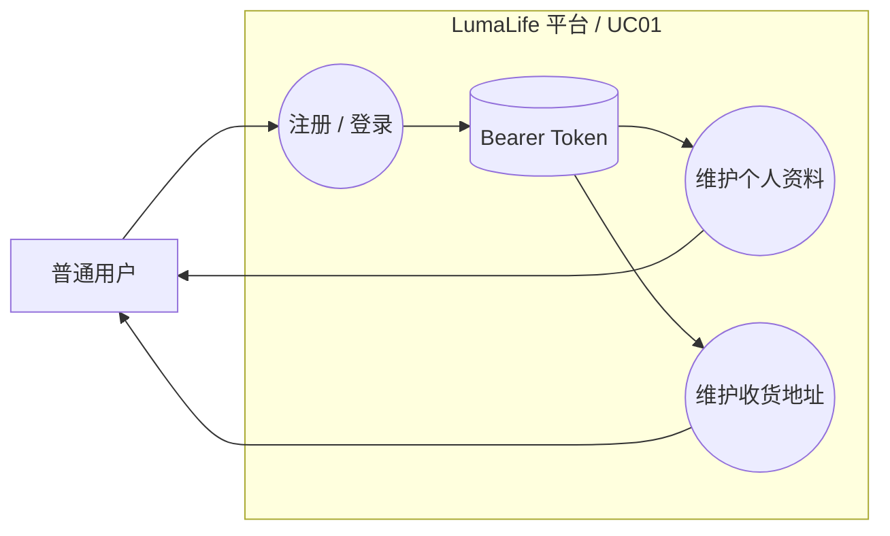
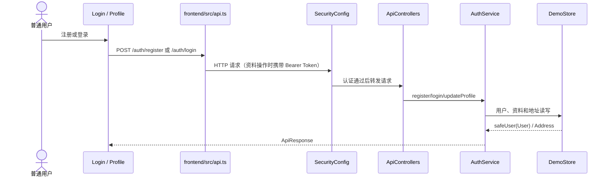
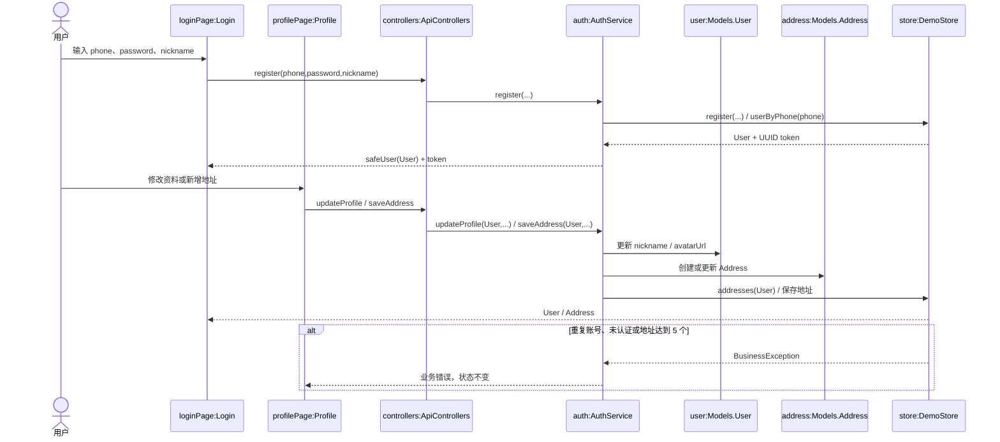

# UC01 用户认证与个人中心：三层模型源文件

> 历史交付编号：D03-A-CR01；正式映射为 `REQ01 / UC01`。本图保留 `monolith-start`/`DemoStore` 基线，不是 `prod,remote` 微服务调用链。

## 系统级图 SYS-SEQ01

直接渲染源文件：[UC01-SYS-SEQ01.mmd](UC01-SYS-SEQ01.mmd)

## 组件级图 COMP-SEQ01

直接渲染源文件：[UC01-COMP-SEQ01.mmd](UC01-COMP-SEQ01.mmd)

## 对象级图 OBJ-SEQ01

直接渲染源文件：[UC01-OBJ-SEQ01.mmd](UC01-OBJ-SEQ01.mmd)

